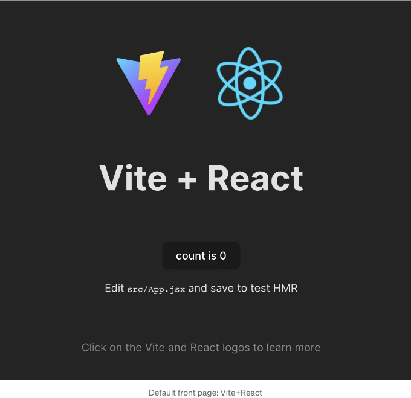
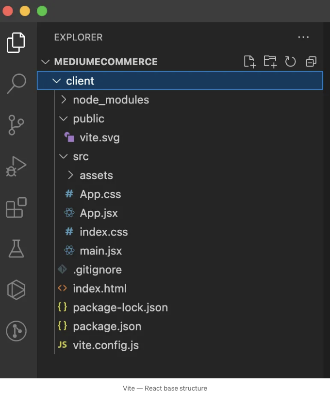
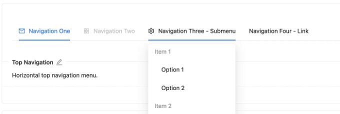
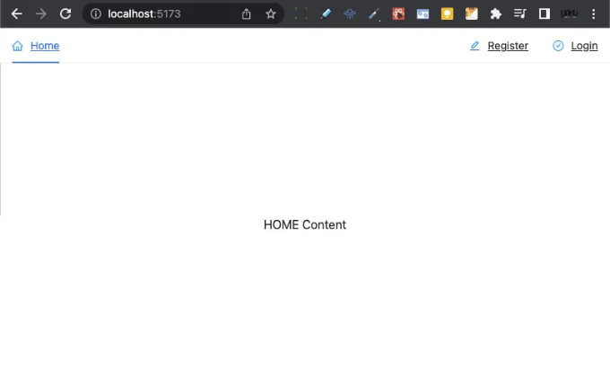

간단히 말하자면 저는 또 다른 전자 상거래 튜토리얼을 따라하고 있었는데, 대다수가 더 이상 최신이 아니라는 것을 알게 되어 자신에게 도전을 해보기로 했습니다. 최신 버전을 이용해 퍼즐을 해결하는 방법을 찾아보겠다는 것이죠.

2021년에 작성된 튜토리얼을 사용하고 있다는 점을 언급해야 합니다. 오늘날 기준으로 보면 매우 오래된 것 같습니다. 이런 종류의 일들이 대부분의 웹 개발자가 매일 직면하는 장벽입니다.

이것은 여러분과 나누고 싶은 몇 가지 미니 튜토리얼 중 첫 번째가 될 것입니다. 희망적으로 가장 쉬운 방법으로 제 발전 상황을 공유할 것이며 언젠가 완전한 전자 상거래 웹 애플리케이션을 완성할 것입니다.

<!-- ui-log 수평형 -->
<ins class="adsbygoogle"
  style="display:block"
  data-ad-client="ca-pub-4877378276818686"
  data-ad-slot="9743150776"
  data-ad-format="auto"
  data-full-width-responsive="true"></ins>
<component is="script">
(adsbygoogle = window.adsbygoogle || []).push({});
</component>

이 미니 튜토리얼에서는 Vite+React를 사용하여 Antd와 Bootstrap으로 스타일링된 3개 페이지를 가진 react-router-dom 구현으로 마무리하겠습니다.

이제 동일한 결과를 얻기 위해 다음 단계를 따라해 주시기 바랍니다:

- React 설치

가장 중요한 것! React를 설치하는 올바른 방법은 무엇인가요? 이에 대해 깊게 다루지는 않겠지만, 대다수 "YouTube 웹 전문가"들이 "create-react-app"이 끝났다고 말하며 이를 대체하기 위해 Vite를 사용하는 것을 권장한다고 합니다. 따라서 저는 도전을 받아들였습니다.

<!-- ui-log 수평형 -->
<ins class="adsbygoogle"
  style="display:block"
  data-ad-client="ca-pub-4877378276818686"
  data-ad-slot="9743150776"
  data-ad-format="auto"
  data-full-width-responsive="true"></ins>
<component is="script">
(adsbygoogle = window.adsbygoogle || []).push({});
</component>

"create-react-app"을 사용하는 중 몇 가지 문제가 있었어요. 예를 들어, 노드와 NPM의 최신 버전을 사용하고 있어서 "npm start"가 제대로 작동하지 않았고, 이를 해결하기 위해 몇 가지 해킹을 해야 했어요. 메시지 섹션에서 그 해킹을 공유해드릴게요.

그리고, 제 옛날 전자 상거래 튜토리얼에서는 "create-react-app"을 사용했어요.

이렇게 작은 튜토리얼 시리즈 동안 모두 VS Code를 사용할 거예요.

전자 상거래 앱을 개발하고 있기 때문에 프론트엔드 부분을 "client"라고 이름 짓었어요. Vite로 React를 설치하려면 터미널을 열고 다음 명령어를 사용하세요:

<!-- ui-log 수평형 -->
<ins class="adsbygoogle"
  style="display:block"
  data-ad-client="ca-pub-4877378276818686"
  data-ad-slot="9743150776"
  data-ad-format="auto"
  data-full-width-responsive="true"></ins>
<component is="script">
(adsbygoogle = window.adsbygoogle || []).push({});
</component>

위 과정은 "create-react-app"보다 매우 빠릅니다. 완료 후에는 client 폴더로 이동한 다음 다음 명령어를 실행하라는 안내가 표시됩니다:

```js
npm install
```

일부 경고를 수정해야 할 수도 있습니다. 원한다면 "npm audit-fix"로 이를 해결할 수 있습니다.

<!-- ui-log 수평형 -->
<ins class="adsbygoogle"
  style="display:block"
  data-ad-client="ca-pub-4877378276818686"
  data-ad-slot="9743150776"
  data-ad-format="auto"
  data-full-width-responsive="true"></ins>
<component is="script">
(adsbygoogle = window.adsbygoogle || []).push({});
</component>

아래 코드 라인을 사용하여 프로젝트를 실행할 수 있어요:

```js
npm run dev
```

콘솔에서 'localhost: 5173'에서 앱이 실행 중이라는 메시지를 확인할 수 있어요 (이는 보통의 3000 포트와 다릅니다!).

그럼 Vite+React 기본 프론트 페이지가 보일 거예요:

<!-- ui-log 수평형 -->
<ins class="adsbygoogle"
  style="display:block"
  data-ad-client="ca-pub-4877378276818686"
  data-ad-slot="9743150776"
  data-ad-format="auto"
  data-full-width-responsive="true"></ins>
<component is="script">
(adsbygoogle = window.adsbygoogle || []).push({});
</component>

```markdown


앞서 설치된 "일반적인" React와 다른 점을 발견할 수 있습니다:
- index.js가 아닌 main.jsx가 있음
- vitals js가 없음
- vite-config.js가 있음
- 기본 프론트를 위한 vite svg가 있음
- 이 미니 튜토리얼의 목적을 벗어난 node_modules에 있는 다른 내용


```

<!-- ui-log 수평형 -->
<ins class="adsbygoogle"
  style="display:block"
  data-ad-client="ca-pub-4877378276818686"
  data-ad-slot="9743150776"
  data-ad-format="auto"
  data-full-width-responsive="true"></ins>
<component is="script">
(adsbygoogle = window.adsbygoogle || []).push({});
</component>

2. 청소

청소 과정은 실제로 사용하지 않을 코드를 제거하기 위한 것입니다.

App.jsx에서 모든 것을 제거합니다. 마지막에는 이렇게 될 것입니다:

```js
function App() {

  return (
    <div className="App">
      Vite APP
    </div>
  )
}

export default App
```

<!-- ui-log 수평형 -->
<ins class="adsbygoogle"
  style="display:block"
  data-ad-client="ca-pub-4877378276818686"
  data-ad-slot="9743150776"
  data-ad-format="auto"
  data-full-width-responsive="true"></ins>
<component is="script">
(adsbygoogle = window.adsbygoogle || []).push({});
</component>

테이블 태그를 삭제해주세요.

3. 튜토리얼 가이드로 돌아가요!

이전에 언급했듯이, 낡은 2021 전자 상거래 튜토리얼을 따르고 있어요. 저자가 저에게 2가지 다른 스타일링 솔루션을 사용하라고 요청합니다.

<!-- ui-log 수평형 -->
<ins class="adsbygoogle"
  style="display:block"
  data-ad-client="ca-pub-4877378276818686"
  data-ad-slot="9743150776"
  data-ad-format="auto"
  data-full-width-responsive="true"></ins>
<component is="script">
(adsbygoogle = window.adsbygoogle || []).push({});
</component>

- Antd: 이것은 Ant Design 원칙의 React 구현입니다. 그들의 웹사이트에 그렇게 나와 있어요. 왜 몇몇 현대 웹사이트에는 약간의 역사나 "About this" 링크가 없는 지 모르겠어요. 어쨌든, 이것을 설치하려면 다음 코드 라인을 실행해야 해요:

```js
npm install antd
```

- Bootstrap — React-bootstrap: Bootstrap이 무엇인지는 다 아시겠지만, 디자인 컴포넌트와 기타 요소들의 컬렉션이라고 요약할게요. 2023년에는 대부분의 "웹 고수"들에게 추천되지 않는다고 해요. Tailwind가 새로운 트렌드인데, 그래도 우리는 기존 지침을 따를 거에요. 설치하려면 다음 코드 라인을 실행하세요:

```js
npm install react-bootstrap bootstrap
```

<!-- ui-log 수평형 -->
<ins class="adsbygoogle"
  style="display:block"
  data-ad-client="ca-pub-4877378276818686"
  data-ad-slot="9743150776"
  data-ad-format="auto"
  data-full-width-responsive="true"></ins>
<component is="script">
(adsbygoogle = window.adsbygoogle || []).push({});
</component>

그리고 `main.jsx` 파일에서 불러오세요:

```js
import 'bootstrap/dist/css/bootstrap.min.css';
```

그러면 두 가지 CSS 라이브러리를 사용할 준비가 끝났어요.

4. 페이지 생성하기

<!-- ui-log 수평형 -->
<ins class="adsbygoogle"
  style="display:block"
  data-ad-client="ca-pub-4877378276818686"
  data-ad-slot="9743150776"
  data-ad-format="auto"
  data-full-width-responsive="true"></ins>
<component is="script">
(adsbygoogle = window.adsbygoogle || []).push({});
</component>

루트에 "Pages" 폴더와 "Auth" 폴더를 생성해야 해요.

그런 다음 3개의 페이지를 만들어야 해요: Home, Register, 그리고 Login. 각 JSX 파일은 이렇게 기본 구조를 가져야 해요. Home.js:

```js
import React from 'react'

const Home = () => {
  return (
    <div>Home</div>
  )
}

export default Home
```

애플리케이션을 위한 헤더를 만들어야 해요. 먼저 components라는 폴더를 만들고 그 안에 nav라는 새 폴더를 만들어요. 그런 다음, Header.jsx라는 새 파일을 만들어요.

<!-- ui-log 수평형 -->
<ins class="adsbygoogle"
  style="display:block"
  data-ad-client="ca-pub-4877378276818686"
  data-ad-slot="9743150776"
  data-ad-format="auto"
  data-full-width-responsive="true"></ins>
<component is="script">
(adsbygoogle = window.adsbygoogle || []).push({});
</component>

이 Header.jsx 파일에서는 Antd 컴포넌트 중 하나인 MENU 컴포넌트를 사용할 것입니다. 이 Nav의 기본 모델은 다음과 같습니다:



이 MENU의 코드는 다음과 같습니다:

```js
import { AppstoreOutlined, MailOutlined, SettingOutlined } from '@ant-design/icons';
import { Menu } from 'antd';
import { useState } from 'react';
const items = [
  {
    label: 'Navigation One',
    key: 'mail',
    icon: <MailOutlined />,
  },
  {
    label: 'Navigation Two',
    key: 'app',
    icon: <AppstoreOutlined />,
    disabled: true,
  },
  {
    label: 'Navigation Three - Submenu',
    key: 'SubMenu',
    icon: <SettingOutlined />,
    children: [
      {
        type: 'group',
        label: 'Item 1',
        children: [
          {
            label: 'Option 1',
            key: 'setting:1',
          },
          {
            label: 'Option 2',
            key: 'setting:2',
          },
        ],
      },
      {
        type: 'group',
        label: 'Item 2',
        children: [
          {
            label: 'Option 3',
            key: 'setting:3',
          },
          {
            label: 'Option 4',
            key: 'setting:4',
          },
        ],
      },
    ],
  },
  {
    label: (
      <a href="https://ant.design" target="_blank" rel="noopener noreferrer">
        Navigation Four - Link
      </a>
    ),
    key: 'alipay',
  },
];
const App = () => {
  const [current, setCurrent] = useState('mail');
  const onClick = (e) => {
    console.log('click ', e);
    setCurrent(e.key);
  };
  return <Menu onClick={onClick} selectedKeys={[current]} mode="horizontal" items={items} />;
};
export default App;
```

<!-- ui-log 수평형 -->
<ins class="adsbygoogle"
  style="display:block"
  data-ad-client="ca-pub-4877378276818686"
  data-ad-slot="9743150776"
  data-ad-format="auto"
  data-full-width-responsive="true"></ins>
<component is="script">
(adsbygoogle = window.adsbygoogle || []).push({});
</component>

표 태그를 마크다운 형식으로 변경해주세요.

<!-- ui-log 수평형 -->
<ins class="adsbygoogle"
  style="display:block"
  data-ad-client="ca-pub-4877378276818686"
  data-ad-slot="9743150776"
  data-ad-format="auto"
  data-full-width-responsive="true"></ins>
<component is="script">
(adsbygoogle = window.adsbygoogle || []).push({});
</component>

```js
npm install react-router-dom localforage match-sorter sort-by
```

이 5 버전 및 이전 버전에서는 페이지를 Layout 안에 캡슐화하는 것을 사용해 왔어요:

```js
import React from "react";
import { BrowserRouter as Router, Route } from "react-router-dom";
import Layout from "./Layout";
import HomePage from "./HomePage";
import AboutPage from "./AboutPage";

const App = () => {
  return (
    <Router>
      <Layout>
        <Route exact path="/" render={() => <HomePage />} />
        <Route exact path="/about" render={() => <AboutPage />} />
      </Layout>
    </Router>
  );
};

export default App;
```

이제 새 버전에서는 Layout이 "특별 컴포넌트"를 사용하여 encapsulate하지만 새 문서에서는 찾기 어려울 수 있는 "element" 속성에 포함되어 있어요.```

<!-- ui-log 수평형 -->
<ins class="adsbygoogle"
  style="display:block"
  data-ad-client="ca-pub-4877378276818686"
  data-ad-slot="9743150776"
  data-ad-format="auto"
  data-full-width-responsive="true"></ins>
<component is="script">
(adsbygoogle = window.adsbygoogle || []).push({});
</component>

리액트 라우터 돔 문서에서 해결책을 찾아보려고 했는데 다양한 레이아웃 상황에서 몇 가지 예제만 포함되어 있다는 걸 깨달았어요.

거기서 답을 찾지 못한 후 구글, 그리고 스택 오버플로우 등에서 몇 가지 솔루션을 찾아보았지만 운이 없네요.

마침내, 새로운 개발 장난감 CHATGPT에 들어가 봤는데 그것이 제게 준 해결책도 오래되었고, 그분으로부터 몇 번의 "사과" 뒤에 문서로 돌아가서 해결책을 찾아보려고 노력했어요.

```js
import React from "react";
import { BrowserRouter, Routes, Route } from "react-router-dom";
import Layout from "./Layout";
import HomePage from "./HomePage";
import AboutPage from "./AboutPage";

const App = () => {
  return (
    <BrowserRouter>
      <Routes>
        <Route path="/" element={<Layout />}>
          <Route path="/" element={<HomePage />} />
          <Route path="/about" element={<AboutPage />} />
        </Route>
      </Routes>
    </BrowserRouter>
  );
};

export default App;
```

<!-- ui-log 수평형 -->
<ins class="adsbygoogle"
  style="display:block"
  data-ad-client="ca-pub-4877378276818686"
  data-ad-slot="9743150776"
  data-ad-format="auto"
  data-full-width-responsive="true"></ins>
<component is="script">
(adsbygoogle = window.adsbygoogle || []).push({});
</component>

ChatGPT에 의해 생성된 마지막 코드는 실제로 올바르지 않습니다. 최신 버전의 react-router-dom에서는 더 이상 BrowserRouter이 사용되지 않습니다.

그래서, react-router-dom 문서로 돌아가서 YouTube에서 몇 가지 것들을 시청하고 Google에서 다른 것들을 찾아내어 이를 올바른 방법으로 구현하는 방법을 알아내기 위해 노력했습니다.

프로젝트로 돌아와서 우리의 경우에 이를 구현해야 합니다:

우리는 react-router-dom 버전 6에서 몇 가지 기능을 사용해야 합니다:

<!-- ui-log 수평형 -->
<ins class="adsbygoogle"
  style="display:block"
  data-ad-client="ca-pub-4877378276818686"
  data-ad-slot="9743150776"
  data-ad-format="auto"
  data-full-width-responsive="true"></ins>
<component is="script">
(adsbygoogle = window.adsbygoogle || []).push({});
</component>

- createBrowserRouter
- createRoutesFromElements
- RouterProvider
- Route

이제 App.jsx 파일에서 이들을 사용하세요:

```js
import React from 'react';
import { Route, createBrowserRouter, createRoutesFromElements, RouterProvider } from 'react-router-dom';
import Home from './pages/Home';
import Login from './pages/auth/Login';
import Register from './pages/auth/Register';
import Header from './components/nav/Header';

const router = createBrowserRouter(
  createRoutesFromElements(
    <Route path="/" element={<Header />}>
      <Route index element={<Home />} />
      <Route path="login" element={<Login />} />
      <Route path="register" element={<Register />} />
    </Route>
  )
)

function App({routes}) {

  return (
    <>
      <RouterProvider router={router}/>
    </>
  );
}

export default App;
```

헤더 요소는 루트 경로 "/ "의 속성으로 사용되지만 모든 경로에서 작동하려면 "인덱스 요소"를 정의해야 합니다.

<!-- ui-log 수평형 -->
<ins class="adsbygoogle"
  style="display:block"
  data-ad-client="ca-pub-4877378276818686"
  data-ad-slot="9743150776"
  data-ad-format="auto"
  data-full-width-responsive="true"></ins>
<component is="script">
(adsbygoogle = window.adsbygoogle || []).push({});
</component>

우리는 이제 프로젝트 요구 사항에 맞게 헤더 컴포넌트를 조정하고 "react-router-dom"을 사용해야 합니다.

우리는 react-router-dom 버전 6에서 다음 요소들을 사용할 것입니다:

- Outlet
- Link

서브메뉴 관련 코드 일부를 삭제하고 아이콘을 변경하는 등 몇 가지 변경을 한 후에는 다음과 같은 코드를 얻게 될 것입니다:

<!-- ui-log 수평형 -->
<ins class="adsbygoogle"
  style="display:block"
  data-ad-client="ca-pub-4877378276818686"
  data-ad-slot="9743150776"
  data-ad-format="auto"
  data-full-width-responsive="true"></ins>
<component is="script">
(adsbygoogle = window.adsbygoogle || []).push({});
</component>

```js
import { HomeTwoTone, EditTwoTone, CheckCircleTwoTone } from '@ant-design/icons';
import { Menu } from 'antd';
import { useState } from 'react';
import { Outlet, Link } from 'react-router-dom';


const Header = () => {
  const [current, setCurrent] = useState('h');
  const onClick = (e) => {
    console.log('click ', e);
    setCurrent(e.key);
  };
  return (
    <>
     <Menu onClick={onClick} selectedKeys={[current]} mode="horizontal">
      <Menu.Item key="h" icon= {<HomeTwoTone />}>
       <Link to="/">Home</Link>
      </Menu.Item>
      <Menu.Item key="r" icon= {<EditTwoTone />}>
        <Link to="/register">Register</Link>
      </Menu.Item>
      <Menu.Item key="l" icon= {<CheckCircleTwoTone />}>
        <Link to="/login">Login</Link>
      </Menu.Item>
     </Menu>
     <Outlet/>
    </>
   
  )
};
export default Header;
```

우리가 한 몇 가지 변경 사항:

- Outlet을 사용하여 다른 링크의 내용을 표시합니다.
- href 및 같은 것을 대체하기 위해 Link를 사용합니다.
- 링크의 성겨성과 관련된 일부 아이콘을 추가했습니다. 이와 더 많은 아이콘은 Ant Design 아이콘 라이브러리에서 확인할 수 있습니다.

마지막으로, 최신 react-router-dom, 최신 react, vite 및 Antd Design을 사용하여 새로운 Nav를 구축하게 됩니다.```

<!-- ui-log 수평형 -->
<ins class="adsbygoogle"
  style="display:block"
  data-ad-client="ca-pub-4877378276818686"
  data-ad-slot="9743150776"
  data-ad-format="auto"
  data-full-width-responsive="true"></ins>
<component is="script">
(adsbygoogle = window.adsbygoogle || []).push({});
</component>

하지만 잠시만 기다려봐요… 왜 Bootstrap을 설치했는데 사용하지 않고 있을까요? 예전 튜토리얼에서 저자는 "Register"와 "Login" 링크를 오른쪽으로 옮기려고 했어요.

이를 위해 "ml-auto"라는 클래스를 사용할 수 있지만, 안타 Design 컴포넌트와 호환되지 않게 되었네요. 하지만, 이는 Bootstrap이 안타 Design과 호환되지 않는다는 것을 전혀 의미하지 않아요. 여러분은 애플리케이션의 어떤 컴포넌트에서라도 Bootstrap을 사용할 수 있어요.

대신, 이 변화를 만들기 위해 인라인 스타일을 사용할 수 있어요. 우리의 헤더는 Menu 컴포넌트 안에 이 최종 코드를 가지게 될거에요:

```js
<Menu onClick={onClick} selectedKeys={[current]} mode="horizontal">
      <Menu.Item key="h" icon= {<HomeTwoTone />}>
       <Link to="/">Home</Link>
      </Menu.Item>
      <Menu.Item key="r" icon= {<EditTwoTone />} style={ marginLeft: 'auto' }>
        <Link to="/register">Register</Link>
      </Menu.Item>
      <Menu.Item key="l" icon= {<CheckCircleTwoTone />} >
        <Link to="/login">Login</Link>
      </Menu.Item>
     </Menu>
```

<!-- ui-log 수평형 -->
<ins class="adsbygoogle"
  style="display:block"
  data-ad-client="ca-pub-4877378276818686"
  data-ad-slot="9743150776"
  data-ad-format="auto"
  data-full-width-responsive="true"></ins>
<component is="script">
(adsbygoogle = window.adsbygoogle || []).push({});
</component>

마침내 앱은 이제 이렇게 보일 거에요:



이렇게 첫 번째 미니튜토리얼 시리즈를 마쳤어요. 최신 기술을 사용하여 완전한 전자상거래 애플리케이션을 만드는 방법에 대한 진보를 계속 업로드할 거예요. 매우 오래된 튜토리얼로 돌아올게요.

다음에 봐요!!