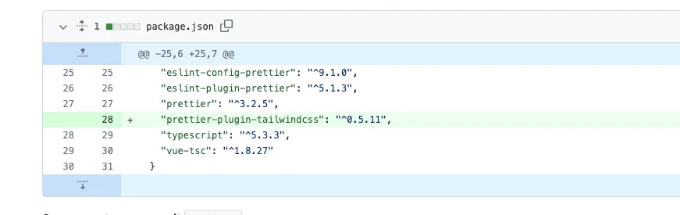
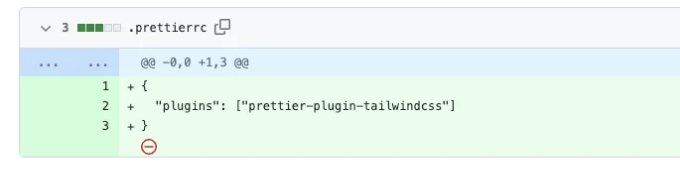
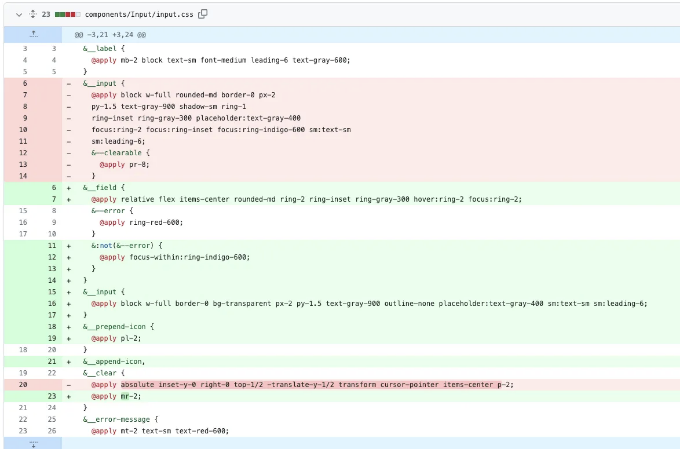
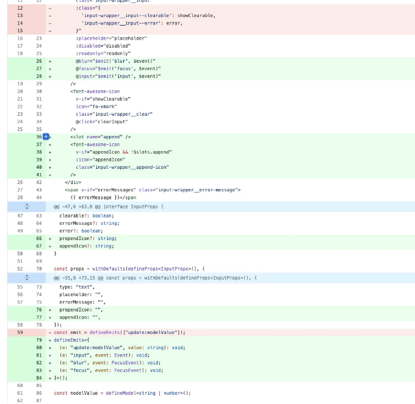

프로젝트에서 Tailwind CSS를 이용하여 Prettier를 활용하기

안녕하세요, 함께 코딩하는 친구들! 오늘은 종종 간과되는 중요한 주제에 대해 이야기하려고 해요 — 코드의 아름다움과 간결함에 관한 것이죠. 이전에 우리는 일관된 포맷팅을 위해 프로젝트에 Prettier를 도입했습니다. 그리고 이제는 package.json에 "prettier-plugin-tailwindcss"를 추가하여 한 단계 더 나아가보려고 해요. 이 플러그인은 Tailwind CSS를 이용하는 프로젝트에 혁명을 일으키는 역할을 하는데, 이를 통해 우리의 스타일 코드가 보다 체계적으로 자동 포맷팅되도록 해줍니다. 그럼 이것이 왜 중요한 걸까요?

Tailwind는 다양한 유틸리티 클래스를 제공하며, 이들을 합리적인 순서로 적용하는 것은 가독성에 매우 중요합니다. Prettier 플러그인은 이러한 스타일 클래스들을 논리적이고 일관된 순서로 정리해주어, 미학적으로도 향상시키고 오류 발생 가능성을 줄여줍니다. 바로 이런 작은 세부사항들이 장기적으로 큰 차이를 만들어낼 수 있는 코딩 관행이죠.

<!-- ui-log 수평형 -->
<ins class="adsbygoogle"
  style="display:block"
  data-ad-client="ca-pub-4877378276818686"
  data-ad-slot="9743150776"
  data-ad-format="auto"
  data-full-width-responsive="true"></ins>
<component is="script">
(adsbygoogle = window.adsbygoogle || []).push({});
</component>

**.prettierrc 파일 설정 마무리**

마지막으로, 우리는 이러한 개선 사항들을 모두 덮어, .prettierrc 파일을 업데이트하여 새로운 Tailwind CSS 플러그인을 활성화했습니다. 이를 통해 우리의 코드를 포맷팅할 때 Tailwind 스타일 가이드에 따라 정렬되도록 보장했습니다.

네, 많은 세부 정보들이 있긴 하지만, 이러한 통찰이 여러분의 프로젝트에 유용할 것이라고 기대합니다. 미적인 감각과 기능성은 코딩 세계에서 손에 꼭 잡히며, 함께 고려함으로써 더 나은 개발자가 되는 길을 가게 됩니다.

<!-- ui-log 수평형 -->
<ins class="adsbygoogle"
  style="display:block"
  data-ad-client="ca-pub-4877378276818686"
  data-ad-slot="9743150776"
  data-ad-format="auto"
  data-full-width-responsive="true"></ins>
<component is="script">
(adsbygoogle = window.adsbygoogle || []).push({});
</component>

# 입력 컴포넌트에서 스타일과 기능을 개선합니다

진행하면서 하나의 입력 컴포넌트의 CSS 및 Vue 파일에서 발생한 변경 사항을 안내해드리겠습니다. 초기에는 기본 스타일과 클래스가 있는 컴포넌트였지만, 저는 보다 유연하고 기능적인 컴포넌트로 발전시키기 위해 노력했습니다. 먼저, Tailwind의 @apply 지시문을 사용하여 CSS에서 일부 변경 사항을 시작했습니다. 이 추가는 오류 상태에 대해 빨간 테두리(ring-red-600) 및 입력이 포커스를 받을 때 구분된 테두리 색상(ring-indigo-600)을 제공했습니다.

Vue 컴포넌트 파일에서는 v-bind를 사용하여 동적으로 UI 모양을 변경하는 조건부 클래스 바인딩을 소개했습니다. 또한, 입력란 시작과 끝에 아이콘을 추가하기 위해 슬롯을 활용하여 컴포넌트의 다양성을 확장했습니다. 이 조정으로 우리의 컴포넌트를 구현할 때 사용자들에 대한 유연성이 크게 향상되었습니다.

<!-- ui-log 수평형 -->
<ins class="adsbygoogle"
  style="display:block"
  data-ad-client="ca-pub-4877378276818686"
  data-ad-slot="9743150776"
  data-ad-format="auto"
  data-full-width-responsive="true"></ins>
<component is="script">
(adsbygoogle = window.adsbygoogle || []).push({});
</component>

이벤트 관리를 중심으로 한 또 다른 중요한 업데이트가 있었어요. 우리는 Vue의 v-model을 활용하여 양방향 데이터 바인딩을 하고, 컴포넌트가 주변 환경에 사용자 정의 이벤트를 발생시킬 수 있도록 명시했어요. 이를 통해 더 넓은 사용 사례에 대한 적응성을 보장했답니다.

# 구성 요소/Input/Input.vue 변경 내용 자세히 살펴보기

물론이죠! 작성자로서 경험을 서술하면서 Input.vue 구성 요소에 대한 변경 사항을 자세히 살펴보겠습니다.

<!-- ui-log 수평형 -->
<ins class="adsbygoogle"
  style="display:block"
  data-ad-client="ca-pub-4877378276818686"
  data-ad-slot="9743150776"
  data-ad-format="auto"
  data-full-width-responsive="true"></ins>
<component is="script">
(adsbygoogle = window.adsbygoogle || []).push({});
</component>

# 프로젝트에서 Tailwind CSS와 Prettier를 활용하기

안녕하세요, 개발자 여러분! 오늘은 종종 간과되는 것에 대해 이야기하고 싶어요 — 우리 코드의 아름다움과 간결함에 대해 말이죠. 이전에 우리 프로젝트에 일관된 형식으로 포매팅을 위해 Prettier를 도입했었죠. 하지만 이제는 조금 더 나아가서 "prettier-plugin-tailwindcss"를 package.json에 통합함으로써 업그레이드를 해보려고 해요. 이 플러그인은 Tailwind CSS를 활용하는 프로젝트에 혁명을 일으킬 수 있는데, 스타일 코드를 자동으로 더 체계적으로 포맷팅해줍니다. 그렇다면 왜 이것이 중요할까요?

Tailwind는 많은 유틸리티 클래스를 제공하며, 이를 상식적인 순서로 적용하는 것은 가독성을 위해 중요합니다. Prettier 플러그인은 이 스타일 클래스를 논리적이고 일관된 순서로 정리하여, 미학적인 측면과 오류 가능성을 줄여줍니다. 코딩 관행의 작은 디테일들이 장기적으로 많은 차이를 만들어내는 것이거든.

# 입력 컴포넌트에서 스타일과 기능을 더욱 정교하게 만들기

<!-- ui-log 수평형 -->
<ins class="adsbygoogle"
  style="display:block"
  data-ad-client="ca-pub-4877378276818686"
  data-ad-slot="9743150776"
  data-ad-format="auto"
  data-full-width-responsive="true"></ins>
<component is="script">
(adsbygoogle = window.adsbygoogle || []).push({});
</component>

우리가 계속 진행하면서, 저는 우리의 입력 컴포넌트 중 하나의 CSS와 Vue 파일에서 발생한 변경 사항을 안내할 거에요. 초반에는 우리 컴포넌트가 기본 스타일과 클래스를 가졌지만, 제가 더 유연하고 기능적인 컴포넌트로 발전시키기 위해 노력했어요. 

먼저 CSS에서 Tailwind의 @apply 지시문을 사용하여 몇 가지 변경을 했어요. 이 추가는 오류 상태에 대해 빨간 테두리 (ring-red-600)를 제공하고, 입력이 포커스될 때는 구분된 테두리 색상 (ring-indigo-600)을 제공했어요.

Vue 컴포넌트 파일에서, 나는 오류 상황에서 UI의 모습을 동적으로 변경하기 위해 조건부 클래스 바인딩을 v-bind로 도입했어요. 게다가, 입력란의 시작과 끝에 아이콘을 추가하기 위해 슬롯을 활용함으로써 컴포넌트의 유연성을 크게 확장했어요. 이 조정은 우리 컴포넌트를 구현하는 사용자들에게 유연성을 크게 높여줍니다.

또 다른 중요한 업데이트는 이벤트 관리를 중심으로 이루어졌어요. 우리는 Vue의 v-model을 활용하여 양방향 데이터 바인딩을 하고, 컴포넌트가 주변에 사용자 정의 이벤트를 발생시킬 수 있도록 구분했어요. 이는 보다 다양한 사용 사례에 대해 적응성을 보장합니다.

# 컴포넌트/Input/Input.vue 변경 사항 깊이 파헤쳐보기

<!-- ui-log 수평형 -->
<ins class="adsbygoogle"
  style="display:block"
  data-ad-client="ca-pub-4877378276818686"
  data-ad-slot="9743150776"
  data-ad-format="auto"
  data-full-width-responsive="true"></ins>
<component is="script">
(adsbygoogle = window.adsbygoogle || []).push({});
</component>

우리 Input.vue 컴포넌트의 진화 과정을 자세히 살펴봅시다. 여기서 상당한 변화를 일으켰네요, 그렇죠?

- 아이콘을 위한 슬롯: prepend와 append 두 가지 슬롯을 도입했어요. 이는 원하는 아이콘이나 요소를 자유롭게 추가할 수 있는 열린 초대장 같은 존재죠. 입력란 안에 검색 아이콘이나 오류 발생 시 에러 아이콘을 추가하고 싶을 때 아주 유용합니다.
- 동적 클래스 바인딩: Vue의 반응성 능력을 활용해서 클래스를 조건부로 적용할 수 있어요. 이로써 입력란이 문제 없을 때는 차분한 파란색, 문제 발생 시엔 경고 신호인 빨간색 등이 적용됩니다. 사용자에게 실시간 피드백을 제공하는 거죠!
- 부모와 상호작용하기 위한 사용자 정의 이벤트: defineEmits를 통해 입력 컴포넌트가 발생시킬 수 있는 이벤트에 대한 계약을 정의했어요. 업데이트:modelValue, input, blur, focus와 같은 이벤트들은 입력란의 내부 동작을 완벽히 이해할 수 있게 해줍니다. 부모 컴포넌트에 입력란의 내부 동작에 직접적으로 접근할 수 있는 것과 같네요.
- 지우기 기능: v-if 지시문이 showClearable을 확인하여, 사용자가 한 번의 클릭으로 입력 내용을 손쉽게 삭제할 수 있게 해줍니다. 이는 사용자 경험을 향상시켜주는 것이죠 – 더 이상 모두 선택하고 삭제하는 번거로움은 없어요!
- 접근성 향상: id 속성을 추가하고 레이블의 for 속성과 일치시킴으로써, 스크린 리더가 입력란을 정확하게 설명할 수 있게 해서 모든 사람에게 더 접근하기 쉬운 컴포넌트로 만들었어요.

