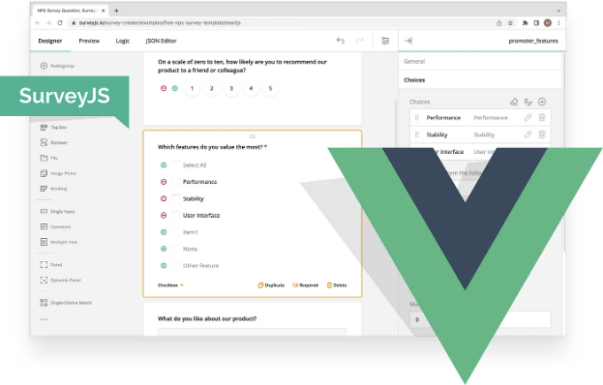
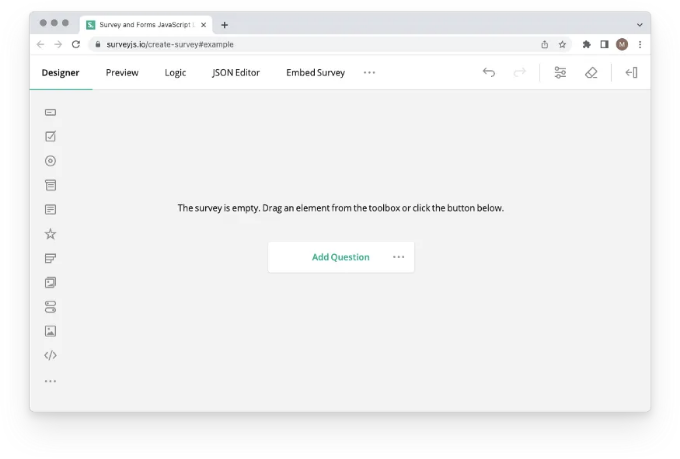
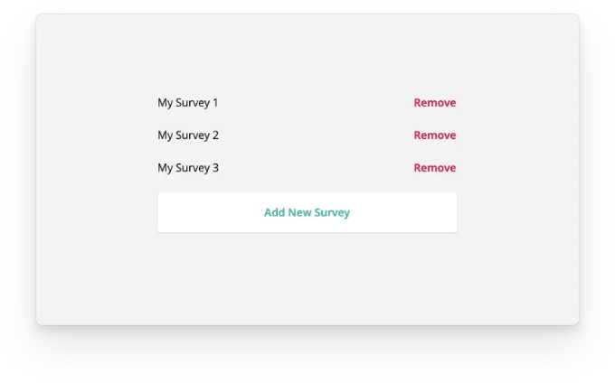
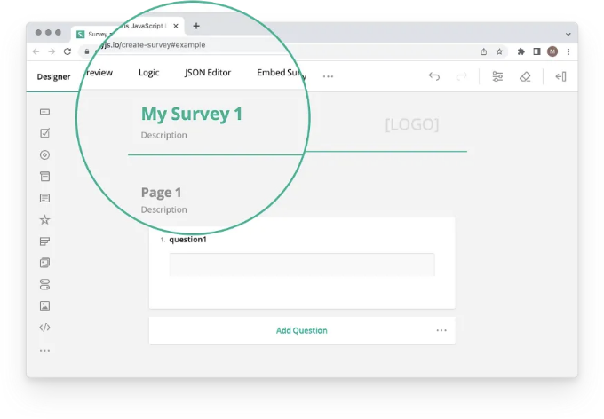

폼 빌더는 수동 코딩이 필요 없이 사용자가 웹 폼을 만들고 사용자 정의할 수 있는 도구입니다. 코딩 기술이 부족한 팀원들도 아름다운 웹 폼을 디자인할 수 있는 강력한 폼 빌더를 찾고 있다면, SurveyJS 제품군은 딱 맞는 구성 요소를 제공합니다. Vue 3용 SurveyJS Form Builder는 오픈 소스 시각적 폼 편집기로, 사용자 친화적인 인터페이스, 20가지 이상의 접근 가능한 입력 유형, 어떤 백엔드 프레임워크 및 데이터베이스와도 완벽히 통합되며, 테마 편집기를 포함한 다양한 기능을 제공합니다. 이 글에서는 Vue 3 애플리케이션에 SurveyJS Form Builder를 추가하는 방법을 소개합니다.



데이터베이스에 저장된 설문조사나 폼 목록을 표시하는 간단한 애플리케이션을 구현할 것입니다. 사용자는 새로운 폼을 만들고 기존 폼을 편집하거나 삭제할 수 있습니다.

# 작업 1: Vue 3 앱에 폼 빌더 추가하기

<!-- ui-log 수평형 -->
<ins class="adsbygoogle"
  style="display:block"
  data-ad-client="ca-pub-4877378276818686"
  data-ad-slot="9743150776"
  data-ad-format="auto"
  data-full-width-responsive="true"></ins>
<component is="script">
(adsbygoogle = window.adsbygoogle || []).push({});
</component>

## 단계 1: 폼 빌더(조사 생성기) 설치하기

CodeSandbox를 열고 Vue 3 템플릿을 복제하여 새 Vue 3 애플리케이션을 만드세요. 다음 패키지를 종속 항목에 추가하세요:

- survey-creator-vue— Vue 3용 Survey Creator 렌더링 코드.
- survey-creator-core — 플랫폼 독립적인 Survey Creator 코드.
- survey-vue3-ui — Vue 3용 SurveyJS Form 라이브러리 렌더링 코드.
- survey-core — 플랫폼 독립적인 SurveyJS Form 라이브러리 코드.

실제 애플리케이션에 Survey Creator를 추가하려면 survey-creator-vue 패키지를 설치하기 위해 다음 명령어를 사용하세요. 다른 패키지는 피어 종속성으로 자동으로 설치됩니다:

<!-- ui-log 수평형 -->
<ins class="adsbygoogle"
  style="display:block"
  data-ad-client="ca-pub-4877378276818686"
  data-ad-slot="9743150776"
  data-ad-format="auto"
  data-full-width-responsive="true"></ins>
<component is="script">
(adsbygoogle = window.adsbygoogle || []).push({});
</component>

```js
npm install survey-creator-vue@latest — save
```

따라서 package.json에 다음 종속 항목이 포함되어 있어야 합니다:

## 단계 2: 플러그인 설치

설문 조사 생성기 렌더링 코드는 surveyPlugin과 surveyCreatorPlugin에 캡슐화되어 있습니다. 이를 응용 프로그램에서 사용하려면 main.js 파일을 열고 이러한 플러그인을 가져와서 아래와 동일한 순서로 app.use() 메서드를 사용하여 설치하십시오:```

<!-- ui-log 수평형 -->
<ins class="adsbygoogle"
  style="display:block"
  data-ad-client="ca-pub-4877378276818686"
  data-ad-slot="9743150776"
  data-ad-format="auto"
  data-full-width-responsive="true"></ins>
<component is="script">
(adsbygoogle = window.adsbygoogle || []).push({});
</component>

## 단계 3: 스타일 구성 및 폼 빌더 렌더링

Survey Creator 스타일은 두 개의 스타일 시트로 제공됩니다. Survey Creator를 렌더링할 사용자 정의 Vue 컴포넌트에 이를 가져오세요. 이 컴포넌트는 FormBuilder로 이름 짓을 수 있습니다. components 디렉토리에 FormBuilder.vue라는 컴포넌트 파일을 만들고 스타일 시트를 가져오세요.

그리고 다음으로 웹 페이지에 폼 빌더를 렌더링해야 합니다. survey-creator-core 패키지에서 SurveyCreatorModel 및 ICreatorOptions를 가져오세요. ICreatorOptions는 Survey Creator 설정을 설명하는 인터페이스입니다. ICreatorOptions 객체를 사용하여 SurveyCreatorModel을 인스턴스화하고 SurveyCreaterComponent 요소의 model 속성에 인스턴스를 전달하세요.

모든 것을 올바르게 수행하면, CodeSandbox 미리보기에 폼 빌더가 표시될 것입니다.

<!-- ui-log 수평형 -->
<ins class="adsbygoogle"
  style="display:block"
  data-ad-client="ca-pub-4877378276818686"
  data-ad-slot="9743150776"
  data-ad-format="auto"
  data-full-width-responsive="true"></ins>
<component is="script">
(adsbygoogle = window.adsbygoogle || []).push({});
</component>



# 작업 2: CRUD 작업을 지원하는 폼 관리 UI 구현 및 Vue 라우팅 설정

이 작업은 SurveyJS 기능과는 무관합니다. 데이터베이스에서 폼 목록을 가져와 새로운 폼을 생성하며 기존 설문의 이름과 JSON 정의를 변경할 수 있는 폼 관리 UI를 구현해야 합니다. 불행하게도, 실제 앱에서는 매번 이러한 단계를 반복해야 합니다. 이미 알고 계신다면 이 섹션을 건너뛰고 직접 작업 3으로 이동할 수 있습니다.

## 단계 1: 데이터베이스와 함께 작동하는 비동기 함수 구현

<!-- ui-log 수평형 -->
<ins class="adsbygoogle"
  style="display:block"
  data-ad-client="ca-pub-4877378276818686"
  data-ad-slot="9743150776"
  data-ad-format="auto"
  data-full-width-responsive="true"></ins>
<component is="script">
(adsbygoogle = window.adsbygoogle || []).push({});
</component>

코드를 간소화하고 브라우저의 로컬 저장소를 사용하여 데이터를 로컬에서 수정할 수 있도록 하기 위해 setTimeout 함수를 사용하여 비동기 호출을 흉내냅니다. 모든 데이터 관련 함수를 WebDataService.ts 파일에 넣을 것입니다. 아래 코드에서 이 파일은 간결함을 위해 함수 시그니처만 포함합니다. 전체 코드 목록은 결과 CodeSandbox를 참조하십시오.

## 단계 2: 설문 조사 목록 렌더링

FormList.vue 컴포넌트를 만들어서 설문지 목록을 렌더링하고 새 설문지를 추가하거나 기존 설문을 편집/삭제할 수 있는 기능을 제공합니다. 편집할 설문지에 대해 다음 경로로 이동합니다: /editsurvey/surveyId.



<!-- ui-log 수평형 -->
<ins class="adsbygoogle"
  style="display:block"
  data-ad-client="ca-pub-4877378276818686"
  data-ad-slot="9743150776"
  data-ad-format="auto"
  data-full-width-responsive="true"></ins>
<component is="script">
(adsbygoogle = window.adsbygoogle || []).push({});
</component>

## 단계 3: 라우팅 설정하기

라우팅은 Vue Router 4에서 제공됩니다. 이를 설치하려면 의존성에 vue-router 패키지를 추가하십시오. 실제 응용 프로그램에서는 다음 명령어를 사용할 수도 있습니다:

```js
npm install vue-router@4 --save
```

main.js 파일을 열고 FormBuilder 및 FormList 구성 요소를 라우트에 추가하십시오:

<!-- ui-log 수평형 -->
<ins class="adsbygoogle"
  style="display:block"
  data-ad-client="ca-pub-4877378276818686"
  data-ad-slot="9743150776"
  data-ad-format="auto"
  data-full-width-responsive="true"></ins>
<component is="script">
(adsbygoogle = window.adsbygoogle || []).push({});
</component>

# 작업 3: JSON 정의를 로드하고 저장하기

설문 JSON 정의를 로드하고 저장하려면 폼 ID가 필요합니다. ID는 id 쿼리 매개변수에서 가져올 수 있습니다. 남은 작업은 WebDataService.ts 파일에서 getSurveyJSON 및 saveSurveyJSON 함수를 호출하는 것 뿐입니다.

Survey Creator에는 isAutoSave 속성이 있습니다. 이를 활성화하면 변경 사항이 발생할 때마다 saveSurveyFunc 콜백이 호출됩니다. 콜백에는 숫자 saveNo와 콜백 함수 두 개의 매개변수가 있습니다. saveNo는 증분 번호입니다. 웹 서비스는 본질적으로 비동기적이므로 이전 변경 사항이 최신 변경 사항보다 나중에 발생할 수 있습니다. 따라서 서버에 변경 #152를 저장한 경우 변경 #151 및 이하를 간단히 무시할 수 있습니다. 서버로부터 확인을 받은 후에는 콜백 매개변수를 사용하여 성공한 경우 callback(saveNo, true) 또는 서버가 데이터 저장에 실패한 경우 callback(saveNo, false)로 호출할 수 있습니다. 양쪽 경우 모두 Form Builder에서 알림을 표시합니다.

# Task 4: 설문 이름 변경

<!-- ui-log 수평형 -->
<ins class="adsbygoogle"
  style="display:block"
  data-ad-client="ca-pub-4877378276818686"
  data-ad-slot="9743150776"
  data-ad-format="auto"
  data-full-width-responsive="true"></ins>
<component is="script">
(adsbygoogle = window.adsbygoogle || []).push({});
</component>

다양한 UI를 구현하여 사용자가 설문 이름을 변경할 수 있습니다. 예를 들어 사용자는 설문 목록에서 이름을 편집할 수 있습니다. 두 번째 옵션은 Survey Creator 아래에 설문 이름을 편집할 수 있는 텍스트 입력을 표시하는 것입니다. 또 다른 해결책은 사용자가 Survey Creator의 Property Grid에서 수정할 수 있는 설문 속성을 추가하는 것입니다 (예시 참조).

이 문서에서는 설문 제목에서 설문 이름을 가져와 데이터베이스에 관련 레코드를 저장합니다. 레코드에는 id, name, json 세 가지 필드가 있습니다.



## 단계 1: 설문 제목 설정

<!-- ui-log 수평형 -->
<ins class="adsbygoogle"
  style="display:block"
  data-ad-client="ca-pub-4877378276818686"
  data-ad-slot="9743150776"
  data-ad-format="auto"
  data-full-width-responsive="true"></ins>
<component is="script">
(adsbygoogle = window.adsbygoogle || []).push({});
</component>

다음과 같은 코드로 작업할 수 있어요: creator.survey.title = "yourValue";. 이 작업은 설문 조사 JSON 정의를로드 한 후 onMounted 후크 내에서 수행하십시오.

## 단계 2: 데이터베이스에서 설문 이름 업데이트

설문 제목 속성이 변경 될 때 데이터베이스 레코드의 이름 필드를 설정하십시오. 이를 위해 creator.onModified 이벤트를 사용할 수 있어요.

## 단계 3: 설문 제목 속성을 필수로 지정하기

<!-- ui-log 수평형 -->
<ins class="adsbygoogle"
  style="display:block"
  data-ad-client="ca-pub-4877378276818686"
  data-ad-slot="9743150776"
  data-ad-format="auto"
  data-full-width-responsive="true"></ins>
<component is="script">
(adsbygoogle = window.adsbygoogle || []).push({});
</component>

설문 제목을 비우지 않도록 사용자가 방지해야 합니다. 데이터베이스에서 설문 이름이 비어 있을 수 없습니다. 이 작업을 수행하는 여러 방법이 있지만, 가장 쉬운 방법은 필요한 속성을 찾아 isRequired 속성을 true로 설정하는 것입니다.

# 결론

Vue 3 애플리케이션에 SurveyJS Form Builder를 추가하고 양식 JSON 정의를 데이터베이스에 저장하는 방법을 배웠습니다. 이것은 완전한 서비스가 아닙니다. 누락된 기능으로는 사용자에게 양식 표시, 응답 수집 및 표 또는 대시보드에 제공하는 것이 포함됩니다. 저희 제품을 좋아하시는 경우 아래에 댓글을 남겨주세요.

# SurveyJS 프로젝트 관련

<!-- ui-log 수평형 -->
<ins class="adsbygoogle"
  style="display:block"
  data-ad-client="ca-pub-4877378276818686"
  data-ad-slot="9743150776"
  data-ad-format="auto"
  data-full-width-responsive="true"></ins>
<component is="script">
(adsbygoogle = window.adsbygoogle || []).push({});
</component>

SurveyJS 프로젝트에는 네 가지 오픈 소스 JavaScript 라이브러리가 포함되어 있습니다:

- SurveyJS Form Library — 웹 애플리케이션에서 동적 JSON 기반 폼을 렌더링하고 응답을 수집하는 무료이자 오픈 소스이며 MIT 라이센스가 부여된 JavaScript 라이브러리입니다. React, Angular, Vue.js 및 Knockout에 대한 네이티브 지원이 제공됩니다.
- SurveyJS Form Builder — 자체 호스팅되는 드래그 앤 드롭 설문 및 폼 빌더로 실시간으로 폼의 JSON 정의(스키마)를 자동으로 생성합니다. 폼 빌더는 React, Angular, Vue.js 및 Knockout에 대한 네이티브 지원이 제공됩니다. 능력을 평가하기 위해 무료의 완전한 기능을 갖춘 데모를 시도해 보세요.
- SurveyJS Dashboard — 대화식 및 사용자 정의 가능한 차트 및 테이블로 설문 데이터 분석을 간단하게 합니다. 설문 데이터 대시보드로 통찰력을 시각화하고 조사 결과를 한 눈에 분석하세요.
- SurveyJS Export to PDF — 브라우저에서 SurveyJS 설문 및 폼을 PDF 파일로 렌더링하는 오픈 소스 JavaScript 라이브러리입니다. PDF Generator를 사용하여 PDF로 사용자 정의된 폼을 무제한으로 저장할 수 있습니다(편집 가능 및 읽기 전용).

SurveyJS에 대해 더 알아보려면 당사 웹사이트를 방문하세요: surveyjs.io.