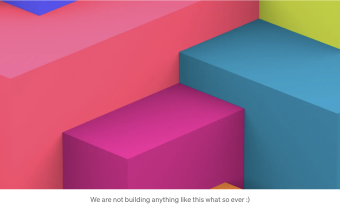
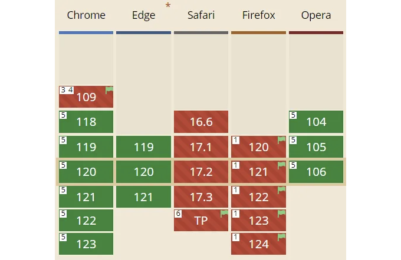
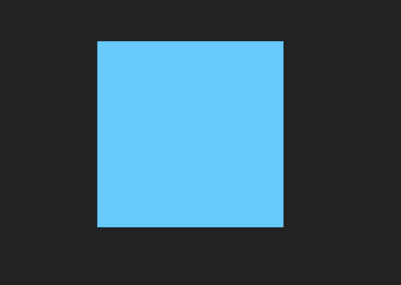
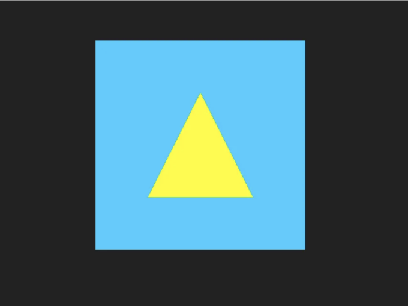

## 웹GPU란 무엇이며 왜 사용해야 하나요?

웹GPU는 WebGL 및 WebGL 2.0의 후속 제품입니다. 이러한 기술은 개발자가 사용자의 GPU를 활용하여 그래픽 렌더링이나 일반 컴퓨팅(예: AI/ML)을 수행할 때 성능을 향상시킬 수 있습니다.

웹GPU는 Vulkan에 크게 영향을 받았으며, Vulkan은 크로스 플랫폼, 저수준 그래픽 및 컴퓨팅 API입니다.

<!-- ui-log 수평형 -->
<ins class="adsbygoogle"
  style="display:block"
  data-ad-client="ca-pub-4877378276818686"
  data-ad-slot="9743150776"
  data-ad-format="auto"
  data-full-width-responsive="true"></ins>
<component is="script">
(adsbygoogle = window.adsbygoogle || []).push({});
</component>

블록 (Block)은 Vulkan에서 영감을 받아, WebGL에서 발생하는 성능 및 호환성 문제를 해결하기 위해 설계된 WebGPU는 다양한 GPU 하드웨어 간의 특히 호환성 문제를 해결합니다. 이 API는 장치 지원에 따라 Vulkan, DirectX 또는 Metal 위에 위치합니다.

성능은 네이티브 성능과 크게 다르지 않다고 합니다. 이는 과거 HTML5 기술로는 이루기 어려웠던 새로운 응용 프로그램 및 산업의 세계를 열어줍니다.

## 지원

본 기사 작성 시점에서 WebGPU는 아직 제대로 제품용이 아니지만, 그것도 오래가지는 않을 것입니다. 현재 가능한 한 사용자 플래그나 캐너리 릴리스를 활용할 수 있습니다. (본 기사 작성 시점에서는 Linux 지원이 어느 정도 제한되어 있습니다).

<!-- ui-log 수평형 -->
<ins class="adsbygoogle"
  style="display:block"
  data-ad-client="ca-pub-4877378276818686"
  data-ad-slot="9743150776"
  data-ad-format="auto"
  data-full-width-responsive="true"></ins>
<component is="script">
(adsbygoogle = window.adsbygoogle || []).push({});
</component>



## 무엇을 하고 있는 거죠?

삼각형은 그래픽 프로그래밍에서의 "Hello World"와 같은 역할을 합니다. 본 글은 여러 길고 지루한 설명 없이 시작할 수 있는 기본 예제입니다. 보다 깊이있는 통찰을 얻고 싶다면 MDN을 살펴보거나 선호하는 AI 챗봇에게 문의해보세요.

## 요구 사항

<!-- ui-log 수평형 -->
<ins class="adsbygoogle"
  style="display:block"
  data-ad-client="ca-pub-4877378276818686"
  data-ad-slot="9743150776"
  data-ad-format="auto"
  data-full-width-responsive="true"></ins>
<component is="script">
(adsbygoogle = window.adsbygoogle || []).push({});
</component>

모든 프로그래밍 언어에 익숙하다면 좋겠지만, 고급 JavaScript 기술이 필요한 것은 아닙니다. 하지만 최소한의 개발 환경을 설정할 수 있는 단계를 따를 수 있어야 합니다.

저는 VSCode를 사용하지만 다른 것을 사용해도 괜찮아요.

## 설정

우리는 JavaScript를 사용하고 있습니다; 이 튜토리얼은 원하는 경우 TypeScript로 쉽게 변환할 수 있습니다. 우리는 최상위 await의 간편함을 원하기 때문에 네이티브 모듈을 사용하고 있습니다. 그러니 먼저 다음을 해주세요:

<!-- ui-log 수평형 -->
<ins class="adsbygoogle"
  style="display:block"
  data-ad-client="ca-pub-4877378276818686"
  data-ad-slot="9743150776"
  data-ad-format="auto"
  data-full-width-responsive="true"></ins>
<component is="script">
(adsbygoogle = window.adsbygoogle || []).push({});
</component>

- 노드가 설치되어 있지 않다면, 먼저 nvm을 설치한 후 nvm을 사용하여 node.js를 설치해주세요.
- npm i -g http-server 명령어를 사용하여 http-server를 전역으로 설치하세요.
- webgpu-hello-world 라는 디렉토리를 만들어주세요.
- 해당 디렉토리로 이동한 후 index.html, script.js, 그리고 shaders.wgsl.js 파일을 생성하세요.
- VSCode를 사용 중이라면, WGSL Literal 구문 강조 기능을 설치해주세요.

## index.html

다음 HTML 코드를 복사해 붙여넣으세요. type="module"을 사용하면 top-level await 및 shaders 파일의 가져오기가 가능해집니다. 캔버스는 화면 높이의 50%로 설정된 정사각형입니다.

```js
<!DOCTYPE html>
<html lang="en">

<head>
    <meta charset="UTF-8">
    <meta name="viewport" content="width=device-width, initial-scale=1.0">
    <title>WebGPU - Hello World!</title>
    <style>
        /* 일부 기본 스타일링 */
        body {
            overflow: hidden;
            background: #222;
            display: grid;
            place-items: center;
            height: 100dvh;
        }

        canvas {
            width: 50dvh;
            height: 50dvh;
        }
    </style>
</head>

<body>
    <canvas widht="500" height="500"></canvas>
    <script type="module" src="./script.js"></script>
</body>

</html>
```

<!-- ui-log 수평형 -->
<ins class="adsbygoogle"
  style="display:block"
  data-ad-client="ca-pub-4877378276818686"
  data-ad-slot="9743150776"
  data-ad-format="auto"
  data-full-width-responsive="true"></ins>
<component is="script">
(adsbygoogle = window.adsbygoogle || []).push({});
</component>

## script.js 첫 번째 부분

가장 먼저 할 일은 셰이더를 가져오는 것입니다. 이 파일은 삼각형을 그릴 때 사용할 버텍스와 프래그먼트 셰이더를 포함하고 있을 것입니다.

```js
import code from './shaders.wgsl.js'
```

requestAdapter()는 GPU에 액세스 권한을 요청합니다. 알 수 있듯이 프로미스를 기반으로 하기 때문에 await를 사용합니다. gpu가 비어 있고 어댑터도 비어 있는 경우 optional chaining operator인 ?.을 사용하여 requestAdapter와 requestDevice가 타입 오류를 발생시키지 않고 값을 반환하게 합니다.

<!-- ui-log 수평형 -->
<ins class="adsbygoogle"
  style="display:block"
  data-ad-client="ca-pub-4877378276818686"
  data-ad-slot="9743150776"
  data-ad-format="auto"
  data-full-width-responsive="true"></ins>
<component is="script">
(adsbygoogle = window.adsbygoogle || []).push({});
</component>

requestDevice은 GPU에 직접 액세스할 수 있는 GPUDevice 객체를 반환합니다. 그러나 requestDevice에서 OperationError가 발생할 수 있습니다.

```js
let adapter
let device

try {
    adapter = await navigator.gpu?.requestAdapter()
    device = await adapter?.requestDevice()
    if (!device) console.error('Webgpu를 지원하지 않는 환경입니다.')
} catch (e) {
    console.error(e)
}
```

다음으로, 우리는 GPU가 출력을 이해할 수 있도록 캔버스 요소와 해당 GPU 컨텍스트를 얻습니다. 또한 기본 캔버스 형식을 필요로 합니다. 이는 기본 그래픽 API에 대한 최적의 픽셀 형식을 확인하여 지정해야 합니다. 이 형식은 픽셀의 빨강, 녹색, 파랑 및 알파 값을 저장하고 해석하는 방식을 정의합니다.

```js
const context = document.querySelector('canvas')?.getContext('webgpu')
const format = navigator.gpu.getPreferredCanvasFormat()
```

<!-- ui-log 수평형 -->
<ins class="adsbygoogle"
  style="display:block"
  data-ad-client="ca-pub-4877378276818686"
  data-ad-slot="9743150776"
  data-ad-format="auto"
  data-full-width-responsive="true"></ins>
<component is="script">
(adsbygoogle = window.adsbygoogle || []).push({});
</component>

그럼 GPU 장치와 픽셀 형식을 사용하여 컨텍스트를 구성하여 스왑 체인에 이 정보를 제공합니다.

```js
context.configure({
    device,
    format,
})
```

## shaders.wgsl.js pt 1

우리는 템플릿 리터럴 문자열 `` 바로 앞에서 WGSL 리터럴 구문 강조 표시기를 활성화하여 파일을 설정할 것입니다.

<!-- ui-log 수평형 -->
<ins class="adsbygoogle"
  style="display:block"
  data-ad-client="ca-pub-4877378276818686"
  data-ad-slot="9743150776"
  data-ad-format="auto"
  data-full-width-responsive="true"></ins>
<component is="script">
(adsbygoogle = window.adsbygoogle || []).push({});
</component>

```JavaScript
export default /* wgsl */ `

@vertex fn vs (@builtin(vertex_index) i : u32) -> @builtin(position) vec4f {
    return vec4(0);
}

@fragment fn fs() -> @location(0) vec4<f32> {
    return vec4(0);
}

```

<!-- ui-log 수평형 -->
<ins class="adsbygoogle"
  style="display:block"
  data-ad-client="ca-pub-4877378276818686"
  data-ad-slot="9743150776"
  data-ad-format="auto"
  data-full-width-responsive="true"></ins>
<component is="script">
(adsbygoogle = window.adsbygoogle || []).push({});
</component>

- @fragment fn: 픽셀 색상을 나타내는 fragment 함수를 선언합니다.
- fs() -` @location(0) vec4`f32`: 함수 서명을 지정합니다. 32비트 부동 소수점 값의 4D 벡터를 반환합니다.
- return vec4(1.0);: 구성 요소가 모두 0으로 설정된 4D 벡터를 반환합니다.

이것은 빈 설정일 뿐이에요. 이제 script.js로 돌아가볼게요.

## script.js pt 2

WGSL은 사람들을 위한 고수준 언어입니다. 쉐이더를 렌더 파이프라인을 위한 이진 표현으로 컴파일해야 해요. 이 표현은 셰이더 모듈이라고 해요.

<!-- ui-log 수평형 -->
<ins class="adsbygoogle"
  style="display:block"
  data-ad-client="ca-pub-4877378276818686"
  data-ad-slot="9743150776"
  data-ad-format="auto"
  data-full-width-responsive="true"></ins>
<component is="script">
(adsbygoogle = window.adsbygoogle || []).push({});
</component>

```js
const module = device.createShaderModule({
    label: '삼각형 버텍스 및 프래그먼트 쉐이더',
    code
})
```

쉐이더 파일에서 WGSL이 @ 기호로 여러 개의 쉐이더를 포함하고 있는지 주목해주세요. 모듈은 해당 쉐이더들을 정의된대로 반환합니다.

이제 쉐이더 모듈이 준비되었으니 렌더 파이프라인을 생성할 수 있습니다.

```js
const pipeline = device.createRenderPipeline({
    label: '삼각형 파이프라인',
    layout: '자동',
    vertex: {
        module,
        entryPoint: 'vs',
    },
    fragment: {
        module,
        entryPoint: 'fs',
        targets: [{ format }],
    },
})
```

<!-- ui-log 수평형 -->
<ins class="adsbygoogle"
  style="display:block"
  data-ad-client="ca-pub-4877378276818686"
  data-ad-slot="9743150776"
  data-ad-format="auto"
  data-full-width-responsive="true"></ins>
<component is="script">
(adsbygoogle = window.adsbygoogle || []).push({});
</component>

우리는 vertex와 fragment 셰이더 내에서 함수(vs 및 fs)를 참조하는 방법을 주목해봅시다. 또한 원하는 형식(format)을 대상(target)으로 전달합니다. Auto-layout은 버퍼, 텍스처 및 다른 자원의 조직과 바인딩을 고려하는 렌더 파이프라인 레이아웃을 자동으로 생성합니다.

이제 WebGPU에게 렌더링 패스 설명자(render-pass descriptor)를 사용하여 셰이더 렌더링하는 방법을 알려주어야 합니다. clearValue는 초기 상태 및 대상을 지우는 값을 나타냅니다. 아래에서는 Red: 0.1, Green: 0.8, Blue: 1.0 및 Alpha: 1.0을 사용하여 파란색에 가까운 색상을 만듭니다.

- loadOp: 렌더링 전 작업(지우기)
- storeOp: 렌더링 후 작업(저장)

따라서 렌더 패스에서 clearValue를 사용하여 지우고, 그려진 값을 저장하여 변경 사항을 보존할 수 있습니다.

<!-- ui-log 수평형 -->
<ins class="adsbygoogle"
  style="display:block"
  data-ad-client="ca-pub-4877378276818686"
  data-ad-slot="9743150776"
  data-ad-format="auto"
  data-full-width-responsive="true"></ins>
<component is="script">
(adsbygoogle = window.adsbygoogle || []).push({});
</component>

```js
const renderPassDesc = {
    label: '렌더패스 설명',
    colorAttachments: [{
        clearValue: [0.1, 0.8, 1, 1],
        loadOp: 'clear',
        storeOp: 'store',
    }]
}
```

아직 아무것도 보이지는 않지만, 커맨드 버퍼를 제출한 후에 파란색 배경을 곧 볼 수 있을 거에요.

`context.getCurrentTexture().createView()`는 캔버스를 위한 GPU 뷰를 만들어 충돌 없이 접근할 수 있게 합니다.

커맨드 인코더는 CPU가 GPU를 위한 명령을 기록할 수 있도록 해줍니다. 렌더패스는 렌더패스 디스크립터로부터의 지침을 가지고 만들어져요.```

<!-- ui-log 수평형 -->
<ins class="adsbygoogle"
  style="display:block"
  data-ad-client="ca-pub-4877378276818686"
  data-ad-slot="9743150776"
  data-ad-format="auto"
  data-full-width-responsive="true"></ins>
<component is="script">
(adsbygoogle = window.adsbygoogle || []).push({});
</component>

우리는 render pass에 셰이더 모듈을 제공해야 합니다. 이 셰이더 모듈에는 우리의 버텍스와 프래그먼트 셰이더가 포함되어 있습니다. 파이프라인을 설정하여 전달합니다.

pass.draw(3)은 삼각형의 각 좌표에 대해 세 번 그리게 합니다. 그러고 나면 pass.end()를 호출하여 그 pass가 끝났음을 알립니다.

엔코더는 CPU를 사용하여 설정한 모든 이 명령들을 기록하고, GPU에 특정 작업을 실행하도록 지시합니다. 커맨드 버퍼는 encoder.finish()에 의해 반환되며, 디바이스 큐로 제출되어 효율적으로 실행됩니다.

```js
const renderer = () => {
    renderPassDesc.colorAttachments[0].view = context.getCurrentTexture().createView()

    const encoder = device.createCommandEncoder({ label: 'The encoder' })
    const pass = encoder.beginRenderPass(renderPassDesc)

    pass.setPipeline(pipeline)
    pass.draw(3)        
    pass.end()

    device.queue.submit([encoder.finish()])
}

renderer()
```

<!-- ui-log 수평형 -->
<ins class="adsbygoogle"
  style="display:block"
  data-ad-client="ca-pub-4877378276818686"
  data-ad-slot="9743150776"
  data-ad-format="auto"
  data-full-width-responsive="true"></ins>
<component is="script">
(adsbygoogle = window.adsbygoogle || []).push({});
</component>

이제 이렇게 보여야 해요:



이것은 clearView 값을 초기 값으로 사용하는 것을 보여줍니다. 삼각형을 렌더링하기 위해 셰이더를 수정해야 합니다.

## shaders.wgsl.js pt 2

<!-- ui-log 수평형 -->
<ins class="adsbygoogle"
  style="display:block"
  data-ad-client="ca-pub-4877378276818686"
  data-ad-slot="9743150776"
  data-ad-format="auto"
  data-full-width-responsive="true"></ins>
<component is="script">
(adsbygoogle = window.adsbygoogle || []).push({});
</component>

```js
export default /* wgsl */ `

@vertex fn vs (
    @builtin(i) vertexIndex : u32
) -> @builtin(position) vec4f {
    let pos = array(
        vec2f(0.0, 0.5),   // 맨 위 중앙 꼭지점
        vec2f(-0.5, -0.5), // 왼쪽 아래 꼭지점
        vec2f(0.5, -0.5),  // 오른쪽 아래 꼭지점 
    );

    return vec4(pos[i], 0.0, 1.0);
}

@fragment fn fs() -> @location(0) vec4f {
    return vec4f(1.0, 0.98, 0.0, 1.0);
}

```

위의 변경 사항을 셰이더 파일에 적용하세요. 이제 3개의 vec2f값(2개의 부동 소수점 값을 가진 벡터)으로 구성된 배열을 만들었습니다. 각 삼각형의 각 꼭지점이 두 개의 좌표를 가지므로 이해하기 쉬울 것입니다.

반환 문에서는 vec4f를 반환하기를 기대합니다. pos[i]를 자바스크립트 배열 또는 다른 프로그래밍 언어의 목록/슬라이스를 순환하는 것처럼 생각하십시오. 각 렌더 패스 그림 처리는 삼각형을 생성하기 위해 각 vec2f 좌표 쌍을 순환합니다.

vec4 반환 값의 3번째 위치는 0으로, 우리는 2D 공간에서만 그리고 있기 때문입니다. 4번째 위치는 중심부터의 크기를 결정하며, 이 값을 변경하여 삼각형의 크기를 조절할 수 있습니다.

<!-- ui-log 수평형 -->
<ins class="adsbygoogle"
  style="display:block"
  data-ad-client="ca-pub-4877378276818686"
  data-ad-slot="9743150776"
  data-ad-format="auto"
  data-full-width-responsive="true"></ins>
<component is="script">
(adsbygoogle = window.adsbygoogle || []).push({});
</component>

프래그먼트 셰이더에서는 정점 셰이더에 의해 그려진 영역에만 영향을 줍니다. 불투명한 노란색 색상값 1.0, 0.98, 0.0, 1.0을 제공했습니다.

이제 삼각형이 보일 것입니다:



이것은 "안녕, 세계"에 해당합니다. 웹GPU에서 멋진 것을 만들고 싶다면 다음을 고려해보세요:

<!-- ui-log 수평형 -->
<ins class="adsbygoogle"
  style="display:block"
  data-ad-client="ca-pub-4877378276818686"
  data-ad-slot="9743150776"
  data-ad-format="auto"
  data-full-width-responsive="true"></ins>
<component is="script">
(adsbygoogle = window.adsbygoogle || []).push({});
</component>

- Athena.js
- use.gpu
- RedGPU
- Babylon
- Three (support is on the way)

더 심층적인 사용을 위해 더 깊이 파보세요. 이것은 단지 작은 소개입니다.