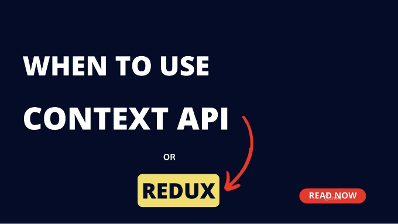
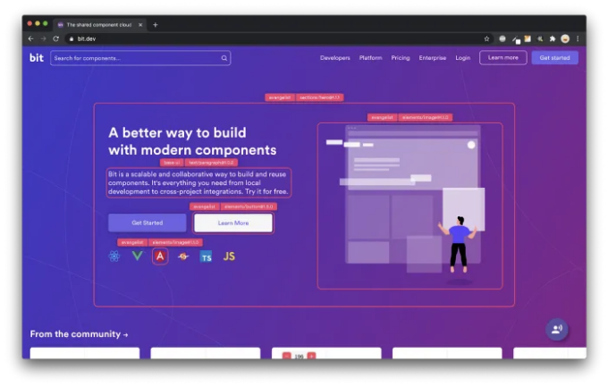

## 리액트 프로젝트에서 상태 관리를 위한 Context API와 Redux의 차이점을 이해한 후 둘 중 어떤 것을 선택할지 결정해보세요.

만약 누군가가 나에게 물어본다면, 웹사이트에서 가장 중요한 부분은 무엇인가요? 제 대답은 항상 같을 거예요. 그것은 상태 관리입니다. 결국, 사용자가 보게 될 것은 상태가 결정하기 때문이죠.



React를 위한 글로벌 상태 관리 솔루션을 선택할 때, 개발자들은 고려할 옵션이 많습니다. 오랜 시간 동안 Redux가 개발자들 사이에서 인기 있는 선택이었습니다. 그러나 Context API의 도입으로 인해, 개발자들은 빠르게 그것을 채택하기 시작했습니다. 어떤 경우에는 Redux를 Context로 대체하기도 합니다. 모든 이러한 일이 발생하는데, 중요한 질문이 나타납니다. 어느 것을 사용해야 할까요?

<!-- ui-log 수평형 -->
<ins class="adsbygoogle"
  style="display:block"
  data-ad-client="ca-pub-4877378276818686"
  data-ad-slot="9743150776"
  data-ad-format="auto"
  data-full-width-responsive="true"></ins>
<component is="script">
(adsbygoogle = window.adsbygoogle || []).push({});
</component>

Context API 또는 Redux를 사용할 때 결정해야 할 때

만약 단순히 props 전달을 피하기 위해 Redux를 사용 중이라면, 대신 Context API로 전환할 수 있습니다. Context API는 컴포넌트 간에 작은 정보 조각을 공유하는 데 적합합니다. 반면에 Redux는 더 강력하며 Context API에는 없는 유용한 기능을 제공합니다. 큰 데이터 청크를 관리하고 API 요청을 처리하는 데 훌륭합니다.

Context API와 Redux의 차이

Context API와 Redux의 차이점은 상태 변경을 어떻게 처리하는가에 있습니다. Redux는 상태 변경을 중앙 집중식으로 다루며, 상태 변경을 중앙 저장소에서 관리합니다. 반면에 Context API는 각 컴포넌트 내에서 발생하는 대로 상태 변경을 다룹니다.

<!-- ui-log 수평형 -->
<ins class="adsbygoogle"
  style="display:block"
  data-ad-client="ca-pub-4877378276818686"
  data-ad-slot="9743150776"
  data-ad-format="auto"
  data-full-width-responsive="true"></ins>
<component is="script">
(adsbygoogle = window.adsbygoogle || []).push({});
</component>

두 라이브러리 간의 차이를 더 잘 이해하기 위해 각각을 자세히 살펴보겠습니다.

## Context API

Context API는 React 세계에 흥미로운 추가 요소입니다. 이는 각 레벨에서 수동으로 props를 전달할 필요 없이 여러 컴포넌트 간에 데이터를 쉽게 공유할 수 있는 편리한 방법을 제공합니다. 이 기능은 React 컴포넌트 트리 내에서 전역적으로 액세스해야 하는 데이터(예: 테마 설정 또는 선호 언어)가 있는 경우 특히 도움이 됩니다.

Context API의 주요 이점 중 하나는 응용 프로그램에서 상태 관리를 간소화할 수 있는 능력입니다. Context를 사용하여 컴포넌트 간 데이터 전달의 복잡성을 줄이고 추가 조치나 props 필요성을 제거할 수 있습니다. 이렇게 하면 코드가 더 간결해지고 유지 관리가 쉬워집니다. 컴포넌트 간 데이터 공유를 간편하게 하는 편리한 도구가 있는 것과 같습니다.

<!-- ui-log 수평형 -->
<ins class="adsbygoogle"
  style="display:block"
  data-ad-client="ca-pub-4877378276818686"
  data-ad-slot="9743150776"
  data-ad-format="auto"
  data-full-width-responsive="true"></ins>
<component is="script">
(adsbygoogle = window.adsbygoogle || []).push({});
</component>

Context API는 두 가지 핵심 개념을 가지고 있어요:

- Providers
- Consumers

Providers는 특정 상태 값들을 정의하고 추적하는 역할을 합니다. 이 상태 값들은 그 후에 Provider 내부에 중첩된 모든 자식 컴포넌트들이 접근할 수 있어요. 이 자식 컴포넌트들, 우리가 Consumers라고 부르는 것들,은 Context Provider에 의해 제공된 상태를 엑세스하거나 수정하는 역할을 맡고 있어요.

전반적으로, Context API는 React Application 내에서 공유 데이터를 효율적으로 관리할 수 있는 방법을 제공하며, 수동으로 프롭스를 전달하거나 Redux와 같은 다른 상태 관리 라이브러리를 사용하는 것에 대한 가치 있는 대안이 될 수 있어요.

<!-- ui-log 수평형 -->
<ins class="adsbygoogle"
  style="display:block"
  data-ad-client="ca-pub-4877378276818686"
  data-ad-slot="9743150776"
  data-ad-format="auto"
  data-full-width-responsive="true"></ins>
<component is="script">
(adsbygoogle = window.adsbygoogle || []).push({});
</component>

## Redux

Redux는 애플리케이션의 데이터 흐름을 중앙 집중식으로 관리하는 강력한 JavaScript 라이브러리입니다. 일관성 있고 테스트 가능하며 유연한 애플리케이션을 구축하는 데 도움이 되도록 설계되었습니다. Redux는 되돌리기/다시 실행 기능, 상태 지속성 등과 같은 멋진 기능들을 제공합니다.

Redux를 사용하면 애플리케이션의 전체 상태가 한 곳에 저장되어 어떤 컴포넌트에서든 손쉽게 접근할 수 있게 되며 props 전파가 필요하지 않습니다. Redux는 다음과 같은 세 가지 핵심 개념에 기반하여 작동합니다:

- Actions
- Reducers
- Store

<!-- ui-log 수평형 -->
<ins class="adsbygoogle"
  style="display:block"
  data-ad-client="ca-pub-4877378276818686"
  data-ad-slot="9743150776"
  data-ad-format="auto"
  data-full-width-responsive="true"></ins>
<component is="script">
(adsbygoogle = window.adsbygoogle || []).push({});
</component>

액션은 데이터를 Redux 스토어로 보내는 이벤트를 나타냅니다. 사용자 상호작용에 의해 트리거되거나 응용 프로그램에서 직접 호출될 수 있습니다. 각 액션은 고유한 유형과 연결된 페이로드를 가지고 있습니다. 예를 들어, 할 일 추가에 대한 액션은 다음과 같이 보일 수 있습니다:

```js
const addTodo = text => {
  return {
    type: 'todos/todoAdded',
    payload: text
  }
}
```

액션이 디스패치되면 해당하는 리듀서 함수가 트리거됩니다. 리듀서는 현재 상태를 가져와 받은 액션을 기반으로 변경 내용을 반영한 새로운 상태를 반환합니다.

이 모든 것은 스토어 내에서 발생합니다. 스토어는 응용 프로그램 상태를 보유하는 역할을 합니다. Redux에서는 응용 프로그램 전체에 대해 하나의 스토어만 가지는 것이 권장됩니다.

<!-- ui-log 수평형 -->
<ins class="adsbygoogle"
  style="display:block"
  data-ad-client="ca-pub-4877378276818686"
  data-ad-slot="9743150776"
  data-ad-format="auto"
  data-full-width-responsive="true"></ins>
<component is="script">
(adsbygoogle = window.adsbygoogle || []).push({});
</component>

이제 Redux와 Context에 대한 이해가 생겼으니, 각각이 빛을 발하는 다양한 사용 사례 및 응용 프로그램을 살펴보겠습니다.

## Context API의 사용 사례

Context API는 React와 함께 제공되는 강력한 기능으로, 수동으로 프롭 전달이 필요하지 않은 컴포넌트 간 데이터 공유에 직관적인 방법을 제공합니다. 응용 프로그램 전반에 걸쳐 비교적 간단한 전역 데이터를 관리하는 데 탁월한 선택지입니다.

React 애플리케이션의 테마를 관리하기 위해 Context API를 사용하는 예제를 살펴보겠습니다:

<!-- ui-log 수평형 -->
<ins class="adsbygoogle"
  style="display:block"
  data-ad-client="ca-pub-4877378276818686"
  data-ad-slot="9743150776"
  data-ad-format="auto"
  data-full-width-responsive="true"></ins>
<component is="script">
(adsbygoogle = window.adsbygoogle || []).push({});
</component>

```js
import React, {useContext, useState} from "react";

// 기본 테마 값 설정
const ThemeContext = React.createContext({
  theme: "light",
  setTheme: () => {},
});

const App = () => {
  const [theme, setTheme] = useState("light");

  return (
    <ThemeContext.Provider value={ theme, setTheme }>
      <Hello />
    </ThemeContext.Provider>
  );
};

const Hello = () => {
  const { theme } = useContext(ThemeContext);
  
  return (
    <h1 style={ color: theme === "light" ? "black" : "white" }>Hello</h1>
  );
};
```

이 예시에서는 React.createContext()를 사용하여 ThemeContext를 생성하고 초기 테마 값을 light로 설정하고 setTheme 함수를 함께 설정합니다. App 컴포넌트는 ThemeContext.Provider로 Hello 컴포넌트를 감싸며 모든 중첩된 컴포넌트에서 theme 및 setTheme 값을 사용할 수 있게합니다. Hello 컴포넌트는 useContext를 사용하여 테마 값을 소비하고 선택된 테마에 따라 적절한 색상을 적용합니다.

## Redux의 사용 사례

Redux는 다음과 같은 상황에서 일반적으로 사용됩니다:```

<!-- ui-log 수평형 -->
<ins class="adsbygoogle"
  style="display:block"
  data-ad-client="ca-pub-4877378276818686"
  data-ad-slot="9743150776"
  data-ad-format="auto"
  data-full-width-responsive="true"></ins>
<component is="script">
(adsbygoogle = window.adsbygoogle || []).push({});
</component>

- 애플리케이션은 많은 컴포넌트에서 액세스해야 하는 상태가 많습니다.
- 애플리케이션 상태가 자주 업데이트됩니다.
- 애플리케이션 상태를 업데이트하는 논리가 복잡합니다.

Redux의 이상적인 사용 사례를 더 잘 이해하기 위해 애플리케이션 사용자 목록을 추적하는 상태 조각을 구현해 보겠습니다.

userReducer.js 파일에서 우리는 빈 배열의 초기 상태로 시작합니다:

```js
const initialState = [];

const userReducer = (state = initialState, action) => {
  switch (action.type) {
    case "SET_USERS":
      return action.payload;

    case "ADD_USER":
      return [...state, action.payload];

    case "EDIT_USER":
      const newState = [...state];
      const index = newState.findIndex((item) => item.id === action.payload.id);
      newState[index] = action.payload;
      return newState;

    case "DELETE_USER":
      return state.filter((user) => user.id !== action.payload.id);

    default:
      return state;
  }
};
```

<!-- ui-log 수평형 -->
<ins class="adsbygoogle"
  style="display:block"
  data-ad-client="ca-pub-4877378276818686"
  data-ad-slot="9743150776"
  data-ad-format="auto"
  data-full-width-responsive="true"></ins>
<component is="script">
(adsbygoogle = window.adsbygoogle || []).push({});
</component>

Redux를 초기화하려면 전체 앱 구성요소를 Redux Provider 내에 감싸고 스토어를 초기화해야합니다.

App.jsx 파일에서:

```js
import { Provider } from 'react-redux';
import { createStore } from 'redux';
import userReducer from './reducers/userReducer';

// 스토어의 인스턴스 생성
const store = createStore({
  users: userReducer,
});

const App = () => {
  // 스토어 인스턴스 설정
  return <Provider store={store}><Users /></Provider>;
};

export default App;
```

마지막으로, 상태에 접근하려면 react-redux에서 제공하는 useSelector 훅을 사용하여 구성 요소를 상태에 연결할 수 있습니다.

<!-- ui-log 수평형 -->
<ins class="adsbygoogle"
  style="display:block"
  data-ad-client="ca-pub-4877378276818686"
  data-ad-slot="9743150776"
  data-ad-format="auto"
  data-full-width-responsive="true"></ins>
<component is="script">
(adsbygoogle = window.adsbygoogle || []).push({});
</component>

## 다른 상태 관리 도구

이 글에서는 흥미로운 다른 상태 관리 도구에 대해 이야기할 예정이에요. 이 도구들을 사용하라고 설득하거나 Redux나 Context API보다 우수하다고 주장하는 것은 아니에요. 우리는 단지 인식을 높이고 고려할 옵션을 더 제공하고 싶어해요. 그러니 이 도구들을 자세히 살펴보아요! 🕺🏻

## React-Query

<!-- ui-log 수평형 -->
<ins class="adsbygoogle"
  style="display:block"
  data-ad-client="ca-pub-4877378276818686"
  data-ad-slot="9743150776"
  data-ad-format="auto"
  data-full-width-responsive="true"></ins>
<component is="script">
(adsbygoogle = window.adsbygoogle || []).push({});
</component>

언급할 가치가 있는 도구 중 하나는 React Query입니다. 이 도구는 데이터 가져오기와 관련된 상태 관리를 처리하기 위해 특별히 설계되었습니다. React Query를 사용하면 데이터 가져오기를 쉽게 처리할 수 있는 다양한 유틸리티를 활용할 수 있습니다. React Query에 대해 더 알고 싶다면 다음 문서를 확인해보세요 -` React-Query

## Recoil

또 다른 흥미로운 상태 관리 도구는 Facebook에서 개발한 Recoil입니다. 비록 비교적 새로운 도구이지만, Recoil은 계속해서 개발되고 향상되고 있습니다. Recoil에서는 각 상태 조각을 "atom"이라고 부르며, 이러한 아톰들을 셀렉터와 결합하여 응용 프로그램에 맞는 고유한 데이터 구조를 만들 수 있습니다. Recoil이 궁금하다면 더 많은 정보를 찾을 수 있습니다 -` Recoil

## MobX

<!-- ui-log 수평형 -->
<ins class="adsbygoogle"
  style="display:block"
  data-ad-client="ca-pub-4877378276818686"
  data-ad-slot="9743150776"
  data-ad-format="auto"
  data-full-width-responsive="true"></ins>
<component is="script">
(adsbygoogle = window.adsbygoogle || []).push({});
</component>

이제 MobX에 대해 이야기 해봐요. Redux와 Context API와는 다르게 MobX는 클래스 기반 접근 방식을 따릅니다. 핵심 개념은 상태 관리를 "observable"하게 만드는 데 중점을 둡니다. MobX를 활용하면 애플리케이션 상태의 변경을 쉽게 관찰하고 반응할 수 있어요. MobX에 대해 더 알아보고 싶다면 - `MobX

## 마무리

상태 관리는 웹 애플리케이션의 필수 요소이며 React 애플리케이션에서 글로벌 상태를 관리하는 올바른 방법을 선택하는 것이 중요해요. Context API와 Redux를 언제 사용해야 하는지에 대한 논쟁은 자주 있습니다. Context API와 Redux가 어떻게 작동하는지를 이해하는 것이 중요하며 사용 사례에 맞는 적절한 도구를 선택하는 것도 중요해요.

이 글을 통해 Context API와 Redux의 기본적인 예제와 이상적인 사용 사례를 제공했습니다. 마지막으로, Context API 대 Redux 언제 사용해야 하는지에 대한 질문에 답변했습니다. 이 지식을 바탕으로 Context API나 Redux를 사용할 때의 결정을 확신할 수 있을 거예요. 👍

<!-- ui-log 수평형 -->
<ins class="adsbygoogle"
  style="display:block"
  data-ad-client="ca-pub-4877378276818686"
  data-ad-slot="9743150776"
  data-ad-format="auto"
  data-full-width-responsive="true"></ins>
<component is="script">
(adsbygoogle = window.adsbygoogle || []).push({});
</component>

# 리액트 앱을 레고처럼 재사용 가능한 컴포넌트로 구축하세요



Bit의 오픈 소스 도구는 25만 명 이상의 개발자가 컴포넌트를 사용하여 앱을 개발하는 데 도움을 줍니다.

어떤 UI, 기능 또는 페이지든 재사용 가능한 컴포넌트로 변환하고 응용 프로그램 간에 공유하세요. 협업하고 더 빨리 구축하는 것이 쉬워집니다.

<!-- ui-log 수평형 -->
<ins class="adsbygoogle"
  style="display:block"
  data-ad-client="ca-pub-4877378276818686"
  data-ad-slot="9743150776"
  data-ad-format="auto"
  data-full-width-responsive="true"></ins>
<component is="script">
(adsbygoogle = window.adsbygoogle || []).push({});
</component>

→ 더 알아보기

앱을 컴포넌트로 분할하여 앱 개발을 더 쉽게 만들 수 있고, 원하는 작업 흐름에 대해 최상의 경험을 즐길 수 있습니다:

- 마이크로 프론트엔드
- 디자인 시스템

<!-- ui-log 수평형 -->
<ins class="adsbygoogle"
  style="display:block"
  data-ad-client="ca-pub-4877378276818686"
  data-ad-slot="9743150776"
  data-ad-format="auto"
  data-full-width-responsive="true"></ins>
<component is="script">
(adsbygoogle = window.adsbygoogle || []).push({});
</component>

## → 코드 공유 및 재사용

## → 모노 레포

## 더 알아보기: