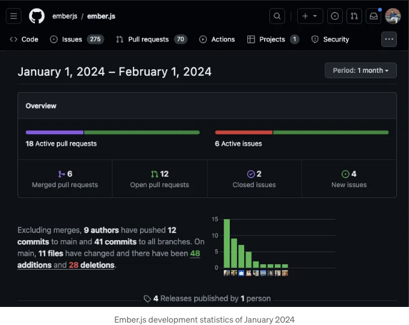
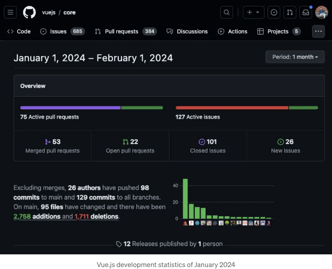
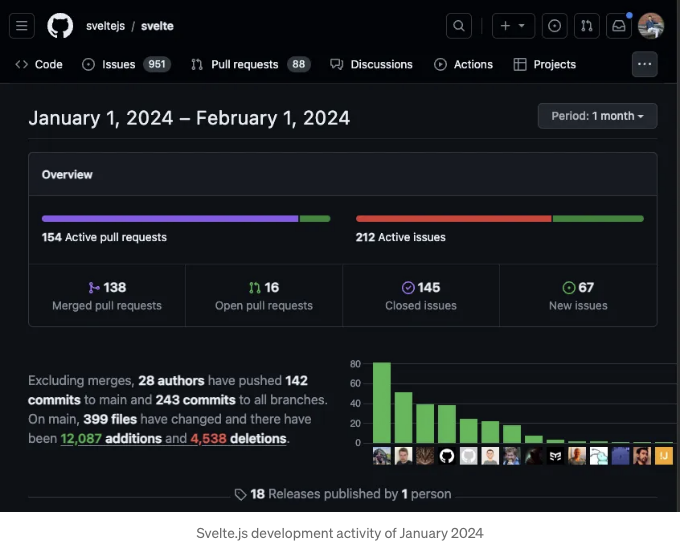
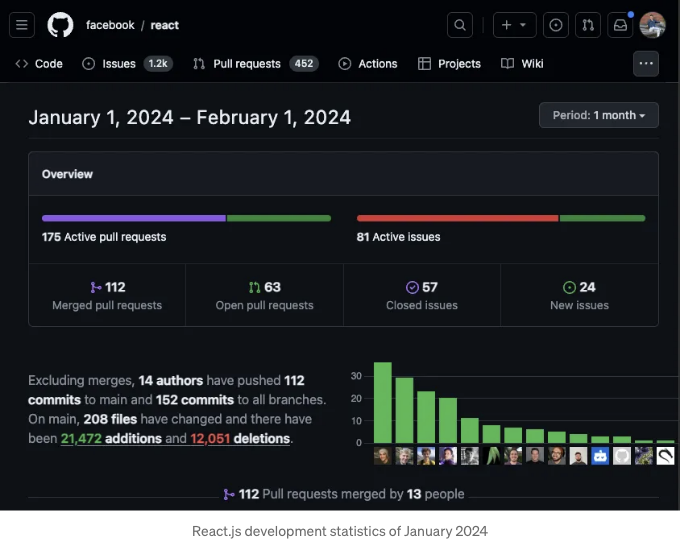
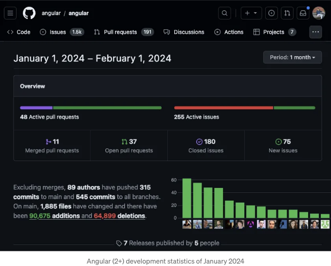
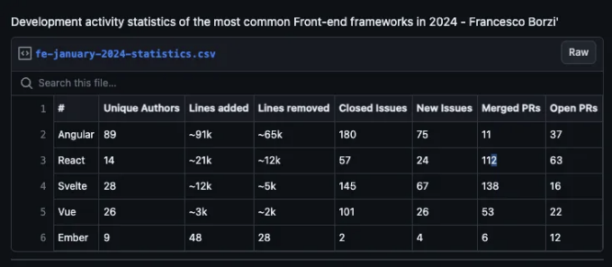

# 또 다른 프론트엔드 프레임워크 비교?

네, 알고 있어요. 이미 "React vs Angular vs Vue vs ..."와 같은 기사로 가득 차 있어서 짜즯네요.

더 짜즯네 한 점은 그 중 대부분이 얕은 정보를 던지고 공통으로 말하는 정치적으로 옳다고 할 수 있는 결론을 하려고 해요. "모든 프레임워크는 충분히 좋으니까, 선택은 당신의 취향과 특별한 필요에 달려있어요" 정도로 요약할 수 있겠죠. 이런 글들은 독자를 더 헷갈리게 만들죠.

<!-- ui-log 수평형 -->
<ins class="adsbygoogle"
  style="display:block"
  data-ad-client="ca-pub-4877378276818686"
  data-ad-slot="9743150776"
  data-ad-format="auto"
  data-full-width-responsive="true"></ins>
<component is="script">
(adsbygoogle = window.adsbygoogle || []).push({});
</component>

하지만 가장 거슬리는 것은 이러한 종류의 비교 기사들이 서로서로 "Angular를 배우는 게 어렵다"나 "React는 빠른 개발에 좋다"와 같은 평범한 주장들을 그냥 복사하는 것 같다는 점입니다.

...내 의견을 묻는다면, 나는 Angular를 배우는 게 "어렵다"고 느끼지 않았고(특히 OOP 배경을 가지고 있기 때문에), 어떤 일을 하는지 알고 있다면 모든 프레임워크가 "빠른 개발"에 좋다고 생각합니다. 그리고 자신이 뭘 하는지 모르는 경우 "빠른 개발"을 하지 말아야 하며, 대신 사용할 기술을 제대로 배워야 한다고 생각합니다. 하지만 이것은 제 개인적인 의견일 뿐이며, 이 기사에서 처음이자 마지막으로 표현할 것입니다.

# 대신 데이터에 대해 이야기해 봅시다

이 기사에서 제가 보여주고 싶은 것은 객관적인 데이터입니다: 각 프론트엔드 프레임워크의 개발 활동에 관한 통계입니다. 이 기사에서는 이미 GitHub에 공개된 정보를 그룹화했습니다. 이 프레임워크들이 오픈 소스라는 것은 정말 멋진 점이지요.

<!-- ui-log 수평형 -->
<ins class="adsbygoogle"
  style="display:block"
  data-ad-client="ca-pub-4877378276818686"
  data-ad-slot="9743150776"
  data-ad-format="auto"
  data-full-width-responsive="true"></ins>
<component is="script">
(adsbygoogle = window.adsbygoogle || []).push({});
</component>

이 실험에서 나는 2024년에 가장 인기 있는 프론트엔드 프레임워크로 보이는 React, Angular, Vue, Svelte 및 Ember를 선택했습니다. 다른 중요한 것이 빠졌다고 생각되면 언제든지 연락해 주세요.

그런 다음 공식 GitHub 저장소로 이동하여 2024년 첫 달의 개발 활동을 비교했습니다.

# 개발 활동이 왜 중요한가요?

새로운 응용 프로그램을 위한 프레임워크를 선택할 때 가장 활발하게 개발 중인 옵션을 확인하는 것이 중요합니다. 물론 이것이 고려해야 할 유일한 요소는 아니지만 실제로 중요한 역할을 합니다.

<!-- ui-log 수평형 -->
<ins class="adsbygoogle"
  style="display:block"
  data-ad-client="ca-pub-4877378276818686"
  data-ad-slot="9743150776"
  data-ad-format="auto"
  data-full-width-responsive="true"></ins>
<component is="script">
(adsbygoogle = window.adsbygoogle || []).push({});
</component>

안녕하세요! 보안, 빈번한 버그 수정, 커뮤니티 지원, 호환성, 지속적인 성능 및 기능 향상, 장기적인 지속 가능성, 산업 변화에 대한 적응력에 중요한 역할을 하는 것은 활발하게 개발 중인 프레임워크를 선택하는 것입니다.

제가 나열할 프레임워크들은 현재 가장 인기 있는 것들이며, 모두 활발히 개발 중입니다. 그러나 그들의 개발 활동에 대한 통계를 비교하는 것은 여전히 흥미로울 것입니다.

# 프론트엔드 프레임워크 개발 활동 통계 2024

아래에 표시된 모든 통계는 2024년 2월 1일에 수집된 것입니다.

<!-- ui-log 수평형 -->
<ins class="adsbygoogle"
  style="display:block"
  data-ad-client="ca-pub-4877378276818686"
  data-ad-slot="9743150776"
  data-ad-format="auto"
  data-full-width-responsive="true"></ins>
<component is="script">
(adsbygoogle = window.adsbygoogle || []).push({});
</component>

## 5. Ember

소스: https://github.com/emberjs/ember.js/pulse/monthly

## 4. Vue

<!-- ui-log 수평형 -->
<ins class="adsbygoogle"
  style="display:block"
  data-ad-client="ca-pub-4877378276818686"
  data-ad-slot="9743150776"
  data-ad-format="auto"
  data-full-width-responsive="true"></ins>
<component is="script">
(adsbygoogle = window.adsbygoogle || []).push({});
</component>

소스: https://github.com/vuejs/core/pulse/monthly

### 3. Svelte

소스: https://github.com/sveltejs/svelte/pulse/monthly

<!-- ui-log 수평형 -->
<ins class="adsbygoogle"
  style="display:block"
  data-ad-client="ca-pub-4877378276818686"
  data-ad-slot="9743150776"
  data-ad-format="auto"
  data-full-width-responsive="true"></ins>
<component is="script">
(adsbygoogle = window.adsbygoogle || []).push({});
</component>

## 2. React

링크: https://github.com/facebook/react/pulse/monthly

<!-- ui-log 수평형 -->
<ins class="adsbygoogle"
  style="display:block"
  data-ad-client="ca-pub-4877378276818686"
  data-ad-slot="9743150776"
  data-ad-format="auto"
  data-full-width-responsive="true"></ins>
<component is="script">
(adsbygoogle = window.adsbygoogle || []).push({});
</component>

## 1. Angular

출처: https://github.com/angular/angular/pulse/monthly

# 프론트엔드 프레임워크 개발 활동 비교

<!-- ui-log 수평형 -->
<ins class="adsbygoogle"
  style="display:block"
  data-ad-client="ca-pub-4877378276818686"
  data-ad-slot="9743150776"
  data-ad-format="auto"
  data-full-width-responsive="true"></ins>
<component is="script">
(adsbygoogle = window.adsbygoogle || []).push({});
</component>

20개 모든 FE 프레임워크의 개발 활동 통계를 비교하기 위한 표를 만들었습니다:

여기서 Angular이 1위를 차지했습니다. 구글이 후원하는 이 프레임워크는 고유 기여자 수 측면에서 React보다 약 6배 많은 인원을 보유하고, 추가하거나 제거된 코드 라인 수 측면에서도 높은 수치를 기록했습니다. 또한 2024년의 첫 달에 보고된 이슈를 상당히 많이 해결하여 180개의 이슈를 닫았습니다. 이 높은 해결 속도는 버그 수정 및 지속적인 향상에 대한 적극적인 접근을 시사합니다.

React는 2위에 올랐습니다. 14명의 고유 기여자로 이루어진 작은 기여자 기반을 가지고 있지만 112개의 병합된 pull 요청을 통해 효율적인 검토 및 통합 프로세스를 보여주었습니다. Svelte는 3위를 차지하며 정보 해결률이 높은(145) 점이 인상적입니다. Vue는 4위를 차지했고 그 수치는 Svelte과 크게 차이 나지 않습니다.

위의 표의 이미지 버전을 참고하고 싶을 경우 다음을 복사하여 붙여넣기해보세요:

<!-- ui-log 수평형 -->
<ins class="adsbygoogle"
  style="display:block"
  data-ad-client="ca-pub-4877378276818686"
  data-ad-slot="9743150776"
  data-ad-format="auto"
  data-full-width-responsive="true"></ins>
<component is="script">
(adsbygoogle = window.adsbygoogle || []).push({});
</component>

# 결론

- 2024년 초에 가장 활발하게 개발되는 프레임워크는 Angular로 보이며, 그 뒤를 이어 React, Svelte, Vue가 있습니다.
- 이러한 지표는 객관적인 측정치를 제공하지만, 그들의 한계를 인식하는 것이 중요합니다. 단순히 코드 행 수, 이슈, 풀 리퀘스트를 세는 것은 코드 변경의 효과나 해결된 이슈의 심각성을 완전히 반영하지는 않습니다.
- 활발한 개발은 프레임워크를 선택할 때 고려해야할 중요한 요소 중 하나지만, 다른 여러 요소 중 하나에 불과합니다.