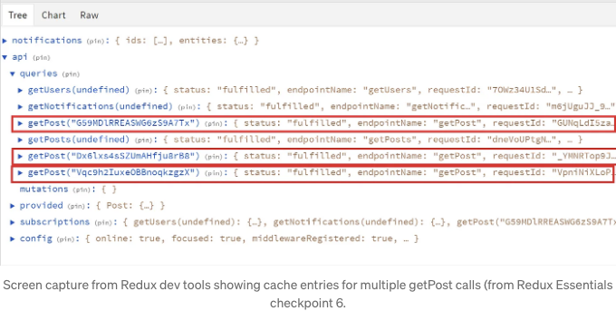
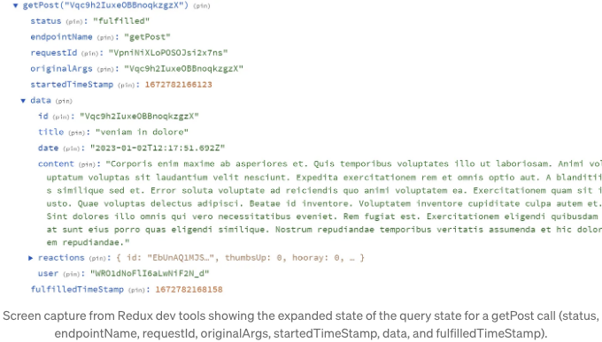

Redux Essentials 자습서의 RTK Query 부분은 놀라울 정도로 훌륭하지만, 더 큰 문서의 일부이기 때문에 RTK Query의 보석 같은 존재가 잃어버리고 있다는 느낌을 받습니다.


# 리덕스란

많은 사람들이 Redux를 상태 관리 라이브러리로 생각하지만, 그것이 맞다. 그들에게 Redux의 주된 가치는 응용 프로그램의 어디서든지 상태에 액세스(및 변경)할 수 있게 만든다는 점입니다. 개인적으로는 Redux와 같은 것을 사용하는 것의 의미는 그것을 놓치는 것이라 생각하므로, 조금 더 확장하여 다시 살펴보겠습니다.

<!-- ui-log 수평형 -->
<ins class="adsbygoogle"
  style="display:block"
  data-ad-client="ca-pub-4877378276818686"
  data-ad-slot="9743150776"
  data-ad-format="auto"
  data-full-width-responsive="true"></ins>
<component is="script">
(adsbygoogle = window.adsbygoogle || []).push({});
</component>

다들 이 다이어그램을 보았을 것이에요, 또는 비슷한 것을 본 적이 있을 거에요:


이 모델에서 UI에는 상점으로부터 현재 금액을 표시할 수 있는 곳이 있고, 사용자가 입금 또는 출금을 원하는지를 나타내는 버튼이 있습니다. 이러한 버튼 중 하나를 클릭하면 해당 버튼을 클릭한 즉시, 사용자가 요청한 내용에 따라 액션을 전달하기 위해 컴포넌트 외부로 이동합니다. 이 시점에서 상태(state)가 변경된 것은 아닙니다. 이후, 액션은 상점(store)에 도착하고, 리듀서는 이를 보고 사용자의 요청에 대해 무엇을 할지 결정합니다. 리듀서가 사용자의 요청을 수용하기로 결정하면, 해당 상태 변경이 UI로 전파됩니다.

이렇게 하는 이유는 무엇일까요? 먼저 사용자가 계좌에 $5가 있고 "10달러 출금" 버튼을 클릭한다고 상상해보죠. 리듀서는 그 요청을 무시하고 음수 잔액으로 가지 않기로 결정할 수도 있습니다. 또는, 리듀서는 오류를 토스트 컴포넌트가 모니터링하는 상태로 경로를 지정할 수도 있습니다. 만약 이러한 논리를 UI 컴포넌트에 넣으려고 한다면, 해당 컴포넌트를 더 복잡하게 만들고, 해당 컴포넌트와 관련 없는 변경 사항을 해당 컴포넌트에서 수행해야 한다는 것을 의미합니다.

<!-- ui-log 수평형 -->
<ins class="adsbygoogle"
  style="display:block"
  data-ad-client="ca-pub-4877378276818686"
  data-ad-slot="9743150776"
  data-ad-format="auto"
  data-full-width-responsive="true"></ins>
<component is="script">
(adsbygoogle = window.adsbygoogle || []).push({});
</component>

동시에, 다른 컴포넌트에서 해당 로직이 필요한 경우 문제가 발생합니다. 예, 사람들은 훅이 이 문제를 해결한다고 말합니다. 하지만 보통의 훅이 뷰 로직과 너무 얽혀 있기 때문에 훅 내의 로직과 상호작용하기 위해 뷰에 상당한 양의 로직이 보통 있습니다. 그래서 실제로는 컴포넌트에 반복 로직이 많아서 다른 곳에서 훅을 그냥 사용할 수 없는 경우가 많습니다.

그리고 처리해야 할 오류 상태와 다른 상황이 많을수록 컴포넌트 내의 복잡성이 악화될 것입니다. 뿐만 아니라, 그 모든 로직이 컴포넌트에 있다면, 상당 부분의 상태가 그 컴포넌트에만 있는 것을 의미합니다. 그래서 사용자가 다른 곳으로 이동하는 즉시 해당 상태가 손실됩니다.

상태가 존재할 곳을 따로 두고 시스템의 각 부분 사이에 메시징을 추가함으로써, 리액트의 반응적인 루트에 충실한 시스템에서 유연성과 회복력을 만들어 냅니다.

# Redux에서 API 호출의 구조

<!-- ui-log 수평형 -->
<ins class="adsbygoogle"
  style="display:block"
  data-ad-client="ca-pub-4877378276818686"
  data-ad-slot="9743150776"
  data-ad-format="auto"
  data-full-width-responsive="true"></ins>
<component is="script">
(adsbygoogle = window.adsbygoogle || []).push({});
</component>

API 호출을 시작하면 모든 것이 더 복잡해지기 시작합니다. 왜냐하면 리덕스의 원래 플레이버나 리액트와 마찬가지로 비동기 논리에 대한 자연스러운 처리 방법이 없기 때문입니다. 다행히 리덕스는 액션에 대응하는 데 있어서 모든 리듀서를 통과시키고 새로운 상태를 만들어내는 것 이외에도 다른 미들웨어를 추가할 수 있는 메커니즘을 제공했습니다.

이와 같은 작업을 다루는 데 가장 인기 있는 미들웨어는 리덕스 사가와 리덕스 썽크였습니다. 제 개인적으로는 사가를 훨씬 선호했고, 사가를 좋아하는 사람들이 최근에 추가된 리스너 미들웨어를 찾던 중 리덕스 툴킷에 심각하게 관심을 갖기 시작했습니다. 결론적으로, 대부분의 경우 사가로 수행했던 작업 중 상당 부분이 RTK 쿼리로 더 효율적으로 처리될 수 있었습니다. 하지만 지금 미리 말하긴 했지만 조금 빨리 나가는 것 같습니다.

매우 높은 수준에서 이러한 미들웨어들은 하나의 디스패치된 액션에 응담하기 위해 취해야 할 일련의 단계를 지정할 수 있게 해줍니다. 이 과정에는 다른 액션을 디스패치하고, 해당 단계가 진행되는 동안 상태를 변경할 수 있는 경우가 포함될 수 있습니다. 이러한 것은 다음과 같이 보일 수 있습니다:


<!-- ui-log 수평형 -->
<ins class="adsbygoogle"
  style="display:block"
  data-ad-client="ca-pub-4877378276818686"
  data-ad-slot="9743150776"
  data-ad-format="auto"
  data-full-width-responsive="true"></ins>
<component is="script">
(adsbygoogle = window.adsbygoogle || []).push({});
</component>

도표로 보면 상당히 간단해 보이지만, 이를 수행하는 논리는 상당히 장황할 수 있고 종종 테스트가 어려웠습니다. 그리고 이 코드는 보통 모든 API 호출에 대해 반복되었어요. 그뿐만 아니라, 이 모든 작업을 마치면 여전히 로딩 상태, 오류 상태, 그리고 각 API 호출에 대한 데이터를 가져오기 위한 선택기 세트를 작성해야 했어요. 그리고 그것들은 비교적 단순한 앱을 위한 것이었을 뿐이에요.

비교적 흔한 패턴은 마스터/세부 정보인데, 여기서 "것들"의 컬렉션에 대한 충분한 데이터를 얻어서 목록을 표시한 후 사용자가 정보를 더 얻을 수 있는 형태로 드릴다운하는 것이에요.

사용자는 같은 세부 정보 항목으로 클릭하여 이동할 수 있기 때문에 성능을 향상할 가장 간단한 방법은 각 세부 호출 결과를 캐시하는 것이며, 이미 해당 결과를 가지고 있는지 확인한 후에 다시 가져오기 전에 확인해봐야 합니다. 하지만 이 또한 복잡성을 증가시키며, 결과를 저장하는 방법, 확인하는 방법을 파악하고 이미 가지고 있는 경우 API 호출을 실행하지 않도록 해야 합니다. 호출을 실행하는 것은 비동기적인데, 이미 가지고 있는 결과를 단순히 반환하는 것은 동기적으로 수행될 수 있어요.

<!-- ui-log 수평형 -->
<ins class="adsbygoogle"
  style="display:block"
  data-ad-client="ca-pub-4877378276818686"
  data-ad-slot="9743150776"
  data-ad-format="auto"
  data-full-width-responsive="true"></ins>
<component is="script">
(adsbygoogle = window.adsbygoogle || []).push({});
</component>

데이터 편집을 시작하면, 더 복잡해집니다. 레코드를 편집할 때 갑자기 마스터 목록을 업데이트해야 하거나 목록을 다시로드할 방법을 뭔가 해줘야 합니다.

모든 것을 추적하려고 코드를 엉망으로 만들 수 있습니다. 언제 무슨 일이 발생해야 하는지 그리고 적절한 시간에 데이터를 가져오거나 업데이트하는 방법을 파악하는 데 정보를 크게 부족할 수 있습니다. 팀 단위로 작업하다 보면 더 어려워질 수 있습니다. 왜냐하면 각 개인마다 이러한 문제를 처리하는 약간 다른 방법을 생각할 수 있기 때문입니다.

리덕스 에센셜 강좌에서의 예시를 보세요:

```js
export const fetchPosts = createAsyncThunk('posts/fetchPosts', async () => {
  const response = await client.get('/fakeApi/posts')
  return response.data
});

const postsSlice = createSlice({
  name: 'posts',
  initialState,
  // these reducers aren't related to the thunk
  reducers: {
    reactionAdded(state, action) {
      const { postId, reaction } = action.payload
      const existingPost = state.posts.find((post) => post.id === postId)
      if (existingPost) {
        existingPost.reactions[reaction]++
      }
    },
    postUpdated(state, action) {
      const { id, title, content } = action.payload
      const existingPost = state.posts.find((post) => post.id === id)
      if (existingPost) {
        existingPost.title = title
        existingPost.content = content
      }
    },
  },
  // these are mostly handling the status of the thunk
  extraReducers(builder) {
    builder
      .addCase(fetchPosts.pending, (state, action) => {
        state.status = 'loading'
      })
      .addCase(fetchPosts.fulfilled, (state, action) => {
        state.status = 'succeeded'
        // Add any fetched posts to the array
        state.posts = state.posts.concat(action.payload)
      })
      .addCase(fetchPosts.rejected, (state, action) => {
        state.status = 'failed'
        state.error = action.error.message
      })
  },
});
```

<!-- ui-log 수평형 -->
<ins class="adsbygoogle"
  style="display:block"
  data-ad-client="ca-pub-4877378276818686"
  data-ad-slot="9743150776"
  data-ad-format="auto"
  data-full-width-responsive="true"></ins>
<component is="script">
(adsbygoogle = window.adsbygoogle || []).push({});
</component>

안타깝게도 많은 개발자들은 문제 해결에 충분한 솔루션을 찾으면 자습서를 읽는 것을 그만두므로, 그들 중 많은 사람들은 자신에게 얼마나 더 많은 기능이 제공되는지 알지 못합니다.

# RTK Query가 등장합니다

<!-- ui-log 수평형 -->
<ins class="adsbygoogle"
  style="display:block"
  data-ad-client="ca-pub-4877378276818686"
  data-ad-slot="9743150776"
  data-ad-format="auto"
  data-full-width-responsive="true"></ins>
<component is="script">
(adsbygoogle = window.adsbygoogle || []).push({});
</component>

Redux Toolkit Query, 또는 RTK Query는 이름에서 알 수 있듯이 Redux Toolkit을 기반으로 만들어진 것인데요, 제가 자세히 다루지는 않을 거예요. RTK Query에서는 API 로직이 API 엔드포인트 전용 슬라이스에 존재합니다. 엔드포인트에는 쿼리와 뮤테이션 두 가지 유형이 있어요. 쿼리는 하나 이상의 레코드를 반환하는데 반해, 뮤테이션은 데이터를 생성, 편집 또는 업데이트하여 업데이트된 상태를 반환할 수 있어요.

해당 슬라이스 내에서 RTK Query는 각 엔드포인트뿐만 아니라 각 엔드포인트와 호출된 인수에 대해 "해시"를 생성해요. 이를 통해 방금 실행한 쿼리의 결과를 사용자가 그 세부 정보로 다시 이동할 때 잠시 동안 유지하는 것이 저렴하고 쉽게 되어요.



해시의 각 부분에 포함된 상태는 이전에 많은 논리를 작성해야 했던 부분을 관리하는 데 사용됩니다:

<!-- ui-log 수평형 -->
<ins class="adsbygoogle"
  style="display:block"
  data-ad-client="ca-pub-4877378276818686"
  data-ad-slot="9743150776"
  data-ad-format="auto"
  data-full-width-responsive="true"></ins>
<component is="script">
(adsbygoogle = window.adsbygoogle || []).push({});
</component>



이 상태를 보면 이전에 우리가 thunk를 통해 관리했던 모든 것을 제공한다는 것을 알 수 있어요. RTK 쿼리에서 이를 기본적으로 제공받아 별도의 코드를 작성할 필요가 없어요. 나중에 작성해야 하는 코드에 대해 나중에 설명하겠지만, 사람들은 먼저 그 장점을 볼 수 있다면 새로운 방법을 시도할 가능성이 높아진다고 생각해요.

## RTK Query Hooks

여러 번 언급했듯이 나는 훅에 대한 의견을 명확히 했지만, RTK Query 훅은 거의 마법과 같아요. 이 훅들은 자동으로 엔드포인트에서 생성됩니다. 이를 컴포넌트에 이렇게 추가할 수 있어요:

<!-- ui-log 수평형 -->
<ins class="adsbygoogle"
  style="display:block"
  data-ad-client="ca-pub-4877378276818686"
  data-ad-slot="9743150776"
  data-ad-format="auto"
  data-full-width-responsive="true"></ins>
<component is="script">
(adsbygoogle = window.adsbygoogle || []).push({});
</component>

```js
export const PostsList = () => {
  const {
    data: posts = [],
    isLoading,
    isFetching,
    isSuccess,
    isError,
    error,
  } = useGetPostsQuery();
```

폭발 💥. 모든 것이 완성되었어요.

그게 아니라요, 컴포넌트에 쿼리 훅을 추가할 때, 쿼리에 대한 구독을 자동으로 만들어줍니다. 그리고 그에 맞게 API 호출 결과를 엔드포인트 + 인수의 조합으로 Redux 상태에 저장하죠. 그리고 "initiate" 액션을 디스패치해 API 호출을 시작합니다. 이 모든 과정에서 로딩 상태를 자동으로 추적하고, 마지막에 데이터를 자동으로 제공해 줍니다.

사용자가 다른 화면 요소를 보면서 다른 인수로 쿼리를 시작하면, 캐시에 이 쿼리들이 쌓일 수 있지만, RTK Query는 전체 API 슬라이스 또는 엔드포인트별로 전역적으로 타임아웃을 설정할 수 있게 해줍니다. 이는 화면에 표시되지 않는 쿼리들이 해당 시간이 경과한 후 캐시에서 제거된다는 뜻이에요.```

<!-- ui-log 수평형 -->
<ins class="adsbygoogle"
  style="display:block"
  data-ad-client="ca-pub-4877378276818686"
  data-ad-slot="9743150776"
  data-ad-format="auto"
  data-full-width-responsive="true"></ins>
<component is="script">
(adsbygoogle = window.adsbygoogle || []).push({});
</component>

변이 훅은 사실적으로 변화를 일으키는 방법을 반환합니다. 이들은 쿼리처럼 상태 번들을 제공하고 캐싱을 처리해 줍니다.

```js
const [updatePost, { isLoading, /* etc. */ }] = useEditPostMutation();
```

배경에서 쿼리와 변이를 연결하여, 변이를 실행하면 쿼리 결과가 변경되어 다시 실행되어 결과를 업데이트하는 방식으로 실행됩니다. 추가적인 코드 없이 결과를 업데이트합니다. 캐시된 데이터를 직접 업데이트할 수도 있지만, 전체 쿼리를 다시 실행하는 것이 비용이 많이 든다면 이것을 고려해야 합니다.

# 코드를 보여주세요!

<!-- ui-log 수평형 -->
<ins class="adsbygoogle"
  style="display:block"
  data-ad-client="ca-pub-4877378276818686"
  data-ad-slot="9743150776"
  data-ad-format="auto"
  data-full-width-responsive="true"></ins>
<component is="script">
(adsbygoogle = window.adsbygoogle || []).push({});
</component>

이 모든 것을 설정하는 코드는 사실 정말 간단합니다. api 슬라이스를 설정한 후에는요. createApi 메소드는 구성 객체 인수를 취합니다. 우리가 가장 많이 사용하는 그 객체의 속성은 엔드포인트 속성이며, 빌더 함수에 구성 객체를 제공하여 엔드포인트 속성을 채웁니다. 복잡하게 들리지만, 사실은 매우 간단할 수 있어요.

## 쿼리가 포함된 API 슬라이스

```js
// API 슬라이스 객체를 정의합니다
export const apiSlice = createApi({
  // 캐시 리듀서는 `state.api`에 추가되어야 합니다 (이미 기본값 - 선택 사항입니다)
  reducerPath: 'api',
  // 모든 요청은 '/fakeApi'로 시작하는 URL을 가져야 합니다
  baseQuery: fetchBaseQuery({ baseUrl: '/fakeApi' }),
  // "endpoints"는 이 서버에 대한 작업 및 요청을 나타냅니다
  endpoints: builder => ({
    // `getPosts` 엔드포인트는 데이터를 반환하는 "쿼리" 작업입니다
    getPosts: builder.query({
      // 요청의 URL은 '/fakeApi/posts'입니다
      query: () => '/posts'
    })
  })
});

// `getPosts` 쿼리 엔드포인트에 대한 자동 생성된 후크를 내보냅니다
export const { useGetPostsQuery } = apiSlice;
```

네, `getPosts` 엔드포인트의 이 작은 코드 조각은 요청 및 로드 상태, 발생한 오류 상태(있는 경우), 그리고 쿼리로 반환된 데이터를 모두 담은 `useGetPostsQuery` 후크를 생성해줍니다!

<!-- ui-log 수평형 -->
<ins class="adsbygoogle"
  style="display:block"
  data-ad-client="ca-pub-4877378276818686"
  data-ad-slot="9743150776"
  data-ad-format="auto"
  data-full-width-responsive="true"></ins>
<component is="script">
(adsbygoogle = window.adsbygoogle || []).push({});
</component>

## 변이 추가

변이를 추가하려면 다음과 같은 코드를 엔드포인트 구성 객체에 추가하면 됩니다:

```js
addNewPost: builder.mutation({
    query: initialPost => ({
      url: '/posts',
      method: 'POST',
      // 요청의 본문으로 전체 포스트 객체를 포함시킵니다
      body: initialPost
    })
});
```

이렇게 하면 useAddNewPostMutation이라고 불리는 훅이 생성됩니다.

<!-- ui-log 수평형 -->
<ins class="adsbygoogle"
  style="display:block"
  data-ad-client="ca-pub-4877378276818686"
  data-ad-slot="9743150776"
  data-ad-format="auto"
  data-full-width-responsive="true"></ins>
<component is="script">
(adsbygoogle = window.adsbygoogle || []).push({});
</component>

## 태그

변이를 쿼리에 연결하여 변이를 실행할 때 쿼리가 다시 실행되도록하려면 슬라이스에 tagTypes를 추가하고 쿼리에 providesTags를, 변이에는 invalidatesTags를 이렇게 추가합니다:

```js
export const apiSlice = createApi({
  reducerPath: 'api',
  baseQuery: fetchBaseQuery({ baseUrl: '/fakeApi' }),
  tagTypes: ['Post'],
  endpoints: builder => ({
    getPosts: builder.query({
      query: () => '/posts',
      providesTags: ['Post']
    }),
    addNewPost: builder.mutation({
      query: initialPost => ({
        url: '/posts',
        method: 'POST',
        body: initialPost
      }),
      invalidatesTags: ['Post']
    })
  })
});
```

번역: "Post"를 포함하는 invalidatesTags 배열을 갖는 어떤 변이가 실행되면 getPosts가 다시 조회되어 해당 훅을 사용하는 모든 컴포넌트가 자동으로 업데이트됩니다.

<!-- ui-log 수평형 -->
<ins class="adsbygoogle"
  style="display:block"
  data-ad-client="ca-pub-4877378276818686"
  data-ad-slot="9743150776"
  data-ad-format="auto"
  data-full-width-responsive="true"></ins>
<component is="script">
(adsbygoogle = window.adsbygoogle || []).push({});
</component>

# 이것은 시작일 뿐입니다

위의 매우 간단한 코드는 꽤 멀리 갈 수 있지만 RTK Query는 변환 함수와 onQueryStarted와 같은 추가 옵션으로 더 복잡한 경우를 처리하는 데 탁월한 성과를 거둡니다. 이를 통해 쿼리를 모니터링하여 실행 중에 다양한 문제를 해결할 수 있고, 뮤테이션 결과를 사용하여 캐시된 데이터를 조정할 수도 있습니다. RTK Query가 무엇을 할 수 있는지 더 알아보려면 Redux Essentials Tutorial을 확인해보세요.

업데이트: RTK Query에 대해 배우는 동안 욕실을 청소하거나 그러한 것을 하는 것을 선호하는 경우에는 아래를 확인해보세요.

이 글이 마음에 들었으면, 아래도 마음에 들 수 있을 것입니다.

<!-- ui-log 수평형 -->
<ins class="adsbygoogle"
  style="display:block"
  data-ad-client="ca-pub-4877378276818686"
  data-ad-slot="9743150776"
  data-ad-format="auto"
  data-full-width-responsive="true"></ins>
<component is="script">
(adsbygoogle = window.adsbygoogle || []).push({});
</component>

만약 유료 회원이 아니라면, 가입을 통해 읽을 시간이 있는 모든 고품질 컨텐츠를 얻을 수 있습니다. 제 제휴 링크로 가입하면 제 글쓰기를 직접적으로 지원하게 됩니다.