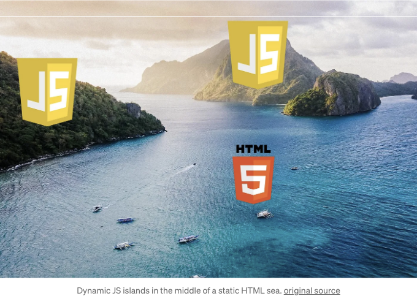

2013년 페이스북 후원으로 등장한 React는 웹 개발 씬을 뒤집어 놓고 웹 애플리케이션을 렌더링하는 방식을 바꿨어. 서버에서 페이지를 렌더링하고 클라이언트에게 전송하는 대신 React를 사용해 클라이언트 측에서 Single Page Applications (SPA)을 만들어 렌더링할 수 있게 됐어. React와 같은 도구들이 인기를 얻을수록 클라이언트 렌더링 SPA가 서버 렌더링된 Multi-Page Application을 빠르게 대체하기 시작했어.

이 방식은 현대 프런트엔드 디자인을 혁신했지만, 성능 문제는 없었어. 조잡한 버그나 좋지 못한 관행들이 대부분의 신규 애플리케이션에 슬금슬금 들어와 SPA 프레임워크인 React, Vue, Angular 등이 웹을 지배하기 시작하면서 더 악화되기 시작했어.

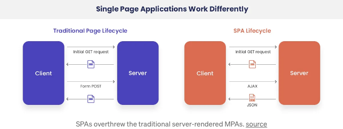

<!-- ui-log 수평형 -->
<ins class="adsbygoogle"
  style="display:block"
  data-ad-client="ca-pub-4877378276818686"
  data-ad-slot="9743150776"
  data-ad-format="auto"
  data-full-width-responsive="true"></ins>
<component is="script">
(adsbygoogle = window.adsbygoogle || []).push({});
</component>

Islands Architecture는 2019년 Katie Sylor-Miller가 개최한 회의에서 고안된 아이디어로, Etsy 프론트엔드 아키텍트입니다. Islands Architecture는 서버와 클라이언트를 모두 활용하여 애플리케이션을 렌더링합니다. 서버에서 HTML에 정적 콘텐츠를 로드한 후 클라이언트가 JavaScript로 대화형 영역의 플레이스홀더를 생성합니다. 개발자로서, 저는 이 아이디어가 프론트엔드 프레임워크의 다음 세대를 탄생시킬 것이라 확신합니다.

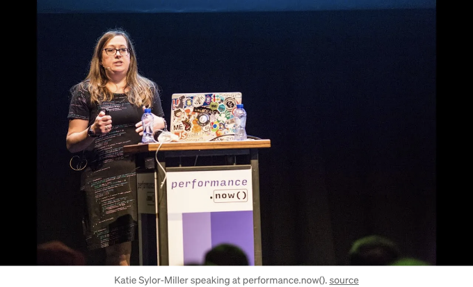

## 전제 조건

웹 아키텍처에 대해 더 깊이 들어가기 전에 중요한 몇 가지 용어를 살펴보겠습니다.

<!-- ui-log 수평형 -->
<ins class="adsbygoogle"
  style="display:block"
  data-ad-client="ca-pub-4877378276818686"
  data-ad-slot="9743150776"
  data-ad-format="auto"
  data-full-width-responsive="true"></ins>
<component is="script">
(adsbygoogle = window.adsbygoogle || []).push({});
</component>

- 가장 큰 콘텐츠 로드 시간 (LCP) — 이는 페이지의 주요 콘텐츠가 로드되는 데 걸리는 시간을 의미합니다.
- 첫 번째 바이트까지의 시간 (TTFB) — 이는 응답의 첫 번째 바이트가 서버에서 브라우저로 도착하는 데 걸리는 시간을 의미합니다.
- 첫 번째 콘텐츠 렌더링 시간 (FCP) — 이는 페이지에 첫 번째 콘텐츠가 렌더링되는 데 걸리는 시간을 의미합니다.
- 첫 입력 지연 시간 (FID) — 이는 사용자가 웹 페이지와 처음 상호작용할 때까지 걸리는 시간을 의미합니다.
- 상호작용 가능한 시간 (TTI) — 이는 주요 리소스가 로드된 후 웹 페이지가 신뢰할 수 있는 상호작용 가능한 상태가 되는 데 걸리는 시간을 의미합니다.

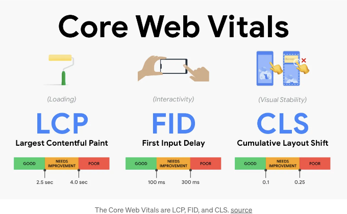

가장 큰 콘텐츠 로드 시간과 첫 입력 지연시간은 둘 다 핵심 웹 핵심 지표로 간주됩니다 (세 번째는 CLS). 페이지의 주요 콘텐츠가 로드되는 데 2.5초 미만이 소요된다면 해당 웹 페이지는 성능이 좋다고 간주됩니다 (LCP). 첫 번째 콘텐츠 로드 시간 (FCP) 및 서버에서 첫 번째 바이트가 도착하는 시간 (TTFB)은 직접적으로 LCP와 관련이 있습니다.

웹 페이지의 첫 입력 지연 시간은 사용자 경험을 유지하기 위해 100 ms 미만으로 유지되어야 합니다. 이 지표는 주요 리소스의 상호작용이 로드되고 신뢰할 수 있는 상태로 작동하는 데 걸리는 시간 (TTI)에 직접적으로 영향을 받습니다.

<!-- ui-log 수평형 -->
<ins class="adsbygoogle"
  style="display:block"
  data-ad-client="ca-pub-4877378276818686"
  data-ad-slot="9743150776"
  data-ad-format="auto"
  data-full-width-responsive="true"></ins>
<component is="script">
(adsbygoogle = window.adsbygoogle || []).push({});
</component>

이 기사에서 논의된 아키텍처 결정은 tradeoff를 포함합니다. 페이지는 더 빨리로드 될 수 있지만 상호 작용이 오래 걸릴 수도 있습니다. 또는 그 반대도 가능합니다.

# 여기까지 온 이유

근본적으로, 이 SPA 도약은 초기 웹의 패러다임인 Server-Side Rendering (SSR)과 관련된 기존 문제들에 의해 촉발되었습니다. SSR은 초기 웹 개발 초창기에 매우 인기가 많았습니다. 사실, 그 때에는 많은 옵션이 없었습니다. React 및 다른 SPA 프레임워크로 인해 Client-Side Rendering (CSR)이 웹 페이지에서 JavaScript를 처리하는 새로운 지배적인 방법이 되었습니다.

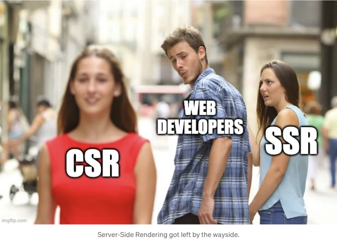

<!-- ui-log 수평형 -->
<ins class="adsbygoogle"
  style="display:block"
  data-ad-client="ca-pub-4877378276818686"
  data-ad-slot="9743150776"
  data-ad-format="auto"
  data-full-width-responsive="true"></ins>
<component is="script">
(adsbygoogle = window.adsbygoogle || []).push({});
</component>

마법알 해결책 시대에서 벗어나고 있습니다. 모두가 단호하고 명확하며 간단해야 한다는 답변을 원합니다. CSR은 서버에 지속적인 핑을 피하고 전체 페이지를 새로고침하지 않고 탈출할 수 있는 방법을 제공했지만, 그와 함께 다양한 문제가 발생했습니다. 현실과 웹 아키텍처는 우리가 선호하는 것보다 훨씬 더 다양성을 요구합니다. SSR과 CSR을 살펴보고, 각 접근 방식에서 숨겨진 문제들을 해결해보겠습니다.

## 서버 사이드 렌더링 (SSR)

클라이언트 사이드 렌더링을 살펴보기 전에 SSR을 살펴보겠습니다. 서버 사이드 렌더링은 웹 콘텐츠를 제공하는 것의 경험을 효과적으로 테스트한 버전입니다. SSR을 통해 전체 HTML 웹페이지가 서버에서 생성되어 페이지를 요청하는 클라이언트로 전송됩니다. 이는 뷰를 렌더링하는 로직이 서버에서 수행된다는 것을 의미합니다. 데이터가 데이터베이스나 제3자 API로부터 필요하다면 페이지가 전달되기 전에 서버에서 처리됩니다.

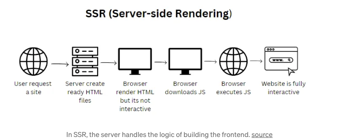

<!-- ui-log 수평형 -->
<ins class="adsbygoogle"
  style="display:block"
  data-ad-client="ca-pub-4877378276818686"
  data-ad-slot="9743150776"
  data-ad-format="auto"
  data-full-width-responsive="true"></ins>
<component is="script">
(adsbygoogle = window.adsbygoogle || []).push({});
</component>

이는 서버로부터 응답을 받은 후 클라이언트의 브라우저에서는 거의 또는 전혀 JavaScript를 처리할 필요가 없음을 의미합니다. 애플리케이션 로직의 주된 처리가 이미 완료되어 있습니다 — 서버가 클라이언트를 위해 처리했습니다.

## 클라이언트 측 렌더링 (CSR)

클라이언트 측 렌더링은 다른 접근 방식을 취합니다. CSR에서는 서버가 웹 페이지 렌더링에서 후순위로 밀려납니다. 애플리케이션 렌더링에 대한 로직 (데이터 가져오기 또는 라우팅 등)은 프론트엔드에 위임됩니다. 만일 React App 구성 요소 전체를 단일 `div` 또는 `main` 태그에 ReactDOM으로 연결한 적이 있다면, 전체 클라이언트 측 렌더링을 갖는 애플리케이션을 구축한 셈입니다.

```js
// 브라우저에 모든 작업을 강제로 시키는구나?
const root = ReactDOM.createRoot(document.getElementById('root'));
root.render(<App />); 
```

<!-- ui-log 수평형 -->
<ins class="adsbygoogle"
  style="display:block"
  data-ad-client="ca-pub-4877378276818686"
  data-ad-slot="9743150776"
  data-ad-format="auto"
  data-full-width-responsive="true"></ins>
<component is="script">
(adsbygoogle = window.adsbygoogle || []).push({});
</component>

CSR에서는 대량의 JavaScript가 클라이언트에 전송될 수 있습니다. 브라우저로 전체 애플리케이션 로직이 전송되는 것을 볼 수도 있습니다. 또한 CSR에 대한 최적화 기술을 강조하지 않는 프론트엔드 튜토리얼 비디오에서도 이러한 점이 일반적입니다.

# SSR 대 CSR

그래서, SSR 대 CSR, 어떤 것이 더 나은가요? 이 두 가지 접근법이 각자 강점을 과시하는 비교 포인트가 있지만, 둘 다 상충하는 요소가 있습니다.

## 검색 엔진 최적화

<!-- ui-log 수평형 -->
<ins class="adsbygoogle"
  style="display:block"
  data-ad-client="ca-pub-4877378276818686"
  data-ad-slot="9743150776"
  data-ad-format="auto"
  data-full-width-responsive="true"></ins>
<component is="script">
(adsbygoogle = window.adsbygoogle || []).push({});
</component>

검색 엔진 최적화는 웹 애플리케이션을 구축할 때 중요한 고려 사항입니다. 결국, 웹 사이트를 예쁘게 만들어서 Github 저장소에 먼지를 쌓이게 하는 게 아니라 다른 사람들이 사용할 도구를 만드는 것입니다. 그리고 사람들이 여러분의 도구나 제품을 찾는 주요 방법 중 하나가 바로 검색 엔진을 통한 것이죠.


만약 여러분의 웹사이트가 검색 엔진 최적화되어 있지 않다면, 그 외에 비해 훨씬 적은 사용자 트래픽을 보게 될 겁니다. SSR을 통해 렌더링되는 애플리케이션은 기본적으로 검색 엔진 최적화되어 있습니다. 서버에서 렌더링되는 웹사이트는 검색 엔진에서 이해하기 쉽습니다. 하지만 CSR 웹사이트는 그렇지 않습니다. 클라이언트 렌더링 애플리케이션은 브라우저에 의해 구축됩니다. 페이지가 로드될 때 각 구성요소가 브라우저에 의해 처리됩니다. 때로는 이로 인해 웹 크롤러가 내용을 놓칠 수 있습니다. 해결책은 있지만, 대부분의 CSR 애플리케이션은 검색 엔진을 위해 높은 최적화가 되어있지 않습니다.

## 로딩

<!-- ui-log 수평형 -->
<ins class="adsbygoogle"
  style="display:block"
  data-ad-client="ca-pub-4877378276818686"
  data-ad-slot="9743150776"
  data-ad-format="auto"
  data-full-width-responsive="true"></ins>
<component is="script">
(adsbygoogle = window.adsbygoogle || []).push({});
</component>

SSR과 CSR 간에는 로딩에 대한 명확한 트레이드오프가 있습니다. 각각은 특정 영역에서 다른 것보다 우수합니다.

SSR은 초기 페이지 렌더링에서 우수합니다. 사용자가 사이트에 요청을 보내면 서버가 HTML 표현을 작성한 다음 클라이언트 브라우저로 다시 전송합니다. 복잡한 응용프로그램이나 많은 로직 및 요소가 있는 경우 SSR이 빛을 발합니다. 이러한 경우 FCP와 TTI가 크게 감소하여 초기 콘텐츠 로딩 및 초기 상호작용이 빨리 도달됩니다.

그러나 사용자가 해당 웹페이지와 상호작용을 계속하기로 결정할 때 SSR은 효과가 떨어집니다. 초기 로드가 그것의 결정적인 순간이었습니다. 사용자가 사이트를 탐색하는 동안 서버에 다음 페이지를 요청하는 과정이 발생하므로 어떤 페이지든 첫 번째 페이지를 로드하는 것만큼이나 괴로운 경험이 될 것입니다.

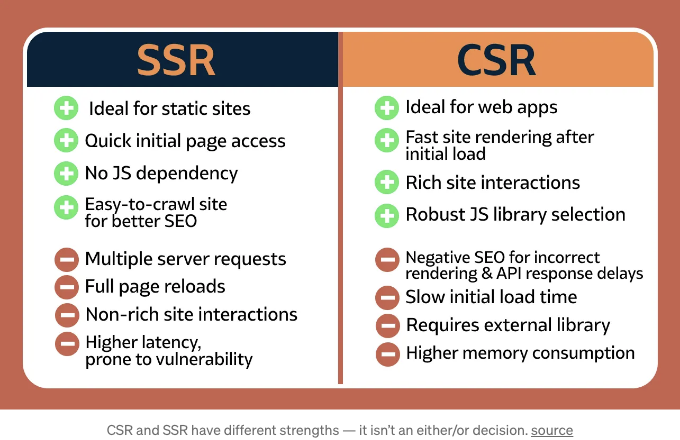

<!-- ui-log 수평형 -->
<ins class="adsbygoogle"
  style="display:block"
  data-ad-client="ca-pub-4877378276818686"
  data-ad-slot="9743150776"
  data-ad-format="auto"
  data-full-width-responsive="true"></ins>
<component is="script">
(adsbygoogle = window.adsbygoogle || []).push({});
</component>

CSR은 이 스크립트를 뒤집습니다: 특히 최적화를 시도하지 않을 때 CSR로 브라우저로 전송되는 JavaScript 양이 많기 때문에, 웹페이지의 초기로드가 계산 시간면에서 지연될 수 있습니다. 그러나 전체 웹사이트가 클라이언트 측으로 전송되므로 사이트의 탐색 가능한 경로가 포함되어 있습니다 (이것이 '싱글 페이지'로 만드는 요소입니다), 사용자는 사이트의 다양한 페이지를 이동할 때 훨씬 부드러운 경험을 제공받을 것입니다. 또한 클라이언트가 초기 페이지를 탐색하는 동안 추가적인 페이지를 구축하는 사전 가져오기 및 기타 최적화를 통합하는 현대 프론트엔드 또는 풀 스택 프레임워크로 인해 특히 그렇습니다.

또한 서버가 과부하인 경우나 네트워크 속도가 느린 경우에는 SSR로 인해 HTML 페이지를 포함한 초기 응답 속도가 증가할 수도 있습니다 (높은 TTFB). 이러한 경우 FCP/TTI가 낮아진 이득이 상쇄될 수 있습니다.

## 상호작용

SSR에서 서버가 응용 프로그램 로직을 처리하므로 상호작용 비용이 발생할 수 있습니다. 순수 서버 렌더링 된 응용 프로그램과 상호작용할 때 매번 브라우저가 서버와 통신해야 합니다. 인프라가 이미 과부하 상태일 때 상호작용을 처리하기 위해 백엔드로 빈번한 핑 전송 및 전체 페이지 다시로드가 발생하면 사용자 요청 처리에 지연을 초래할 수 있습니다. 결국 페이지는 서버에 의해 생성되고 있습니다. 콘텐츠 변경이 필요하고 해당 웹페이지를 다시 구축해야 하는 경우 전체 페이지를 재구성해야 할 수도 있습니다.

<!-- ui-log 수평형 -->
<ins class="adsbygoogle"
  style="display:block"
  data-ad-client="ca-pub-4877378276818686"
  data-ad-slot="9743150776"
  data-ad-format="auto"
  data-full-width-responsive="true"></ins>
<component is="script">
(adsbygoogle = window.adsbygoogle || []).push({});
</component>

CSR은 대화형 기능에 대해 잘 다루지만, 서버에 요청하는 것이 아닌 프론트엔드에서 응용 프로그램 로직이 처리됩니다. 그러나 이 모델에도 단점이 있습니다. 데이터가 페이지에 처음으로로드되지 않을 수 있고, 대신 사용자가 페이지와 상호 작용할 때 요청될 수 있습니다. 이는 서버에 핑을 보내야 하며, 사용자 상호 작용의로드 시간을 늘릴 수 있습니다.

# 렌더링에서 창의성을 높이기

진짜 질문은 "SSR 또는 CSR?"이 아니라 "왜 둘 다 사용하지 않을까?"입니다. 두 방법 모두 장점이 있다면, 두 가지의 강점을 결합하고 완전히 새로운 개선 도구를 만들 수 있을 것입니다.

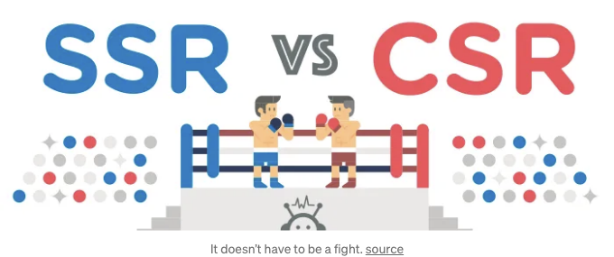

<!-- ui-log 수평형 -->
<ins class="adsbygoogle"
  style="display:block"
  data-ad-client="ca-pub-4877378276818686"
  data-ad-slot="9743150776"
  data-ad-format="auto"
  data-full-width-responsive="true"></ins>
<component is="script">
(adsbygoogle = window.adsbygoogle || []).push({});
</component>

웹 브라우저에 순수 JavaScript 또는 JSX 형식의 전체 프론트엔드를 배송하는 것은 좋지 않은 습관이에요, 특히 대규모 어플리케이션의 경우에는 말이죠. 모든 코드와 종속성을 패키징하고 그 논리를 브라우저에 실린 뒤, 실제 HTML 웹 페이지를 빌드하도록 요청하는 것은 효율적이지 않을 수밖에 없어요. 이 아키텍처의 결과물을 직접 목격해봤습니다.

또한 매번 사용자 요청 시 서버가 전체 페이지를 빌드하는 것은 최대한 효율적이지 않다는 것은 분명합니다. 사용자 상호작용마다 서버로의 이동이 필요할 때, 현대 브라우저의 모든 기능을 활용할 수 없을 뿐만 아니라, 기다리는 사용자들은 페이지를 전환할 때마다 응답을 기다리기 싫어할 거예요.

그럼 양 방식을 조합해보는 건 어때요? SSR과 CSR의 장점을 최대한 활용하고 다른 한 방식의 약점을 다른 한 방식의 강점으로 보완하여 둘의 단점을 최소화하는 접근 방식을 만드는 게 어떨까요?

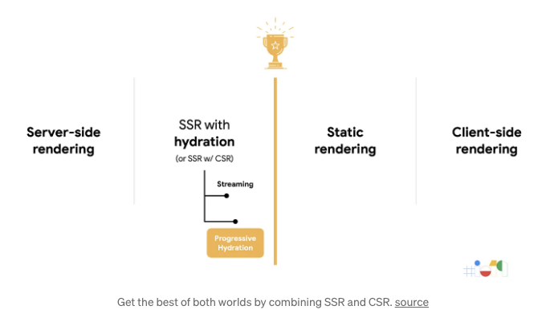

<!-- ui-log 수평형 -->
<ins class="adsbygoogle"
  style="display:block"
  data-ad-client="ca-pub-4877378276818686"
  data-ad-slot="9743150776"
  data-ad-format="auto"
  data-full-width-responsive="true"></ins>
<component is="script">
(adsbygoogle = window.adsbygoogle || []).push({});
</component>

개발자들도 그렇게 했어요. SPA의 등장 이후, 각 접근 방법의 장점을 최대한 활용하려는 여러 새로운 방법이 등장했어요. Static Generation은 사이트를 구축할 때 미리 정의된 HTML 페이지를 작성하고 즉시 요청 시 제공해요. Streaming SSR은 서버가 웹사이트를 구축하지만 응답을 브라우저로 스트리밍하여 더 빠른 FCP 및 TTFB를 제공해요. 선택적 수화(React 18의 경우와 같이)은 서버가 전체 페이지를 작성하고 클라이언트가 상호작용 요소를 선택적으로 수화할 수 있도록 만들어요. 그러나 가장 최신이자 혁신적인 접근 방법은 Islands Architecture에 있어요.

# Islands Architecture

Islands Architecture의 아이디어는 간단해요 - 서버에서 정적 내용을 가진 HTML 페이지를 렌더링하고 동적 내용을 위한 페이지 안에 플레이스홀더를 생성해요. 이러한 플레이스홀더(또는 "아일랜드")는 클라이언트가 선택적으로 수화할 수 있어요. 게다가, 서버에 의해 초기 HTML로 렌더링된 이러한 플레이스홀더는 클라이언트에서 사용할 수 있어요. HTML 뼈대는 아일랜드와 함께 전송된 스크립트로 수화되어요.

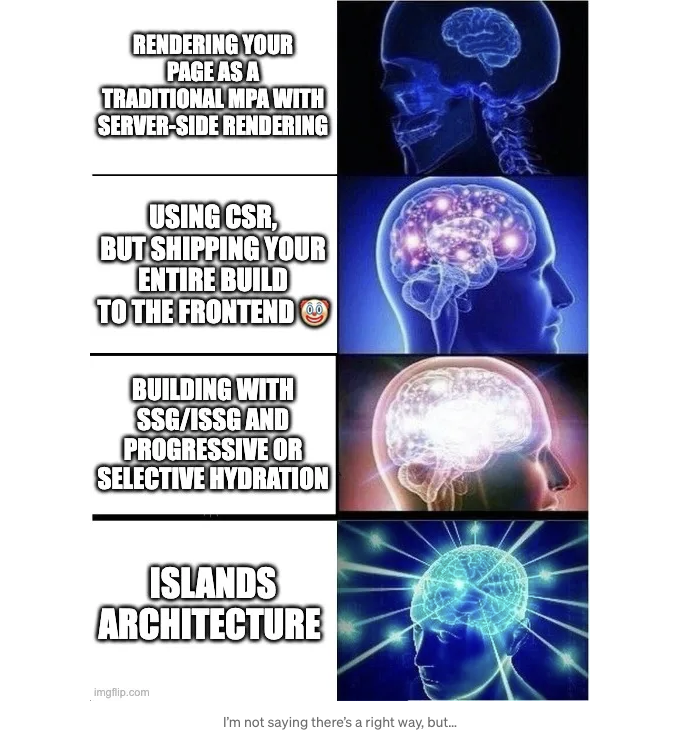

<!-- ui-log 수평형 -->
<ins class="adsbygoogle"
  style="display:block"
  data-ad-client="ca-pub-4877378276818686"
  data-ad-slot="9743150776"
  data-ad-format="auto"
  data-full-width-responsive="true"></ins>
<component is="script">
(adsbygoogle = window.adsbygoogle || []).push({});
</component>

만약 이해가 안 된다면, 이것은 실제로 클라이언트로 전송되는 JavaScript가 매우 적다는 것을 의미합니다. CSR의 일반적인 함정 중 하나를 피할 수 있어요. 즉, 전체 프론트엔드 로직을 브라우저로 보내지 않아도 되요. 서버가 구성할 수 있는 것은 모두 구성하고, 나머지에 대한 HTML 뼈대와 스크립트를 남겨요. 이렇게 하면 서버 측 렌더링으로 인한 낮은 LCP와 낮은 TTI의 모든 이점을 누리고, CSR로 구축된 SPA의 빠른 상호작용과 탐색을 얻을 수 있어요.

모든 동적 지역은 독립적으로 구성되어 있어요. 한 지역의 성능 문제가 다른 지역의 성능에 영향을 미치지 않아요. 이렇게 해서 이러한 지역들은 별도의 앱처럼 작동해요. 이것은 응용 프로그램을 보는 새로운 접근 방식이며, 성능 이점은 거의 발견되지 않았어요. 이 아이디어를 채택하기 시작한 프레임워크는 몇 개뿐이에요.

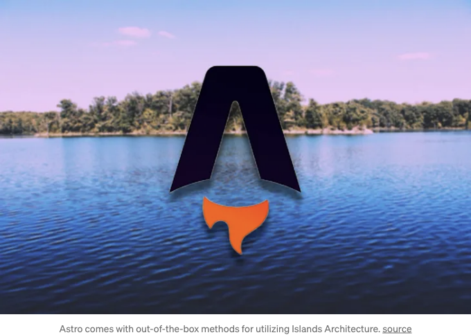

eBay에서 개발한 Marko나 다른 동적 지역과 함께 수화물 코드 만을 전송하는 프레임워크가 되요. 또한 React, Vue, Svelte 등을 사용할 수 있는 Astro를 탐색할 수도 있어요. Astro의 지역은 간단한 스니펫으로 어떤 구성 요소가 클라이언트로 로드되는지 지시할 수 있답니다.

<!-- ui-log 수평형 -->
<ins class="adsbygoogle"
  style="display:block"
  data-ad-client="ca-pub-4877378276818686"
  data-ad-slot="9743150776"
  data-ad-format="auto"
  data-full-width-responsive="true"></ins>
<component is="script">
(adsbygoogle = window.adsbygoogle || []).push({});
</component>

```js
<MyComponent client:load />
```

다른 런타임 환경을 위한 다른 프레임워크도 있습니다. Fresh가 좋은 예입니다. 이 프론트엔드 프레임워크는 Islands Architecture를 주요 고려 사항으로 빌드되었습니다. 성능상의 이점을 갖는 이러한 프레임워크들이 프론트엔드 개발 생태계를 빠르게 변화시킬 것이라 믿습니다.

프론트엔드 아키텍처에 대해 더 알아보고 싶다면 patterns.dev를 통해 이 주제 및 기타 내용에 더 깊게 관심을 가지길 적극 추천합니다.```