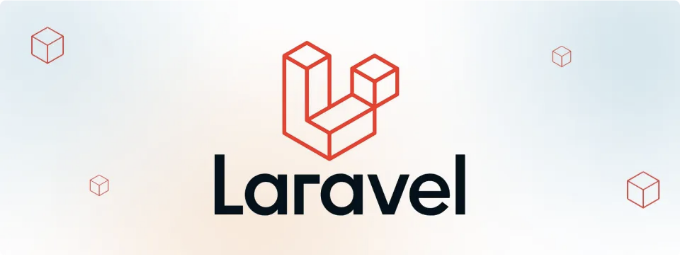

안녕하세요, E-Sportstats입니다. 저희는 사이트에 새로운 섹션을 추가하게 되었습니다. - 바로 베팅 회사들과의 제휴 마케팅입니다.

이 프로젝트는 개념 증명 프로젝트이므로 저희는 제한된 자원 내에서 빠르게 개발해야 합니다.

예전에는 Java와 Spring Boot를 주 개발 도구로 선택했습니다. - 팀원이 적었고, 저에게는 한 명의 주니어 개발자가 필요했기 때문에 좋은 선택이라고 생각했습니다. Java 생태계의 오랜 전통이 우리가 안정적인 것을 구축하는 데 도움이 될 것으로 기대했죠. 하지만 실제로는 많은 시간을 JPA 및 Hibernate의 명확하지 않고 문서화되지 않은, 구현하기 어려운 행동을 고치는 데 쓰게 되었습니다. 저는 이 지점에서 많이 틀렸다는 것을 알게 되었습니다.

<!-- ui-log 수평형 -->
<ins class="adsbygoogle"
  style="display:block"
  data-ad-client="ca-pub-4877378276818686"
  data-ad-slot="9743150776"
  data-ad-format="auto"
  data-full-width-responsive="true"></ins>
<component is="script">
(adsbygoogle = window.adsbygoogle || []).push({});
</component>

새 프로젝트에서 이게 작동하지 않을 것 같아. 제가 고생해서 빠르게 제공하기 위해 생산성 향상을 도울 뭔가를 찾기 시작했어.

제가 가진 요구 사항 중에는:

- 자바 아님. 절대, 다시는.
- 생산성.
- 사용하기 쉬운 언어와 풍부한 프레임워크.
- 기본 내장된 인증 및 액세스 관리.
- 관리자 도구.

저는 가지고 있는 옵션들을 살펴보고 팀에게 장단점을 지적할 거야.

<!-- ui-log 수평형 -->
<ins class="adsbygoogle"
  style="display:block"
  data-ad-client="ca-pub-4877378276818686"
  data-ad-slot="9743150776"
  data-ad-format="auto"
  data-full-width-responsive="true"></ins>
<component is="script">
(adsbygoogle = window.adsbygoogle || []).push({});
</component>

## 옵션 #1: 장고

2014년부터 2018년까지 소규모 에이전시에서 고객들을 위해 제품을 개발할 때 Django를 사용한 즐거운 경험이 있었어요.

"Django는 모든 것을 갖추고 있다"는 이 말이 이 프레임워크의 모토죠. 맞지만, 대부분의 경우 커뮤니티에서 만들어진 "배터리"들을 직접 연결해야 하며 명령을 실행하는 것보다 좀 더 많은 타자를 눌러야 할 수도 있어요.

하지만 django-admin은 구식으로 느껴집니다. django-grapelli를 사용하면 조금 더 현대적으로 작동시킬 수 있지만, 이 도구로 현대적인 동적 폼을 개발하는 것을 상상할 수 없어요 (복잡한 클라이언트 측 유효성 검사, 유연한 자동완성, 및 의존 필드).

<!-- ui-log 수평형 -->
<ins class="adsbygoogle"
  style="display:block"
  data-ad-client="ca-pub-4877378276818686"
  data-ad-slot="9743150776"
  data-ad-format="auto"
  data-full-width-responsive="true"></ins>
<component is="script">
(adsbygoogle = window.adsbygoogle || []).push({});
</component>

스택의 장점:

- Python — 가장 깔끔한 현대 언어 중 하나입니다.
- 장고에 거의 마법이 없습니다 — 배우기 쉽습니다.
- 다양한 “배터리”들이 제공됩니다.

스택의 단점:

- 때때로 장고의 행동을 덮어쓰기하기에 너무 장황할 수 있습니다.
- 관리자 UI는 고정되어 있습니다 — 10년 전과 똑같습니다.

<!-- ui-log 수평형 -->
<ins class="adsbygoogle"
  style="display:block"
  data-ad-client="ca-pub-4877378276818686"
  data-ad-slot="9743150776"
  data-ad-format="auto"
  data-full-width-responsive="true"></ins>
<component is="script">
(adsbygoogle = window.adsbygoogle || []).push({});
</component>

## 옵션 #2: 루비 온 레일즈와 Avo.

RoR은 오랜 역사를 가진 잘 알려진 프레임워크입니다. 오늘날, Hotwire, Strada 및 Stimulus의 덕분에 그저 웹 프레임워크 이상의 경험을 제공할 수 있으며, SPA와 모바일 애플리케이션을 구축할 수도 있습니다!

이 프레임워크(“F"로 시작하는 단어입니다)는 인증부터 백그라운드 작업, 프론트엔드 통합까지 다양한 모듈을 잘 통합하여 제공합니다. Github 및 Gitlab, Shopify, AirBnB 등 많은 스타트업이 단엽 및 그 이상으로成장한 것을 확인할 수 있는 믿을 수 있는솔루션입니다!

그 생태계에는 주목할만한 별이 떴습니다 — Avo CMS입니다. 이는 관리자 생성 도구 중에서 경험이 가장 좋았습니다.

<!-- ui-log 수평형 -->
<ins class="adsbygoogle"
  style="display:block"
  data-ad-client="ca-pub-4877378276818686"
  data-ad-slot="9743150776"
  data-ad-format="auto"
  data-full-width-responsive="true"></ins>
<component is="script">
(adsbygoogle = window.adsbygoogle || []).push({});
</component>

스택의 장점:

- 매우 생산적이고 미래 지향적인 솔루션(37signals에게 감사합니다!).
- 많은 기능이 기본 제공됨.
- 현대적인 툴킷들.
- Rails에는 마이그레이션, 모델 및 컨트롤러용 좋은 스캐폴드 생성기가 있습니다.

스택의 단점:

- Avo의 가격이 상당히 높습니다 — 새 프로젝트에서는 아직 우리가 감당할 수 없는 금액입니다.
- RoR 자체 — 많은 마법과 매우 동적인 특성으로 좋은 경험을 선배 개발자에게 제공하지만 초보자에겐 혼란스러울 수 있습니다.
- 다시 말해 RoR 자체 — 이 기술로 제작한 프로덕션 경험이 없기 때문에 팀원들이 무엇에 갇혔을 때 빠른 해결책을 제시하지 못할 수 있습니다.
- RoR ;) — 이 마법으로 인해 IDE가 그다지 도움이 되지 않습니다. 무언가 언어 서버 개발이 진행 중이라는 얘기를 들었는데, 많은 변화가 일어날 것으로 예상되지만 아직 도입되지는 않았습니다.

<!-- ui-log 수평형 -->
<ins class="adsbygoogle"
  style="display:block"
  data-ad-client="ca-pub-4877378276818686"
  data-ad-slot="9743150776"
  data-ad-format="auto"
  data-full-width-responsive="true"></ins>
<component is="script">
(adsbygoogle = window.adsbygoogle || []).push({});
</component>

## 옵션 #3: NextJS.

지난 몇 년 동안 대부분 JS로 개발해 왔기 때문에, NextJS 14를 살펴보기로 결정했습니다. NextJS 14는 많은 새로운 기능들을 가져다 주고 있어서 발전하는 모습이 기대됩니다. 이전에는 NextJS 11(또는 12)만 사용했는데, 그 때에는 필요한 모든 것을 달성하기 위해 많은 해킹을 해야 했습니다.

스택의 장점:

- UI 복잡도에 대한 제한이 없음.
- SPA와 백엔드 서비스 간에 공유 가능한 유효성 검사/코드.
- SEO에 대한 최상의 선택은 아닙니다 - 여전히 모든 것을 수화해야 하기 때문에 WebVitals에 불리한 영향을 미칩니다.

<!-- ui-log 수평형 -->
<ins class="adsbygoogle"
  style="display:block"
  data-ad-client="ca-pub-4877378276818686"
  data-ad-slot="9743150776"
  data-ad-format="auto"
  data-full-width-responsive="true"></ins>
<component is="script">
(adsbygoogle = window.adsbygoogle || []).push({});
</component>

스택의 단점:

- JS가 매우 동적이기 때문에 TypeScript는 필수입니다. 런타임에서 정확성을 보장하지 않는 매우 장황한 언어와 작업한 적이 없었습니다.
- API 스택을 작성하지 않고도 필요한 Admin 도구가 없습니다.
- NodeJS 자체가 매우 표준화되어 있지 않으며 개발 속도를 높이기 위한 풍부한 3rd-party 솔루션을 찾기가 어렵습니다.
- 인증 및 액세스 제어를 구현하는 데 필요한 핵심 부분이 누락되어 있습니다. 직접 솔루션을 선택/작성해야 합니다.

## 옵션 #4: Astro.

JavaScript 커뮤니티의 보석입니다: 어떤 클라이언트 측 프레임워크와도 원활하게 통합되며 완벽한 SEO를 제공합니다 — JS가 필요할 때까지 전혀 로드되지 않습니다.

<!-- ui-log 수평형 -->
<ins class="adsbygoogle"
  style="display:block"
  data-ad-client="ca-pub-4877378276818686"
  data-ad-slot="9743150776"
  data-ad-format="auto"
  data-full-width-responsive="true"></ins>
<component is="script">
(adsbygoogle = window.adsbygoogle || []).push({});
</component>

그러나 우리는 이 프로젝트가 여전히 초기 개발 단계에 있다고 느끼고 있습니다. 중요한 것들이 부족하니까요.

스택의 장점:

- SEO 측면에서 강력함.
- 무제한 UI 변형.
- 콘텐츠 기반 웹사이트를 위한 생산적인 도구 모음.

스택의 단점:

<!-- ui-log 수평형 -->
<ins class="adsbygoogle"
  style="display:block"
  data-ad-client="ca-pub-4877378276818686"
  data-ad-slot="9743150776"
  data-ad-format="auto"
  data-full-width-responsive="true"></ins>
<component is="script">
(adsbygoogle = window.adsbygoogle || []).push({});
</component>

- NextJS와 거의 비슷해요.

## 최종 선택: Laravel + Laravel Nova.

위의 모든 옵션을 시도해본 후에, 나는 PHP 를 보러 가기로 결정했습니다. 나는 뉴스를 그렇게 많이 따르지 않았지만, Inertia 와 Livewire 와 같은 최신 Laravel 추가 기능에 대해 들었어요.

내 커리어 초기에, 나는 Laravel 5.4 와 함께 일해본 적이 있어요. 이 프레임워크는 그 때조차 최고의 인상을 줬어요.

<!-- ui-log 수평형 -->
<ins class="adsbygoogle"
  style="display:block"
  data-ad-client="ca-pub-4877378276818686"
  data-ad-slot="9743150776"
  data-ad-format="auto"
  data-full-width-responsive="true"></ins>
<component is="script">
(adsbygoogle = window.adsbygoogle || []).push({});
</component>

오늘날은 정말 대단해요 — SPA부터 SPA와 같은 경험을 제공하는 MPA까지 어떤 웹사이트든 만들 수 있어요.

Inertia는 NextJS처럼 Vue/React의 SSR과 수분화를 할 수 있게 해줘요! 반면에 Livewire는 HTMX의 강화판 같아요 — UI 상호작용이 필요하지만 대형 JS 청크를 프론트엔드에 가져오기 싫은 경우 완벽한 도구에요.

백엔드 생태계는 흥미로워요 — 어떤 기능이든 프레임워크 자체에 포함되어 있어요: 인증, 접근 제어, 백그라운드 작업, 심지어 실시간 통신 프레임워크인 Laravel Reverb도요!

이 생태계의 다른 훌륭한 구성 요소는 Laravel Nova에요. 이는 Inertia+Vue와 Laravel을 기반으로 하는 초현대적인 관리자 도구 세트에요. 풍부한 컴포넌트 라이브러리 덕분에 종종 어떤 JS 코드도 작성하지 않고도 백엔드와의 원활한 통합을 제공해줘요.

<!-- ui-log 수평형 -->
<ins class="adsbygoogle"
  style="display:block"
  data-ad-client="ca-pub-4877378276818686"
  data-ad-slot="9743150776"
  data-ad-format="auto"
  data-full-width-responsive="true"></ins>
<component is="script">
(adsbygoogle = window.adsbygoogle || []).push({});
</component>

스택의 장점:

- SEO에 우수한 검증된 프레임워크.
- 유연한 Active Record ORM.
- 강력한 관리자 도구 세트.
- 젊은 스타트업이 서비스 구축에 필요한 모든 것을 갖추고 있습니다 - 인증, 프론트엔드 프레임워크 통합, 백그라운드 작업 등 많은 기능.

스택의 단점:

- PHP를 모르겠어요. "대표적이지 않다"고 말해도 되나요? 일부 "최적의 방법"을 준수하지 않는다고요?

<!-- ui-log 수평형 -->
<ins class="adsbygoogle"
  style="display:block"
  data-ad-client="ca-pub-4877378276818686"
  data-ad-slot="9743150776"
  data-ad-format="auto"
  data-full-width-responsive="true"></ins>
<component is="script">
(adsbygoogle = window.adsbygoogle || []).push({});
</component>

우리 팀에서 아직 충분히 시범을 보이지 않은 선택이긴 하지만, 이미 CI/CD 플로우를 설정하고 몇 개의 간단한 페이지를 Laravel Nova에서 만들었습니다. 정말 감격스럽네요 — 현대 소프트웨어 엔지니어링 기술들을 활용해 생산성을 느낄 수 있는 건 오랜만이에요. 백엔드를 Java로 대대적인 개편을 시작했을 때 PHP가 무서웠던 것이 조금 아쉽기도 하네요 — Laravel로 더 많은 것을 이룰 수 있었을 텐데, Laravel은 작은 스타트업을 위해 훨씬 더 만들어진 점에서 Spring Boot보다 훨씬 덜 가짜 마케팅을 하거든요 (Spring Boot는 아직도 "간단하고 강력한 도구"로 광고하고 있지만).

Java는 혈세 기업에 잘 맞는다는 아픈 경험을 했고, "입증되고 쉽고 안정적인" 것처럼 보이는 모든 프레임워크가 그만큼 좋지는 않을 수 있다는 것을 깨달았습니다. 수백만 달러라도 가지지 않는 한, Spring의 마케팅에 속지 마세요.