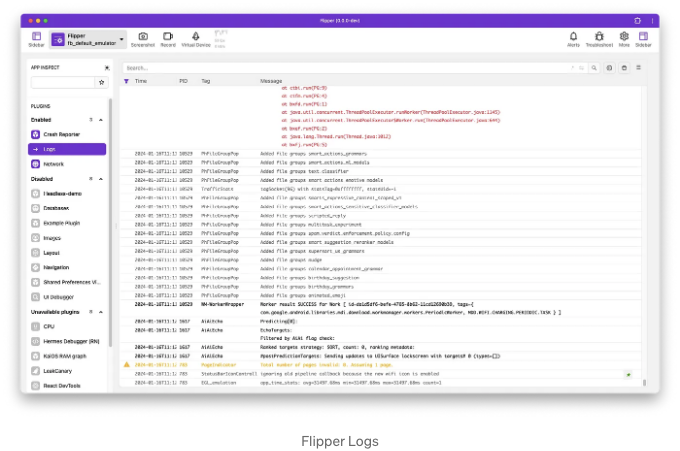

Flipper가 0.62 버전에서 소개되었을 때, React Native 개발자들에게 큰 도움이 되었습니다. 이 소식은 React Native 개발자들에게는 정말 좋은 소식이었죠! 오랫동안 더 나은 디버깅 도구를 원해왔었거든요.


하지만 Flipper는 컴파일 시간이 길어지고, 몇 가지 문제가 있었으며, 때로는 앱이 연결하는 데 문제가 발생하며, Flipper에 전혀 영향을 미치지 않을 것으로 예상되는 업그레이드가 실패할 수도 있었습니다.

결국 React Native 핵심 팀은 Flipper를 제거하기로 결정했습니다.

<!-- ui-log 수평형 -->
<ins class="adsbygoogle"
  style="display:block"
  data-ad-client="ca-pub-4877378276818686"
  data-ad-slot="9743150776"
  data-ad-format="auto"
  data-full-width-responsive="true"></ins>
<component is="script">
(adsbygoogle = window.adsbygoogle || []).push({});
</component>


더 자세히 알고 싶다면 RFC를 읽어보세요. 간단히 말하자면, 커뮤니티 CLI에서 Flipper를 제거하고 기본적으로 사용하지 않도록 권장하지 않았다는 것입니다.

그럼 이제 어떻게 해야 할까요? Flipper는 React Native 개발자들에게 많은 유용한 기능을 제공했었는데, 핵심 기능과 플러그인을 모두 포함하고 있었습니다.

자켓을 걷어서 한 가지씩 대체해 봅시다.

<!-- ui-log 수평형 -->
<ins class="adsbygoogle"
  style="display:block"
  data-ad-client="ca-pub-4877378276818686"
  data-ad-slot="9743150776"
  data-ad-format="auto"
  data-full-width-responsive="true"></ins>
<component is="script">
(adsbygoogle = window.adsbygoogle || []).push({});
</component>


# React DevTools

Flipper을 열 때 React DevTools로 가서 React 렌더 트리와 Components Inspector, 그리고 Profiler flamegraph를 활용하는 경우가 많아요.


<!-- ui-log 수평형 -->
<ins class="adsbygoogle"
  style="display:block"
  data-ad-client="ca-pub-4877378276818686"
  data-ad-slot="9743150776"
  data-ad-format="auto"
  data-full-width-responsive="true"></ins>
<component is="script">
(adsbygoogle = window.adsbygoogle || []).push({});
</component>

## 대안:

React DevTools를 단독으로 실행하세요! 이 간단한 명령어를 실행하면 경량 Electron 앱에서 React DevTools의 버전이 나타납니다.

```js
npx react-devtools
```


<!-- ui-log 수평형 -->
<ins class="adsbygoogle"
  style="display:block"
  data-ad-client="ca-pub-4877378276818686"
  data-ad-slot="9743150776"
  data-ad-format="auto"
  data-full-width-responsive="true"></ins>
<component is="script">
(adsbygoogle = window.adsbygoogle || []).push({});
</component>

이 도구에는 React Native 앱에서 발생할 수 있는 몇 가지 주의할 점이 있습니다.

# 기기 로그 표시

일반적으로 console.log 호출은 Metro 패키저 창 출력에서 볼 수 있지만, 실제 기기 로그(시뮬레이터 또는 기기에서)에 대한 접근은 조금 더 어렵습니다. Flipper는 모든 기기 로그를 한 곳에서 보여주는 화면을 제공했습니다.



<!-- ui-log 수평형 -->
<ins class="adsbygoogle"
  style="display:block"
  data-ad-client="ca-pub-4877378276818686"
  data-ad-slot="9743150776"
  data-ad-format="auto"
  data-full-width-responsive="true"></ins>
<component is="script">
(adsbygoogle = window.adsbygoogle || []).push({});
</component>

## 대안:

Android에서는 Android Studio에서 또는 CLI에서 logcat을 다음과 같이 사용할 수 있습니다:

```js
# 에뮬레이터를 사용하는 경우
adb logcat

# 실제 기기를 사용하는 경우
adb devices
adb -s "기기_ID" logcat
```

(더 간단한 방법은 npx react-native log-android을 통해 실행하는 것입니다.)

<!-- ui-log 수평형 -->
<ins class="adsbygoogle"
  style="display:block"
  data-ad-client="ca-pub-4877378276818686"
  data-ad-slot="9743150776"
  data-ad-format="auto"
  data-full-width-responsive="true"></ins>
<component is="script">
(adsbygoogle = window.adsbygoogle || []).push({});
</component>

iOS에서는 Xcode의 내장 기기 로그를 사용할 수 있어요:


또는 Xcode에서 실행시키고 싶지 않다면 MacOS 앱인 Console.app을 사용할 수도 있어요. Spotlight에서 시작해서 실행 중인 기기를 선택하고 로그를 스트리밍하면 돼요. 오른쪽 상단에 있는 검색란에 (앱 이름을 넣어) 앱에 대한 로그만 볼 수도 있고, 특정 로그를 검색할 수도 있어요.


<!-- ui-log 수평형 -->
<ins class="adsbygoogle"
  style="display:block"
  data-ad-client="ca-pub-4877378276818686"
  data-ad-slot="9743150776"
  data-ad-format="auto"
  data-full-width-responsive="true"></ins>
<component is="script">
(adsbygoogle = window.adsbygoogle || []).push({});
</component>

위의 대안들을 지금 당장 사용하는 것을 추천해 드리는데, npx react-native log-ios를 실행해 볼 수도 있어요. 제가 테스트 중에는 제대로 작동하지 않았는데요. 

# 네트워크 호출 기록

네트워크 호출을 가져와서 확인하는 것은 흔한 일이에요. Flipper의 네트워크 플러그인을 사용하면 요청과 응답 헤더 및 페이로드를 확인할 수 있어요.


<!-- ui-log 수평형 -->
<ins class="adsbygoogle"
  style="display:block"
  data-ad-client="ca-pub-4877378276818686"
  data-ad-slot="9743150776"
  data-ad-format="auto"
  data-full-width-responsive="true"></ins>
<component is="script">
(adsbygoogle = window.adsbygoogle || []).push({});
</component>

## 대안:

Infinite Red의 Reactotron을 사용하세요! 타임라인에서 네트워크 요청과 응답을 살펴볼 수 있습니다. 이 기능이 매우 유용하기 때문에 향후 릴리스에서 네트워크 전용 탭을 만들 계획을 논의 중입니다.

요청을 CURL로 복사하여 터미널에서 실행할 수도 있습니다.


<!-- ui-log 수평형 -->
<ins class="adsbygoogle"
  style="display:block"
  data-ad-client="ca-pub-4877378276818686"
  data-ad-slot="9743150776"
  data-ad-format="auto"
  data-full-width-responsive="true"></ins>
<component is="script">
(adsbygoogle = window.adsbygoogle || []).push({});
</component>

# 데이터베이스 보기

Flipper에는 장치에서 SQLite 쿼리를 검사할 수 있는 데이터베이스 플러그인이 있어요.


## 대안:

<!-- ui-log 수평형 -->
<ins class="adsbygoogle"
  style="display:block"
  data-ad-client="ca-pub-4877378276818686"
  data-ad-slot="9743150776"
  data-ad-format="auto"
  data-full-width-responsive="true"></ins>
<component is="script">
(adsbygoogle = window.adsbygoogle || []).push({});
</component>

정말 솔직히 말하면, 이것은 치환하기가 어려운 것 중 하나입니다! Flipper의 데이터베이스 뷰어는 매우 사용하기 쉽고 강력합니다.

그러나 SQLite는 파일이기 때문에 원하는 데이터베이스 뷰어를 사용하여 iOS 시뮬레이터를 사용하고 있다면 파일 시스템에서 SQLite 파일의 위치를 찾아 열고 쿼리를 실행할 수 있습니다.

# 충돌 보고서

Flipper의 충돌 보고서는 네이티브 측에서 앱이 충돌할 때 알림을 표시하고 로그와 함께 제공합니다.

<!-- ui-log 수평형 -->
<ins class="adsbygoogle"
  style="display:block"
  data-ad-client="ca-pub-4877378276818686"
  data-ad-slot="9743150776"
  data-ad-format="auto"
  data-full-width-responsive="true"></ins>
<component is="script">
(adsbygoogle = window.adsbygoogle || []).push({});
</component>


## 대안:

생산 환경에서는 이미 Sentry, BugSnag, Crashlytics와 같은 크래시 보고 도구를 사용해야 합니다. Ignite에는 크래시 보고 설정을 연결할 편리한 장소가 이미 포함되어 있습니다. 어떤 앱도 이런 기능 없이 출시해서는 안 됩니다!

개발환경에서도 네이티브 로그에서 크래시를 확인할 수 있습니다(위에서 설명한 대로). 결국 Flipper에서 하는 것과 별 다를바 없습니다.

<!-- ui-log 수평형 -->
<ins class="adsbygoogle"
  style="display:block"
  data-ad-client="ca-pub-4877378276818686"
  data-ad-slot="9743150776"
  data-ad-format="auto"
  data-full-width-responsive="true"></ins>
<component is="script">
(adsbygoogle = window.adsbygoogle || []).push({});
</component>

# 공유 설정 뷰어

이 플러그인을 잘 사용하지는 않지만, NSUserDefaults(iOS) 또는 SharedPreferences(Android)의 기본 키-값 저장소에 액세스할 수 있습니다.


## 대안:

<!-- ui-log 수평형 -->
<ins class="adsbygoogle"
  style="display:block"
  data-ad-client="ca-pub-4877378276818686"
  data-ad-slot="9743150776"
  data-ad-format="auto"
  data-full-width-responsive="true"></ins>
<component is="script">
(adsbygoogle = window.adsbygoogle || []).push({});
</component>

리액트 네이티브 개발자들은 보통 선호도를 저장하기 위해 react-native-mmkv 또는 AsyncStorage를 사용하지만, 네이티브 코드와 공유해야 할 경우에는 일반적으로 이러한 네이티브 도구들을 활용합니다.

만약 이에 접근해야 한다면, iOS에서는 로그로 덤프하거나 Android Studio에서 파일을 직접 확인할 수 있습니다.

# Layout Inspector / UI Debugger

Flipper의 레이아웃 인스펙터와 UI 디버거는 네이티브 뷰를 자세히 살펴보고 관련 정보를 확인하는 데 유용할 수 있습니다.

<!-- ui-log 수평형 -->
<ins class="adsbygoogle"
  style="display:block"
  data-ad-client="ca-pub-4877378276818686"
  data-ad-slot="9743150776"
  data-ad-format="auto"
  data-full-width-responsive="true"></ins>
<component is="script">
(adsbygoogle = window.adsbygoogle || []).push({});
</component>


## 대안:

iOS 네이티브 뷰를 확인하려면 Xcode의 내장된 뷰 계층 검사 도구를 사용하세요.

- Xcode에서, 디버깅 메뉴로 이동한 다음 “프로세스에 연결”을 선택하고 실행 중인 앱을 선택하세요.
- 다시 디버깅 메뉴로 돌아가서 “뷰 디버깅” 및 “뷰 계층 캡처”를 선택하세요. 왼쪽에는 계층 구조, 중간에는 폭발된 뷰를 보실 수 있습니다. 오른쪽에는 뷰에 대한 다양한 정보를 보실 수 있는 마지막 두 아이콘을 클릭할 수 있습니다.

<!-- ui-log 수평형 -->
<ins class="adsbygoogle"
  style="display:block"
  data-ad-client="ca-pub-4877378276818686"
  data-ad-slot="9743150776"
  data-ad-format="auto"
  data-full-width-responsive="true"></ins>
<component is="script">
(adsbygoogle = window.adsbygoogle || []).push({});
</component>


안드로이드에서는 Android Studio의 Layout Inspector를 사용하세요.

- Android Studio를 열고 앱을 런칭하세요.
- View - `Tool Windows - ` Layout Inspector로 이동하세요.

이를 통해 네이티브 뷰를 확인할 수 있고, Xcode의 유사한 3D 폭발 뷰로 살펴볼 수 있습니다.

<!-- ui-log 수평형 -->
<ins class="adsbygoogle"
  style="display:block"
  data-ad-client="ca-pub-4877378276818686"
  data-ad-slot="9743150776"
  data-ad-format="auto"
  data-full-width-responsive="true"></ins>
<component is="script">
(adsbygoogle = window.adsbygoogle || []).push({});
</component>


# 네비게이션

솔직히 말해서, 이 플러그인이 존재한다는 것을 이 기사를 위해 연구하기 전에는 몰랐어요. 이 플러그인을 사용하면 앱 내부에서 딥 링크를 설정하고 쉽게 다양한 곳으로 이동할 수 있어요.

## 대안:

<!-- ui-log 수평형 -->
<ins class="adsbygoogle"
  style="display:block"
  data-ad-client="ca-pub-4877378276818686"
  data-ad-slot="9743150776"
  data-ad-format="auto"
  data-full-width-responsive="true"></ins>
<component is="script">
(adsbygoogle = window.adsbygoogle || []).push({});
</component>

Reactotron은 유사한 기능을 달성하기 위해 설정할 수 있는 사용자 정의 명령을 가지고 있습니다. 또한 기기에서 브라우저에서 실행되는 간단한 웹 페이지에서 딥 링크를 설정할 수도 있습니다.

# Hermes 디버거

만약 Hermes를 사용 중이라면, Flipper에 특별한 디버거가 있습니다.


<!-- ui-log 수평형 -->
<ins class="adsbygoogle"
  style="display:block"
  data-ad-client="ca-pub-4877378276818686"
  data-ad-slot="9743150776"
  data-ad-format="auto"
  data-full-width-responsive="true"></ins>
<component is="script">
(adsbygoogle = window.adsbygoogle || []).push({});
</component>

이 작업은 비교적 간단합니다! 공식 문서에서 가져온 내용입니다:

- Chrome 브라우저 창에서 chrome://inspect로 이동합니다.
- "구성..." 버튼을 사용하여 개발 서버 주소(일반적으로 localhost:8081)를 추가합니다.
- 이제 "Hermes React Native" 대상과 "inspect" 링크가 표시됩니다. 이를 클릭하여 디버거를 엽니다.


# Flipper 이후의 삶

<!-- ui-log 수평형 -->
<ins class="adsbygoogle"
  style="display:block"
  data-ad-client="ca-pub-4877378276818686"
  data-ad-slot="9743150776"
  data-ad-format="auto"
  data-full-width-responsive="true"></ins>
<component is="script">
(adsbygoogle = window.adsbygoogle || []).push({});
</component>

이제 Flipper에서 알고 사랑하는 모든 기능을 대체할 수 있는 도구를 갖게 되었으니 안전하게 그것을 폐기할 수 있어요!

더 많은 좋은 기능을 원한다면 꼭 Reactotron을 확인하고 개발 워크플로우에 통합해보세요. 이것은 멋진, 과소평가된 도구이며 React Native 개발자 중 15.5%가 발견했고 사랑하고 있어요.


그런데 기다려봐요!

<!-- ui-log 수평형 -->
<ins class="adsbygoogle"
  style="display:block"
  data-ad-client="ca-pub-4877378276818686"
  data-ad-slot="9743150776"
  data-ad-format="auto"
  data-full-width-responsive="true"></ins>
<component is="script">
(adsbygoogle = window.adsbygoogle || []).push({});
</component>

참 사소한 내용이 있어요!


React Native에 새로운 디버거가 나옵니다!

React Native JS Inspector라고 하는데 npx react-native start --experimental-debugger를 실행하면 됩니다. 개발자 메뉴에서 "디버거 열기"를 선택하면 구글 크롬 또는 마이크로소프트 엣지에서 새 디버거가 시작됩니다.

<!-- ui-log 수평형 -->
<ins class="adsbygoogle"
  style="display:block"
  data-ad-client="ca-pub-4877378276818686"
  data-ad-slot="9743150776"
  data-ad-format="auto"
  data-full-width-responsive="true"></ins>
<component is="script">
(adsbygoogle = window.adsbygoogle || []).push({});
</component>


새로운 React Native JS Inspector가 정확히 준비되진 않았지만, 이미 유용한 도구들이 있고 앞으로 추가될 새로운 기능과 개선 사항을 기대해봐요.

마지막으로... 디버깅 도구상의 마지막 도구를 놓치지 마세요.

준비됐나요?

<!-- ui-log 수평형 -->
<ins class="adsbygoogle"
  style="display:block"
  data-ad-client="ca-pub-4877378276818686"
  data-ad-slot="9743150776"
  data-ad-format="auto"
  data-full-width-responsive="true"></ins>
<component is="script">
(adsbygoogle = window.adsbygoogle || []).push({});
</component>

플립퍼네요.

공식 템플릿에는 더 이상 권장되지 않거나 포함되어 있지는 않지만, 플립퍼는 여전히 존재하며 작동합니다!

필요한 상황에 놓인다면 수동 설치 단계(Android 및 iOS)를 따라 플립퍼로 돌아갈 수 있어요.

React Native 앱에 도움이 필요하다면, Infinite Red라는 우리 회사가 최고의 React Native 앱 개발 업체입니다! 연락해보고 우리가 귀하의 팀의 실력을 향상시키고 앱을 출시 준비 단계로 이끄는 데 어떻게 도움을 줄 수 있는지 확인해보세요.

<!-- ui-log 수평형 -->
<ins class="adsbygoogle"
  style="display:block"
  data-ad-client="ca-pub-4877378276818686"
  data-ad-slot="9743150776"
  data-ad-format="auto"
  data-full-width-responsive="true"></ins>
<component is="script">
(adsbygoogle = window.adsbygoogle || []).push({});
</component>

테이블 태그를 마크다운 형식으로 변경해주세요.