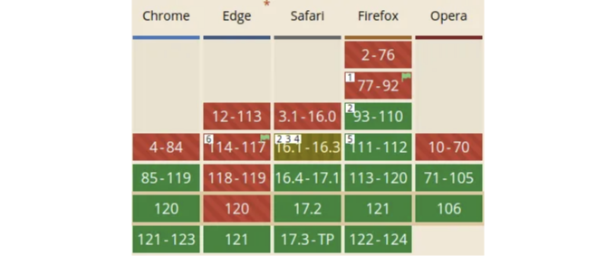
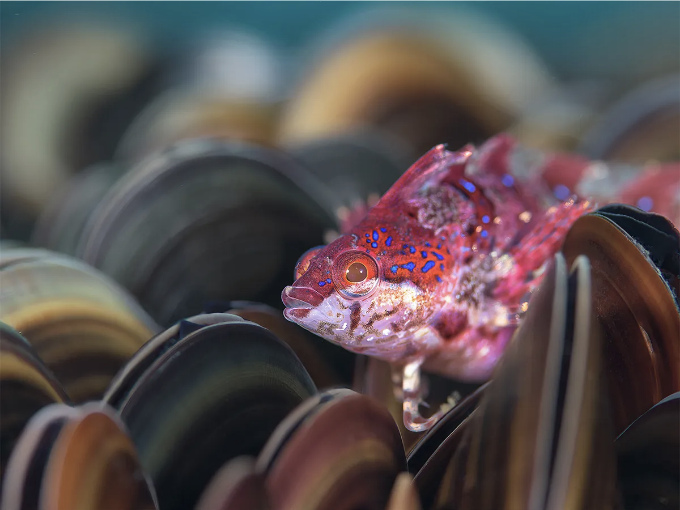
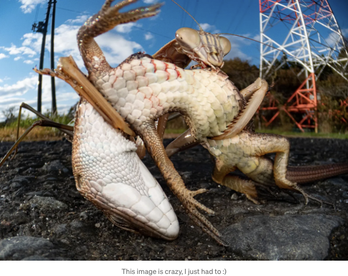

AVIF은 최근에 등장한 파일 형식으로, 이 기사 작성 시점에서 Microsoft Edge에서 지원을 받아서 상당한 브라우저 지원을 이루었습니다.



중요: 우리는 더 이상 어둠의 시대에 있지 않습니다. 대부분의 대형 웹 플랫폼은 일반적으로 현재 브라우저 버전으로부터 1년까지의 지원을 제공합니다. AVIF를 사용하기 시작할 수 있습니다. (2024년 말까지는 WebP로 후퇴해야 함)

# 이것이 의미하는 바는 무엇일까요?

<!-- ui-log 수평형 -->
<ins class="adsbygoogle"
  style="display:block"
  data-ad-client="ca-pub-4877378276818686"
  data-ad-slot="9743150776"
  data-ad-format="auto"
  data-full-width-responsive="true"></ins>
<component is="script">
(adsbygoogle = window.adsbygoogle || []).push({});
</component>

이제 래스터화된 이미지를 위한 기본값으로 AVIF를 "주로" 사용할 수 있습니다. 이는 일반적인 JPEG 사용의 대부분을 대체하는 것으로 간주됩니다.

## JPEG 및 WEBP 대신 AVIF를 선택하는 이유는?

- 압축 효율성: 고화질 이미지를 유지하면서 JPEG 및 WebP와 같은 형식보다 높은 압축 비율을 제공합니다.
- 색 깊이: 8비트, 10비트, 12비트 및 16비트를 포함한 다양한 색 깊이를 지원합니다.
- 넓은 색역 및 HDR 지원: AVIF는 넓은 색상 범위와 높은 다이내믹 범위(HDR)로 생생하고 생동감 있는 이미지를 가능하게 합니다. 전문적인 사진 및 미디어 콘텐츠와 같이 정밀한 색상과 디테일을 요구하는 애플리케이션에 이상적입니다.
- 손실 압축 및 비손실 압축: AVIF의 비손실 압축은 압축된 비트맵 및 PNG보다 훨씬 우수합니다.
- 알파 채널 지원: PNG과 마찬가지로 반투명 이미지를 저장할 수 있지만, 더 나은 압축률로 가능합니다.
- AV1 기반: AV1은 구글의 VP9 코덱을 기반으로 한 Alliance for Open Media에서 개발한 로열티 프리 코덱입니다. 이는 다른 다가오는 이미지 형식과 비교하여 논란이 훨씬 적은 널리 퍼져 있는 채택을 의미합니다.
- 대부분의 주요 브라우저 및 다양한 플랫폼 지원.
- 대역폭 축소 및 더 빠른 로딩 시간: 파일 크기가 작기 때문에 사용자에게 더 빠른 로딩 속도를 제공합니다.

## 단점

<!-- ui-log 수평형 -->
<ins class="adsbygoogle"
  style="display:block"
  data-ad-client="ca-pub-4877378276818686"
  data-ad-slot="9743150776"
  data-ad-format="auto"
  data-full-width-responsive="true"></ins>
<component is="script">
(adsbygoogle = window.adsbygoogle || []).push({});
</component>

- 계산적으로 중요한 압축: 보통 AVIF 압축은 JPEG와 같은 이전 이미지 형식보다 계산적으로 더 많은 리소스를 요구하지만, 일반적으로 우수한 압축 효율을 달성합니다.

## 얼마나 작아질까요?



얼라이언스 포 오픈 미디어는 매우 흥분했으며 주장합니다:

<!-- ui-log 수평형 -->
<ins class="adsbygoogle"
  style="display:block"
  data-ad-client="ca-pub-4877378276818686"
  data-ad-slot="9743150776"
  data-ad-format="auto"
  data-full-width-responsive="true"></ins>
<component is="script">
(adsbygoogle = window.adsbygoogle || []).push({});
</component>

저도 약 4년 동안 AVIF를 사용해왔는데, 제 의견으로는 대부분의 이미지를 압축했을 때 JPEG 출력 이미지와 비교했을 때 약 60% 정도의 크기를 차지합니다. 여전히 놀랍도록 인상적이에요.

AVIF는 SVG 및 SVG 이미지를 제외한 대부분의 이미지 시나리오를 커버합니다. 다만 아래의 경우에 해당하지요:
- 벡터 이미지: SVG 및 SVG 이미지가 이를 잘 처리합니다.
- 벡터 애니메이션: 다시 말해, SVG가 이를 꽤 잘 다루지만, 렌더 품질을 더 많이 조절할 수 있으면 좋겠긴 한데, 별로 중요하지 않아요.

<!-- ui-log 수평형 -->
<ins class="adsbygoogle"
  style="display:block"
  data-ad-client="ca-pub-4877378276818686"
  data-ad-slot="9743150776"
  data-ad-format="auto"
  data-full-width-responsive="true"></ins>
<component is="script">
(adsbygoogle = window.adsbygoogle || []).push({});
</component>

# 백엔드 인코딩/디코딩

선호하는 백엔드 언어에 AVIF를 지원하는 소프트웨어 라이브러리를 찾지 못했다면 offical AOMedia 인코더/디코더인 libavif를 감싸서 사용할 수 있습니다. 혹은 용감하다면 원시 지원을 위해 변환할 수도 있어요.

아래는 Github에서 한눈에 보이는 몇 가지 예시입니다.

- Node.js: [https://github.com/lovell/sharp](https://github.com/lovell/sharp)
- PHP: [https://github.com/flyimg/flyimg](https://github.com/flyimg/flyimg)
- Go: [https://github.com/webp-sh/webp_server_go](https://github.com/webp-sh/webp_server_go)

<!-- ui-log 수평형 -->
<ins class="adsbygoogle"
  style="display:block"
  data-ad-client="ca-pub-4877378276818686"
  data-ad-slot="9743150776"
  data-ad-format="auto"
  data-full-width-responsive="true"></ins>
<component is="script">
(adsbygoogle = window.adsbygoogle || []).push({});
</component>

# AVIF를 사용하지 말아야 하는 경우

실제 이미지의 동적 및 복잡성에 따라 다르지만 보통:

- 손실 없는 벡터/비현실적 애니메이션
- 상황에 따라 (으음)

AVIF 보다 품질/압축 비율을 비교할 때 WebP 또는 심지어 JPEG가 AVIF보다 더 우수한 경우도 있습니다.

<!-- ui-log 수평형 -->
<ins class="adsbygoogle"
  style="display:block"
  data-ad-client="ca-pub-4877378276818686"
  data-ad-slot="9743150776"
  data-ad-format="auto"
  data-full-width-responsive="true"></ins>
<component is="script">
(adsbygoogle = window.adsbygoogle || []).push({});
</component>

일반적으로 말해, AVIF는 사실적인 사진 이미지를 최적화할 때 빛을 발합니다. 다이어그램이나 벡터 아트와 같은 다른 이미지들에 대해서도 꽤 우월하다고 개인적으로 생각합니다.

# 이전 브라우저 버전 지원

누군가가 오랜 휴가에서 돌아왔는데 브라우저를 오랫동안 업데이트하지 않은 경우를 상상해보세요.

이 글을 쓴 시점에서 AVIF를 사용하고 싶다면, srcset 및 `picture``source`를 사용하여 AVIF를 이용하되 WebP 또는 JPEG와 같은 더 오래된 이미지 형식으로의 폴백을 설정하세요.

<!-- ui-log 수평형 -->
<ins class="adsbygoogle"
  style="display:block"
  data-ad-client="ca-pub-4877378276818686"
  data-ad-slot="9743150776"
  data-ad-format="auto"
  data-full-width-responsive="true"></ins>
<component is="script">
(adsbygoogle = window.adsbygoogle || []).push({});
</component>

만약 이 글을 작성한 후 Edge의 3번 이상의 릴리스가 되었다면, src만 사용해도 괜찮습니다.

# 애니메이션

AVIF 애니메이션 예시

이 글의 범위를 약간 벗어나지만, AVIF는 APNG와 마찬가지로 애니메이션에 사용될 수 있습니다.

<!-- ui-log 수평형 -->
<ins class="adsbygoogle"
  style="display:block"
  data-ad-client="ca-pub-4877378276818686"
  data-ad-slot="9743150776"
  data-ad-format="auto"
  data-full-width-responsive="true"></ins>
<component is="script">
(adsbygoogle = window.adsbygoogle || []).push({});
</component>

두 형식은 GIF보다 훨씬 우수하며 전체 브라우저 지원을 갖추고 있기 때문에 대체로 고려해야 합니다. GIF는 압축이 부족한 움짤 이미지용으로 낡은 형식이기 때문에 더욱 그렇습니다.

이와 같이, 이메일 지원에 대해서는 주의해야 합니다. 이 역시 오래된, 형편없는 시스템이라 이러한 새로운 형식에 대한 일관된 지원을 제공하지 않을 확률이 높기 때문에 꼭 확인해야 합니다.

# 결론

나는 경쟁하는 이미지 형식과 선호되는 압축 결과에 대한 관점을 피하려 노력합니다. 사실 모든 손실 압축 코덱은 희생과 보상의 문제가 있습니다; 모두 약점이 존재하기 때문입니다.

<!-- ui-log 수평형 -->
<ins class="adsbygoogle"
  style="display:block"
  data-ad-client="ca-pub-4877378276818686"
  data-ad-slot="9743150776"
  data-ad-format="auto"
  data-full-width-responsive="true"></ins>
<component is="script">
(adsbygoogle = window.adsbygoogle || []).push({});
</component>

특정 이미지 아티팩트 스타일이 마음에 들지 않을 수 있지만, 기차에서나 느린 네트워크 환경에서 누군가가 웹사이트를 빠르게 로드할 수 있다면, 개발자로서 타협을 해야 할 때도 있죠.

최종 목표는 현실적인 범위 내에서 사용자에게 가장 작은 페이로드를 제공하는 것이죠. 어떤 포맷이 더 최적인지와는 무관하게 말이에요.

제 의견으로는 새로운 이미지 포맷은 간단히 말해 더 나은 제품을 만들기 위한 도구일 뿐이에요. 경쟁적인 선호도 문제가 아니라 사용자 경험 향상을 위한 것이죠.

독서해 주셔서 감사합니다 :)

<!-- ui-log 수평형 -->
<ins class="adsbygoogle"
  style="display:block"
  data-ad-client="ca-pub-4877378276818686"
  data-ad-slot="9743150776"
  data-ad-format="auto"
  data-full-width-responsive="true"></ins>
<component is="script">
(adsbygoogle = window.adsbygoogle || []).push({});
</component>

```

```