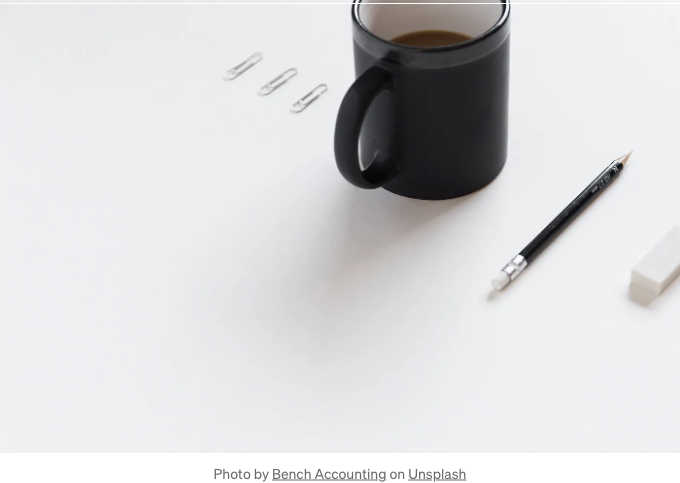
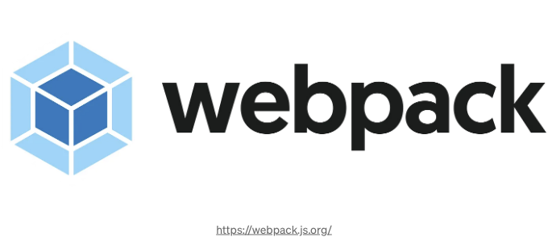

요즘 React는 매우 인기가 많이 있거나 이미 많은 인기를 얻고 있는 중입니다. 물론 대형 또는 중소 규모의 애플리케이션에 대한 매우 좋은 솔루션이지만, 완전히 일반적인 몇 페이지 정적 콘텐츠 웹 사이트에는 언제나 적용할 수는 없습니다.



## 증거

이러한 간단한 웹 사이트의 주요 목적은 방문자에게 장소, 비즈니스 또는 조직에 대한 정보를 전달하는 것입니다.

<!-- ui-log 수평형 -->
<ins class="adsbygoogle"
  style="display:block"
  data-ad-client="ca-pub-4877378276818686"
  data-ad-slot="9743150776"
  data-ad-format="auto"
  data-full-width-responsive="true"></ins>
<component is="script">
(adsbygoogle = window.adsbygoogle || []).push({});
</component>

작은 비즈니스를 예로 들어 이러한 웹 사이트를 살펴보겠습니다.
대부분의 경우, 사이트는 다음과 같은 페이지로 구성됩니다:

1. 홈 - 비즈니스에 관한 가장 중요한 정보, 영업 시간, 연락처 정보를 포함합니다.
2. 연락처 - 전화번호, 주소, 영업 시간, 이메일 주소 및 위치를 보여주는 지도와 함께 자세한 연락처 정보, 그리고 피드백 양식이 포함되어 있습니다.
3. 서비스 - 회사가 제공하는 서비스와 설명에 대해 설명하는 섹션입니다.

위 페이지들을 보면, 이 프로젝트는 가능한 한 간단하고 효과적일 것으로 보입니다.

이를 바탕으로, 이러한 프로젝트를 개발하기 위해 가장 기본적이고 간단한 기술인 HTML, CSS, JavaScript가 필요할 것으로 이해할 수 있습니다.

<!-- ui-log 수평형 -->
<ins class="adsbygoogle"
  style="display:block"
  data-ad-client="ca-pub-4877378276818686"
  data-ad-slot="9743150776"
  data-ad-format="auto"
  data-full-width-responsive="true"></ins>
<component is="script">
(adsbygoogle = window.adsbygoogle || []).push({});
</component>

프로젝트의 구조는 매우 간단합니다. 총 3개의 정적 HTML 페이지가 포함되어 있습니다:

- index.html
- services.html
- contact.html

# 개발 시작하기

이 프로젝트에서 사용할 수 있는 두 가지 접근 방식은 다음과 같습니다:
- CSS와 JS를 사용하여 .html 파일에서 로컬 개발하기
- webpack을 사용하여 프로젝트를 개발하고 빌드하기. 제안드리는 것은 항상 이 방법을 사용하는 것입니다. 이 방법을 사용하면 여러분의 삶이 훨씬 쉬워질 것입니다.

<!-- ui-log 수평형 -->
<ins class="adsbygoogle"
  style="display:block"
  data-ad-client="ca-pub-4877378276818686"
  data-ad-slot="9743150776"
  data-ad-format="auto"
  data-full-width-responsive="true"></ins>
<component is="script">
(adsbygoogle = window.adsbygoogle || []).push({});
</component>

웹팩을 사용하는 것 외에도 CSS 대신 SCSS를 사용해 봅시다. 아래에서 웹팩과 SCSS의 장점을 설명하겠습니다.

## 웹팩



먼저, Node.js가 설치되어 실행 중인지 확인해야 합니다.
터미널에서 다음 명령을 통해 쉽게 확인할 수 있습니다:

<!-- ui-log 수평형 -->
<ins class="adsbygoogle"
  style="display:block"
  data-ad-client="ca-pub-4877378276818686"
  data-ad-slot="9743150776"
  data-ad-format="auto"
  data-full-width-responsive="true"></ins>
<component is="script">
(adsbygoogle = window.adsbygoogle || []).push({});
</component>

```js
node -v
```

만약 노드.js 버전을 이미 가지고 있다면 대단해요! 그렇지 않다면 노드.js 공식 사이트를 방문해서 설치해주세요.

시작해봅시다:
웹팩 — 간단히 말해서, 이는 가게에서 당신의 "주문"을 고르는 장바구니 고르는 사람입니다 📦.

마치 당신이 가게에 와서 다음을 요청하는 것처럼 상상해봐요:
— HTML 페이지
— SCSS를 사용한 스타일링
— 모든 최신 브라우저를 지원
— 폼 제출, 드롭다운 리스트 등과 같은 동적 자바스크립트 로직
— 자바스크립트 코드는 서버에 업로드되기 전에 압축되어 페이지 로딩 속도를 높입니다.
— 로컬 개발을 위한 웹 서버, 모든 새로운 코드 변경 사항이 반영된 페이지를 자동으로 다시로드합니다.

<!-- ui-log 수평형 -->
<ins class="adsbygoogle"
  style="display:block"
  data-ad-client="ca-pub-4877378276818686"
  data-ad-slot="9743150776"
  data-ad-format="auto"
  data-full-width-responsive="true"></ins>
<component is="script">
(adsbygoogle = window.adsbygoogle || []).push({});
</component>

우리의 Webpack 번들러는 매우 간단하고 아름다운 방식으로 모두 처리해줍니다!

## 시작해봅시다!

Webpack을 사용하여 간단한 웹사이트를 만드는 것은 HTML 파일, 스타일링을 위한 SCSS 및 기능 구현을 위한 JavaScript를 처리하는 설정을 구성하는 것을 포함합니다. 아래는 여러분의 요구 사항을 충족시킬만한 기본 webpack.config.js 파일입니다:

- 프로젝트 이름으로 된 빈 폴더를 만듭니다 — 이것이 프로젝트 루트 디렉토리입니다.
- 루트 디렉토리에서 npm i를 실행합니다. 프로젝트 및 기타 필요한 설정을 정합니다.
- 필요한 패키지 설치: Webpack 및 몇 가지 로더를 설치해야 합니다. 다음 명령어를 프로젝트 루트 디렉토리에서 실행하세요:

<!-- ui-log 수평형 -->
<ins class="adsbygoogle"
  style="display:block"
  data-ad-client="ca-pub-4877378276818686"
  data-ad-slot="9743150776"
  data-ad-format="auto"
  data-full-width-responsive="true"></ins>
<component is="script">
(adsbygoogle = window.adsbygoogle || []).push({});
</component>

```js
npm install --save-dev webpack webpack-cli html-webpack-plugin mini-css-extract-plugin css-loader sass sass-loader style-loader babel-loader @babel/core @babel/preset-env webpack-dev-server
```

4. 프로젝트 루트 디렉토리에 webpack.config.js를 생성하세요. 이 파일은 webpack 구성 파일입니다.

```js
const path = require('path');
const HtmlWebpackPlugin = require('html-webpack-plugin');
const MiniCssExtractPlugin = require('mini-css-extract-plugin');

module.exports = {
  entry: './src/index.js', // 여러분의 주요 JavaScript 파일
  output: {
    path: path.resolve(__dirname, 'dist'),
    filename: 'bundle.js',
  },
  module: {
    rules: [
      {
        test: /\.js$/,
        exclude: /node_modules/,
        use: {
          loader: 'babel-loader',
          options: {
            presets: ['@babel/preset-env'],
          },
        },
      },
      {
        test: /\.scss$/,
        use: [MiniCssExtractPlugin.loader, 'css-loader', 'sass-loader'],
      },
    ],
  },
  plugins: [
    new HtmlWebpackPlugin({
      template: './src/index.html',
      filename: 'index.html',
    }),
    new HtmlWebpackPlugin({
      template: './src/services.html',
      filename: 'services.html',
    }),
    new HtmlWebpackPlugin({
      template: './src/contact.html',
      filename: 'contact.html',
    }),
    new MiniCssExtractPlugin(),
  ],
  devServer: {
    contentBase: path.join(__dirname, 'dist'),
    compress: true,
    port: 3000,
  },
};
```

5. 프로젝트 구조:
새로운 src 폴더를 프로젝트 루트 디렉토리에 만드세요:

<!-- ui-log 수평형 -->
<ins class="adsbygoogle"
  style="display:block"
  data-ad-client="ca-pub-4877378276818686"
  data-ad-slot="9743150776"
  data-ad-format="auto"
  data-full-width-responsive="true"></ins>
<component is="script">
(adsbygoogle = window.adsbygoogle || []).push({});
</component>

- index.js: 메인 JavaScript 진입 파일입니다.
- index.html, services.html, contact.html: HTML 파일들입니다.
- SCSS 파일들이 있는 scss 폴더.

6. Babel 구성:
프로젝트 루트 디렉토리에 Babel 구성을 위한 .babelrc 파일을 생성해주세요.

```js
{
  "presets": ["@babel/preset-env"]
}
```

이것이 무엇인지 설명해드릴게요. Babel은 널리 사용되는 JavaScript 컴파일러로, 당신이 최신의 JavaScript를 사용할 수 있도록 합니다. 실제로는 현대적인 JavaScript 코드를 현재 및 오래된 브라우저 또는 환경과 호환되는 버전으로 변환합니다.

<!-- ui-log 수평형 -->
<ins class="adsbygoogle"
  style="display:block"
  data-ad-client="ca-pub-4877378276818686"
  data-ad-slot="9743150776"
  data-ad-format="auto"
  data-full-width-responsive="true"></ins>
<component is="script">
(adsbygoogle = window.adsbygoogle || []).push({});
</component>

여기 있는 ECMAScript이 최신 버전이고, 인터넷 익스플로러 11이 오래된 버전이에요. 다행히도 없어졌네요!

```js
"scripts": {
  "start": "webpack serve --open",
  "build": "webpack --mode production"
}
```

8. 프로젝트를 실행하세요.

<!-- ui-log 수평형 -->
<ins class="adsbygoogle"
  style="display:block"
  data-ad-client="ca-pub-4877378276818686"
  data-ad-slot="9743150776"
  data-ad-format="auto"
  data-full-width-responsive="true"></ins>
<component is="script">
(adsbygoogle = window.adsbygoogle || []).push({});
</component>

- npm start을 사용하여 개발 서버를 시작하세요.
- npm run build를 사용하여 프로덕션 빌드를 생성하세요.

# SCSS

가장 쉽게 설명해 보겠습니다:

그림을 그리기 위한 색연필이 가득한 큰 상자가 있다고 상상해봅시다✏️. 일반 CSS(Cascading Style Sheets)는 상자에서 바로 각 색연필을 사용하여 그림을 칠하는 것과 같습니다. 색을 선택하고 조금 그리고, 다른 색을 선택하는 식으로 계속합니다. 잘 작동하지만 가끔은 색을 섞어서 사용하거나 즐겨 사용하는 조합을 쉽게 기억하고 싶을 때가 있습니다.

<!-- ui-log 수평형 -->
<ins class="adsbygoogle"
  style="display:block"
  data-ad-client="ca-pub-4877378276818686"
  data-ad-slot="9743150776"
  data-ad-format="auto"
  data-full-width-responsive="true"></ins>
<component is="script">
(adsbygoogle = window.adsbygoogle || []).push({});
</component>

이제 SCSS (Sassy CSS)를 마법의 색칠북으로 생각해 보세요. 여러분만의 특별한 색연필을 만들 수 있는 곳이에요.

- 특별한 색연필 (변수):
여러 색을 섞어 "석양 오렌지"와 같은 이름을 붙여 특별한 색연필을 만들 수 있어요. 그럼 그 정확한 색을 필요할 때, 색을 다시 섞을 필요 없이 "석양 오렌지" 연필을 사용하시면 돼요. 

```scss
$ocean-blue: #1ca3ec;
body {
  background-color: $ocean-blue; /* 배경에 오션 블루를 사용하세요 */
}
```

2. 그리기 쌓기 (중첩):
나무를 그린다고 상상해보세요. 우선 줄기를 그리고 가지, 마지막으로 잎을 그립니다, 맞죠? SCSS에서도 이렇게 그릴 수 있어요. 나무의 큰 부분부터 시작해서 (나무), 그리고 작은 부분들(가지, 잎)을 큰 부분 내부에 넣을 수 있어요. 그림 속에 그림을 그리는 것처럼, 모든 걸 깔끔하게 이해하기 쉽게 유지해줘요.

<!-- ui-log 수평형 -->
<ins class="adsbygoogle"
  style="display:block"
  data-ad-client="ca-pub-4877378276818686"
  data-ad-slot="9743150776"
  data-ad-format="auto"
  data-full-width-responsive="true"></ins>
<component is="script">
(adsbygoogle = window.adsbygoogle || []).push({});
</component>

```js
.garden {
  .tree {
    height: 10ft;
    .leaves {
      color: green;
    }
  }
}
```

3. 마법 공식 (믹스인):
특정한 것을 그리기 위한 마법 공식을 만들 수 있다면 어떨까요? 별이나 구름을 그리는 공식을 만들어봅시다. 구름을 그릴 때마다 마법의 구름 공식을 사용하면 그림자가 나타납니다! 무지개:

```js
@mixin rainbow {
  background: linear-gradient(to right, red, orange, yellow, green, blue, indigo, violet);
}
.sky {
  @include rainbow; /* 하늘에 무지개 그리기 */
}
```

4. 색상 공유 (상속):
한 그림에 사용한 좋아하는 색상 세트가 있다면, 그 색상을 다시 선택하지 않고 다른 그림에 사용할 수 있습니다.```

<!-- ui-log 수평형 -->
<ins class="adsbygoogle"
  style="display:block"
  data-ad-client="ca-pub-4877378276818686"
  data-ad-slot="9743150776"
  data-ad-format="auto"
  data-full-width-responsive="true"></ins>
<component is="script">
(adsbygoogle = window.adsbygoogle || []).push({});
</component>

```css
.flower {
  size: small;
  smell: nice;
}
.rose {
  @extend .flower; /* 장미는 꽃과 같은 특징을 갖고 있습니다 */
  color: red;
}
```

5. 작은 도우미 페이지 (부분과 가져오기):
당신이 그림의 일부를 그려내는 작은 페이지들이 있는 상황을 상상해 보세요 - 나무를 위한 페이지, 집을 위한 다른 페이지 등등. 그럼 큰 그림에서 "여기에 나무를 넣어라" 또는 "저기에 집을 넣어라"라고 말할 수 있어서, 마치 작은 도우미 페이지에서 복사하는 것과 같은 느낌이 듭니다.

```scss
// _stars.scss (이것은 작은 도우미 페이지입니다)
.star {
  shape: star;
  color: yellow;
}

// main.scss (당신의 큰 그림)
@import 'stars'; /* 여기서 별 그림을 사용하세요 */
```

6. 예술에서의 수학 (수학적인 연산):
만약 그림 그리는 데 수학을 활용할 수 있다면 어떨까요? "이 선을 이전 것의 두 배로 길게 해주세요" 또는 "이 파란색의 절반만 사용해주세요"와 같이 말할 수도 있습니다. 울타리를 두 배로 높게 만든다던가:```

<!-- ui-log 수평형 -->
<ins class="adsbygoogle"
  style="display:block"
  data-ad-client="ca-pub-4877378276818686"
  data-ad-slot="9743150776"
  data-ad-format="auto"
  data-full-width-responsive="true"></ins>
<component is="script">
(adsbygoogle = window.adsbygoogle || []).push({});
</component>

```js
/* 울타리를 두 배로 높게 만들기: */
.울타리 {
  높이: 5ft;
  .키다리_울타리 {
    높이: 2 * 5ft; /* 키다리 울타리는 두 배 더 높음 */
  }
}
```

SCSS를 사용하면 그림 그리기(또는 웹사이트 디자인)를 더 쉽고 재미있게 만드는 멋진 도구와 트릭을 가지고 있는 것과 같아요. 보다 창의적이고 쉽게 변경할 수 있어요. 마법 같은 색칠북과 같이 작동할 수 있도록 만들어지면 좋겠어요!

이 설명이 도움이 되길 바라요. 이제 프로젝트 설정으로 돌아가보겠습니다.

9. 프로젝트 구성의 마지막 단계는 `./src/scss`에 `main.scss`를 추가하는 것입니다.```

<!-- ui-log 수평형 -->
<ins class="adsbygoogle"
  style="display:block"
  data-ad-client="ca-pub-4877378276818686"
  data-ad-slot="9743150776"
  data-ad-format="auto"
  data-full-width-responsive="true"></ins>
<component is="script">
(adsbygoogle = window.adsbygoogle || []).push({});
</component>


여기까지! 우리 간단한 프로젝트가 구성되었고 제대로 작동해야 합니다. 이제 진짜 개발을 시작할 수 있어요 🚀.
보시다시피, React, Angular, Vue 등의 프레임워크를 사용하지 않고도 꽤 간단한 웹사이트를 만들 수 있습니다.

위 방법은 검색 엔진에서 완벽하게 색인되며 웹사이트의 성능에 어려움을 끼치지 않을 것입니다. 헤더와 푸터와 같이 각 페이지마다 반복되는 블록이 있는 경우, 템플릿 엔진을 사용하여 DRY (DON’T REPEAT YOURSELF) 원칙을 따르는 것을 권장합니다.

가까운 미래에 템플릿 엔진에 관한 별도의 기사를 올릴 예정이에요.

<!-- ui-log 수평형 -->
<ins class="adsbygoogle"
  style="display:block"
  data-ad-client="ca-pub-4877378276818686"
  data-ad-slot="9743150776"
  data-ad-format="auto"
  data-full-width-responsive="true"></ins>
<component is="script">
(adsbygoogle = window.adsbygoogle || []).push({});
</component>

우리가 서버에서 작업한 결과로는 Nginx, Node.js, Apache 등의 웹 서버를 사용하여 배포될 정적 파일 세트가 생성됩니다.

웹 프로젝트를 빠르고 편리하게 배포하는 방법에 대해 다음 문서에서 함께 알아보겠습니다.

계속 주목해 주세요!

LinkedIn에서 저에게 연락해보세요 🚀