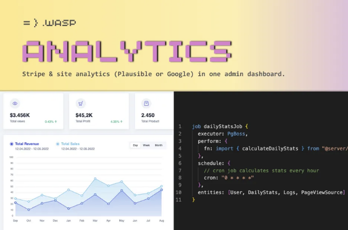

# 오픈 SaaS 소개 🎉

저희가 자랑스럽게 소개하는 것은 오픈 SaaS입니다. React, NodeJS 및 Prisma를 위한 완전히 무료, 오픈 소스, 프로덕션 급 SaaS 보일러플레이트입니다.

여기에서 실제로 확인해보세요:

<!-- ui-log 수평형 -->
<ins class="adsbygoogle"
  style="display:block"
  data-ad-client="ca-pub-4877378276818686"
  data-ad-slot="9743150776"
  data-ad-format="auto"
  data-full-width-responsive="true"></ins>
<component is="script">
(adsbygoogle = window.adsbygoogle || []).push({});
</component>

Open SaaS는 최근에 보셨던 유료 SaaS 스타터들의 모든 기능을 갖추고 있지만 완전히 무료이며 오픈 소스입니다.

우리는 스스로 관리해야 하는 일부 보일러플레이트 코드에 $300~$2,000을 지불하는 것이 정말 황당하다고 느꼈습니다. 덤으로 이러한 보일러플레이트 중 많은 것들이 3자 서비스에 매우 의존하고 있습니다. 호스팅 및 기타 요금까지 추가하면 아이디어를 세상에 내놓기 위해 상당히 많은 돈을 쓰게 될 것입니다.

그래서 Open SaaS에서는 가능한 한 오픈 소스 및 무료 서비스를 사용하도록 의식적인 결정을 내렸습니다. 예를 들어, OpenSaaS.sh의 호스팅된 데모 앱과 그 관리용 대시보드는 Plausible 분석의 자체 호스팅 버전을 사용하고 있습니다. 귀하의 SaaS에 동일한 기능을 원하십니까? 그렇다면 Open SaaS가 이미 사전 구성되어 있습니다!

또한 Open SaaS에서 사용하는 Wasp 프레임워크는 인증 및 크론 작업과 같은 여러 기능을 빌드하는 작업을 대신 수행하기 때문에 3자 서비스에 돈을 지불하거나 코드를 완전히 직접 작성할 필요가 없습니다 (나중에 이에 대해 자세히 설명하겠습니다).

<!-- ui-log 수평형 -->
<ins class="adsbygoogle"
  style="display:block"
  data-ad-client="ca-pub-4877378276818686"
  data-ad-slot="9743150776"
  data-ad-format="auto"
  data-full-width-responsive="true"></ins>
<component is="script">
(adsbygoogle = window.adsbygoogle || []).push({});
</component>

# 시작하기 전에...

오픈 SaaS가 지금 Product Hunt에서 라이브 중입니다! 우리의 무료 오픈 소스 이니셔티브를 지원해주세요 🙏


# 왜 우리가 만들었는지... 그리고 그것을 무료로 제공한 이유

<!-- ui-log 수평형 -->
<ins class="adsbygoogle"
  style="display:block"
  data-ad-client="ca-pub-4877378276818686"
  data-ad-slot="9743150776"
  data-ad-format="auto"
  data-full-width-responsive="true"></ins>
<component is="script">
(adsbygoogle = window.adsbygoogle || []).push({});
</component>

우리의 사전 릴리스 초기 피드백은 대부분 긍정적이었지만 몇 가지 질문도 받았어요:
- "무료로 유지될 건가요?"
- "오픈소스로 한 동기는 무엇인가요?"


그래서 우리는 이에 대한 대답을 시작하기로 했어요.

먼저, 네, 이것은 100% 무료 및 오픈소스이며 그대로 유지될 거예요.

<!-- ui-log 수평형 -->
<ins class="adsbygoogle"
  style="display:block"
  data-ad-client="ca-pub-4877378276818686"
  data-ad-slot="9743150776"
  data-ad-format="auto"
  data-full-width-responsive="true"></ins>
<component is="script">
(adsbygoogle = window.adsbygoogle || []).push({});
</component>

두 번째로, 개발자들, 인디핵커, 그리고 솔로기업가들의 지식이 모이면 개별이나 소규모 그룹보다 더 나은 보일러플레이트가 만들어질 것으로 믿습니다. 어떤 개발자로부터 SaaS 스타터를 구매하면 이미 주관적인 스택을 얻게 되는데, 거기에 더해 그들이 생각한 최고의 방법으로 앱이 구축되었다는 말입니다 — 하지만 그것이 항상 *당신에게* 최선인 것은 아닐 수 있습니다.

세 번째로, Open SaaS는 Wasp의 프로젝트입니다. Wasp는 오픈 소스 React + NodeJS + Prisma 풀스택 프레임워크로서 슈퍼파워를 지닙니다. Wasp 팀은 Wasp가 SaaS 앱을 빠르고 효율적으로 만들기에 매우 적합하다고 믿으며, 이 템플릿을 통해 그를 증명하고자 합니다. 게다가, 우리는 개발자로서 다른 오픈 소스 프로젝트로부터 많은 것을 배웠고, Wasp 자체가 오픈 소스 프로젝트임을 강조하고 있습니다.

기본적으로, 우리는 오픈 소스 철학을 사랑하며 이를 앞으로 전달하고자 합니다. 🙏

따라서 우리는 개발자 커뮤니티에 심각한 가치를 제공하고, 우리의 오픈 소스 풀스택 프레임워크에 대한 정보를 확산하고자 합니다. 그리고 이를 향해 커뮤니티가 기여하고, 이 템플릿이 성장하여 최고의 SaaS 보일러플레이트가 되기를 바라고 있습니다.

<!-- ui-log 수평형 -->
<ins class="adsbygoogle"
  style="display:block"
  data-ad-client="ca-pub-4877378276818686"
  data-ad-slot="9743150776"
  data-ad-format="auto"
  data-full-width-responsive="true"></ins>
<component is="script">
(adsbygoogle = window.adsbygoogle || []).push({});
</component>

# 오픈 SaaS가 무엇으로 이루어져 있는지

오픈 SaaS에는 문서 작업을 포함하여 개발자가 자신감 있고 쉽게 SaaS 앱을 출시할 수 있도록 많은 노력을 기울였습니다.

또한, 우리는 다른 무료 오픈 소스 SaaS 시작기를 살펴보고, 오픈 SaaS가 제조에 준비된 스타터의 모든 적절한 기능을 갖추고 있도록 하고자 했습니다. 그리고 우리는 대부분을 성취했다고 생각하지만, 계속해서 기능을 추가하고 향상시켜 나가겠습니다.

현재 주요 기능은 다음과 같습니다:

<!-- ui-log 수평형 -->
<ins class="adsbygoogle"
  style="display:block"
  data-ad-client="ca-pub-4877378276818686"
  data-ad-slot="9743150776"
  data-ad-format="auto"
  data-full-width-responsive="true"></ins>
<component is="script">
(adsbygoogle = window.adsbygoogle || []).push({});
</component>

- 🔐 인증 (이메일 확인, 구글, 깃헙)
- 📩 이메일 발송 (sendgrid, emailgun, SMTP)
- 📈 관리자 대시보드 (plausible 또는 구글 애널리틱스)
- 🤑 스트라이프 결제 (구독 제품 ID만 추가하면 됩니다)
- ⌨️ 종단 간 타입 안전성 (구성 필요 없음)
- 🤖 OpenAI 통합 (AI 기반 예시 앱)
- 📖 Astro로 구현된 블로그
- 🚀 어디서든 배포 가능
- 📄 완벽한 문서 및 커뮤니티 지원

각 기능에 대해 자세히 알아보겠습니다.

# 인증


<!-- ui-log 수평형 -->
<ins class="adsbygoogle"
  style="display:block"
  data-ad-client="ca-pub-4877378276818686"
  data-ad-slot="9743150776"
  data-ad-format="auto"
  data-full-width-responsive="true"></ins>
<component is="script">
(adsbygoogle = window.adsbygoogle || []).push({});
</component>

와스프 덕분에 Open SaaS는 다양한 인증 방법을 갖추고 있어요:

- 사용자 이름과 비밀번호 (개발 테스트에 가장 간단하고 쉬움)
- 이메일 인증 및 비밀번호 재설정
- 구글 및/또는 깃허브 소셜 로그인

이게 바로 Wasp의 강점이에요. 풀스택 인증을 설정하고 미리 구성된 UI 구성 요소를 가져오려면 이것만 하면 돼요:

```js
//main.wasp
app SaaSTemplate {
  auth: {
    userEntity: User,
    methods: {
      usernameAndPassword: {},
      google: {},
      gitHub: {},
    }
  }
}
```

<!-- ui-log 수평형 -->
<ins class="adsbygoogle"
  style="display:block"
  data-ad-client="ca-pub-4877378276818686"
  data-ad-slot="9743150776"
  data-ad-format="auto"
  data-full-width-responsive="true"></ins>
<component is="script">
(adsbygoogle = window.adsbygoogle || []).push({});
</component>

진짜에요. 그게 전부에요!

소셜 인증을 설정하고 API 키를 입력했는지, 그리고 `사용자(User)`와 `외부인증(ExternalAuth)` 엔티티를 정의했는지 확인하세요. 그러면 이제 시작할 준비가 끝났어요. 그리고 걱정하지 마세요. 이 부분은 모두 Open SaaS 문서에서 자세히 문서화되어 있고 설명되어 있답니다.

게다가 Open SaaS에는 강력한 인증 흐름을 사용자 정의하고 생성하는 방법에 대한 예제가 사전 구성되어 있어요.

# 관리자 대시보드 및 분석

<!-- ui-log 수평형 -->
<ins class="adsbygoogle"
  style="display:block"
  data-ad-client="ca-pub-4877378276818686"
  data-ad-slot="9743150776"
  data-ad-format="auto"
  data-full-width-responsive="true"></ins>
<component is="script">
(adsbygoogle = window.adsbygoogle || []).push({});
</component>



Wasp의 Job 기능을 활용하여, Open SaaS는 매 시간 Plausible이나 Google의 사이트 분석 및 Stripe의 데이터 API에서 데이터를 추출하여 이를 데이터베이스에 저장합니다. 이 데이터는 우리의 관리자 대시보드에 표시됩니다 (작동 방식을 확인하려면 OpenSaaS.sh로 이동하세요). 좋은 점은, 귀하의 앱에서 이 데이터에 액세스하려면 분석 API 키를 획들하고 제공된 스크립트를 삽입하기만 하면 되는 것입니다!

다시 말씀드리지만, Wasp는 이 과정 전체를 정말 쉽게 만듭니다. 이미 정의된 API를 쿼리하고 우리가 필요로 하는 데이터를 얻는 기능이 제공되어 있습니다. 그 후 Open SaaS는 `main.wasp` 구성 파일 내에서 Wasp Job을 사용합니다:

```js
job dailyStatsJob {
  executor: PgBoss,
  perform: {
    fn: import { calculateDailyStats } from "@server/workers/calculateDailyStats.js"
  },
  schedule: {
    cron: "0 * * * *"
  },
  entities: [User, DailyStats, Logs, PageViewSource]
}
```

<!-- ui-log 수평형 -->
<ins class="adsbygoogle"
  style="display:block"
  data-ad-client="ca-pub-4877378276818686"
  data-ad-slot="9743150776"
  data-ad-format="auto"
  data-full-width-responsive="true"></ins>
<component is="script">
(adsbygoogle = window.adsbygoogle || []).push({});
</component>

그게 다야! 와스프가 크론 작업을 설정하고 실행해 줍니다.

# 스트라이프 결제


만약 SaaS를 직접 구축해 본 적이 없는 개발자라면, 스트라이프와 같은 결제 프로세서와 통합하는 것이 아마도 직면할 몇 안 되는 도전 중 하나일 것입니다.

<!-- ui-log 수평형 -->
<ins class="adsbygoogle"
  style="display:block"
  data-ad-client="ca-pub-4877378276818686"
  data-ad-slot="9743150776"
  data-ad-format="auto"
  data-full-width-responsive="true"></ins>
<component is="script">
(adsbygoogle = window.adsbygoogle || []).push({});
</component>

나는 처음으로 SaaS인 CoverLetterGPT.xyz를 만들 때 이 문제를 겪었습니다. 실제로 그것은 내가 그것을 만드는 주요 동기 중 하나였습니다; 어떻게 앱에 Stripe 결제를 통합하고 OpenAI API를 배울 것인지 배우기 위해서였죠.

그리고 비록 Stripe가 훌륭한 문서를 갖고 있어도, 프로세스는 여전히 어렵습니다. 당신은:

- 올바른 제품 유형을 생성해야 합니다
- 웹훅 엔드포인트를 설정해야 합니다
- Stripe에게 올바른 웹훅 이벤트를 보내도록 말해야 합니다
- 이벤트를 올바르게 수용해야 합니다
- 반복되는 결제와 실패한 결제에 대처해야 합니다
- 라이브로 이동하기 전에 CLI를 통해 모두 올바르게 테스트해야 합니다

그래서 Stripe 구독 결제가 이미 설정되어 있는 것은 이러한 힘든 작업을 성취하는 것입니다.

<!-- ui-log 수평형 -->
<ins class="adsbygoogle"
  style="display:block"
  data-ad-client="ca-pub-4877378276818686"
  data-ad-slot="9743150776"
  data-ad-format="auto"
  data-full-width-responsive="true"></ins>
<component is="script">
(adsbygoogle = window.adsbygoogle || []).push({});
</component>

하지만 무엇보다 중요한 것은, 전체 과정이 편리하게 문서화되어 있는 것이죠! 그래서 Open SaaS는 당신을 위해 편리한 스트라이프 안내서를 문서에 제공합니다 🙂


## 엔드투엔드 타입 안정성

Open SaaS는 타입스크립트로 구축되었으며, 풀 스택 앱이기 때문에 백엔드에서 프론트엔드로의 타입 안정성이 정말 큰 도움이 될 수 있어요. 어떤 주장적인 스택들이 이 기반에 근거하여 엄청나게 인기를 끌었지요.

<!-- ui-log 수평형 -->
<ins class="adsbygoogle"
  style="display:block"
  data-ad-client="ca-pub-4877378276818686"
  data-ad-slot="9743150776"
  data-ad-format="auto"
  data-full-width-responsive="true"></ins>
<component is="script">
(adsbygoogle = window.adsbygoogle || []).push({});
</component>

다행히도, Wasp는 아웃 오브 더 박스로 엔드 투 엔드 타입 안전성을 제공해줍니다(구성할 것이 없어요!), 그래서 Open SaaS가 이를 쉽게 활용할 수 있었어요.

예시가 있어요:

- Wasp에 서버 액션을 알리기:

```js
// main.wasp

action getResponse {
  fn: import { getResponse } from "@server/actions.js",
  entities: [Response]
}
```

<!-- ui-log 수평형 -->
<ins class="adsbygoogle"
  style="display:block"
  data-ad-client="ca-pub-4877378276818686"
  data-ad-slot="9743150776"
  data-ad-format="auto"
  data-full-width-responsive="true"></ins>
<component is="script">
(adsbygoogle = window.adsbygoogle || []).push({});
</component>

2. 서버 액션의 유형 및 구현을 작성해주세요.

```js
// src/server/actions.ts

type RespArgs = {
  hours: string;
};

const getResponse: GetResponse<RespArgs, string> = async ({ hours }) => { }
```

3. 이를 가져와서 클라이언트에서 호출해주세요. 클라이언트 측 유형이 정확하게 유추될 것입니다!


<!-- ui-log 수평형 -->
<ins class="adsbygoogle"
  style="display:block"
  data-ad-client="ca-pub-4877378276818686"
  data-ad-slot="9743150776"
  data-ad-format="auto"
  data-full-width-responsive="true"></ins>
<component is="script">
(adsbygoogle = window.adsbygoogle || []).push({});
</component>

```markdown


# AI를 활용한 예시 앱 (OpenAI API 사용)


AI 기술을 활용하면 새로운 앱 아이디어를 실현할 수 있습니다. 이것이 개발자들이 SaaS 앱을 만들기에 관심을 가지는 원인 중 하나입니다. 위에서 언급한 것처럼, 내가 처음으로 만든 SaaS 앱인 CoverLetterGPT는 "GPT Wrapper" 중 하나이며, 매월 약 $350의 수익을 올리는 것에 자부심을 갖고 있습니다.
```

<!-- ui-log 수평형 -->
<ins class="adsbygoogle"
  style="display:block"
  data-ad-client="ca-pub-4877378276818686"
  data-ad-slot="9743150776"
  data-ad-format="auto"
  data-full-width-responsive="true"></ins>
<component is="script">
(adsbygoogle = window.adsbygoogle || []).push({});
</component>

개인적으로 소프트웨어 개발 분야에서 우리는 새로운 AI 기술을 활용한 수익 창출이 가능한 많은 기회가 있는 단골 지점에 있다고 믿습니다. 특히 "인디해커"와 "솔로기업가"들이 그렇습니다.

이것이 Open SaaS가 AI 예약 어시스턴트 데모 앱을 제공하는 이유입니다. 작업과 할당된 시간을 입력하면, AI Scheduler가 하루 일정을 자세히 계획해줍니다.


내부적으로, 이는 OpenAI의 API를 사용하여 각 작업에 우선 순위를 할당하고 커피 휴식을 포함한 자세한 하위 작업으로 분할합니다! 또한 사용자가 정의한 JSON 개체로 응답을 정확하게 소비할 수 있도록 OpenAI의 함수 호출 기능을 활용합니다. 미래에는 오픈소스 LLMs를 추가할 계획이므로 기대해 주세요!

<!-- ui-log 수평형 -->
<ins class="adsbygoogle"
  style="display:block"
  data-ad-client="ca-pub-4877378276818686"
  data-ad-slot="9743150776"
  data-ad-format="auto"
  data-full-width-responsive="true"></ins>
<component is="script">
(adsbygoogle = window.adsbygoogle || []).push({});
</component>

데모 AI 스케줄러는 개발자들이 OpenAI API를 효과적으로 활용하는 방법을 배우고 창의적인 SaaS 애플리케이션 아이디어를 떠올릴 수 있도록 돕기 위해 있어요!

# 어디서나 쉽게 배포하세요.

인기 있는 SaaS 스타터들은 대부분 호스팅 종속적인 프레임워크를 사용하는데, 이는 배포를 위해 한 공급업체에 의존해야 한다는 것을 의미해요. 이것들은 쉬운 옵션이 될 수 있지만 항상 앱에 가장 적합한 것은 아닐 수 있어요.

Wasp는 풀스택 앱을 배포하는 데 무한한 가능성을 제공해줘요:

<!-- ui-log 수평형 -->
<ins class="adsbygoogle"
  style="display:block"
  data-ad-client="ca-pub-4877378276818686"
  data-ad-slot="9743150776"
  data-ad-format="auto"
  data-full-width-responsive="true"></ins>
<component is="script">
(adsbygoogle = window.adsbygoogle || []).push({});
</component>

- `wasp deploy` 명령으로 Fly.io에 쉽게 배포할 수 있어요!
- `wasp build`를 사용하여 Dockerfiles를 빌드하고 클라이언트를 원하는 곳에 배포하세요!

`wasp deploy`의 좋은 점은 데이터베이스, 서버, 클라이언트를 자동으로 생성하고 배포해주며 환경 변수를 자동으로 설정해준다는 것이에요.

또한 Open SaaS는 배포를 위해 모든 것이 올바르게 설정되어 있는지 확인하고, 문서에 배포 안내서도 포함돼 있어요.


<!-- ui-log 수평형 -->
<ins class="adsbygoogle"
  style="display:block"
  data-ad-client="ca-pub-4877378276818686"
  data-ad-slot="9743150776"
  data-ad-format="auto"
  data-full-width-responsive="true"></ins>
<component is="script">
(adsbygoogle = window.adsbygoogle || []).push({});
</component>

최종적으로, 코드는 여러분이 소유하며, 벤더 잠금없이 자유롭게 배포할 수 있습니다.

# 우리를 돕고, 당신을 도우세요

우리의 무료 오픈소스 이니셔티브를 지원하고 싶으신가요? 그렇다면 Product Hunt에서 우리를 지원해주세요! 🙏


<!-- ui-log 수평형 -->
<ins class="adsbygoogle"
  style="display:block"
  data-ad-client="ca-pub-4877378276818686"
  data-ad-slot="9743150776"
  data-ad-format="auto"
  data-full-width-responsive="true"></ins>
<component is="script">
(adsbygoogle = window.adsbygoogle || []).push({});
</component>

# 이제 여러분의 SaaS를 만들어 보세요!

저희는 오픈 SaaS가 더 많은 개발자들이 아이디어와 사이드 프로젝트를 출시할 수 있도록 돕기를 바랍니다. 또한 개발자들로부터 피드백과 의견을 받아서 이것을 가장 훌륭한 SaaS 보일러플레이트 스타터로 만들 수 있기를 희망합니다.

그러니까, 여러분의 생각이나 버그를 발견하신 경우 이곳에 이슈를 제출해주세요.

그리고 만약 오픈 SaaS나/또는 와스프(Wasp)가 유용하다고 생각되신다면, 지원하는 가장 쉬운 방법은 우리에게 스타를 주시는 것입니다:

<!-- ui-log 수평형 -->
<ins class="adsbygoogle"
  style="display:block"
  data-ad-client="ca-pub-4877378276818686"
  data-ad-slot="9743150776"
  data-ad-format="auto"
  data-full-width-responsive="true"></ins>
<component is="script">
(adsbygoogle = window.adsbygoogle || []).push({});
</component>

- Open SaaS 레포에 스타를 눌러주세요.
- Wasp 레포에 스타를 눌러주세요.

건설하는 즐거움이 있기를 바라요!