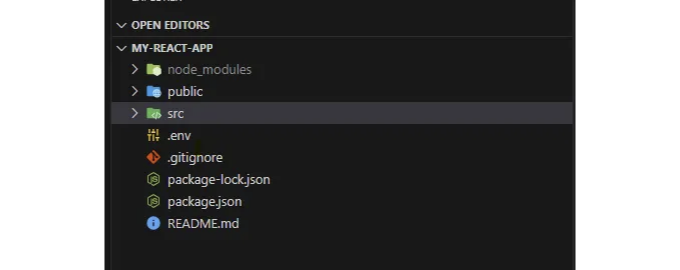

React.js 프로젝트에서 .env 파일은 주로 환경 변수를 저장하는 데 사용됩니다. 환경 변수는 API 키, 데이터베이스 연결 및 개발과 프로덕션 환경 간에 변경될 수 있는 기타 설정과 같이 응용 프로그램의 다양한 측면을 구성하는 데 사용됩니다. 이러한 값을 .env 파일에 보관함으로써, 여러 환경에 대한 구성을 쉽게 관리하고 민감한 정보를 안전하게 보호할 수 있습니다.

## React.js 프로젝트에서 .env 파일을 사용하는 방법

- .env 파일 생성: React 프로젝트의 루트 디렉토리에 .env 파일이름으로 파일을 생성합니다. 이 파일은 수동으로 생성하거나 명령줄 도구를 사용하여 생성할 수 있습니다.
- 환경 변수 정의: .env 파일에서 KEY=VALUE 구문을 사용하여 환경 변수를 정의할 수 있습니다.

<!-- ui-log 수평형 -->
<ins class="adsbygoogle"
  style="display:block"
  data-ad-client="ca-pub-4877378276818686"
  data-ad-slot="9743150776"
  data-ad-format="auto"
  data-full-width-responsive="true"></ins>
<component is="script">
(adsbygoogle = window.adsbygoogle || []).push({});
</component>

## 환경 변수 생성하기

```js
REACT_APP_API_KEY=your-api-key
REACT_APP_API_URL=https://api.example.com
```

React를 사용할 때는 환경 변수 이름을 REACT_APP_로 접두어를 붙이는 것이 중요합니다. 이렇게 함으로써 React가 이러한 변수에 액세스할 수 있도록 보장할 수 있습니다.

## 환경 변수 접근하기

<!-- ui-log 수평형 -->
<ins class="adsbygoogle"
  style="display:block"
  data-ad-client="ca-pub-4877378276818686"
  data-ad-slot="9743150776"
  data-ad-format="auto"
  data-full-width-responsive="true"></ins>
<component is="script">
(adsbygoogle = window.adsbygoogle || []).push({});
</component>

JavaScript 코드에서 process.env를 사용하여 이 환경 변수에 액세스할 수 있습니다.

```js
const apiKey = process.env.REACT_APP_API_KEY;
const apiUrl = process.env.REACT_APP_API_URL;

console.log(`API Key: ${apiKey}`);
console.log(`API URL: ${apiUrl}`);
```

환경 변수 로드: .env 파일에 정의된 환경 변수는 react-scripts를 사용하여 React 애플리케이션을 시작할 때 자동으로로드됩니다 (예: npm start 또는 yarn start). 코드에서 .env 파일을 수동으로 로드할 필요가 없습니다.

중요: .env 파일을 버전 관리 (예: Git)에 커밋해서는 안 됩니다. 민감한 정보를 보호하려면 .gitignore 파일에 포함시켜 실수로 커밋되지 않도록 해야 합니다.

<!-- ui-log 수평형 -->
<ins class="adsbygoogle"
  style="display:block"
  data-ad-client="ca-pub-4877378276818686"
  data-ad-slot="9743150776"
  data-ad-format="auto"
  data-full-width-responsive="true"></ins>
<component is="script">
(adsbygoogle = window.adsbygoogle || []).push({});
</component>

## .env 파일을 src 폴더 밖에 배치하세요.

