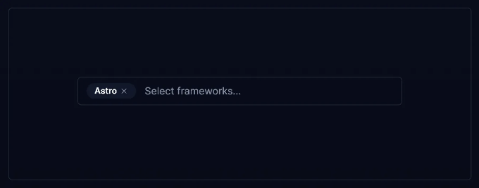
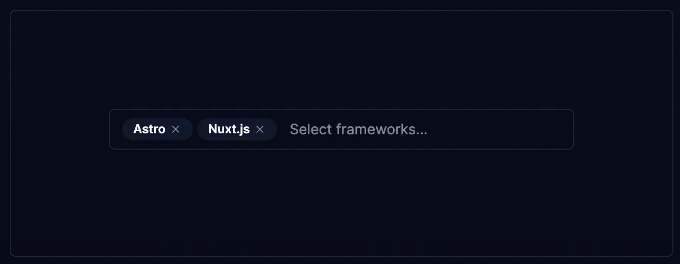
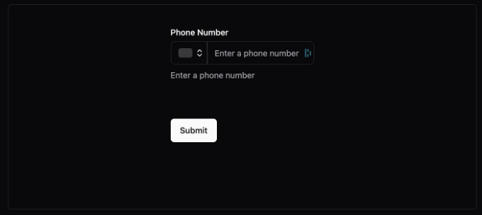

# 원래 게시물 이후 추가 내용:

2024년 02월 26일:

- shadcnui-expansions
- 팬시 멀티 셀렉트
- 팬시 상자
- 팬시 영역

2024년 02월 25일:

<!-- ui-log 수평형 -->
<ins class="adsbygoogle"
  style="display:block"
  data-ad-client="ca-pub-4877378276818686"
  data-ad-slot="9743150776"
  data-ad-format="auto"
  data-full-width-responsive="true"></ins>
<component is="script">
(adsbygoogle = window.adsbygoogle || []).push({});
</component>

- shadcn-keyboard-shortcuts
- image-upload

shadcn/ui는 사용하기 쉽고 깔끔한 UI 및 코드로 매우 인기가 있어졌어요.

shadcn/ui 프로젝트에서 사용할 수 있는 추가 컴포넌트/라이브러리가 종종 필요하니까, 시간이 지나면서 멋진 자원을 모았어요.

그래서 여기에 여러분의 프로젝트에서 사용할 수 있는 이러한 컴포넌트들의 목록이 있어요!

<!-- ui-log 수평형 -->
<ins class="adsbygoogle"
  style="display:block"
  data-ad-client="ca-pub-4877378276818686"
  data-ad-slot="9743150776"
  data-ad-format="auto"
  data-full-width-responsive="true"></ins>
<component is="script">
(adsbygoogle = window.adsbygoogle || []).push({});
</component>

만약 다른 유용한 자료를 찾으신다면 아래에 댓글을 남겨주세요. 그럼 제가 목록에 추가하겠습니다.

# shadcnui-expansions


shadcn/ui를 기반으로 만들어진 추가 컴포넌트 세트:

<!-- ui-log 수평형 -->
<ins class="adsbygoogle"
  style="display:block"
  data-ad-client="ca-pub-4877378276818686"
  data-ad-slot="9743150776"
  data-ad-format="auto"
  data-full-width-responsive="true"></ins>
<component is="script">
(adsbygoogle = window.adsbygoogle || []).push({});
</component>

- 자동 크기 조절 텍스트 에어리어
- 인용문
- 플로팅 라벨
- 입력
- 앵커가 있는 제목
- 무한 스크롤
- 로딩 버튼
- 다중 선택자

# 멋진 멀티 셀렉트



campsite.design과 cal.com의 설정 폼에서 영감을 받은 멀티 셀렉트 구성 요소입니다.

<!-- ui-log 수평형 -->
<ins class="adsbygoogle"
  style="display:block"
  data-ad-client="ca-pub-4877378276818686"
  data-ad-slot="9743150776"
  data-ad-format="auto"
  data-full-width-responsive="true"></ins>
<component is="script">
(adsbygoogle = window.adsbygoogle || []).push({});
</component>

# 멋진 상자


GitHub의 PR 라벨 선택기에서 영감을 받은 Combobox 컴포넌트.

# 멋진 영역

<!-- ui-log 수평형 -->
<ins class="adsbygoogle"
  style="display:block"
  data-ad-client="ca-pub-4877378276818686"
  data-ad-slot="9743150776"
  data-ad-format="auto"
  data-full-width-responsive="true"></ins>
<component is="script">
(adsbygoogle = window.adsbygoogle || []).push({});
</component>

```markdown


GitHub의 PR 코멘트 섹션에서 영감을 받은 Textarea 컴포넌트입니다.

# shadcn-keyboard-shortcuts


```

<!-- ui-log 수평형 -->
<ins class="adsbygoogle"
  style="display:block"
  data-ad-client="ca-pub-4877378276818686"
  data-ad-slot="9743150776"
  data-ad-format="auto"
  data-full-width-responsive="true"></ins>
<component is="script">
(adsbygoogle = window.adsbygoogle || []).push({});
</component>

표 태그를 Markdown 형식으로 변경하십시오.

https://stackblitz.com/edit/stackblitz-starters-dlsw2v

# 이미지 업로드


<!-- ui-log 수평형 -->
<ins class="adsbygoogle"
  style="display:block"
  data-ad-client="ca-pub-4877378276818686"
  data-ad-slot="9743150776"
  data-ad-format="auto"
  data-full-width-responsive="true"></ins>
<component is="script">
(adsbygoogle = window.adsbygoogle || []).push({});
</component>

드래그 앤 드롭, 다중 업로드 및 진행률 표시기가 포함된 이미지 업로드 컴포넌트입니다.

# 고급 데이터 테이블


많은 유용한 도우미와 서버 측 정렬, 필터링 및 페이지네이션 기능을 제공하는 데이터 테이블을 생성하기 위한 유틸리티 세트입니다.

<!-- ui-log 수평형 -->
<ins class="adsbygoogle"
  style="display:block"
  data-ad-client="ca-pub-4877378276818686"
  data-ad-slot="9743150776"
  data-ad-format="auto"
  data-full-width-responsive="true"></ins>
<component is="script">
(adsbygoogle = window.adsbygoogle || []).push({});
</component>

# 태그 입력


추가, 삭제, 제안 기능이 있는 완성형 태그 UI.

# Plate Rich Text Editor

<!-- ui-log 수평형 -->
<ins class="adsbygoogle"
  style="display:block"
  data-ad-client="ca-pub-4877378276818686"
  data-ad-slot="9743150776"
  data-ad-format="auto"
  data-full-width-responsive="true"></ins>
<component is="script">
(adsbygoogle = window.adsbygoogle || []).push({});
</component>

```markdown


릭텍스트 편집기. 아직 어리지만 관심을 가지고 지켜보세요.

# 그라데이션 선택기


```

<!-- ui-log 수평형 -->
<ins class="adsbygoogle"
  style="display:block"
  data-ad-client="ca-pub-4877378276818686"
  data-ad-slot="9743150776"
  data-ad-format="auto"
  data-full-width-responsive="true"></ins>
<component is="script">
(adsbygoogle = window.adsbygoogle || []).push({});
</component>

그라데이션 / 색상 / 배경 선택 도구

# AutoForm


zod 스키마에서 자동으로 양식을 생성합니다.

<!-- ui-log 수평형 -->
<ins class="adsbygoogle"
  style="display:block"
  data-ad-client="ca-pub-4877378276818686"
  data-ad-slot="9743150776"
  data-ad-format="auto"
  data-full-width-responsive="true"></ins>
<component is="script">
(adsbygoogle = window.adsbygoogle || []).push({});
</component>

# 크레덴자 모달


데스크톱 및 모바일용 반응형 모달 컴포넌트.

# 멋진 다중 선택

<!-- ui-log 수평형 -->
<ins class="adsbygoogle"
  style="display:block"
  data-ad-client="ca-pub-4877378276818686"
  data-ad-slot="9743150776"
  data-ad-format="auto"
  data-full-width-responsive="true"></ins>
<component is="script">
(adsbygoogle = window.adsbygoogle || []).push({});
</component>

```


다중 선택 컴포넌트입니다.

# 전화번호 입력


```

<!-- ui-log 수평형 -->
<ins class="adsbygoogle"
  style="display:block"
  data-ad-client="ca-pub-4877378276818686"
  data-ad-slot="9743150776"
  data-ad-format="auto"
  data-full-width-responsive="true"></ins>
<component is="script">
(adsbygoogle = window.adsbygoogle || []).push({});
</component>

전화번호 입력 컴포넌트입니다.

# 향상된 버튼


더 많은 변형이 있는 버튼 컴포넌트의 버전입니다.

<!-- ui-log 수평형 -->
<ins class="adsbygoogle"
  style="display:block"
  data-ad-client="ca-pub-4877378276818686"
  data-ad-slot="9743150776"
  data-ad-format="auto"
  data-full-width-responsive="true"></ins>
<component is="script">
(adsbygoogle = window.adsbygoogle || []).push({});
</component>

# 날짜 범위 선택기


Radix UI를 기반으로 한 날짜 범위 선택기입니다.

# 채팅

<!-- ui-log 수평형 -->
<ins class="adsbygoogle"
  style="display:block"
  data-ad-client="ca-pub-4877378276818686"
  data-ad-slot="9743150776"
  data-ad-format="auto"
  data-full-width-responsive="true"></ins>
<component is="script">
(adsbygoogle = window.adsbygoogle || []).push({});
</component>

```markdown


사용 준비된 채팅 UI입니다.

# 사용자 정의


```

<!-- ui-log 수평형 -->
<ins class="adsbygoogle"
  style="display:block"
  data-ad-client="ca-pub-4877378276818686"
  data-ad-slot="9743150776"
  data-ad-format="auto"
  data-full-width-responsive="true"></ins>
<component is="script">
(adsbygoogle = window.adsbygoogle || []).push({});
</component>

아주 재미있는 shadcn/ui 테마의 오픈소스 확장입니다.

# 멋진 shadcn/ui


shadcn/ui 컴포넌트와 예시들을 추가로 정리한 목록입니다.

<!-- ui-log 수평형 -->
<ins class="adsbygoogle"
  style="display:block"
  data-ad-client="ca-pub-4877378276818686"
  data-ad-slot="9743150776"
  data-ad-format="auto"
  data-full-width-responsive="true"></ins>
<component is="script">
(adsbygoogle = window.adsbygoogle || []).push({});
</component>

# Next.js 14 Admin 대시보드 스타터 템플릿


shadcn/ui를 사용한 준비된 Next.js admin 템플릿입니다.

# Veryfront 사전 제작 UI 컴포넌트

<!-- ui-log 수평형 -->
<ins class="adsbygoogle"
  style="display:block"
  data-ad-client="ca-pub-4877378276818686"
  data-ad-slot="9743150776"
  data-ad-format="auto"
  data-full-width-responsive="true"></ins>
<component is="script">
(adsbygoogle = window.adsbygoogle || []).push({});
</component>


복사하여 붙여 넣을 준비가 된 미리 만들어진 템플릿 목록입니다.

# 10000+ Themes for shadcn/ui


<!-- ui-log 수평형 -->
<ins class="adsbygoogle"
  style="display:block"
  data-ad-client="ca-pub-4877378276818686"
  data-ad-slot="9743150776"
  data-ad-format="auto"
  data-full-width-responsive="true"></ins>
<component is="script">
(adsbygoogle = window.adsbygoogle || []).push({});
</component>

다양한 색상 테마 조합이 있어요.

# shadcn Svelte


shadcn/ui의 Svelte 플레이버.

<!-- ui-log 수평형 -->
<ins class="adsbygoogle"
  style="display:block"
  data-ad-client="ca-pub-4877378276818686"
  data-ad-slot="9743150776"
  data-ad-format="auto"
  data-full-width-responsive="true"></ins>
<component is="script">
(adsbygoogle = window.adsbygoogle || []).push({});
</component>

# shadcn Vue


Vue flavor of shadcn/ui.

# React native reusables

<!-- ui-log 수평형 -->
<ins class="adsbygoogle"
  style="display:block"
  data-ad-client="ca-pub-4877378276818686"
  data-ad-slot="9743150776"
  data-ad-format="auto"
  data-full-width-responsive="true"></ins>
<component is="script">
(adsbygoogle = window.adsbygoogle || []).push({});
</component>

```markdown


shadcn/ui에서 영감을 받은 매우 좋은 React Native UI 라이브러리입니다.

# React Native: nativecn-ui


```

<!-- ui-log 수평형 -->
<ins class="adsbygoogle"
  style="display:block"
  data-ad-client="ca-pub-4877378276818686"
  data-ad-slot="9743150776"
  data-ad-format="auto"
  data-full-width-responsive="true"></ins>
<component is="script">
(adsbygoogle = window.adsbygoogle || []).push({});
</component>

shadcn/ui의 또 다른 React Native 구현입니다.

# Remix + Vite + shadcn/ui


shadcn/ui를 사용한 준비된 Remix 템플릿입니다.

<!-- ui-log 수평형 -->
<ins class="adsbygoogle"
  style="display:block"
  data-ad-client="ca-pub-4877378276818686"
  data-ad-slot="9743150776"
  data-ad-format="auto"
  data-full-width-responsive="true"></ins>
<component is="script">
(adsbygoogle = window.adsbygoogle || []).push({});
</component>

# 피그마 디자인 시스템


이 Figma 파일은 @shadcn의 놀라운 새 UI 시스템에 대한 디자인 동반자입니다.

여기에는 최신 구성 요소와 다크 모드가 있는 다른 구현도 있습니다:

<!-- ui-log 수평형 -->
<ins class="adsbygoogle"
  style="display:block"
  data-ad-client="ca-pub-4877378276818686"
  data-ad-slot="9743150776"
  data-ad-format="auto"
  data-full-width-responsive="true"></ins>
<component is="script">
(adsbygoogle = window.adsbygoogle || []).push({});
</component>

# VSCode 확장 프로그램


터미널 없이 구성 요소를 설치하는 VSCode 확장 프로그램.

# VSCode UI 스니펫 확장 프로그램

<!-- ui-log 수평형 -->
<ins class="adsbygoogle"
  style="display:block"
  data-ad-client="ca-pub-4877378276818686"
  data-ad-slot="9743150776"
  data-ad-format="auto"
  data-full-width-responsive="true"></ins>
<component is="script">
(adsbygoogle = window.adsbygoogle || []).push({});
</component>


미리 제작된 JSX 및 import를 쉽게 삽입할 수 있는 코드 조각들이 있습니다.

다른 유용한 자료를 찾으셨다면 아래 댓글로 남겨주세요!