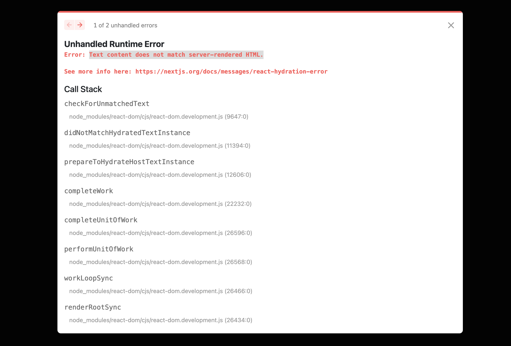

# Nextjs + Zustand, "Text content does not match server-rendered HTML." 에러 해결 방법 (React Hydration Error)

:::tip 목표
Nextjs와 Zustand를 같이 사용할 때 아래와 같은 에러가 발생할 때 해결할 수 있습니다.
"Text content does not match server-rendered HTML."
:::



<component is="script" src="https://pagead2.googlesyndication.com/pagead/js/adsbygoogle.js?client=ca-pub-4877378276818686" crossorigin="anonymous" async></component>

<!-- ui-log 수평형 -->

<ins class="adsbygoogle"
     style="display:block"
     data-ad-client="ca-pub-4877378276818686"
     data-ad-slot="9743150776"
     data-ad-format="auto"
     data-full-width-responsive="true"></ins>
<component is="script">
(adsbygoogle = window.adsbygoogle || []).push({});
</component>

## 1. Persist 제거

기본적으로 zustand로 store를 만든다면 아래와 같이 만들 수 있는데요.

```tsx
import React from "react";
import create from "zustand";

import { devtools, persist } from "zustand/middleware";

interface CountState {
  count: number;
  increase: (by?: number) => void;
  decrease: (by?: number) => void;
}

const useCountStore = create<CountState>()(
  devtools(
    persist(
      (set) => ({
        count: 0,
        increase: (by) => set((state) => ({ count: state.count + 1 })),
        decrease: (by) => set((state) => ({ count: state.count - 1 })),
      }),
      {
        name: "bear-storage",
      }
    )
  )
);

export default useCountStore;
```

위 코드에서 persist를 제거해주면 "Text content does not match server-rendered HTML." 에러가 더이상 발생하지 않는 것을 보실 수 있습니다.

<component is="script" src="https://pagead2.googlesyndication.com/pagead/js/adsbygoogle.js?client=ca-pub-4877378276818686" crossorigin="anonymous" async></component>

<!-- ui-log 수평형 -->

<ins class="adsbygoogle"
     style="display:block"
     data-ad-client="ca-pub-4877378276818686"
     data-ad-slot="9743150776"
     data-ad-format="auto"
     data-full-width-responsive="true"></ins>
<component is="script">
(adsbygoogle = window.adsbygoogle || []).push({});
</component>

```tsx
import React from "react";
import create from "zustand";

import { devtools, persist } from "zustand/middleware";

interface CountState {
  count: number;
  increase: (by?: number) => void;
  decrease: (by?: number) => void;
}

const useCountStore = create<CountState>()(
  devtools(
      (set) => ({
        count: 0,
        increase: (by) => set((state) => ({ count: state.count + 1 })),
        decrease: (by) => set((state) => ({ count: state.count - 1 })),
      })
    )
  )
);

export default useCountStore;

```

## 2. Persist name 변경

persist에 대해서 더 깊게 공부해보지는 않았지만,
persist의 name을 변경해주는 것 만으로도 React Hydration Error 에러가 발생하지 않았는데요.

이 부분에 대한 이유는 Zustand를 더 공부해서 추가하도록 하겠습니다.

```tsx
import React from "react";
import create from "zustand";

import { devtools, persist } from "zustand/middleware";

interface CountState {
  count: number;
  increase: (by?: number) => void;
  decrease: (by?: number) => void;
}

const useCountStore = create<CountState>()(
  devtools(
    persist(
      (set) => ({
        count: 0,
        increase: (by) => set((state) => ({ count: state.count + 1 })),
        decrease: (by) => set((state) => ({ count: state.count - 1 })),
      }),
      {
        name: "test",
      }
    )
  )
);

export default useCountStore;
```
