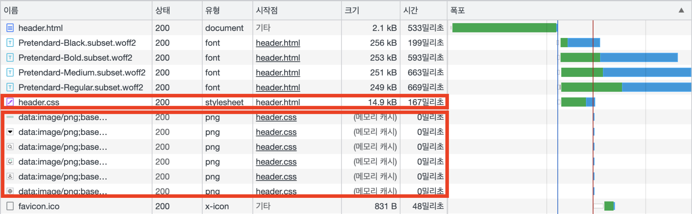
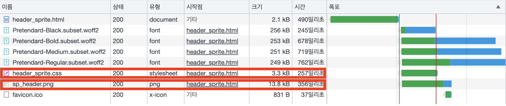

# React에서 Data URL과 sprite 이미지 성능 비교

개발을 할 때 sprite이미지를 사용할지 각각의 png로 된 이미지를 사용할지에 대해서 고민일 수 있는데요.
이번 글에서는 React 환경에서 sprite이미지를 사용했을 경우와 각각의 png를 사용했을 경우에 대해서 비교해보도록 하겠습니다.

CRA(Create React App) 기반으로 생성된 프로젝트는 서버 요청 횟수를 줄이기 위해 10,000 bytes 미만의 이미지(bmp, gif, jpg, jpeg, png 등, svg 는 제외됩니다)는 Data URL 로 변환됩니다. Sprite 와 비교했을 때, 어떤 특징이 있는지 알아보겠습니다.

## Data URL 이란

"데이터 URL"은 Uniform Resource Locator(일반적으로 URL로 알려짐)의 한 유형입니다. 데이터 URL은 일반적인 웹 페이지나 문서의 URL과는 조금 다르게 작동합니다. 일반적인 URL은 일반적으로 웹 페이지, 이미지, 동영상 등과 같은 외부 리소스에 대한 위치를 지정합니다. 그러나 데이터 URL은 리소스 자체를 포함합니다.

데이터 URL은 특정 데이터를 포함하는 URL입니다. 이것은 **텍스트, 이미지, 오디오, 비디오** 또는 기타 형식의 데이터가 될 수 있습니다. 데이터 URL은 보통 웹 페이지나 스크립트에서 작은 데이터 조각을 인라인으로 포함해야 할 때 유용합니다. 예를 들어, HTML 페이지에서 이미지나 CSS 스타일을 인라인으로 포함할 때 사용될 수 있습니다.

데이터 URL은 "data:"라는 프로토콜로 시작하며, 그 뒤에는 데이터의 형식과 인코딩 방식이 옵션으로 나타납니다. 일반적으로 다음과 같은 형식을 갖습니다.

```bash
data:[<mediatype>][;base64],`<data>`
```

- `<mediatype>` : 데이터의 MIME 타입을 나타냅니다. 이것은 텍스트, 이미지, 오디오 등과 같은 데이터의 유형을 지정합니다.
- `;base64` : 데이터가 Base64로 인코딩되었음을 나타냅니다. 이 부분은 필수는 아니지만, 데이터가 텍스트가 아닌 경우에는 종종 사용됩니다.
- `<data>` : 실제 데이터입니다.

<!-- ui-log 수평형 -->

<ins class="adsbygoogle"
     style="display:block"
     data-ad-client="ca-pub-4877378276818686"
     data-ad-slot="9743150776"
     data-ad-format="auto"
     data-full-width-responsive="true"></ins>
<component is="script">
(adsbygoogle = window.adsbygoogle || []).push({});
</component>

## 스프라이트 이미지

스프라이트 이미지는 여러 개의 작은 이미지를 하나의 이미지 파일로 결합한 것입니다. 웹 개발에서 주로 사용되며, 여러 이미지를 로드하는 대신 하나의 스프라이트 이미지를 사용하여 **웹 페이지의 성능을 향상**시킬 수 있습니다.

스프라이트 이미지를 사용하면 웹 페이지의 로딩 시간을 줄일 수 있습니다. **여러 이미지를 다운로드하는 대신 단일 이미지 파일을 다운로드하기 때문에 HTTP 요청의 수를 줄여주기 때문**인데요. 또한, 브라우저가 이미지를 로드하는 데 필요한 시간이 절약되므로 웹 페이지의 로딩 속도가 향상될 수 있습니다.

스프라이트 이미지를 사용하는 경우 몇 가지 장단점이 있습니다.

### 장점

1. HTTP 요청 수를 줄여 성능을 향상시킵니다.
2. 이미지 파일의 압축률을 높여 파일 크기를 줄일 수 있습니다.
3. 웹 페이지의 로딩 시간을 단축하여 사용자 경험을 향상시킬 수 있습니다.

### 단점

1. 이미지를 수정할 때 모든 이미지를 수정해야 하므로 유지보수가 어려울 수 있습니다.
2. 이미지를 동적으로 로드하는 경우 캐싱을 사용하기 어려울 수 있습니다.
3. CSS 코드가 복잡해지고 가독성이 떨어질 수 있습니다.
4. 스프라이트 이미지는 웹 개발에서 효율적으로 사용되는 기술 중 하나이며, 성능 최적화에 유용한 도구입니다.

## Data URL 특징

`img` 태그의 `src` 나 CSS `background` 속성에 활용될 수 있습니다.

Data URL 사용 예시

```html
<div style="background-image:url(data:image/png;base64,iVBORw0KGgoAAAANSUhEUgAAAEwAAABM...)"></div>

```

Data URL 은 이름 처럼 URL 자체가 이미지 파일의 DATA를 의미합니다. 보통 img 태그의 src 나 CSS background-url 속성에서 저장해둔 이미지(.png) 경로를 넣는 것과 다르게 Data URL 만으로 이미지를 나타냅니다.

사용하는 이미지 파일의 크기가 커질수록 `<data>` 영역이 길어집니다.

base64 로 인코딩함으로써 **기존 데이터의 용량보다 30% 증가합니다.**

## Data URL, Sprite 직접 비교해보기

각각 Data URL, Sprite 를 활용해 마크업 예제를 만들어 Chrome 개발자 도구의 네트워크 툴로 서버에 요청되는 리소스를 비교해 보겠습니다.

<!-- ui-log 수평형 -->

<ins class="adsbygoogle"
     style="display:block"
     data-ad-client="ca-pub-4877378276818686"
     data-ad-slot="9743150776"
     data-ad-format="auto"
     data-full-width-responsive="true"></ins>
<component is="script">
(adsbygoogle = window.adsbygoogle || []).push({});
</component>

Data URL을 활용한 마크업 페이지


Sprite를 활용한 마크업 페이지


Data URL 예제의 경우 **CSS 파일의 크기가 14.9kB 로 Sprite 예제의 3.3kB 보다 매우 큰 크기**를 가진 것을 확인할 수 있습니다. 그 이유는 이미지 파일이 Data URL 의 형태로 CSS 파일에 포함되었기 때문입니다. 대신 Sprite 예제에선 13.8kB 의 Sprite 이미지 리소스를 따로 다운로드한 것을 확인할 수 있습니다.

Data URL 이미지는 CSS 파일에 포함되어 CSS 파일과 함께 다운로드되어 별도의 리소스 요청이 없으며, 이미지가 요청되면 메모리 캐시의 형태로 빠르게 불려오게 됩니다.

Sprite 를 사용하는 가장 큰 이유는 여러 이미지 파일을 하나로 합쳐 리소스 요청을 줄이기 위함인데, Data URL 은 이미지가 CSS 파일에 포함되어 여러 이미지 파일에 대한 리소스 요청이 일어나지 않기 때문에 Sprite 와 비슷한 성능 개선 효과를 가진다고 볼 수 있습니다.

<!-- ui-log 수평형 -->

<ins class="adsbygoogle"
     style="display:block"
     data-ad-client="ca-pub-4877378276818686"
     data-ad-slot="9743150776"
     data-ad-format="auto"
     data-full-width-responsive="true"></ins>
<component is="script">
(adsbygoogle = window.adsbygoogle || []).push({});
</component>

## 주의사항

Data URL 은 `background-image` 로 이미지의 경로가 아닌 파일 자체를 CSS 코드에 삽입하므로, 같은 아이콘이 여러 번 사용될 경우 코드가 중복되어 CSS 의 크기가 더욱 커지게 됩니다.

```css
.banner_badge {
  background-image: url(data:image/png;base64,iVBORw0KGgoAAAANSUhEUgAAAEwAAABM...);
}

.post_badge {
  background-image: url(data:image/png;base64,iVBORw0KGgoAAAANSUhEUgAAAEwAAABM...);
}
```

같은 이미지의 Data URL 중복 사용으로 CSS 파일의 크기가 커지는 것을 막기 위해 동일 이미지의 경우 한 번에 묶어서 사용하는 것이 좋습니다.

```css
.banner_badge,
.post_badge {
  background-image: url(data:image/png;base64,iVBORw0KGgoAAAANSUhEUgAAAEwAAABM...);
}
```
