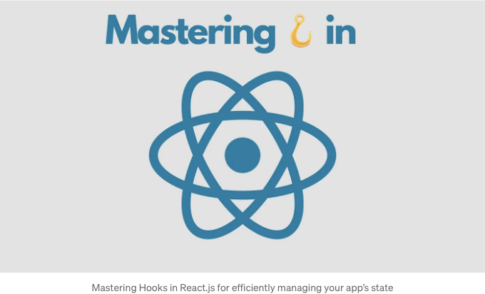

# 리액트 훅 이란? 리액트 커스텀 훅 사용 방법



React.js 개발에서, 훅은 함수형 컴포넌트 내에서 상태, 사이드 이펙트, 그리고 기타 기능들을 관리하기 위한 강력한 도구로 부상했습니다. 훅을 사용하면 재사용 가능한 로직을 캡슐화하고 컴포넌트를 보다 직관적이고 유연하게 조합할 수 있습니다.
오늘은 리액트 훅의 사용법, 장점, 그리고 유지보수가 용이한 애플리케이션을 구축할 수 있는 방법에 대해 알아보겠습니다.

# 리액트 훅 이해하기

훅은 함수형 컴포넌트가 리액트의 상태와 라이프사이클 메소드와 같은 기능을 사용할 수 있게 해주는 함수입니다.
훅은 16.8 버전에서 도입되었으며 클래스 컴포넌트를 사용하지 않고 함수형 컴포넌트에서 상태 로직을 작성할 수 있도록 합니다. 리액트는 useState, useEffect, useContext, useRef와 같은 몇 가지 내장 훅을 제공하며 사용자 정의 훅을 생성할 수도 있습니다.

## 주요 내장 훅:

- useState: 함수형 컴포넌트 내에서 상태를 관리합니다.
- useEffect: 함수형 컴포넌트 내에서 사이드 이펙트를 수행합니다.
- useContext: 함수형 컴포넌트 내에서 컨텍스트에 접근합니다.
- useReducer: 리듀서를 사용하여 복잡한 상태 로직을 관리합니다.
- useCallback: 불필요한 다시 렌더링을 방지하기 위해 함수를 메모이제이션합니다.
- useMemo: 성능을 최적화하기 위해 비싼 계산을 메모이제이션합니다.
- useRef: 렌더링 간에 지속되는 변경 가능한 참조를 생성합니다.

<!-- ui-log 수평형 -->

<ins class="adsbygoogle"
     style="display:block"
     data-ad-client="ca-pub-4877378276818686"
     data-ad-slot="9743150776"
     data-ad-format="auto"
     data-full-width-responsive="true"></ins>
<component is="script">
(adsbygoogle = window.adsbygoogle || []).push({});
</component>

# 리액트 훅의 예시

리액트 훅을 사용하여 함수형 컴포넌트에 기능을 추가하는 몇 가지 예시를 살펴보겠습니다:

- useState:

- useState는 함수형 컴포넌트에서 상태 변수를 가질 수 있게 합니다.
- 문법: const [state, setState] = useState(initialState);
- useState 훅을 사용하여 함수형 컴포넌트에서 상태를 관리할 수 있습니다. 이 예시에서는 초기 값이 0인 상태 변수 count와 해당 값을 업데이트하는 함수 setCount를 초기화합니다. 버튼을 클릭하면 count가 증가합니다.
- 예시:

```js
import React, { useState } from "react";

const Counter = () => {
  const [count, setCount] = useState(0);

  return (
    <div>
      <p>Count: {count}</p>
      <button onClick={() => setCount(count + 1)}>증가</button>
    </div>
  );
};
```

<!-- ui-log 수평형 -->

<ins class="adsbygoogle"
     style="display:block"
     data-ad-client="ca-pub-4877378276818686"
     data-ad-slot="9743150776"
     data-ad-format="auto"
     data-full-width-responsive="true"></ins>
<component is="script">
(adsbygoogle = window.adsbygoogle || []).push({});
</component>

2. useEffect:

- useEffect는 함수형 컴포넌트에서 사이드 이펙트를 수행하기 위해 사용됩니다. 예를 들어 데이터 가져오기, 구독, 또는 수동으로 DOM을 변경하는 작업입니다.
- 문법: useEffect(() => { /_ 효과 코드 _/ }, [의존성]);
- useEffect 훅은 함수형 컴포넌트에서 사이드 이펙트를 수행하기 위해 사용됩니다. 이 예시에서는 effect 내부에서 setInterval을 사용하여 매 초마다 증가하는 타이머를 생성합니다. 컴포넌트가 언마운트될 때 인터벌을 지우는 클린업 함수를 반환합니다.
- 예시:

```js
import React, { useState, useEffect } from "react";

const Timer = () => {
  const [seconds, setSeconds] = useState(0);

  useEffect(() => {
    const intervalId = setInterval(() => {
      setSeconds(seconds + 1);
    }, 1000);

    return () => clearInterval(intervalId);
  }, [seconds]);

  return <p>타이머: {seconds} 초</p>;
};
```

3. useContext:

- useContext는 중첩을 도입하지 않고 리액트 컨텍스트를 구독하기 위해 사용됩니다.
- 문법: const value = useContext(MyContext);
- useContext 훅을 사용하여 함수형 컴포넌트에서 컨텍스트를 소비할 수 있습니다. 이 예시에서는 테마에 대한 컨텍스트를 생성하고 현재 테마 값을 액세스하기 위해 useContext를 사용합니다.
- 예시:

```js
import React, { useContext } from "react";

const ThemeContext = React.createContext("light");

const ThemeToggle = () => {
  const theme = useContext(ThemeContext);

  return <button>{theme === "light" ? "다크로 변경" : "라이트로 변경"}</button>;
};
```

<!-- ui-log 수평형 -->

<ins class="adsbygoogle"
     style="display:block"
     data-ad-client="ca-pub-4877378276818686"
     data-ad-slot="9743150776"
     data-ad-format="auto"
     data-full-width-responsive="true"></ins>
<component is="script">
(adsbygoogle = window.adsbygoogle || []).push({});
</component>

4. useReducer:

- useReducer는 더 복잡한 상태 로직을 관리하기 위해 사용됩니다. 다음 상태가 이전 상태에 따라 달라질 때 useState보다 선호됩니다.
- 문법: const [state, dispatch] = useReducer(reducer, initialState);
- useReducer 훅은 복잡한 상태 로직을 관리하기 위한

useState의 대안입니다. 이 예시에서는 리듀서 함수를 사용하여 증가 및 감소하는 카운터를 생성합니다.

- 예시:

```js
import React, { useReducer } from "react";

const initialState = { count: 0 };

const reducer = (state, action) => {
  switch (action.type) {
    case "increment":
      return { count: state.count + 1 };
    case "decrement":
      return { count: state.count - 1 };
    default:
      return state;
  }
};

const Counter = () => {
  const [state, dispatch] = useReducer(reducer, initialState);

  return (
    <div>
      <p>Count: {state.count}</p>
      <button onClick={() => dispatch({ type: "increment" })}>증가</button>
      <button onClick={() => dispatch({ type: "decrement" })}>감소</button>
    </div>
  );
};
```

5. useMemo:

- useMemo 훅은 비용이 많이 드는 계산을 메모이제이션하여 매 렌더링마다 다시 실행되지 않도록합니다. 이 예시에서는 valueA 및 valueB의 변경 내용에 따라 computeExpensiveValue의 결과를 메모이제이션합니다.
- 예시:

```js
import React, { useState, useMemo } from "react";

const ExpensiveComponent = () => {
  // 이것은 비용이 많이 드는 계산이라고 가정합니다.
  const computeExpensiveValue = (a, b) => {
    return a * b;
  };

  const [valueA, setValueA] = useState(1);
  const [valueB, setValueB] = useState(1);

  const result = useMemo(() => computeExpensiveValue(valueA, valueB), [valueA, valueB]);

  return (
    <div>
      <p>결과: {result}</p>
      <button onClick={() => setValueA(valueA + 1)}>A 증가</button>
      <button onClick={() => setValueB(valueB + 1)}>B 증가</button>
    </div>
  );
};
```

<!-- ui-log 수평형 -->

<ins class="adsbygoogle"
     style="display:block"
     data-ad-client="ca-pub-4877378276818686"
     data-ad-slot="9743150776"
     data-ad-format="auto"
     data-full-width-responsive="true"></ins>
<component is="script">
(adsbygoogle = window.adsbygoogle || []).push({});
</component>

6. useCallback:

- useCallback은 콜백 함수를 메모이제이션합니다.
- useCallback 훅은 함수를 메모이제이션하여 매 렌더링마다 재생성되지 않도록합니다. 이 예시에서는 렌더링을 방지하기 위해 increment 함수를 메모이제이션합니다.
- 예시:

```js
import React, { useState, useCallback } from "react";

const Counter = () => {
  const [count, setCount] = useState(0);

  const increment = useCallback(() => {
    setCount(count + 1);
  }, [count]);

  return (
    <div>
      <p>Count: {count}</p>
      <button onClick={increment}>증가</button>
    </div>
  );
};
```

7. useRef:

- useRef 훅은 렌더링 간에 지속되는 변경 가능한 참조를 생성합니다. 이 예시에서는 버튼을 클릭하면 입력 요소에 포커스를 맞춥니다.
- 예시:

```js
import React, { useRef } from "react";

const TextInput = () => {
  const inputRef = useRef();

  const focusInput = () => {
    inputRef.current.focus();
  };

  return (
    <div>
      <input ref={inputRef} type="text" />
      <button onClick={focusInput}>입력에 포커스</button>
    </div>
  );
};
```

<!-- ui-log 수평형 -->

<ins class="adsbygoogle"
     style="display:block"
     data-ad-client="ca-pub-4877378276818686"
     data-ad-slot="9743150776"
     data-ad-format="auto"
     data-full-width-responsive="true"></ins>
<component is="script">
(adsbygoogle = window.adsbygoogle || []).push({});
</component>

이러한 예시들은 모든 내장 리액트 훅의 사용법을 보여주며, 함수형 컴포넌트에 상태, 컨텍스트, 이펙트 등을 포함하여 더욱 다양하고 유용하게 활용할 수 있음을 보여줍니다.

사용자 정의 훅도 만들어서 컴포넌트 간에 로직을 캡슐화하고 재사용할 수 있습니다. 훅은 함수형 컴포넌트에서 상태와 사이드 이펙트를 관리하는 강력한 도구로서, 리액트 애플리케이션을 더 간단하고 일관되게 구축할 수 있는 방법을 제공합니다.

# 몇 가지 사용자 정의 리액트 훅 예시

- 데이터 가져오기용 사용자 정의 훅:

- 이 사용자 정의 훅(useFetch)은 Fetch API를 사용하여 URL에서 데이터를 가져옵니다. 데이터, 로딩 상태 및 오류 상태를 반환하며, 비동기적으로 데이터를 가져올 때 로딩 및 오류 상태를 처리합니다.
- 예시:

```js
import { useState, useEffect } from "react";

const useFetch = (url) => {
  const [data, setData] = useState(null);
  const [loading, setLoading] = useState(true);
  const [error, setError] = useState(null);

  useEffect(() => {
    const fetchData = async () => {
      try {
        const response = await fetch(url);
        if (!response.ok) {
          throw new Error("네트워크 응답이 정상적이지 않습니다");
        }
        const result = await response.json();
        setData(result);
        setLoading(false);
      } catch (error) {
        setError(error);
        setLoading(false);
      }
    };

    fetchData();
  }, [url]);

  return { data, loading, error };
};

// 사용법
const ComponentUsingFetch = () => {
  const { data, loading, error } = useFetch("https://api.example.com/data");

  if (loading) return <div>로딩 중...</div>;
  if (error) return <div>에러: {error.message}</div>;

  return (
    <div>
      {data && (
        <ul>
          {data.map((item) => (
            <li key={item.id}>{item.name}</li>
          ))}
        </ul>
      )}
    </div>
  );
};
```

<!-- ui-log 수평형 -->

<ins class="adsbygoogle"
     style="display:block"
     data-ad-client="ca-pub-4877378276818686"
     data-ad-slot="9743150776"
     data-ad-format="auto"
     data-full-width-responsive="true"></ins>
<component is="script">
(adsbygoogle = window.adsbygoogle || []).push({});
</component>

2. 입력 디바운싱을 위한 사용자 정의 훅:

- 이 사용자 정의 훅(useDebounce)은 값이 마지막으로 변경된 이후 지정된 시간이 경과할 때까지 값을 업데이트하지 않습니다. 검색 쿼리

와 같은 사용자 입력을 처리할 때 연속적인 요청을 방지하기 위해 유용합니다.

- 예시:

```js
import { useState, useEffect } from "react";

const useDebounce = (value, delay) => {
  const [debouncedValue, setDebouncedValue] = useState(value);

  useEffect(() => {
    const handler = setTimeout(() => {
      setDebouncedValue(value);
    }, delay);

    return () => {
      clearTimeout(handler);
    };
  }, [value, delay]);

  return debouncedValue;
};

// 사용법
const ComponentWithDebounce = () => {
  const [searchTerm, setSearchTerm] = useState("");
  const debouncedSearchTerm = useDebounce(searchTerm, 500);

  useEffect(() => {
    // debouncedSearchTerm으로 API 호출
  }, [debouncedSearchTerm]);

  return <input type="text" value={searchTerm} onChange={(e) => setSearchTerm(e.target.value)} placeholder="검색..." />;
};
```

<!-- ui-log 수평형 -->

<ins class="adsbygoogle"
     style="display:block"
     data-ad-client="ca-pub-4877378276818686"
     data-ad-slot="9743150776"
     data-ad-format="auto"
     data-full-width-responsive="true"></ins>
<component is="script">
(adsbygoogle = window.adsbygoogle || []).push({});
</component>

# 훅 사용의 장점

- 간소화된 로직: 훅은 함수형 컴포넌트 내에서 로직을 더 깔끔하고 간결하게 만들어줍니다.
- 코드 재사용성: 사용자 정의 훅은 복잡한 로직을 독립적인 함수로 추상화하여 여러 컴포넌트에서 재사용할 수 있도록 돕습니다.
- 성능 향상: useCallback과 useMemo를 사용한 메모이제이션은 불필요한 다시 렌더링과 비용이 많이 드는 계산을 방지하여 성능을 최적화합니다.
- 상태 관리의 용이성: useState 및 useReducer 훅은 클래스 컴포넌트 없이도 함수형 컴포넌트에서 상태 관리를 간편하게 합니다.
