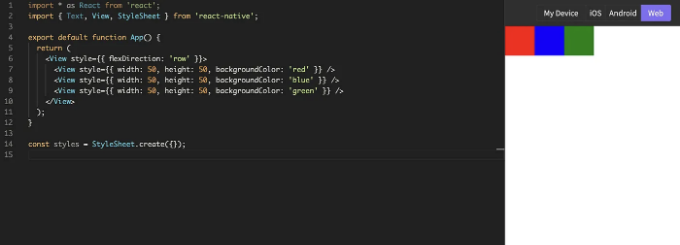
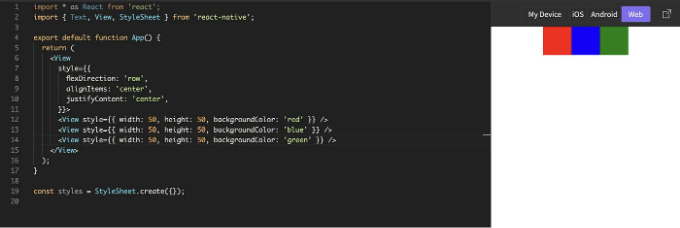
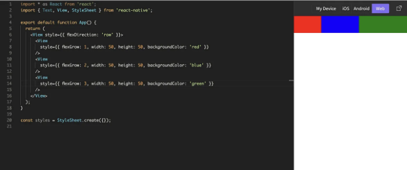
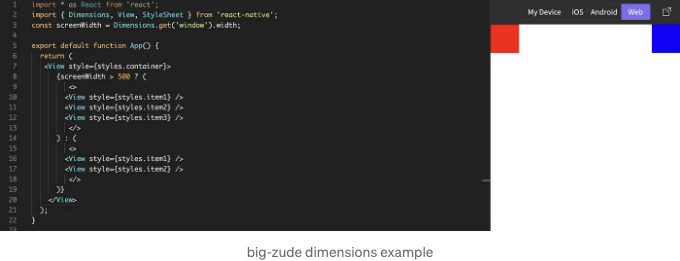
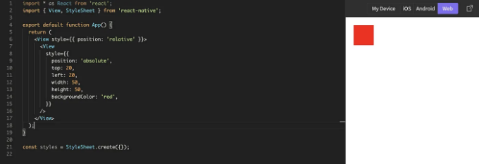
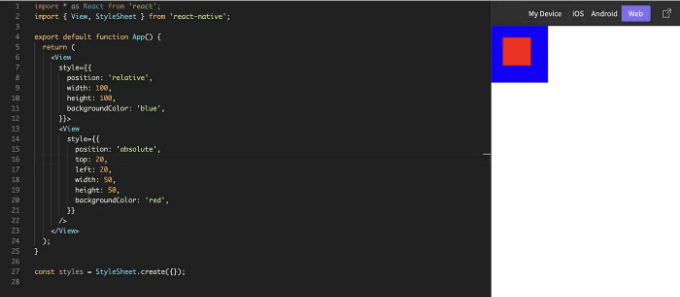
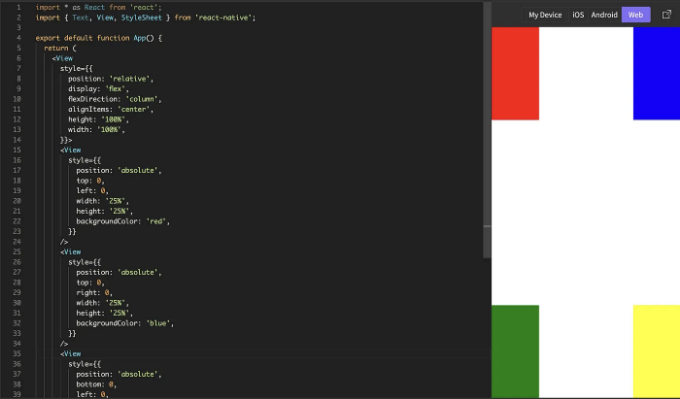

# React Native로 레이아웃 디자인하기: 고급 기술 소개


<!-- ui-log 수평형 -->

<ins class="adsbygoogle"
     style="display:block"
     data-ad-client="ca-pub-4877378276818686"
     data-ad-slot="9743150776"
     data-ad-format="auto"
     data-full-width-responsive="true"></ins>
<component is="script">
(adsbygoogle = window.adsbygoogle || []).push({});
</component>

# 소개

React Native에서는 플렉스박스(flexbox)와 절대위치 지정(absolute positioning)을 포함한 다양한 레이아웃 옵션이 있습니다. 이 글에서는 React Native에서 고급 레이아웃 기술 옵션을 살펴보고 사용자 친화적인 앱을 만들어보겠습니다.
시니어 개발자이든 초보자이든, 이러한 기술들은 여러분의 레이아웃 스킬을 한 단계 더 나아가게 도와줄 것입니다.

# 레이아웃에 플렉스박스 사용하기

플렉스박스는 컨테이너 내에서 요소들을 배열하는 강력한 레이아웃 도구입니다. 부모 요소를 플렉스 컨테이너로 설정한 다음 그 안에 있는 자식 요소들의 레이아웃을 플렉스 아이템으로 정의하는 방식으로 작동합니다. 컨테이너의 기본 플렉스-방향을 설정하려면 flex-direction 스타일 속성을 사용할 수 있습니다. 이 속성은 'row', 'column', 'row-reverse', 또는 'column-reverse'로 설정할 수 있습니다. 예를 들어, 모바일의 기본 flex-direction은 'column'으로 설정됩니다. 아래 예시를 살펴봅시다:

```js
<View style={{ flexDirection: "row" }}>
  <View style={{ width: 50, height: 50, backgroundColor: "red" }} />
  <View style={{ width: 50, height: 50, backgroundColor: "blue" }} />
  <View style={{ width: 50, height: 50, backgroundColor: "green" }} />
</View>
```

<!-- ui-log 수평형 -->

<ins class="adsbygoogle"
     style="display:block"
     data-ad-client="ca-pub-4877378276818686"
     data-ad-slot="9743150776"
     data-ad-format="auto"
     data-full-width-responsive="true"></ins>
<component is="script">
(adsbygoogle = window.adsbygoogle || []).push({});
</component>



이렇게 하면 왼쪽에 빨간색 요소, 가운데에 파란색 요소, 오른쪽에 초록색 요소가 있는 세 개의 요소로 이루어진 행이 생성됩니다.

요소를 정렬하기 위해 alignItems와 justifyContent 스타일 속성을 사용할 수 있습니다. justifyContent는 주축을 따라 항목들의 정렬을 조절하고, alignItems는 교차축을 따라 항목들의 정렬을 조절합니다. 이러한 속성은 'flex-start', 'flex-end', 'center', 'stretch', 또는 'space-between'으로 설정할 수 있습니다.

<!-- ui-log 수평형 -->

<ins class="adsbygoogle"
     style="display:block"
     data-ad-client="ca-pub-4877378276818686"
     data-ad-slot="9743150776"
     data-ad-format="auto"
     data-full-width-responsive="true"></ins>
<component is="script">
(adsbygoogle = window.adsbygoogle || []).push({});
</component>

예를 들어, 이전 예제의 플렉스 컨테이너에서 요소들을 가운데 정렬하려면:

```js
<View style={{ flexDirection: "row", alignItems: "center", justifyContent: "center" }}>
  <View style={{ width: 50, height: 50, backgroundColor: "red" }} />
  <View style={{ width: 50, height: 50, backgroundColor: "blue" }} />
  <View style={{ width: 50, height: 50, backgroundColor: "green" }} />
</View>
```



조금의 연습을 통해 플렉스박스를 능숙하게 사용할 수 있을 것입니다!

# 고급 플렉스박스 기술

플렉스박스를 사용하는 기본적인 방법을 익힌 후에는 React Native에서 제공하는 보다 복잡한 방법들을 살펴볼 수 있습니다.

flexGrow와 flexShrink 스타일 속성을 사용하여 한 가지 방법으로 더 큰 유연한 객체를 다른 것들과 어떻게 크기를 조절할지 관리할 수 있습니다.

flexGrow 속성을 사용하면 컨테이너 내의 다른 항목들과 비교하여 플렉스 항목이 얼마나 큰지를 관리할 수 있습니다. 이 속성에는 증가량을 나타내는 양수의 숫자를 사용할 수 있으며, 숫자가 클수록 증가량이 더 많아집니다. 아래 예시를 살펴보세요:

```js
<View style={{ flexDirection: "row" }}>
  <View style={{ flexGrow: 1, width: 50, height: 50, backgroundColor: "red" }} />
  <View style={{ flexGrow: 2, width: 50, height: 50, backgroundColor: "blue" }} />
  <View style={{ flexGrow: 3, width: 50, height: 50, backgroundColor: "green" }} />
</View>
```



이렇게 하면 빨간색 요소가 가능한 공간의 1/6을 차지하

고, 파란색 요소가 가능한 공간의 1/3을 차지하고, 초록색 요소가 가능한 공간의 1/2을 차지합니다.

동작 방식이 유사한 flexShrink 속성은 컨테이너 내 공간이 충분하지 않을 때 플렉스 항목이 얼마나 줄어들어야 하는지를 지정합니다. 양수의 숫자를 사용할 수 있으며, 숫자가 클수록 축소량이 더 많아집니다.

flexGrow와 flexShrink를 다른 플렉스박스 기능과 결합하여 React Native에서 복잡하고 반응형 레이아웃을 디자인할 수 있습니다.

반응형 레이아웃에 관해 이야기할 때 미디어 쿼리도 사용할 수 있는 고급 플렉스박스 기술 중 하나입니다. 다양한 플랫폼과 기기에 디자인할 때, 미디어 쿼리를 사용하여 다양한 화면 크기와 해상도에 대한 서로 다른 스타일을 지정할 수 있습니다.

React Native에서 미디어 쿼리를 사용하려면 Dimensions 모듈을 사용하여 기기 화면의 너비와 높이를 가져와야 합니다. 그런 다음 화면 크기에 따라 if 문을 사용하여 여러 스타일을 적용할 수 있습니다.

다양한 화면 크기에 대응하는 반응형 레이아웃을 만들기 위해 React Native에서 미디어 쿼리를 사용하는 예시를 살펴보겠습니다:

<!-- ui-log 수평형 -->

<ins class="adsbygoogle"
     style="display:block"
     data-ad-client="ca-pub-4877378276818686"
     data-ad-slot="9743150776"
     data-ad-format="auto"
     data-full-width-responsive="true"></ins>
<component is="script">
(adsbygoogle = window.adsbygoogle || []).push({});
</component>

```js
import { Dimensions, View } from "react-native";

const screenWidth = Dimensions.get("window").width;

const App = () => {
  return (
    <View style={styles.container}>
      {screenWidth > 500 ? (
        <>
          <View style={styles.item1} />
          <View style={styles.item2} />
          <View style={styles.item3} />
        </>
      ) : (
        <>
          <View style={styles.item1} />
          <View style={styles.item2} />
        </>
      )}
    </View>
  );
};

const styles = StyleSheet.create({
  container: {
    flexDirection: "row",
    alignItems: "center",
    justifyContent: "space-between",
  },
  item1: {
    width: 50,
    height: 50,
    backgroundColor: "red",
  },
  item2: {
    width: 50,
    height: 50,
    backgroundColor: "blue",
  },
  item3: {
    width: 50,
    height: 50,
    backgroundColor: "green",
  },
});

export default App;
```



이 예시에서는 부모 컨테이너 요소에 세 개의 자식 요소(item1, item2 및 item3)가 있습니다. Dimensions 모듈을 사용하여 기기 화면의 너비를 가져와서 해당 너비에 따라 if 문을 사용하여 여러 스타일을 적용합니다. 화면이 500픽셀보다 넓으면 세 개의 자식 요소가 한 행에 표시됩니다. 화면이 500픽셀 이하인 경우 첫 번째 두 자식 요소만 표시됩니다.

이 예시는 React Native에서 다양한 화면 크기에 대응하는 반응형 레이아웃을 개발하는 방법을 보여줍니다.

이러한 고급 플렉스박스 기술을 활용하면 프로처럼 유연하고 반응형 레이아웃을 React Native에서 만들 수 있습니다!

<!-- ui-log 수평형 -->

<ins class="adsbygoogle"
     style="display:block"
     data-ad-client="ca-pub-4877378276818686"
     data-ad-slot="9743150776"
     data-ad-format="auto"
     data-full-width-responsive="true"></ins>
<component is="script">
(adsbygoogle = window.adsbygoogle || []).push({});
</component>

# 절대위치 지정

React Native에서 레이아웃을 디자인하는 데 플렉스박스를 사용하는 것 외에도 요소를 화면에 배치하기 위해 절대위치 지정을 사용할 수 있습니다. 절대위치 지정을 사용하면 부모 컨테이너 내에서 요소의 정확한 좌표를 지정할 수 있습니다.

React Native에서 절대위치 지정을 사용하려면 원하는 요소에 position 스타일 속성을 "absolute"로 설정해야 합니다. 그런 다음 top, left, right 및 bottom 스타일 매개변수를 사용하여 요소와 컨테이너 간의 각 거리를 지정할 수 있습니다.

예를 들어:

```js
<View style={{ position: "relative" }}>
  <View style={{ position: "absolute", top: 20, left: 20, width: 50, height: 50, backgroundColor: "red" }} />
</View>
```



이렇게 하면 부모 컨테이너의 상단과 좌측 경계에서 20픽셀 떨어진 위치에 빨간색 요소가 생성됩니다.

절대위치를 사용할 때 요소는 문서의 자연스러운 흐름에서 벗어나며 필요한 경우 다른 요소와 겹칠 수 있음을 염두에 두는 것이 중요합니다. 이것은 오버레이나 팝업을 만들 때 유용할 수 있지만, 지혜롭게 다루지 않으면 예상치 못한 결과를 초래할 수도 있습니다.

절대위치를 사용하려면 부모 컨테이너의 position 스타일 속성을 "relative"로 설정해야 합니다. 전체 화면 대신 부모 컨테이너에 대해 상대적으로 항목을 정렬할 수 있게 됩니다.

예를 들어:

```js
<View style={{ position: "relative", width: 100, height: 100, backgroundColor: "blue" }}>
  <View style={{ position: "absolute", top: 20, left: 20, width: 50, height: 50, backgroundColor: "red" }} />
</View>
```



이 예에서는 외부 View 컨테이너가 요소를 열에 배치하고 화면 중앙에 정렬하기 위해 flexbox를 사용합니다. 내부 View 요소는 절대 위치 지정을 사용하여 화면의 네 모퉁이에 배치됩니다.

이 예제에서는 외부 컨테이너가 전체 화면을 커버하도록 100%의 높이와 너비를 가져야 하므로 중요합니다. 그렇지 않으면 절대위치 지정이 예상대로 작동하지 않을 수 있습니다. 절대위치를 사용하여 요소를 배치할 때 레이아웃이 덜 반응적일 수 있으므로 화면 크기에 따라 위치를 조정하기 위해 미디어 쿼리나 다른 방법을 사용해야 할 수 있습니다.

<!-- ui-log 수평형 -->

<ins class="adsbygoogle"
     style="display:block"
     data-ad-client="ca-pub-4877378276818686"
     data-ad-slot="9743150776"
     data-ad-format="auto"
     data-full-width-responsive="true"></ins>
<component is="script">
(adsbygoogle = window.adsbygoogle || []).push({});
</component>

# 레이아웃 기술 혼합하기

플렉스박스와 절대위치 지정은 익힌 후에 조합하고 싶은 두 가지 레이아웃 접근법입니다. 다른 레이아웃 전략을 조합하는 장단점을 알아야 합니다. 이것은 복잡하고 섬세한 레이아웃을 만드는 데 훌륭한 방법일 수 있습니다.

레이아웃 방법을 조합하는 한 가지 방법은 플렉스박스를 사용하여 컨테이너 내에서 요소들을 정렬하고 절대위치 지정을 사용하여 해당 컨테이너 내의 개별 요소를 정확하게 배치하는 것입니다.

예를 들어:

```js
<View
  style={{
    position: "relative",
    display: "flex",
    flexDirection: "column",
    alignItems: "center",
    height: "100%",
    width: "100%",
  }}
>
  <View
    style={{
      position: "absolute",
      top: 0,
      left: 0,
      width: "25%",
      height: "25%",
      backgroundColor: "red",
    }}
  />
  <View
    style={{
      position: "absolute",
      top: 0,
      right: 0,
      width: "25%",
      height: "25%",
      backgroundColor: "blue",
    }}
  />
  <View
    style={{
      position: "absolute",
      bottom: 0,
      left: 0,
      width: "25%",
      height: "25%",
      backgroundColor: "green",
    }}
  />
  <View
    style={{
      position: "absolute",
      bottom: 0,
      right: 0,
      width: "25%",
      height: "25%",
      backgroundColor: "yellow",
    }}
  />
</View>
```



이 예제에서는 외부 View 컨테이너가 열로 배치되고 화면의 중앙에 정렬됩니다. 내부 View 요소들은 화면의 네 모퉁이에 절대위치 지정을 사용하여 배치됩니다.

이 예에서는 절대위치 지정을 사용하여 요소를 배치하는 데 있어 부모 컨테이너의 너비와 높이가 각각 100%여야 함을 기억하는 것이 중요합니다. 그렇지 않으면 절대위치 지정이 예상대로 작동하지 않을 수 있습니다. 절대위치 지정을 사용하여 요소를 배치할 때 레이아웃이 덜 반응적일 수 있으므로 화면 크기에 따라 위치를 조정하기 위해 미디어 쿼리나 다른 방법을 사용해야 할 수 있습니다.

<!-- ui-log 수평형 -->

<ins class="adsbygoogle"
     style="display:block"
     data-ad-client="ca-pub-4877378276818686"
     data-ad-slot="9743150776"
     data-ad-format="auto"
     data-full-width-responsive="true"></ins>
<component is="script">
(adsbygoogle = window.adsbygoogle || []).push({});
</component>

# 레이아웃 문제 해결

최선의 노력에도 불구하고 가끔씩 React Native 앱에서 레이아웃 문제가 발생할 수 있습니다. 부분 정렬이 잘못된 것이나 예상치 못한 겹침 등의 레이아웃 문제는 해결하기 까다로울 수 있습니다. 여기에서는 자주 발생하는 몇 가지 React Native 레이아웃 문제와 해결책을 살펴보겠습니다.

컨테이너 내 항목의 잘못된 정렬은 일반적인 레이아웃 문제입니다. 이는 플렉스박스 속성이 적절하게 설정되지 않아 발생할 수 있습니다.

이 문제를 해결하려면 다음 단계를 따를 수 있습니다:

- 플렉스박스 속성이 올바르게 설정되어 있는지 확인하여 플렉스박스 속성을 검사합니다. 올바른 flexDirection가 설정되어 있는지 확인하세요. justifyContent와 alignItems 설정이 올바르게 되어 있는지 확인하세요.
- 절대위치 지정 속성이 올바르게 설정되어 있는지 확인하여 절대위치 지정 속성을 검사합니다. top, left, right 및 bottom 속성이 올바르게 설정되어 있는지 확인하세요.
- 요소의 크기와 측정이 올바르게 설정되어 있는지 확인하여 요소의 위치를 확인합니다. width 및 height 속성이 올바르게 설정되어 있는지 확인하세요.
- 요소가 올바르게 배치

되었는지 확인하여 요소의 위치를 확인합니다. 외부 컨테이너와 요소 사이의 간격이 올바르게 설정되어 있는지 확인하세요.

- 다른 요소와 겹치는지 확인하여 겹치는 요소를 확인합니다. 겹치는 요소의 위치를 조정하여 겹침을 해결합니다.

이러한 단계를 따르면 React Native 앱에서 발생하는 일반적인 레이아웃 문제를 해결할 수 있습니다.

# 결론

이 글에서는 React Native에서 레이아웃을 디자인하는 고급 기술을 살펴보았습니다. 플렉스박스와 절대위치 지정을 사용하여 복잡하고 반응형 레이아웃을 만드는 방법을 배웠습니다. 다양한 레이아웃 문제를 해결하는 방법도 살펴보았습니다. 이러한 고급 기술과 문제 해결 능력을 사용하면 프로처럼 멋진 React Native 앱을 개발할 수 있을 것입니다. 계속해서 실력을 향상시키고 새로운 기술을 익혀나가면서 멋진 앱을 만들어보세요!
