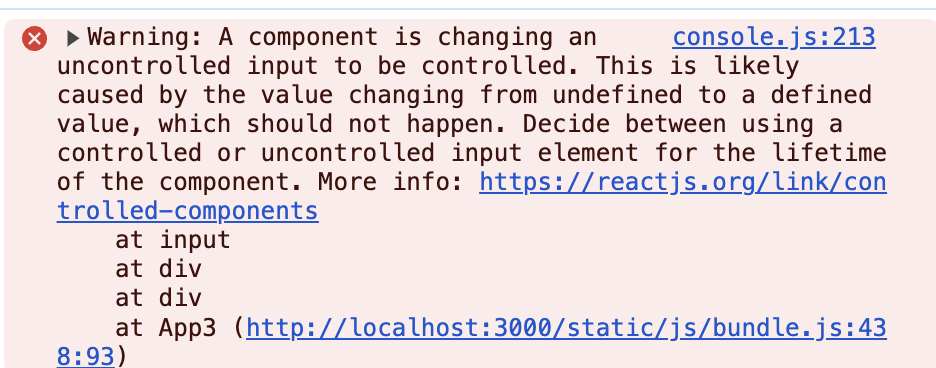

# React 'uncontrolled input to be controlled.' 에러 해결 방법(100% 됨)

## 에러

React를 개발하다보면 인풋을 사용할 때 onChange시 이런 에러를 만나는 경우가 있습니다.

```
Warning: A component is changing an uncontrolled input to be controlled.
This is likely caused by the value changing from undefined to a defined value, which should not happen.
Decide between using a controlled or uncontrolled input element for the lifetime of the component.
More info: https://reactjs.org/link/controlled-components
```

<!-- ui-log 수평형 -->

<ins class="adsbygoogle"
     style="display:block"
     data-ad-client="ca-pub-4877378276818686"
     data-ad-slot="9743150776"
     data-ad-format="auto"
     data-full-width-responsive="true"></ins>
<component is="script">
(adsbygoogle = window.adsbygoogle || []).push({});
</component>



```js
import { useState } from "react";

const useInput = () => {
  const [input, setInput] = useState();

  const onChange = (e) => {
    setInput(e.target.value);
  };

  return [input, onChange];
};

export default useInput;
```

저는 위와 같이 useInput 훅을 만들어 사용중이었는데, 위 훅을 사용하면 에러가 발생했습니다.

<!-- ui-log 수평형 -->

<ins class="adsbygoogle"
     style="display:block"
     data-ad-client="ca-pub-4877378276818686"
     data-ad-slot="9743150776"
     data-ad-format="auto"
     data-full-width-responsive="true"></ins>
<component is="script">
(adsbygoogle = window.adsbygoogle || []).push({});
</component>

## 원인

위 에러가 발생하는 원인은 에러 메세지에 나와있는대로 uncontrolled input이 controlled로 변경되어서 발생한 것인데요.
더 쉽게 말하자면 input의 값이 undefined 되어있다가 onChange를 통해서 defined 된 값으로 변경되어서 발생하는 이슈입니다.


## 해결 방법

위 에러를 해결하려면 아래와 같이 value를 받아서 useState의 초기 값에 넣어주면 됩니다.

<!-- ui-log 수평형 -->

<ins class="adsbygoogle"
     style="display:block"
     data-ad-client="ca-pub-4877378276818686"
     data-ad-slot="9743150776"
     data-ad-format="auto"
     data-full-width-responsive="true"></ins>
<component is="script">
(adsbygoogle = window.adsbygoogle || []).push({});
</component>

```js
import { useState } from "react";

const useInput = (value) => {
  const [input, setInput] = useState(value);

  const onChange = (e) => {
    setInput(e.target.value);
  };

  return [input, onChange];
};

export default useInput;
```

커스텀 훅을 사용하는 곳에서는 아래와 같이 초기값인 "" 빈 문자열을 넣어주면 됩니다.

```js
const [email, onEmailChange] = useInput("");
```

이렇게 하면 input에서 onChange할 때 발생하던 "uncontrolled input to be controlled." 에러를 손 쉽게 해결할 수 있습니다.
