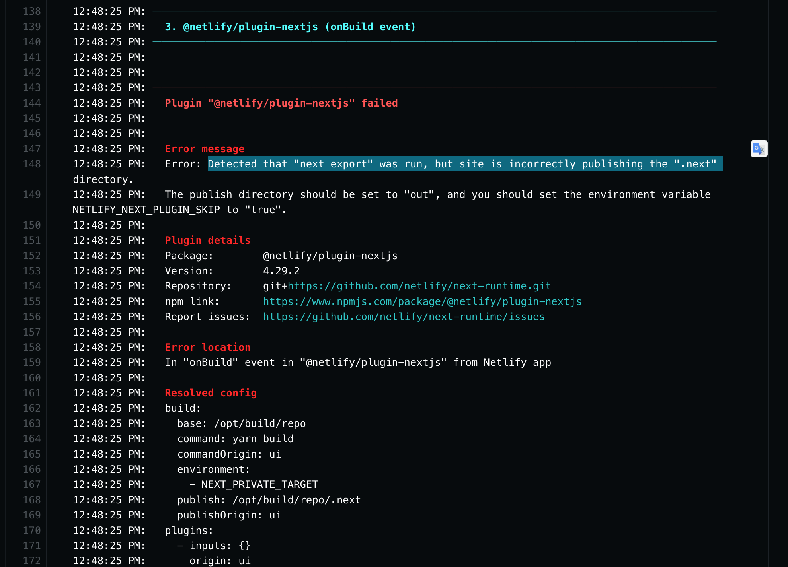
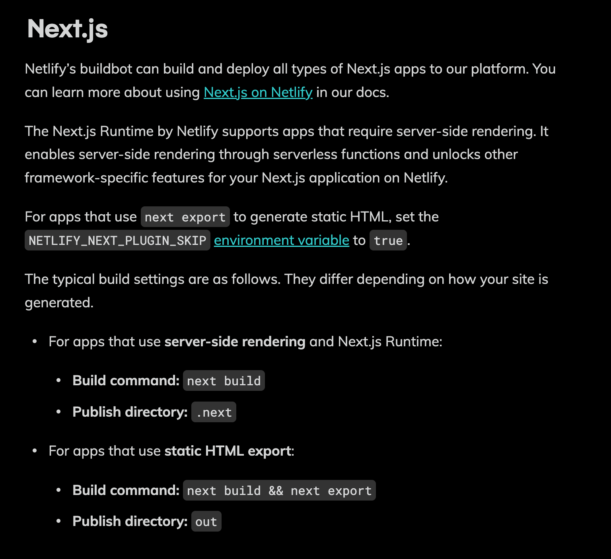
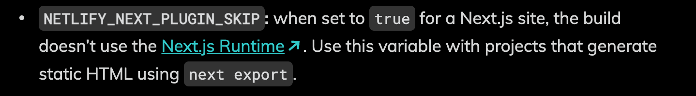
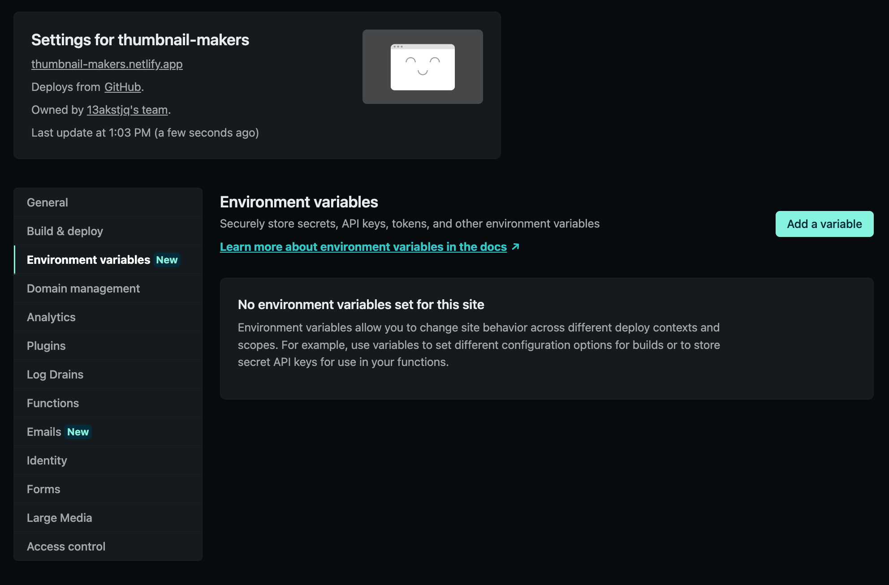
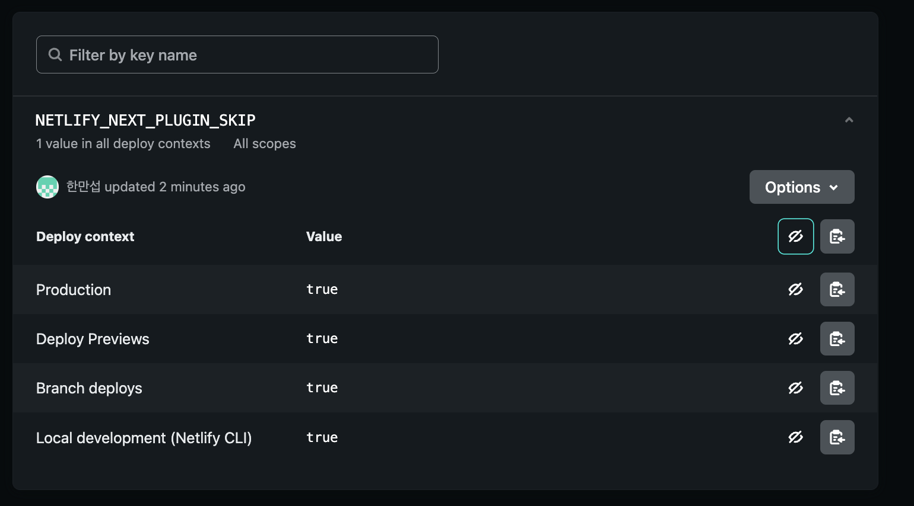
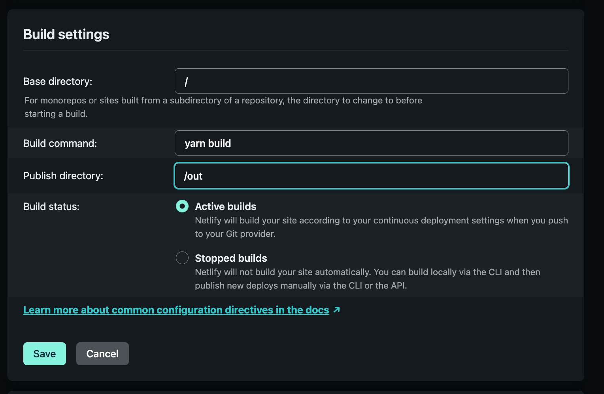
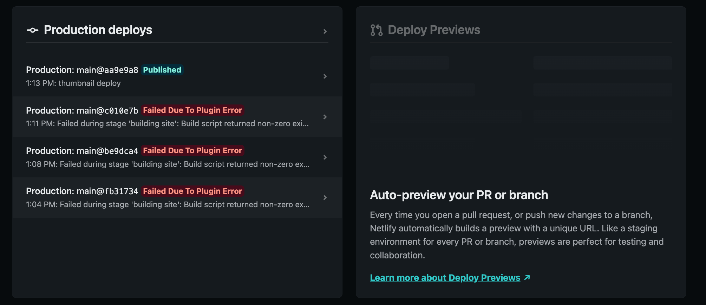

# Netlify에 Nextjs 프로젝트 배포하는 두 가지 방법 (.next , out)

Nextjs 프로젝트는 두가지 형식의 사이트로 사용되는데요.
첫번째는 `.next` 디렉토리의 일반적인 Nextjs 프로젝트
두번째는 `out` 디렉토리로 생성되는 정적 HTML 웹사이트입니다.

**이 포스팅에서는 각 방식에 따라 Netlify build configuration 설정 방법과 에러 해결 방법에 대해서 정리합니다.**

## 1. 정적 웹 사이트 (out) 경로 배포

Netlify를 통해서 Nextjs를 배포할 때는 위 두가지 중 어떤 것으로 배포하냐에 따라 빌드 설정이 달라지게 됩니다.
빌드 설정을 잘못하게 되면 아래와 같은 에러가 발생합니다.

<component is="script" src="https://pagead2.googlesyndication.com/pagead/js/adsbygoogle.js?client=ca-pub-4877378276818686" crossorigin="anonymous" async></component>

<!-- ui-log 수평형 -->

<ins class="adsbygoogle"
     style="display:block"
     data-ad-client="ca-pub-4877378276818686"
     data-ad-slot="9743150776"
     data-ad-format="auto"
     data-full-width-responsive="true"></ins>
<component is="script">
(adsbygoogle = window.adsbygoogle || []).push({});
</component>



```bash
12:48:25 PM:   Error message
12:48:25 PM:   Error: Detected that "next export" was run, but site is incorrectly publishing the ".next" directory.
12:48:25 PM:   The publish directory should be set to "out", and you should set the environment variable NETLIFY_NEXT_PLUGIN_SKIP to "true".
```

위 에러는 `next export` 명령어를 통해 static 웹사이트를 만들었는데 netlify의 publish directory가 `.next` 로 되어있어서 발생한 오류인데요.

publish directory를 정적 웹사이트가 있는 `out`으로 수정해주고 `NETLIFY_NEXT_PLUGIN_SKIP` 를 true로 바꾸어주어야합니다.

정적웹사이트를 배포하는 과정에서는 Netlify에서 Nextjs 플러그인을 빌드할 필요가 없기 때문에 skip에 true를 넣어주는 것이죠.[참고](https://docs.netlify.com/integrations/frameworks/#next-js)



netlify의 환경변수에서 `NETLIFY_NEXT_PLUGIN_SKIP`를 살펴보면 아래와 같이 설명되어있습니다. **이 값을 true로 변경하면 next.js 런타임을 사용하지 않는 것이고 next export를 이용해서 static html를 생성한다고 나와있습니다.**

:::
NETLIFY_NEXT_PLUGIN_SKIP: when set to true for a Next.js site, the build doesn’t use the Next.js Runtime. Use this variable with projects that generate static HTML using next export.
:::



### Netlify 환경변수 추가방법

<component is="script" src="https://pagead2.googlesyndication.com/pagead/js/adsbygoogle.js?client=ca-pub-4877378276818686" crossorigin="anonymous" async></component>

<!-- ui-log 수평형 -->

<ins class="adsbygoogle"
     style="display:block"
     data-ad-client="ca-pub-4877378276818686"
     data-ad-slot="9743150776"
     data-ad-format="auto"
     data-full-width-responsive="true"></ins>
<component is="script">
(adsbygoogle = window.adsbygoogle || []).push({});
</component>





위와 같이 환경변수를 추가해줍니다. **소문자 true로 작성해야합니다**

### publish directory 변경



위와 같이 publish directory를 `out`으로 변경해줍니다.

### build 명령어 수정

static HTML 사이트를 배포할 것이기 때문에 저장소 build 명령어를 아래와 같이 수정해야합니다.

```json
"build": "next build && next export",
```

### git push

위와 같이 설정을 다 마쳤다면 git push 를 통해 원격 저장소에 푸시해줍니다.



이제 정상적으로 published된 것을 확인하실 수 있습니다.

위와 같이 진행했는데도 계속 실패가 발생한다면 환경변수 설정을 파일 기반 설정으로 변경해보시기 바랍니다.

## 2. .next 경로 배포

`.next` 경로는 out에서 추가했던 환경변수를 제거하고 빌드 명령어도 `next build`로 수정한 후에 원격 저장소에 푸시하면 정상적으로 배포되는 것을 확인하실 수 있습니다.
