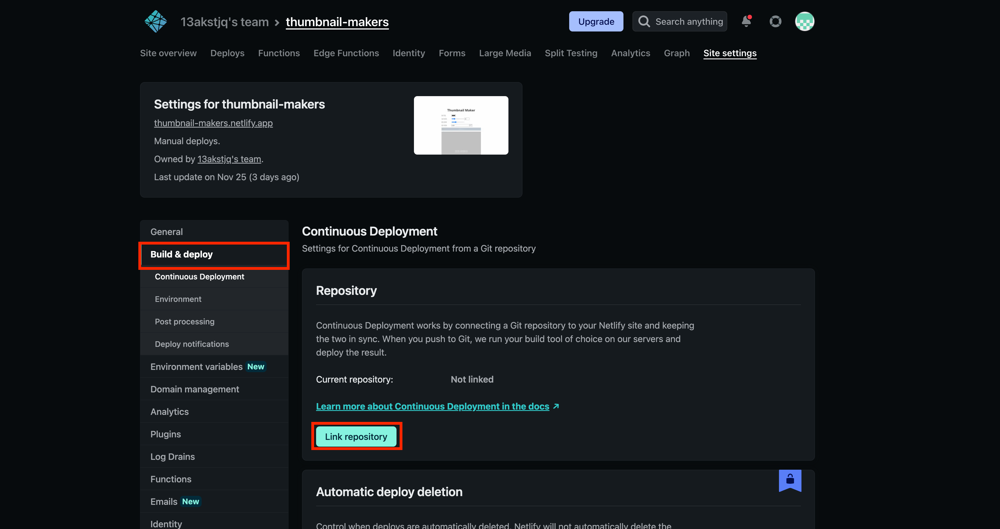
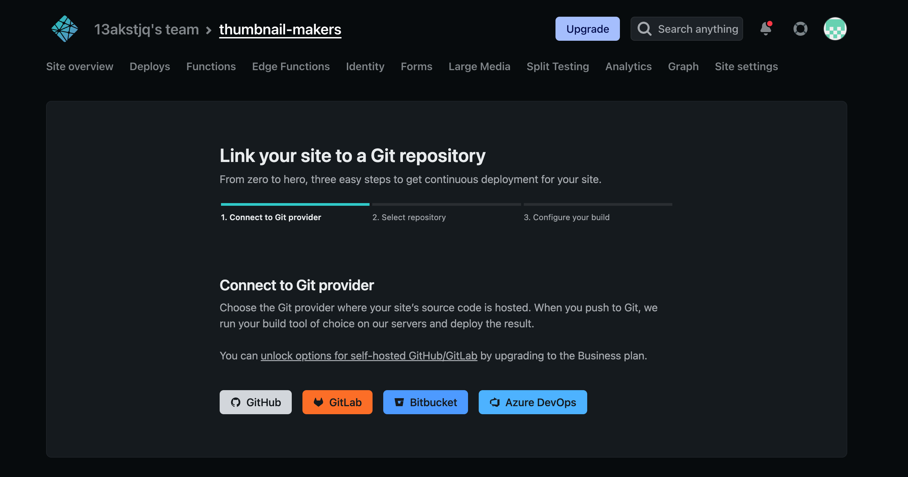
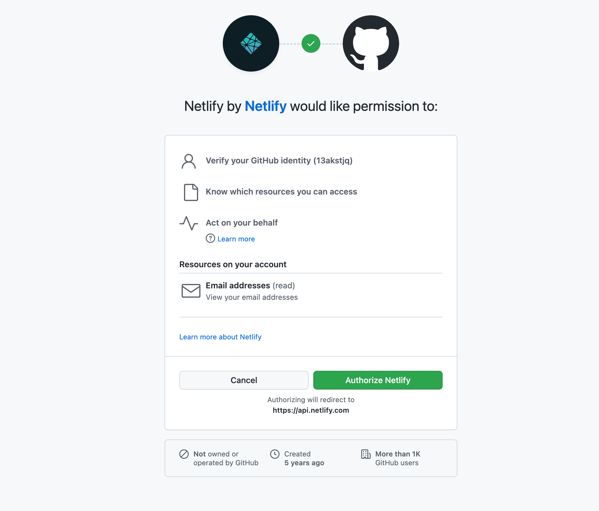
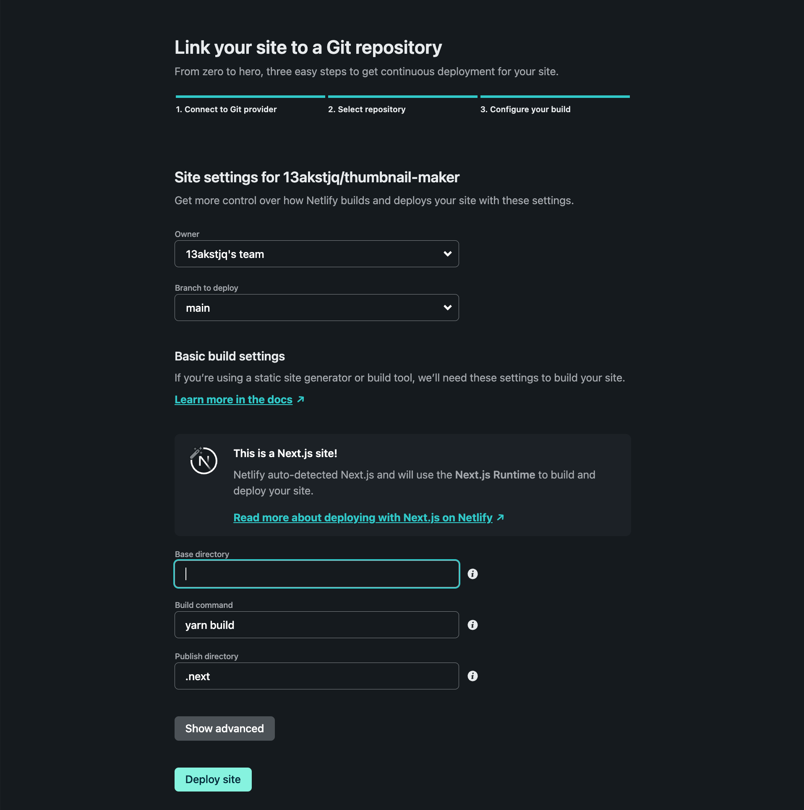

# Netlify에 github 저장소 연결하는 방법

이전에는 Netlify에 static HTML 웹사이트 파일을 업로드해서 호스팅하는 방법에 대해서 알아보았었는데요.

오늘은 github 저장소와 연결하여 **원격 저장소에 push하면 자동으로 빌드가 되어 배포되는 방법을 알아보겠습니다.**

## Github 저장소 연결

<component is="script" src="https://pagead2.googlesyndication.com/pagead/js/adsbygoogle.js?client=ca-pub-4877378276818686" crossorigin="anonymous" async></component>

<!-- ui-log 수평형 -->

<ins class="adsbygoogle"
     style="display:block"
     data-ad-client="ca-pub-4877378276818686"
     data-ad-slot="9743150776"
     data-ad-format="auto"
     data-full-width-responsive="true"></ins>
<component is="script">
(adsbygoogle = window.adsbygoogle || []).push({});
</component>

build & deploy 메뉴에 들어가서 link repository 버튼을 클릭해줍니다.

Github을 선택해줍니다.

권한 승인을 해줍니다.

원하는 저장소를 선택해줍니다.

배포할 브랜치와 베이스 디렉토리 **publish directory 등 배포에 필요한 설정을 할 수 있습니다.**

Nextjs 저장소의 경우 .next와 out 두 개의 배포 방법이 있기 때문에 이 내용은 아래 포스팅에서 확인하실 수 있습니다.

이렇게 Github 저장소에 있는 프로젝트를 Netlify에 연결하여 push하는 것만으로도 자동으로 호스팅이 되도록 작업했습니다.

Netlify외에도 다양한 호스팅 서비스들이 많기 때문에 각자 상황에 맞는 것을 사용하시면 좋을 것 같습니다.
