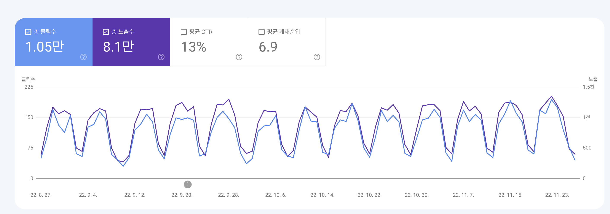
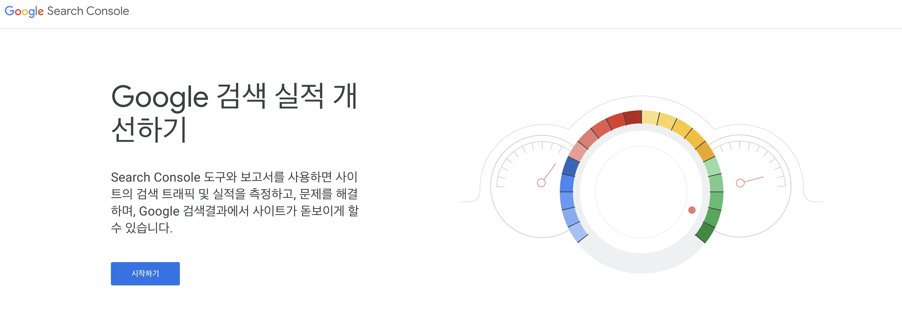
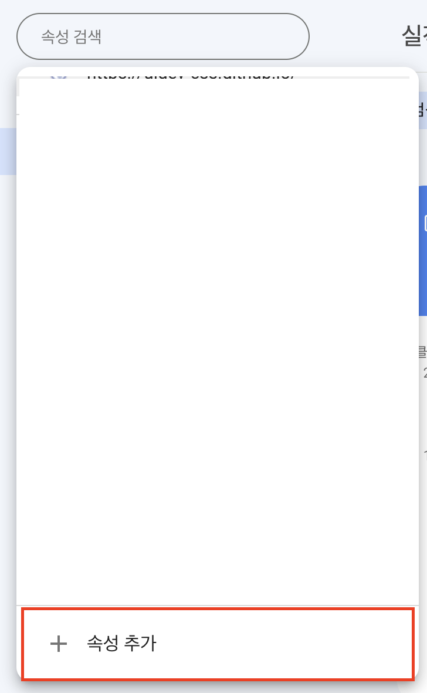
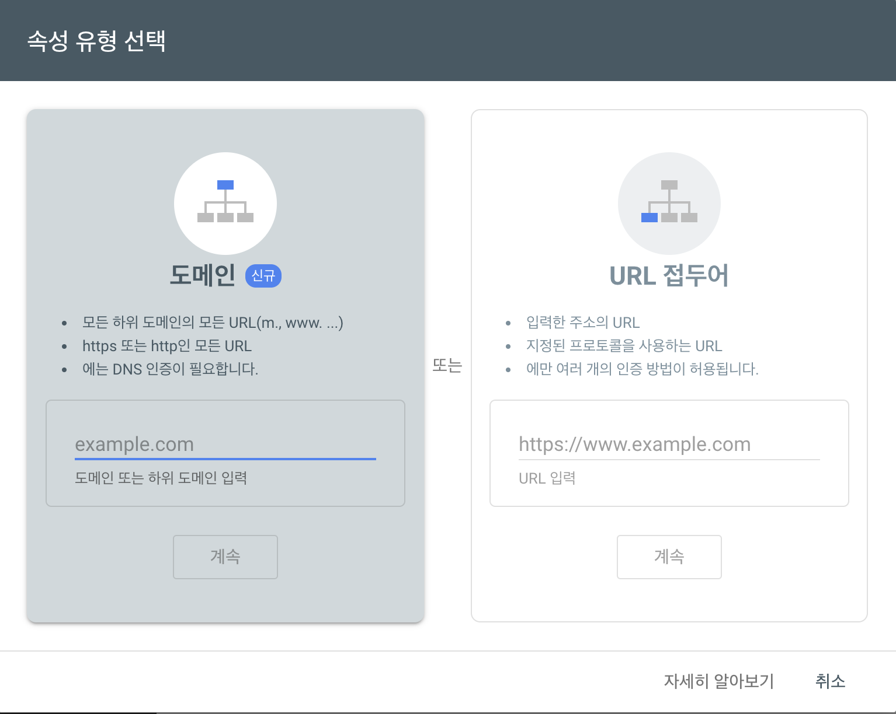
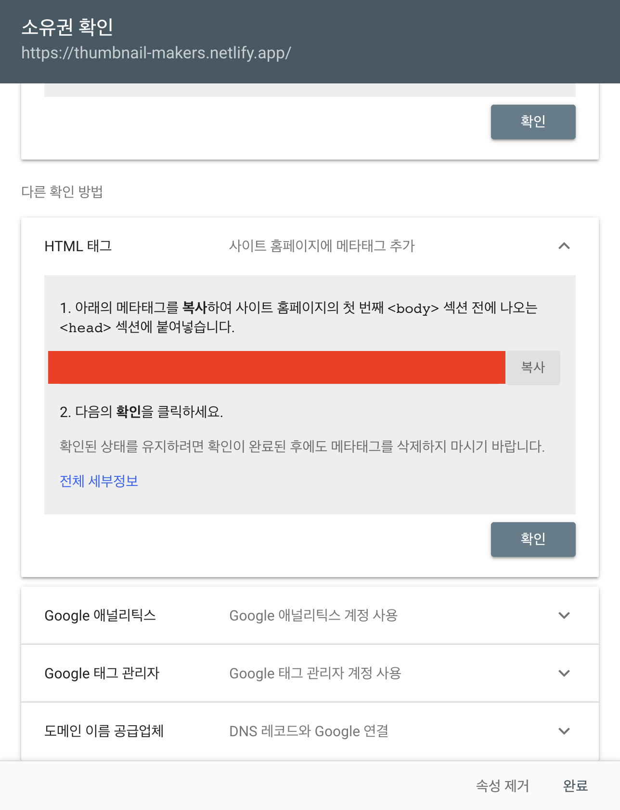
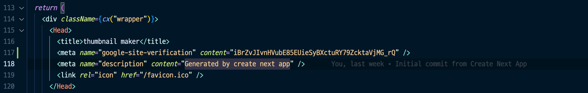
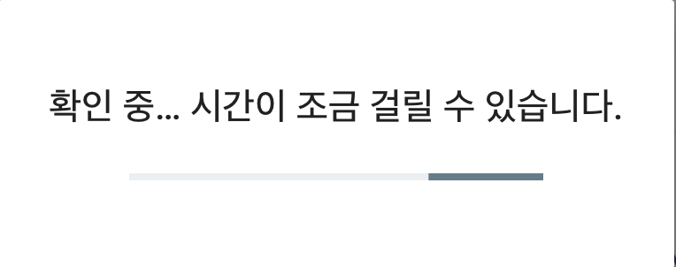
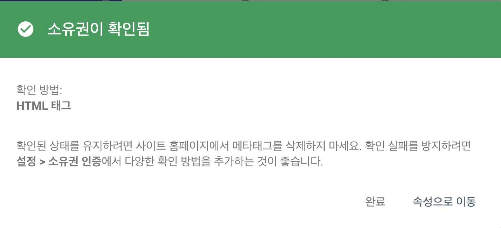
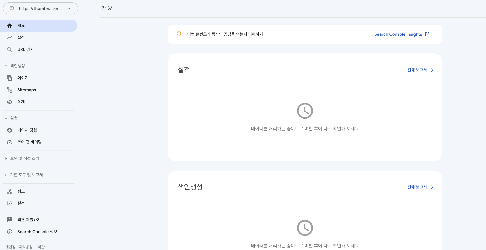

# 웹사이트 구글 검색 되게 하는 방법

아무리 사이트를 잘 만들어두어도 아무도 들어오지 않는다면 소용이 없겠죠?
잘 만든 사이트를 **구글 검색에 노출이 되어 아래와 같이 유입을 만들 수 있는 방법을 정리했습니다.**



<component is="script" src="https://pagead2.googlesyndication.com/pagead/js/adsbygoogle.js?client=ca-pub-4877378276818686" crossorigin="anonymous" async></component>

<!-- ui-log 수평형 -->

<ins class="adsbygoogle"
     style="display:block"
     data-ad-client="ca-pub-4877378276818686"
     data-ad-slot="9743150776"
     data-ad-format="auto"
     data-full-width-responsive="true"></ins>
<component is="script">
(adsbygoogle = window.adsbygoogle || []).push({});
</component>

## Search Console

구글 검색 결과에 노출이 되려면 [서치콘솔(Search Condsole)](https://search.google.com/search-console/about)에 사이트를 등록해야하는데요.



사이트에 방문해서 시작하기 버튼을 눌러줍니다.



좌측 속성 검색 버튼을 누르면 위와 같이 창이 나오는데 여기서 '속성추가'를 눌러줍니다.



여기서 도메인이 아닌 'URL 접두어'의 입력창에 보유하신 사이트 주소를 입력하고 계속 버튼을 눌러줍니다.



검토 후에 소유권 확인 창이 나오는데요. 본인이 소유한 사이트가 맞는지 소유권 확인 절차가 필요합니다.
소유권 확인 방법에는 HTML파일을 사이트에 추가하는 것이 있고, 그 외에도
HTML 태그를 추가하거나 구글 애널리틱스(GA)계정을 연동하거나 여러 방법이 존재합니다.

저는 가장 간단한 HTML태그을 웹사이트에 추가하는 방식으로 하겠습니다.

저는 Nextjs로 제작한 사이트라 아래와 같이 `<Head>` 태그 사이에 넣어주었습니다.



<component is="script" src="https://pagead2.googlesyndication.com/pagead/js/adsbygoogle.js?client=ca-pub-4877378276818686" crossorigin="anonymous" async></component>

<!-- ui-log 수평형 -->

<ins class="adsbygoogle"
     style="display:block"
     data-ad-client="ca-pub-4877378276818686"
     data-ad-slot="9743150776"
     data-ad-format="auto"
     data-full-width-responsive="true"></ins>
<component is="script">
(adsbygoogle = window.adsbygoogle || []).push({});
</component>

```tsx
<Head>
  <title>thumbnail maker</title>
  <meta name="google-site-verification" content="iBrZvJIvnHVubE85EUieSyBXctuRY79ZcktaVjMG_rQ" />
  <meta name="description" content="Generated by create next app" />
  <link rel="icon" href="/favicon.ico" />
</Head>
```

정적인 meta태그 추가는 이렇게 그냥 한줄 추가하면 되지만
가끔씩 동적인 meta태그를 추가해야하는 상황이 있는데요.
해당 내용은 아래 포스팅에서 확인하실 수 있습니다.

위 메타 태그를 추가한 뒤 확인 버튼을 클릭하면





확인 후에 아래와 같이 나오는 것을 보실 수 있습니다.



Nextjs 에서 sitemap 추가 및 구글 검색에 잘 걸리도록하는 SEO 셋팅 방법에 대해서 추후 다뤄보도록 하겠습니다.
