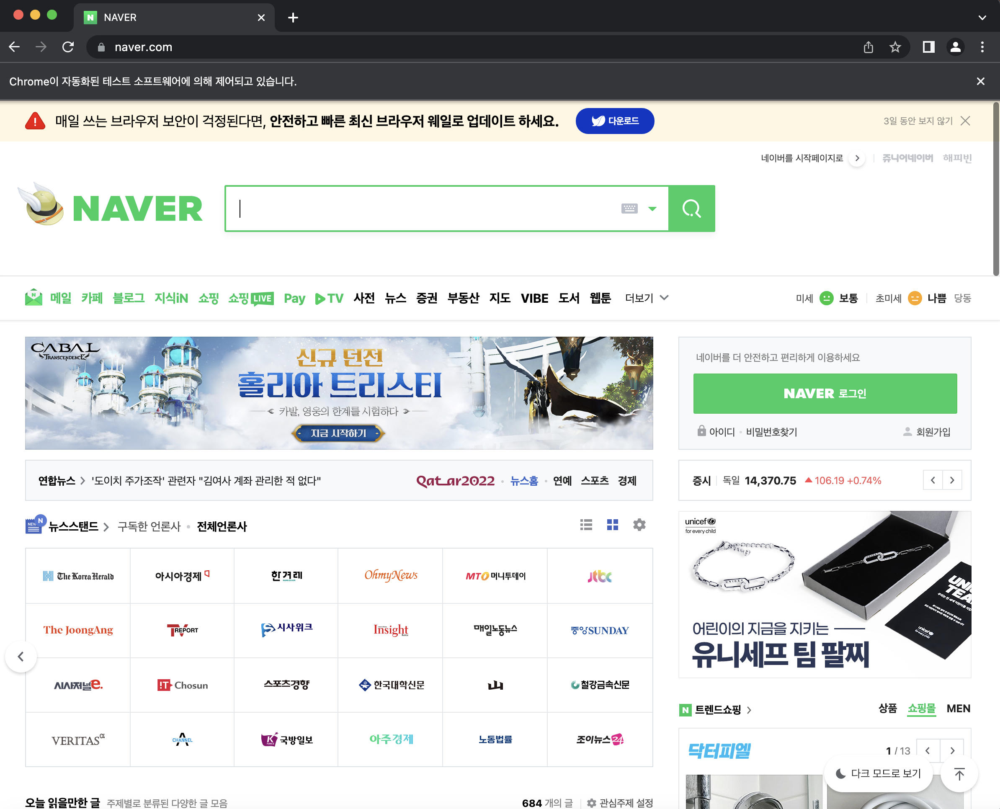

# 셀레니움(selenium)으로 자동화 프로그램 제작하기(1)

::: tip 💡이 포스팅을 읽으면
셀레니움으로 자동화 프로그램을 제작할 수 있습니다.
이번 글에서는 셀레니움을 실행하는 방법에 대해서 정리하겠습니다.
:::

크롤링을 하는 방법에는 다양한 방법이 있지만 실제 유저가 동작하는 것처럼 하기 위해서는 셀레니움(selenium)을 사용해야합니다.
셀레니움은 파이썬 자바 자바스크립트 등 다양한 언어로 사용할 수 있지만 자바스크립트로 사용하는 방법에 대해서 공유합니다.

## 1. selenium-webdriver 설치

```bash
npm i selenium-webdriver
```

## 2. 크롬 실행

크롬 셀레니움을 사용하기 위해선 chromeOption들을 설정해주어야 합니다.

```js
const webdriver = require("selenium-webdriver");
const chrome = require("selenium-webdriver/chrome");
const { Builder, By, Key, until, Capabilities } = require("selenium-webdriver");

const userAgent = "Mozilla/5.0 (Macintosh; Intel Mac OS X 11_0_1) AppleWebKit/537.36 (KHTML, like Gecko) Chrome/88.0.4324.192 Safari/537.36";

const driver = async () => {
  return new Builder()
    .forBrowser("chrome")
    .setChromeOptions(
      new chrome.Options()
        .addArguments("--headless") // 백그라운드로 실행
        .addArguments("--disable-gpu") // gpu 비활성화
        .addArguments("--no-sandbox")
        .addArguments("--disable-dev-shm-usage") // 공유 메모리를 사용하지 않겠다는 의미
        .addArguments("window-size=1280,800") // 윈도우 사이즈 지정
        .addArguments("--disable-blink-features=AutomationControlled")
        .addArguments([`user-agent==${userAgent}`]) // 유저 에이전트를 지정할 수 있음
        .setUserPreferences({
          "download.default_directory": "", // 다운로드할 경우 디폴트 경로를 지정할 수 있음
          "profile.default_content_setting_values.automatic_downloads": 1,
        })
    )
    .build();
};

await driver.get("https://www.naver.com/"); // 네이버 홈페이지 열기
await driver.sleep(1000000000); // 타임 슬립
```

위에 주석처리해둔 속성들을 보고 필요한 속성을 적용하여 사용할 수 있습니다.
위와 같이 index.js를 작성해서 실행하면 아무런 결과도 나오지 않는데요.

그 이유는 백그라운드로 실행했기 때문입니다.
아래 부분을 주석처리하거나 제거하고 실행시켜야합니다.

```js
.addArguments("--headless") // 백그라운드로 실행
```



## 3. 셀레니움 파이어폭스 실행

크롬이 아닌 파이어폭스도 실행할 수 있는데요.
셀레니움을 사용하다보면 특정 브라우저에서는 동작하지 않는 경우가 있어서 다른 브라우저도 사용해야할 경우가 발생합니다.

firefox도 크롬과 동일하게 headless를 통해 백그라운드로 실행 여부를 결정하는데요.

아래처럼 함수를 만들어두면 필요에 따라 headless를 설정할 수 있습니다.

```js
const firefoxBuild = async (headless = true) => {
  if (headless) {
    return new Builder().forBrowser("firefox").setFirefoxOptions(new firefox.Options().addArguments("--headless")).build();
  } else {
    return new Builder().forBrowser("firefox").setFirefoxOptions(new firefox.Options()).build();
  }
};
```

이제 셀레니움을 실행해서 브라우저를 키는데 까지 성공했습니다.
셀레니움을 이용하면 클릭, 스크롤, 다운로드 등등 사람이 동작하는 것과 동일하게 동작을 수행할 수 있습니다.

셀레니움을 활용하면 정말 다양한 동작을 자동화할 수 있는데요.

다음 글에서는 셀레니움의 기본 명령어들에 대해서 알아보겠습니다.
