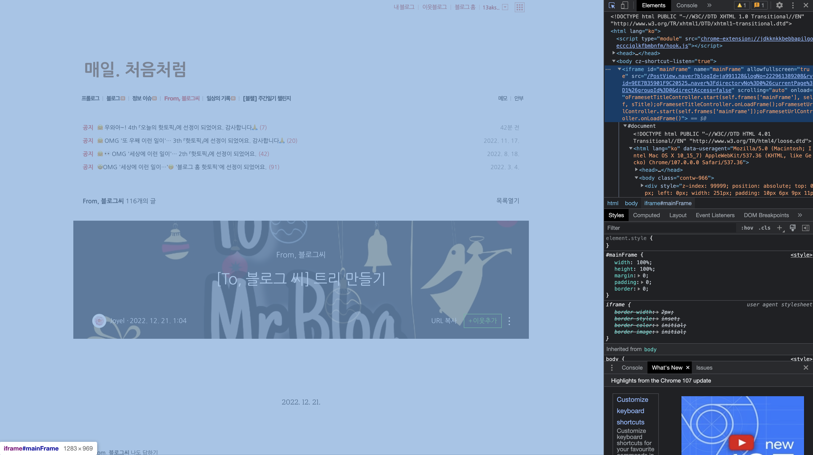

# 자바스크립트로 selenium iframe에 접근하는 방법

::: tip 💡이 포스팅을 읽으면
자바스크립트를 이용해 selenium을 사용할 때 iframe 내부에 있는 요소에 접근하여 처리할 수 있습니다.
:::

selenium을 사용하다보면 이렇게 사이트가 iframe으로 이루어진 경우가 종종 발생하는데요.
이럴 때는 findElements 와 같은 함수를 통해서 엘리먼트에 접근하는 것이 안됩니다.



<component is="script" src="https://pagead2.googlesyndication.com/pagead/js/adsbygoogle.js?client=ca-pub-4877378276818686" crossorigin="anonymous" async></component>

<!-- ui-log 수평형 -->

<ins class="adsbygoogle"
     style="display:block"
     data-ad-client="ca-pub-4877378276818686"
     data-ad-slot="9743150776"
     data-ad-format="auto"
     data-full-width-responsive="true"></ins>
<component is="script">
(adsbygoogle = window.adsbygoogle || []).push({});
</component>

현재 body로 되어있는 기준을 iframe으로 먼저 바꿔 준 후에 findElements를 사용해야
iframe 내부에 있는 요소에 접근할 수 있는데요.

## switchTo()

driver의 `switchTo()` 함수를 사용해서 iframe으로 포커스를 스위칭할 수 있는데요.
iframe이 있는지 판단하기 위해서 findElements 함수로 iframe 유무를 판단할 수 있습니다.

```js
let [iframe] = await driver.findElements(By.css("iframe"));
if (iframe) {
  await driver.switchTo().frame(iframe); // driver를 iframe으로 스위칭
}
```

위와 같이 하면 이제 iframe 내부에 있는 엘리먼트에 접근할 수 있습니다.

<component is="script" src="https://pagead2.googlesyndication.com/pagead/js/adsbygoogle.js?client=ca-pub-4877378276818686" crossorigin="anonymous" async></component>

<!-- ui-log 수평형 -->

<ins class="adsbygoogle"
     style="display:block"
     data-ad-client="ca-pub-4877378276818686"
     data-ad-slot="9743150776"
     data-ad-format="auto"
     data-full-width-responsive="true"></ins>
<component is="script">
(adsbygoogle = window.adsbygoogle || []).push({});
</component>

```js
let [iframe] = await driver.findElements(By.css("iframe"));
if (iframe) {
  await driver.switchTo().frame(iframe); // driver를 iframe으로 스위칭

  const iframeElement = await driver.findElements(By.css("iframe 내부 엘리먼트 요소"));
}
```

## defaultContent()

이제 iframe에서 할 일을 다 끝냈다면 다시 body로 스위칭해야하는데요.
그 때 필요한 것이 `defaultContent()` 함수입니다.

```js
let [iframe] = await driver.findElements(By.css("iframe"));
if (iframe) {
  await driver.switchTo().frame(iframe); // driver를 iframe으로 스위칭

  const iframeElement = await driver.findElements(By.css("iframe 내부 엘리먼트 요소"));
  await driver.switchTo().defaultContent(); // 돌아가기
}
```

<component is="script" src="https://pagead2.googlesyndication.com/pagead/js/adsbygoogle.js?client=ca-pub-4877378276818686" crossorigin="anonymous" async></component>

<!-- ui-log 수평형 -->

<ins class="adsbygoogle"
     style="display:block"
     data-ad-client="ca-pub-4877378276818686"
     data-ad-slot="9743150776"
     data-ad-format="auto"
     data-full-width-responsive="true"></ins>
<component is="script">
(adsbygoogle = window.adsbygoogle || []).push({});
</component>

## 정리

- iframe 내부 요소를 탐색하고 싶다면 `.switchTo()` 함수로 바꾼 후에 처리

```js
await driver.switchTo().frame(iframe); // iframe으로 스위칭
```

- iframe 내부에서 작업 다 끝내서 다시 body로 돌아오려면 `.switchTo().defaultContent()` 로 돌아오기

```js
await driver.switchTo().defaultContent(); // 다시 원래 body로 돌아가기
```
