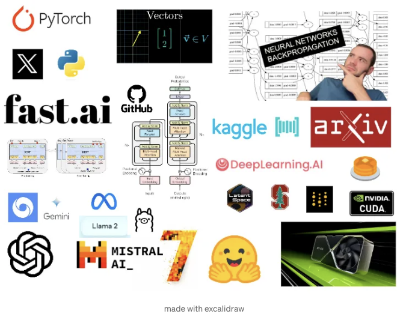
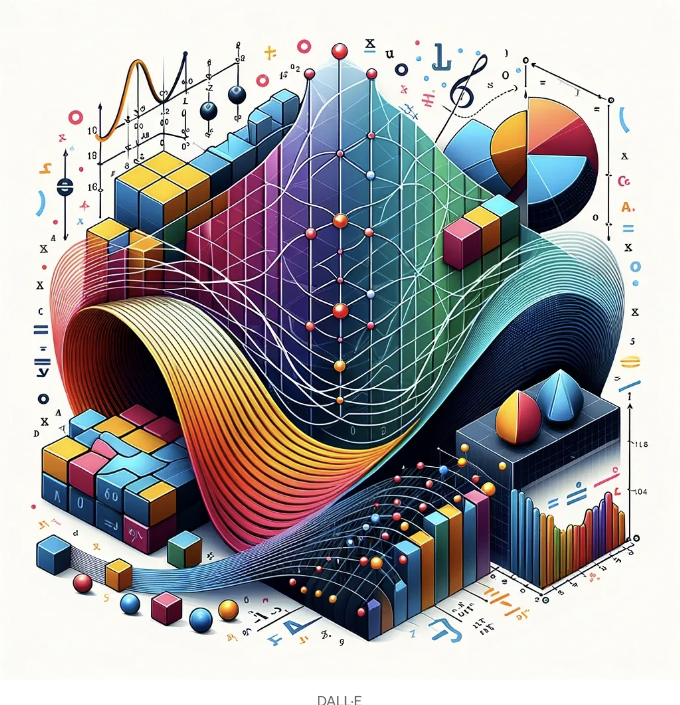
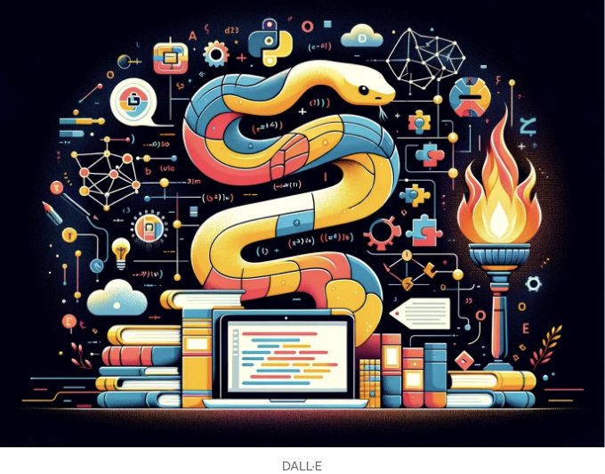
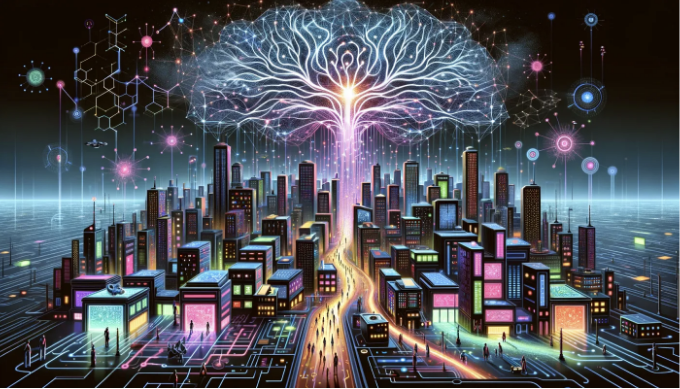

# 2024년도 AI 개발 최신 로드맵

::: tip 💡이 포스팅을 읽으면

:::

## AI를 배우고 싶으신가요?

AI를 배우고 싶지만 어떻게 시작해야 할지 모르시나요? 이 포스팅은 그렇게 고민하는 분들을 위해 최신 무료 데이터 과학, 기계 학습 및 인공 지능 강의들을 통해 실전 중심의 학습 방법을 소개합니다. 튜토리얼 헬(tutorial hell)에서 벗어나 실제 문제를 해결하고 AI를 사용하여 즐거운 사이드 프로젝트를 진행하는 것이 이 포스팅의 핵심입니다. 이러한 철학을 따르는 무료 커리큘럼을 제시하고 있으며, 작성자는 일부 강의를 진행 중이므로 함께 학습하고 싶다면 트위터나 링크드인에서 연락해 주세요! 또한 빠뜨린 부분이 있다면 댓글을 남겨 주세요!

그러나 먼저 이 커리큘럼에 대한 몇 가지 참고 사항과 학습에 대한 조언을 드리겠습니다.

# 상향식 접근법

이 커리큘럼은 상향식 접근법을 따릅니다. 즉, 코드를 먼저 작성하고 이론을 이후에 공부합니다.

저는 필요에 따라 배우는 것을 좋아합니다. 따라서 해결해야 할 문제나 만들어야 할 프로토타입이 있다면 필요한 정보를 얻기 위해 최선을 다하고, 공부하고, 이해한 후에 행동에 옮깁니다.

예를 들어, 저는 기본적으로 LLMs를 이해하는 AI 엔지니어가 되고 싶습니다. 이는 스크래치에서 변환기를 작성하고 GPU에서 LLMs를 미세 조정하는 등의 스킬을 가지고 있다는 것을 의미합니다. 현재 그렇게 할 수 없는 이유는 제 지식에는 여전히 구멍이 있기 때문에 그 구멍을 채우려고 합니다.

또한 이 커리큘럼은 NLP에 초점을 맞추고 있습니다. 컴퓨터 비전이나 강화 학습과 같은 다른 AI 전문화에 관심이 있다면 아래 댓글이나 트위터, 링크드인을 통해 연락 주세요. 추천을 해드리겠습니다.

링크가 많이 나열되어 있기 전에 학습하기 전에 알았더라면 좋았을 것 같은 두 가지 중요한 것을 먼저 알려주었으면 좋았을 것 같습니다.

# 공개 학습

배워야 할 것이 많고 AI에서는 매주 새로운 혁신적인 논문과 아이디어가 발표됩니다.

가장 큰 실수는 비공개로 학습하는 것입니다. 그렇게 한다면 본인에게 어떠한 기회도 만들지 못할 것입니다. 완료했다고 말할 수는 있지만, 본인이 정보를 어떻게 활용하고, 그것을 공개적으로 공유할 수 있게 변환하고, 그 정보에서 새로운 아이디어와 해결책이 나온 것이 더 중요합니다.

따라서 공개적으로 학습해야 합니다.

이는 무엇인가를 만드는 습관을 가지고 있다는 것을 의미합니다.

이것은 다음을 의미할 수 있습니다:

- 블로그와 튜토리얼 작성
- 해커톤 참여 및 협업
- Discord 커뮤니티에서 질문하고 답변하기
- 열정적인 사이드 프로젝트에 참여하기
- 발견한 흥미로운 것을 트위터에 트윗하기

그리고 트위터에 대해서 이야기하면,

# 트위터 사용

올바른 사람들을 팔로우하고 제대로 사용한다면 트위터는 현재 가장 가치 있는 소셜 플랫폼입니다.

누구를 팔로우해야 할까요? Suhail이 만든 이 AI 리스트를 확인해보세요.

트위터를 어떻게 사용해야 할까요? Near의 '트위터 성공 가이드'를 읽어보세요.

트위터에서 사람들에게 다이렉트 메시지를 보내세요. 진심어린 마음을 담아 간결하고 구체적인 요청을 해야 합니다

. Sriram Krishnan의 '얼음깨는 이메일 쓰기 가이드'도 DM에 적용될 수 있습니다.

트위터를 어떻게 트윗해야 할까요? '트윗의 해부학'을 읽어보세요. 이 책은 Instructor의 제작자 Jason이 몇 달 동안 0 → 14k 팔로워로 성장한 경험을 바탕으로 작성되었습니다.

이 글을 읽고 계신다면, 트위터에서 저를 팔로우하세요!

저에게 무엇을 하고 있는지 DM을 보내주세요! 멋진 프로젝트에 대해 협업할 준비가 되어 있습니다.

이제 시작해 보겠습니다.

# 목차

- 수학
- 도구
  ∘ Python
  ∘ PyTorch
- 기계 학습
  ∘ 스크래치에서 작성하기
  ∘ 경쟁하기
  ∘ 사이드 프로젝트 진행하기
  ∘ 배포하기
  ∘ 보조 자료
- 딥 러닝
  ∘ Fast.ai
  ∘ 더 많은 경쟁 참여하기
  ∘ 논문 구현하기
  ∘ 컴퓨터 비전
  ∘ NLP
- 대규모 언어 모델
  ∘ Neural Networks: Zero to Hero 시청
  ∘ 무료 LLM 부트캠프
  ∘ LLM로 빌드하기
  ∘ 해커톤 참여하기
  ∘ 논문 읽기
  ∘ 스크래치에서 Transformers 작성하기
  ∘ 좋은 블로그들
  ∘ Umar Jamil 시청
  ∘ 오픈 소스 모델 실행 방법 배우기
  ∘ 프롬프트 엔지니어링
  ∘ LLM 미세 조정
  ∘ RAG
- 최신 소식 받는 방법
- 유용한 다른 커리큘럼/목록들

# 수학

기계 학습은 선형 대수학, 미적분, 확률 및 통계라는 세 가지 수학적 기둥에 크게 의존합니다. 각각은 알고리즘이 효과적으로 작동할 수 있도록 해줍니다.

- 선형 대수학: 데이터 표현 및 조작을 위한 수학적 도구로, 행렬과 벡터가 알고리즘이 정보를 해석하고 처리할 수 있는 언어를 형성합니다.
- 미적분: 기계 학습에서 최적화를 위한 엔진으로, 기울기와 변화율을 이해함으로써 알고리즘이 학습하고 개선할 수 있도록 합니다.
- 확률 및 통계: 불확실성 하에서의 의사 결정의 기초로서, 알고리즘이 결과를 예측하고 데이터를 통해 학습하는 데 필요한 랜덤성 및 변동성 모델을 제공합니다.

프로그래머 관점에서의 수학에 대한 이 시리즈가 좋습니다: Weights & Biases에 의한 기계 학습을 위한 수학.

코드 기반의 선형 대수학을 원한다면, fast.ai의 Computational Linear Algebra 강의를 들어보세요.

더 전통적인 내용을 원한다면, 임페리얼 칼리지 런던의 강의인 Linear Algebra & Multivariate Calculus를 참고하세요.

3Blue1Brown의 Essence of Linear Algebra와 Essence of Calculus를 시청하세요.

통계에 대한 StatQuest의 Statistics Fundamentals 강의도 좋은 자료입니다.

보조 자료

- 책: Mathematics for Machine Learning
- 논문: The Matrix Calculus You Need For Deep Learning

# 도구

## Python

초보자는 여기서 시작하세요: Practical Python Programming.

이미 Python에 익숙하다면, 이 Advanced Python Mastery를 수강하세요.

둘 다 Python Cookbook의 저자인 David Beazley가 제작한 훌륭한 강의입니다.

이후에 James Powell의 일부 강의를 시청하세요.

Python Design Patterns를 읽어보세요.

보조 자료

- 책: Fluent Python, 2nd Edition
- 팟캐스트: Real Python & Talk Python

## PyTorch

비디오

- Aladdin Persson에 의한 PyTorch Tutorials

공식 자료

- PyTorch Examples
- 공식 PyTorch Tutorials

실습

- srush/Tensor-Puzzles: 퍼즐 풀기. PyTorch를 통해 실력 향상하기

보조 자료

- 책: Programming PyTorch for Deep Learning

# 기계 학습

100 페이지짜리 ML 책을 읽어보세요.

## 스크래치에서 작성하기

읽는 동안 알고리즘을 스크래치에서 작성하세요.

아래 저장소를 살펴보세요

- eriklindernoren/ML-From-Scratch
- JeremyNixon/oracle
- trekhleb/homemade-machine-learning

도전을 원한다면, 이 강의를 따라 PyTorch를 스크래치에서 작성하세요.

- MiniTorch: Machine Learning Engineering에 대한 DIY 강의 (비디

오, 코드)

<!-- ui-log 수평형 -->

<ins class="adsbygoogle"
     style="display:block"
     data-ad-client="ca-pub-4877378276818686"
     data-ad-slot="9743150776"
     data-ad-format="auto"
     data-full-width-responsive="true"></ins>
<component is="script">
(adsbygoogle = window.adsbygoogle || []).push({});
</component>

## 경쟁하기

배운 내용을 대회에서 적용하세요.

- bitgrit 및 Kaggle과 같은 플랫폼에서 ML 대회에 참가하세요. 이 글에서 더 많은 정보를 찾을 수 있습니다.
- 과거의 우승 솔루션을 살펴보고 연구하세요

## 사이드 프로젝트 진행하기

Vicki Boykis가 작성한 Getting machine learning to production을 읽어보세요.

그녀는 책 검색을 위한 의미적 검색 엔진인 Viberary를 구축하는 과정에서 배운 내용에 대해도 이야기했습니다.

데이터 세트를 얻고 모델을 구축하세요 (예: NASA 지구 데이터를 얻기 위해 earthaccess 사용).

streamlit을 사용하여 UI를 만들고 트위터에서 공유하세요.

## 배포하기

모델을 프로덕션 환경으로 가져가세요. 실험을 추적하세요. 모델을 모니터하는 방법을 배우세요. 데이터 및 모델 드리프트를 직접 경험하세요.

여기에는 훌륭한 리소스가 있습니다.

- Made With ML
- DataTalksClub/mlops-zoomcamp: 무료 MLOps 강좌
- chiphuyen/machine-learning-systems-design
- Evidently AI — ML 시스템 디자인: 300개의 사례 연구
- stas00/ml-engineering: Machine Learning Engineering 온라인 서적

## 보조 자료

- Machine Learning with PyTorch and Scikit-Learn
- [1811.12808] Model Evaluation, Model Selection, and Algorithm Selection in Machine Learning
- Introduction to Machine Learning Interviews Book · MLIB

# 딥 러닝

상향식으로 접근하려면 fast.ai부터 시작하세요.

## Fast.ai

- fast.ai (part1, part2) + W&B Study Group

fast.ai가 마음에 들었나요? Full Stack Deep Learning도 살펴보세요.

더 포괄적이고 전통적인 강의를 원한다면, UNIGE 14x050 — Deep Learning by François Fleuret를 살펴보세요.

이론을 필요로 할 때 이러한 책들을 읽으세요.

- Dive into Deep Learning
- Deep Learning by Ian Goodfellow, Yoshua Bengio, and Aaron Courville
- Neural networks and deep learning
- Understanding Deep Learning

네트워크가 수렴되는 동안 이 책들을 읽으세요.

- A Recipe for Training Neural Networks
- Deep Neural Nets: 33 years ago and 33 years from now

<!-- ui-log 수평형 -->

<ins class="adsbygoogle"
     style="display:block"
     data-ad-client="ca-pub-4877378276818686"
     data-ad-slot="9743150776"
     data-ad-format="auto"
     data-full-width-responsive="true"></ins>
<component is="script">
(adsbygoogle = window.adsbygoogle || []).push({});
</component>

## 더 많은 경쟁 참여하기

- PlantTraits2024 — FGVC11 | Kaggle (컴퓨터 비전)

## 논문 구현하기

labml.ai Annotated PyTorch Paper Implementations을 확인하세요.

Papers with Code는 훌륭한 리소스입니다. 여기서 BERT에 대한 설명을 찾을 수 있습니다.

딥 러닝의 특수화에 대한 리소스는 아래와 같습니다.

## 컴퓨터 비전

CS231n: Deep Learning for Computer Vision을 많은 사람들이 추천합니다. 도전적이지만 극복한다면 가치가 있습니다.

## 강화 학습

강화 학습에 대해서는 다음 두 가지가 좋습니다:

- Spinning Up in Deep RL by OpenAI
- 🤗 Deep Reinforcement Learning Course — Hugging Face

## NLP

또 다른 훌륭한 스탠포드 강의인 CS 224N | Natural Language Processing with Deep Learning을 듣세요.

Hugging Face를 배워보세요: Hugging Face NLP Course

좋은 기사와 분석들

- BERT Research — Ep. 1 — Key Concepts & Sources · Chris McCormick
- The Illustrated Word2vec — Jay Alammar
- The Illustrated BERT, ELMo, and co. (How NLP Cracked Transfer Learning
- Understanding LSTM Networks — colah’s blog
- PyTorch RNN from Scratch — Jake Tae

보조 자료

- Natural Language Processing with Transformers Book

# 대규모 언어 모델

먼저 Andrej의 [1시간 강의] Intro to Large Language Models를 시청하세요.

그런 다음 Alexander Rush의 Large Language Models in Five Formulas를 읽어보세요 — Cornell Tech

<!-- ui-log 수평형 -->

<ins class="adsbygoogle"
     style="display:block"
     data-ad-client="ca-pub-4877378276818686"
     data-ad-slot="9743150776"
     data-ad-format="auto"
     data-full-width-responsive="true"></ins>
<component is="script">
(adsbygoogle = window.adsbygoogle || []).push({});
</component>

## Neural Networks: Zero to Hero 시청

백프로퍼게이션을 스크래치에서 설명하고 GPT를 스크래치에서 작성하기까지 시작합니다.

Neural Networks: Zero To Hero by Andrej Karpathy

그는 새로운 비디오를 방금 출시했습니다 → Let’s build the GPT Tokenizer

Jay Mody의 GPT in 60 Lines of NumPy | Jay Mody도 함께 보세요.

##

무료 LLM 부트캠프

[Reimagine AI @ Cornell Tech 2024] – Large Language Models를 시청하세요.

Neural Networks: Zero To Hero by Andrej Karpathy도 함께 보세요.

## LLM로 빌드하기

Nicholas Renotte의 [GPT-3] Creating a Language Model Using OpenAI's GPT-3을 시청하세요.

Large Language Models: A Summary of the Landscape | Hugging Face도 함께 보세요.

예제로 GPT-2 및 GPT-3를 사용한 다양한 프로젝트를 살펴보세요.

## 해커톤 참여하기

게이츠는 가장 큰 AI 해커톤이며, 경쟁에 참여할 수 있습니다.

AI 4 Earth: The Future of Conservation AI의 해커톤도 있습니다.

<!-- ui-log 수평형 -->

<ins class="adsbygoogle"
     style="display:block"
     data-ad-client="ca-pub-4877378276818686"
     data-ad-slot="9743150776"
     data-ad-format="auto"
     data-full-width-responsive="true"></ins>
<component is="script">
(adsbygoogle = window.adsbygoogle || []).push({});
</component>

## 논문 읽기

NLP Research in 2023: A Review | The Gradient를 읽어보세요.

미디엄에서도 많은 훌륭한 기사가 있습니다. 예를 들어, 문화 간 특성을 모델링하는 GPT-4는 무엇을 가질까요? | Synced를 읽어보세요.

## 스크래치에서 Transformers 작성하기

Neural Networks: Zero To Hero by Andrej Karpathy와 Nicholas Renotte의 GPT-3 튜토리얼을 시청하세요.

GPT-3.5를 만드는 방법을 배우세요.

## 좋은 블로그들

- Jay Mody's Blog
- Rachel Thomas' Blog
- Chris Olah's Blog
- Aladdin Persson's Blog
- Ryan Bails' Blog

## Umar Jamil 시청

LLMs를 사용하여 Rasa 챗봇을 개발하는 방법에 대해 배웁니다.

## 오픈 소스 모델 실행 방법 배우기

파이썬으로 대화형 AI 엔진을 빌드하는 방법을 익히세요.

## 프롬프트 엔지니어링

친절하게 강조하는 동영상 튜토리얼을 확인하세요.

## LLM 미세 조정

Large Language Models for Text Generation | Machine Learning Mastery를 살펴보세요.

Fine-tuning GPT-3을 살펴보세요.

## RAG

IR을 수행하는 더 나은 방법.

# 최신 소식 받는 방법

- YouTube: Yannic Kilcher
- Newsletters: TheBatch (AI News)
- 블로그: Import AI (by Jack Clark)
- Slack: Code Questions Channel (by David Krueger)
- RSS: Jack's Newsletter
- Twitter: ML News
- Newsletters: Arxiv Weekly (Trending AI Papers)

# 유용한 다른 커리큘럼/목록들

- Machine Learning for Programmers
- This is Your Brain on AI
- CS50's Introduction to Artificial Intelligence with Python
- Awesome AI-ML-DL
- Data Science for COVID-19
- Digital Public Goods Alliance Data and AI Repository

이제 AI 세계로의 여정을 시작하세요. 부디 이 글이 도움이 되기를 바랍니다!

기원과 함께하는 공개 학습! 🚀

[제목 이미지 출처](https://www.freepik.com/)

[로드맵 이미지 출처](https://www.freepik.com/)

"2024년 AI 개발 최신 로드맵"의 모든 권리는 만료되었습니다. 2024년의 지식을 바탕으로 작성되었습니다.
