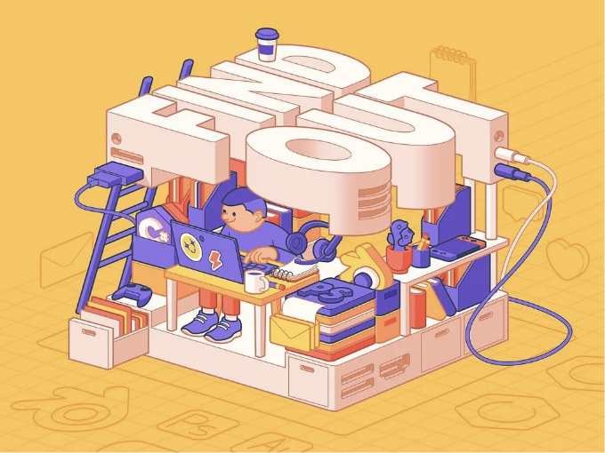
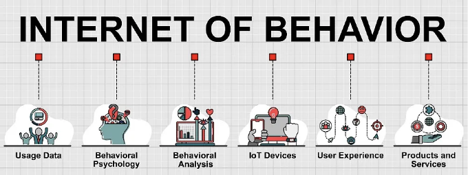
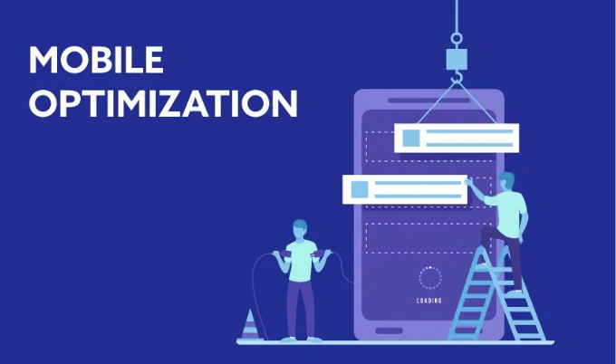

# 2024년도 최신 웹 개발 트렌드 정리

::: tip 💡이 포스팅을 읽으면

:::

디지털 혁신의 끊임없는 변화는 당신에게 끊임없는 도전과 기회의 소용돌이처럼 느껴질 수 있습니다. 개발자로서의 고민은 실제로 느껴지는 것입니다. 최신 제품을 제공하고 경쟁력을 유지하며 사용자 기대의 변화에 발 맞추는 압력은 압도적일 수 있습니다.

하지만 만약 이 복잡한 지형을 탐험할 나침반이 있다고 말한다면 어떨까요? 특정한 통찰력이 있다면 당신의 고민을 덜어줄 뿐만 아니라 창의성을 일으킬 수도 있을 것입니다. 행운이 따르는 순간입니다. 왜냐하면 우리는 웹 개발의 미래 트렌드를 탐험할 것입니다.

이 글에서는 2024년을 정의할 핵심 트렌드를 공개하고, 당신에게 선도할 수 있는 도구와 지식을 제공합니다. 우수한 개발자로서 탁월함을 추구하거나 혁신을 주도하려는 제품 소유자라면 이것이 성공으로의 로드맵입니다.

<!-- ui-log 수평형 -->

<ins class="adsbygoogle"
     style="display:block"
     data-ad-client="ca-pub-4877378276818686"
     data-ad-slot="9743150776"
     data-ad-format="auto"
     data-full-width-responsive="true"></ins>
<component is="script">
(adsbygoogle = window.adsbygoogle || []).push({});
</component>

# AI가 기술 혁신의 선두에 남아 있습니다

지난 몇 년 동안 인공 지능(AI)과 기계 학습(ML)은 단순한 모드에서부터 웹 개발의 핵심 요소로 빠르게 발전해왔습니다. 2024년에도 이러한 채택 곡선이 끊임없이 계속될 것으로 예상됩니다.

AI와 ML은 사용자 경험을 향상시키고 복잡한 프로세스를 자동화하며 수많은 대상 페르소나에게 맞춤형 콘텐츠를 제공하는 데 중추적인 역할을 할 것으로 예상됩니다. AI 기반 챗봇, 예측 분석 및 자동화된 콘텐츠 큐레이션은 2024년에도 웹 개발을 혁신시키는 몇 가지 예시에 불과합니다.

ChatGPT와 같은 생성적 AI는 이미 웹 개발에서 중요한 역할을 하고 있으며, 콘텐츠 생성을 자동화하고 코드 제안을 제공하며 디버깅 프로세스를 간소화합니다.

특히 워드프레스의 경우, AI와 ML은 워드프레스 사이트의 운영 방식을 변화시키고 있습니다. 이러한 기술은 이미 개인화된 콘텐츠 추천, 예측 검색 및 자동화된 고객 서비스와 같은 고급 기능을 가능하게 합니다.

워드프레스 사용자에게는 사용자 참여도 향상 및 사이트 기능 개선에서부터 코드 작성 및 자동화에 대한 생성적 AI까지 모든 것을 의미합니다. 현재 AI와 ML 혁신의 흐름을 고려하면 새로운 해가 펼쳐짐에 따라 두 기술 모두 워드프레스와 이상을 서로간에 강력한 흐름으로 작용할 것으로 예상됩니다.

# 행동 인터넷(IoB)이 등장합니다

<!-- ui-log 수평형 -->

<ins class="adsbygoogle"
     style="display:block"
     data-ad-client="ca-pub-4877378276818686"
     data-ad-slot="9743150776"
     data-ad-format="auto"
     data-full-width-responsive="true"></ins>
<component is="script">
(adsbygoogle = window.adsbygoogle || []).push({});
</component>

지난 몇 년간 우리는 사물 인터넷(IoT)에 대해 들어왔고 (IoT가 2024년에 급속한 발전을 이루고 있을 것이라는 조짐이 있습니다), 행동 인터넷(IoB)은 상대적으로 새로운 트렌드로, 기술과 행동 심리학을 결합하여 온라인 활동에서 수집한 데이터를 통해 사용자 행동을 이해하고 이러한 통찰력을 사용하여 더 맞춤형 온라인 경험을 제공합니다. 2024년에 IoB가 주목받기 시작할 수도 있는 연도입니다.

IoB는 온라인 활동에서 수집한 데이터를 통해 사용자 행동을 이해하고 이러한 통찰력을 활용하여 더 맞춤형 온라인 경험을 제공하는 데 초점을 맞추고 있습니다. 2024년에는 IoB가 마케터와 웹 개발자 모두에게 중요한 도

구가 될 것으로 예상되며, 이를 통해 더 매료되고 사용자 중심의 웹 사이트를 만들 수 있습니다.

워드프레스와 직접적으로 관련된 IoB 애플리케이션은 없지만, 워드프레스 사용자는 API, 플러그인 및 기타 데이터 캡처 도구를 통해 IoB 기반 전략을 추구할 수 있습니다. 이는 다음을 포함할 수 있습니다:

- 고객의 구매 행동 및 습관 분석.
- 이전에 도달할 수 없었던 장치와의 사용자 상호 작용에 대한 데이터 공개.
- 캠페인 효과를 테스트하고 결과에 따라 개선.
- IoT 기기에서 수집된 데이터에서 보다 정확한 통찰력 획득.

IoT 데이터 수집 기능과 행동 인사이트의 융합은 보다 연결된 세계와 더 잘 이해되며 반응적인 세계의 약속을 안고 있습니다. 특히 온라인 콘텐츠가 생성되고 소비되는 방식에 대해 더 많이 이해되고 대응할 수 있습니다. 이러한 하류 흐름을 고려할 때 IoB가 2024년부터 더 확장될 것으로 예상됩니다.

# 헤드리스 CMS가 주류로 등장합니다

진화하는 기술의 통합, 특히 IoT(Internet of Things)와 IoB(Internet of Behavior)와 같은 기술을 현대 웹 사이트에 통합하는 것은 헤드리스 아키텍처를 통해 상당히 강화됩니다. 이를 통해 다양한 응용 프로그램 및 장치 간의 API 기반 콘텐츠 전달이 가능합니다.

헤드리스가 새로운 개념은 아니지만, 2024년에는 특히 "헤드리스 CMS" 또는 "헤드리스 CMS"라는 용어를 통해 더욱 보급될 것으로 예상됩니다.

헤드리스 CMS는 선호하는 프런트엔드 프레임워크를 사용할 수 있는 분리된 유연성을 제공하지만 콘텐츠 편집 경험을 강조하며 다양한 응용 프로그램, 장치 및 레이아웃에 걸쳐 콘텐츠를 최적화할 수 있습니다.

이러한 유연성은 사용자 경험을 원활하게 만들고 콘텐츠 생성자를 특정 프레젠테이션 스타일의 국한에서 해방시키므로, 더 큰 혁신과 더 매료되는 콘텐츠를 유도할 수 있습니다.
이런 맥락에서 워드프레스는 헤드리스 CMS로서 엄청난 힘을 증가하고 있으며, 백엔드 콘텐츠 관리에 워드프레스를 사용하면서 동시에 다양한 프런트엔드 기술을 활용할 수 있습니다.

개발자들은 이미 헤드리스 워드프레스를 사용하고 React 또는 Angular와 같은 현대 프런트엔드 도구를 활용하여 고유한 사용자 경험을 구현하고 성능, 확장성 및 보안을 향상시키고 있습니다.

이러한 콘텐츠 관리의 강력함은 다양한 플랫폼에서 개발 및 소비되는 디지털 콘텐츠의 변화하는 요구에 부합됩니다.

따라서 2024년 동안 웹 개발의 이 분야에서 헤드리스 CMS 및 헤드리스 워드프레스가 주도할 것으로 예상됩니다.

# 마이크로 프론트엔드가 모듈러 확장됩니다

헤드리스 아키텍처는 프런트엔드(사용자 인터페이스)와 백엔드(콘텐츠 관리 시스템 또는 데이터 소스)를 분리함으로써 시작되지만, 마이크로 프론트엔드는 이를 한 단계 더 나아가 프런트엔드를 더 작고 독립적으로 배포 가능한 구성 요소로 나눕니다. 이 분리로 인해 사용자 인터페이스(UI)의 각 부분에 대해 더욱 세밀한 제어가 가능해집니다.

마이크로 프론트엔드는 프런트엔드 개발에 대한 마이크로서비스의 백엔드 개발을 변화시킨 원칙과 동일한 원칙을 적용합니다.

2024년에는 마이크로 프론트엔드가 프런트엔드 개발에 대한 가치 있는 접근 방식으로 더욱 인식되는 것으로 예상됩니다. 이 방

식은 각각의 사용자 인터페이스(UI) 섹션을 독립적으로 작동할 수 있는 프런트엔드를 작은 관리 가능한 부분으로 분할하는 것을 허용함으로써 팀의 민첩성과 효율성을 향상시킵니다(백엔드에서 마이크로서비스가 작동하는 방식과 유사합니다).

워드프레스 사용자들에게 마이크로 프론트엔드는 UI의 설계 및 관리에서 모듈성과 유연성을 도입하는 데 큰 도움이 될 수 있습니다. 다음은 그 적용 사례입니다.

- 모듈식 UI 개발: 마이크로 프론트엔드를 사용하면 워드프레스 프런트엔드를 더 작고 독립적인 구성 요소 또는 섹션으로 분해할 수 있습니다. 이러한 접근 방식은 다른 팀이나 개발자들이 사이트의 다양한 측면(특정 페이지, 위젯 또는 테마와 같은)에 독립적으로 작업할 수 있도록 하여 개발 속도와 효율성을 향상시킵니다.
- 기술 유연성: 마이크로 프론트엔드를 사용하면 워드프레스 사이트의 다양한 부분이 다른 기술이나 프레임워크를 사용할 수 있습니다. 이 유연성은 특정 기능이나 디자인 요소를 필요로 하는 사이트에 유용합니다.
- 업데이트 및 유지 관리 간소화: 마이크로 프론트엔드를 사용하면 전체 프런트엔드를 재설계하지 않고도 사이트의 특정 부분을 업데이트하거나 향상시킬 수 있습니다. 이러한 모듈성은 유지 관리와 업데이트를 더 쉽고 덜 위험하게 만듭니다.
- 성능 향상: 다양한 프런트엔드 구성 요소를 격리함으로써 마이크로 프론트엔드는 복잡하고 기능이 풍부한 인터페이스를 최적화하는 데 도움이 될 수 있습니다.
- 사용자 경험 향상: 마이크로 프론트엔드를 사용하면 보다 동적이고 반응적인 사용자 인터페이스를 생성할 수 있습니다. 사이트의 특정 부분을 다양한 사용자 세그먼트의 필요 및 행동에 맞게 조정하는 것이 더 가능해져 전반적으로 사용자 경험이 향상됩니다.

# 모바일 최적화가 새로운 높이에 달합니다

모바일 최적화는 몇 년 동안 트렌드로 여겨져 왔으므로 트렌드로 생각되지 않을 수 있습니다. 그러나 모바일 기기에 대한 최적화는 웹 개발에서 여전히 매우 중요합니다.

<!-- ui-log 수평형 -->

<ins class="adsbygoogle"
     style="display:block"
     data-ad-client="ca-pub-4877378276818686"
     data-ad-slot="9743150776"
     data-ad-format="auto"
     data-full-width-responsive="true"></ins>
<component is="script">
(adsbygoogle = window.adsbygoogle || []).push({});
</component>

뿐만 아니라, 소비자의 요구와 기대가 진화하고 모바일 기기 자체가 더 많은 기능을 제공함에 따라 2024년에는 모바일 최적화를 유지하는 것이 이전보다 더 어려울 수 있습니다.

모바일 기기에 대한 최적화는 2024년에도 매우 중요할 것입니다.

이러한 맥락에서, 웹 개발자들은 모바일 우선 디자인, 가속된 모바일 페이지(AMP)의 구현, Progressive Web Apps(PWAs)의 개발, 그리고 정밀하고 반응형 웹 디자인과 같은 한때 선택 사항으로 간주되던 요소를 우선적으로 고려해야 할 것입니다. 이러한 요소는 모든 기기에서 원활한 사용자 경험을 보장하기 위해 더 이상 선택 사항이 아닌 필수 요소가 되었습니다.

워드프레스 사이트의 경우, 모바일 트래픽의 지속적인 증가는 모바일 중심 최적화의 필요성을 강조합니다. 미래 지향적인 워드프레스 테마와 플러그인은 이미 모바일 우선 디자인 원칙을 채택하고 반응형 레이아웃이 후순위가 아닌 주요 고려 사항이 되도록 보장할 것으로 예상됩니다. 2024년에는 이러한 기대가 더욱 확고해질 것으로 예상됩니다.

# GraphQL의 널리 퍼지는 채택

2012년에 Facebook에서 개발되고 2015년에 오픈 소스로 공개된 GraphQL은 개발자가 API와 상호 작용하는 방식을 혁신했습니다. 전통적인 REST API의 제한을 극복하기 위해 설계된 GraphQL은 더 효율적이고 정확한 데이터 쿼리를 가능하게 합니다.

GitHub와 Shopify과 같은 기술 거인들이 GraphQL의 유연성과 데이터 요청의

효율성을 인식하고 도입함으로써 GraphQL의 인기가 높아지고 있습니다. 2024년에는 GraphQL이 널리 퍼지는 채택을 경험할 것으로 예상됩니다.

워드프레스의 경우, GraphQL은 REST API의 대안으로써 강력한 선택으로 떠오르고 있습니다. REST API는 이미 워드프레스와 통합되어 있지만, GraphQL의 유연성과 효율성은 더 많은 개발자들에게 끌리고 있습니다.

GraphQL은 특히 단일 쿼리에서 여러 데이터 리소스를 검색할 수 있으므로, 앱의 성능을 향상시키고 데이터 전송을 최소화하는 데 도움이 될 수 있습니다. 또한 클라이언트가 필요한 데이터만 요청할 수 있으므로 네트워크 대역폭을 줄이고 불필요한 데이터를 검색하지 않도록 할 수 있습니다.

워드프레스 개발자들은 현재 GraphQL을 사용하여 워드프레스에서 데이터를 쿼리하고 렌더링하는 방법을 연구하고 있으며, 2024년에는 이러한 노력이 더 많은 실무 적용 사례로 이어질 것으로 기대됩니다.

<!-- ui-log 수평형 -->

<ins class="adsbygoogle"
     style="display:block"
     data-ad-client="ca-pub-4877378276818686"
     data-ad-slot="9743150776"
     data-ad-format="auto"
     data-full-width-responsive="true"></ins>
<component is="script">
(adsbygoogle = window.adsbygoogle || []).push({});
</component>

# 마치며

웹 개발 트렌드는 끊임없이 변화하고 진화합니다. 새로운 기술과 도구가 계속해서 나타나면서 개발자들은 항상 최신 트렌드를 따라잡고 새로운 기회를 포착하기 위해 노력해야 합니다.

2024년은 웹 개발자들에게 많은 기회를 제공할 것으로 기대됩니다. AI와 ML의 발전, IoB의 부상, 헤드리스 CMS의 보급, 마이크로 프론트엔드 및 모바일 최적화의 증가, 그리고 GraphQL의 확대는 이번 해에 웹 개발을 새로운 높이로 끌어올릴 것입니다.

이 트렌드들을 이해하고 채택함으로써 개발자들은 더욱 혁신적인 제품을 제공하고 사용자들에게 더 나은 경험을 제공할 수 있을 것입니다. 하지만 가장 중요한 것은 항상 열려 있는 마음을 가지고 새로운 아이디어를 받아들이고 학습하며, 끊임없이 성장하고 발전하는 것입니다.
