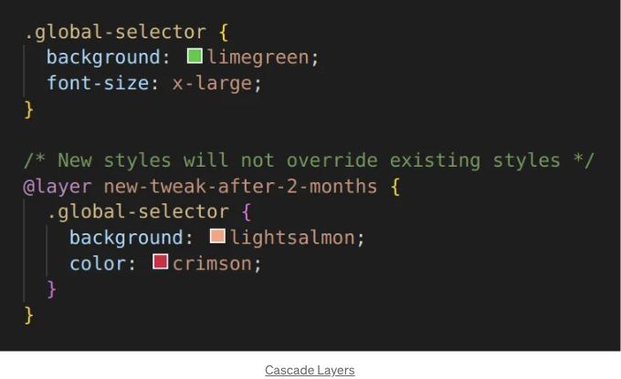
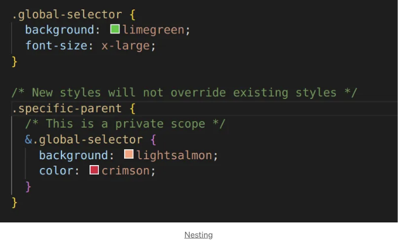

# Tailwind vs CSS 비교 정리

::: tip 💡이 포스팅을 읽으면
Tailwind와 CSS의 장단점을 비교하여 이해합니다.
:::

## Inline-classes VS CSS Nesting

Tailwind는 사랑받는 CSS 프레임워크로, 사용자 인터페이스를 만드는 데 많은 기능을 제공합니다. 이 글에서는 Tailwind의 인라인 클래스 사용에 따른 몇 가지 고려 사항을 분리하여 살펴보고, 이러한 고려 사항에 접근하는 방식을 혁신적으로 바꾸는 새로운 네이티브 CSS 기능을 짚어보겠습니다.

# Inline-classes

인라인 클래스는 Tailwind의 주목받는 기능 중 하나입니다. Tailwind에 대한 피드백을 수렴하면 다양한 의견을 받지만, 한 가지 의견이 특히 주목받았습니다.

바로 코드 편집에 대한 개발자들의 태도에 관한 것입니다:

<!-- ui-log 수평형 -->

<ins class="adsbygoogle"
     style="display:block"
     data-ad-client="ca-pub-4877378276818686"
     data-ad-slot="9743150776"
     data-ad-format="auto"
     data-full-width-responsive="true"></ins>
<component is="script">
(adsbygoogle = window.adsbygoogle || []).push({});
</component>

## 모든 것을 한 눈에 편집할 수 있다

일부 개발자는 Tailwind를 좋아하는 이유로 CSS와 HTML을 화면 전환 없이 관리할 수 있다고 표현했습니다. 여기에 대한 제 의견은 다음과 같습니다:

위의 내용은 Tailwind에 특정한 것이 아니라 소프트웨어 개발에 대한 전문적인 인식과 관련이 있습니다. 이 의견에 대한 반대가 없을 것으로 예상하며, 저는 이것이 성숙한 견해라고 믿습니다.

## 인라인 클래스의 장점

인라인 클래스는 범위를 정의합니다. Rohan은 Tailwind의 이러한 장점을 아름답게 설명했습니다:

이것은 전통적인 CSS 프로젝트의 예측할 수 없는 방법과 비교했을 때 Tailwind의 가장 매력적인 장점일 것입니다.

## 네이티브 CSS에서의 스코프

다행히도, 현대 CSS는 전통적인 CSS와는 다르게 스코프를 지정할 수 있습니다. 네이티브 CSS에는 Rohan의 시나리오를 처리할 수 있는 적어도 두 가지 방법이 있습니다.

2달 후:

또는 더 선호하는 방식으로:

이러한 접근 방식은 모두 네이티브 CSS를 사용하며, 일부 사람들에게는 사용자 정의에 약간의 패러다임 변경이 필요할 수 있습니다.

<!-- ui-log 수평형 -->

<ins class="adsbygoogle"
     style="display:block"
     data-ad-client="ca-pub-4877378276818686"
     data-ad-slot="9743150776"
     data-ad-format="auto"
     data-full-width-responsive="true"></ins>
<component is="script">
(adsbygoogle = window.adsbygoogle || []).push({});
</component>

## 인라인 클래스의 문제점

인라인 클래스에는 몇 가지 고려 사항이 있습니다. 이러한 사항은 프로젝트나 해석 방식에 따라 미미할 수도 있고 심각할 수도 있습니다.

- 인라인 클래스는 때때로 무거워질 수 있습니다: 이 글 작성 시점에서 tailwindcss.com 랜딩 HTML(편의상 사례 연구로만 언급)은 Tailwind의 인라인 클래스를 사용하며 432.5 KB의 크기를 가지고 있습니다. 클래스 속성과 그 값은 데이터의 249KB를 구성하며, 페이지 크기의 57.6%가 인라인 클래스로 인한 것입니다. 현대 네이티브 CSS를 사용하면 약 5%에서 15%를 예상할 수 있습니다.
- 무거운 HTML은 페이지 속도에 영향을 줄 수 있습니다: 프런트엔드 개발자들은 종종 "그러나 이것은 gziped 된 것이다"라고 말하여 과도한 페이로드를 정당화하기도 합니다. 그러나 서버의 gzip 크기는 약간 과장된 것입니다(이에 대해 다른 글에서 논의할 예정입니다). 이러한 시나리오에서 더 중요한 고려 사항은 인라인 스타일의 데이터 크기로 인한 DOM 속성 노드의 메모리 영향입니다.
- 속성의 혼잡성: 인라인 클래스에 대한 의견은 양극화되어 있습니다. 디버깅은 개발 및 프로덕션 코드에서 모두 수행됩니다. 이를 부인하는 사람은 거짓말을 하고 있거나 활발한 대규모 프로젝트에서 일한 경험이 없을 것입니다. HTML에는 소스 맵이 없으므로 너무 지저분해지지 않도록 주의해야 합니다.
- 높은 대역폭: 대부분의 프로젝트에서 큰 문제가 되지 않을 것입니다. 그러나 고대역폭 웹사이트의 경우 무거운 HTML은 클라우드 제공자에 따라 추가 비용이 발생할 수 있습니다. HTTP의 개념이 만들어진 시점에 CSS

스타일 시트가 캐시될 수 있도록 특별히 설계되었습니다. Tailwind의 인라인 클래스는 일반적으로 CSS 스타일 시트와 유사하게 캐시되지 않는 HTML 문서의 일부입니다.

- 중복된 스타일 방언: Tailwind는 CSS와 유사한 간소화된 방언을 정의하도록 허용합니다. 이러한 클래스는 프레임워크 CSS 규칙에 연결됩니다. 이는 직접적인 중복은 아니지만 프레임워크 코드의 CSS에도 표시되는 추가적인 가중치입니다.

# CSS 중첩이 모든 것을 바꿉니다

중첩된 스코프가 비공개이기 때문에

- 모든 요소를 클래스로 정의할 필요가 없으며, 판단하고 합리적으로 사용하면 됩니다.
- BEM, OOCSS 또는 기타 전통적인 CSS 방법론을 더 이상 따를 필요가 없습니다. 이제 그런 것들은 모두 죽었습니다.

CSS 중첩과 상대 선택자는 CSS 프레임워크보다 적은 인라인 클래스를 정의하며, 전통적인 CSS 프로젝트와 비교했을 때도 적은 인라인 클래스를 정의합니다.

<!-- ui-log 수평형 -->

<ins class="adsbygoogle"
     style="display:block"
     data-ad-client="ca-pub-4877378276818686"
     data-ad-slot="9743150776"
     data-ad-format="auto"
     data-full-width-responsive="true"></ins>
<component is="script">
(adsbygoogle = window.adsbygoogle || []).push({});
</component>

# 결론

CSS를 옛 방식으로 사용한다면, 그만두세요. 시대에 맞추는 방법을 찾아보세요. 아래 내용이 도움이 될 수 있습니다(말장난 아님):

- caniuse.com
- PostCSS
- 중첩

지난 15년 이상 동안 CSS 라이브러리와 프레임워크는 주로 과도한 인라인 클래스를 사용했습니다. Tailwind도 예외가 아닙니다.

Tailwind는 거대합니다. Tailwind에서 CSS로의 전환은 React에서 JS/TS로의 전환보다 큽니다. 따라서 어쩔 수 없이 이 글에서 제기된 많은 우려사항을 선동하는 사람들과 무리가 많을 것입니다.

CTFO, 누구도 Tailwind 사용을 그만두라고 말하는 것이 아닙니다. 개발자로서 중요한 것은 사용하는 도구보다 자신의 능력과 지식을 응원하는 것입니다. 이것은 그냥 다른 지식 출처일 뿐입니다.

여기에는 새로운 것이 없습니다. CSS-in-JS가 등장했을 때 비슷한 상황이 있었고, 처음에는 CSS 푸트 프린트를 중복 생성하고 캐시 및 무효화 개념에 반하는 것으로 인식되었습니다(이에 대해서는 완전히 해결되었는지 확실하지 않습니다).

이 글이 CSS 실제 문제와 해결책에 대한 몇 가지 점을 이해하는 데 도움이 되기를 바랍니다.

여기서 중요한 것은 "깨달음"이며 "제지"가 아닙니다.

읽어 주셔서 감사합니다 :)
