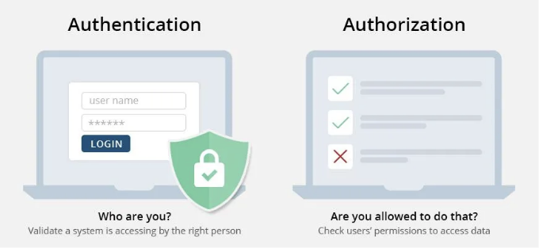
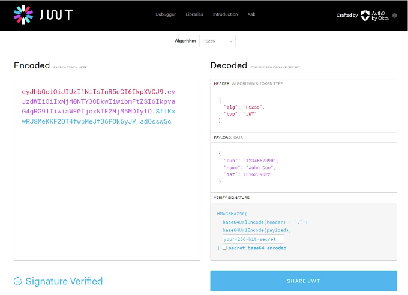
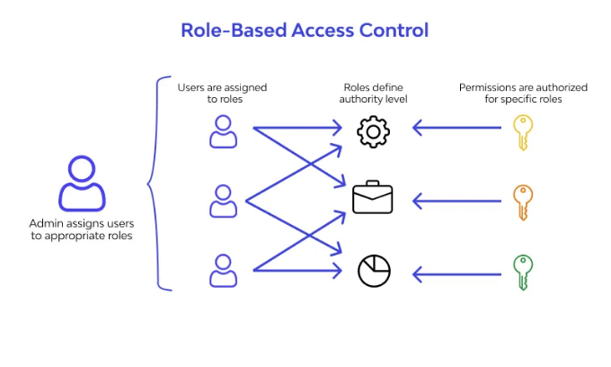
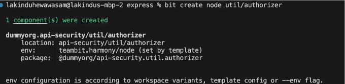
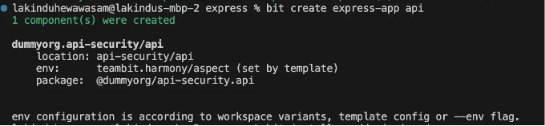
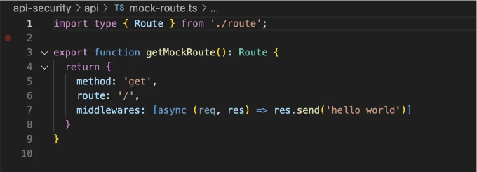
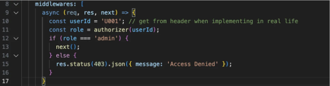
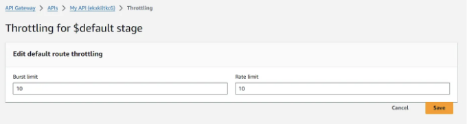

# API 권한 부여 방법 정리

::: tip 💡이 포스팅을 읽으면

:::

## API 권한 부여를 위한 4가지 Best Practices

API(Application Programming Interfaces)는 다른 소프트웨어 프로그램 간에 대화할 수 있도록 하는 비밀 문들과 같습니다. 그러나 모든 사람이 모든 문의 열쇠를 가질 필요는 없습니다. 마치 모든 소프트웨어가 모든 API에 제한 없이 액세스해야 하는 것이 아닌 것처럼요.

이러한 API는 은행의 모바일 앱부터 즐겨 찾는 소셜 미디어 플랫폼에 이르기까지 모든 것을 연결하며, 민감한 데이터를 처리하고 중요한 기능을 수행합니다.

그래서 여기에서 API 권한 부여가 필요합니다.

API 권한 부여는 게이트키퍼 역할을 하여 올바른 키를 가진 올바른 소프트웨어만이 문을 열고 내부 리소스를 사용할 수 있도록 합니다. 효과적인 API 권한 부여는 단순히 보안 이상의 것입니다. 원활하고 안전한 사용자 경험을 창출합니다. 권한이 있는 응용 프로그램만 개인 정보에 액세스하고 이러한 응용 프로그램이 허용된 범위 내에서만 작업을 수행하도록 보장합니다.

<!-- ui-log 수평형 -->

<ins class="adsbygoogle"
     style="display:block"
     data-ad-client="ca-pub-4877378276818686"
     data-ad-slot="9743150776"
     data-ad-format="auto"
     data-full-width-responsive="true"></ins>
<component is="script">
(adsbygoogle = window.adsbygoogle || []).push({});
</component>

# API 권한 부여 이해



API 권한 부여의 최상의 방법을 논의하기 전에 종종 혼동되는 두 가지 개념, 인증과 권한, 사이의 차이를 이해해야 합니다.

- 인증은 신원을 확인하는 것입니다. 사용자의 신원을 사용자 이름, 비밀번호 또는 생체 인식과 같은 방법으로 확인하는 것과 같습니다.
- 권한은 신원이 확인된 후 리소스 또는 기능에 대한 액세스를 부여하는 것입니다. 예를 들어, 인증은 앞문을 통과하는 것과 같고, 권한은 건물 내부에서 해당 사람이 어떤 방과 서비스에 액세스할 수 있는지를 결정합니다.

# API 권한 부여의 최상의 방법

이제 API 권한 부여의 중요성을 이해했으니, 이를 최대한 활용하기 위한 몇 가지 최상의 방법을 살펴보겠습니다.

## 1. 토큰 기반 권한 부여 사용(JWT, OAuth 토큰)



특히 JWT(JSON Web Tokens)와 OAuth 토큰을 사용한 토큰 기반 권한 부여는 API 상호 작용을 관리하기 위한 안전하고 효율적인 방법을 제공합니다. 예를 들어:

- 토큰은 상태 없는 인증을 가능하게 하여 서버가 각 사용자에 대한 세션 상태를 유지할 필요가 없어 확장성이 향상됩니다.
- 토큰은 다양한 방법을 통해 안전하게 전송될 수 있으며 전통적인 세션 기반 인증보다 CSRF 공격에 덜 취약합니다.
- 토큰은 도메인 간에 사용할 수 있으므로, 마이크로서비스 아키텍처 및 단일 로그인(SSO) 애플리케이션에 이상적입니다.
- 토큰, 특히 OAuth 토큰은 스코프와 권한을 포함할 수 있어 인증된 사용자의 작업에 대해 정확한 제어를 제공합니다.

## JWT를 사용한 토큰 기반 권한 부여 구현 방법

일반적으로 JWT는 사용자가 성공적으로 인증한 후 생성됩니다. 사용자 정보와 해당 사용자의 권한이 포함된 페이로드를 포함합니다. Node.js의 jsonwebtoken 또는 Python의 PyJWT와 같은 라이브러리를 사용하여 JWT 권한 부여를 구현할 수 있습니다.

먼저 JWT 토큰을 생성해야 합니다. 다음은 PyJWT를 사용하여 이를 수행하는 방법입니다:

```python
import jwt
from datetime import datetime, timedelta

secret_key = 'YOUR_SECRET_KEY'
payload = {
    'sub': user_id,
    'iat': datetime.utcnow(),
    'exp': datetime.utcnow() + timedelta(days=1)
}

token = jwt.encode(payload, secret_key, algorithm='HS256')
```

그런 다음 사용자의 요청을 검증하고 사용자가 요청을 수행할 수 있는지 결정해야 합니다. 토큰은 일반적으로 각 요청의 Authorization 헤더에 포함됩니다. 서버는 JWT를 디코딩하고 유효성을 검사할 수 있습니다. 유효한 경우, 서버는 요청을 처리하고 그렇지 않은 경우 오류를 반환합니다.

```python
from flask import

 Flask, request, jsonify
import jwt
import datetime

app = Flask(name)
SECRET_KEY = "your_secret_key"  # 사용자의 시크릿 키로 교체

# 토큰 기반 인증이 필요한 샘플 라우트
@app.route('/protected', methods=['GET'])
def protected():
    token = request.headers.get('Authorization')
    if not token:
        return jsonify({'message': '토큰이 누락되었습니다!'}), 403

    try:
        # 토큰 디코딩
        data = jwt.decode(token, SECRET_KEY, algorithms=["HS256"])
        # 필요한 경우 토큰 내의 데이터를 사용할 수 있습니다. 예를 들어:
        # user_id = data['user_id']

    except jwt.ExpiredSignatureError:
        return jsonify({'message': '토큰이 만료되었습니다!'}), 403
    except jwt.InvalidTokenError:
        return jsonify({'message': '잘못된 토큰입니다!'}), 403

    # 토큰이 유효하면 요청을 처리합니다.
    return jsonify({'message': '토큰이 유효합니다! 보호된 라우트에 액세스할 수 있습니다.'})
```

<!-- ui-log 수평형 -->

<ins class="adsbygoogle"
     style="display:block"
     data-ad-client="ca-pub-4877378276818686"
     data-ad-slot="9743150776"
     data-ad-format="auto"
     data-full-width-responsive="true"></ins>
<component is="script">
(adsbygoogle = window.adsbygoogle || []).push({});
</component>

## 2. 세밀한 접근 제어 구현



세밀한 접근 제어는 응용 프로그램의 권한과 액세스 권한에 대한 자세한 제어를 제공하는 보안 관리 접근 방식입니다. 사용자 또는 서비스가 필요한 액세스만 가지고 있도록 보장하며 최소 권한의 원칙을 준수합니다.

## 세밀한 접근 제어 구현 방법:

세밀한 접근 제어를 구현하는 것에는 여러 단계가 포함됩니다:

- 역할 및 권한 정의: 시스템 내에서 다른 사용자 역할을 식별하고 각 역할의 특정 작업을 정의합니다.
- 역할 기반 접근 제어(RBAC) 사용: 역할에 기반하여 리소스 액세스를 부여합니다. 각 역할에는 특정 권한이 할당됩니다.
- 속성 기반 접근 제어(ABAC) 고려: 더 복잡한 시나리오의 경우 ABAC를 사용할 수 있습니다. 여기서 액세스 결정은 속성(사용자, 리소스, 환경)의 조합에 따라 이루어집니다.

예를 들어, 관리자와 사용자 간에 액세스가 다른 API가 있다면, 독립적인 구성 요소를 사용하여 액세스 제어 메커니즘을 구현할 수 있습니다. 예를 들어, Bit를 사용하여 API 요청을 승인하는 독립적인 인증 구성 요소를 빌드할 수 있습니다.

다음과 같이 수행할 수 있습니다:

1. "authorizer"라는 Node.js 구성 요소를 만들어서 인증 로직을 구현할 수 있습니다.

```bash
bit create node util/authorizer
```

올바르게 수행하면 다음과 같은 결과가 나타납니다:



그런 다음, 인증자 로직을 구현하십시오.

```typescript
export function authorizer(userId: string) {
  // 사용자 역할을 검색하는 로직을 구현합니다.
  if (userId === "U001") {
    return "admin";
  }
  return "customer";
}
```

다음으로 Express 앱을 생성하십시오.

```bash
bit create express-app api
```

결과는 다음과 같습니다:



다음으로, mock-route.ts를 업데이트하여 인증자를 앱에 연결합니다. 초기에는 다음과 같습니다:



새로운 미들웨어를 추가하십시오.



함수를 연결하여 엔드포인트에 역할 기반 액세스 제어를 강제합니다. 데코레이터는 사용자의 역할이 엔드포인트에 필요한 역할과 일치하는지 확인하고 그렇지 않으면 액세스 거부 메시지를 반환합니다.

그리고 계속해서 인증자 로직을 업데이트하고 앱을 업데이트하면 Bit의 CI 서버인 Ripple CI가 모든 트리에 변경 사항을 자동으로 업데이트합니다.

## 3. 안전한 API 게이트웨이 구성

API 게이트웨이는 모든 API 요청의 프런트도어 역할을 하며 보안 및 운영 정책을 중앙 집중식으로 적용합니다. 예를 들어, API 게이트웨이를 사용하면 다음과 같은 기능을 수행할 수 있습니다:

- 향상된 보안: DDoS 공격, 무단 액세스 및 API 남용과 같은 위협으로부터 보호하는 추가 보안 계층을 제공합니다.
- 요청 비율 제한 및 스로틀링: API 과도한 사용을 방지하고 사용자 간 공정한 사용을 보장합니다.
- 데이터 변환 및 유효성 검사: 들어오는 데이터가 예상된 형식과 표준을 준

수하는지 확인합니다.

<!-- ui-log 수평형 -->

<ins class="adsbygoogle"
     style="display:block"
     data-ad-client="ca-pub-4877378276818686"
     data-ad-slot="9743150776"
     data-ad-format="auto"
     data-full-width-responsive="true"></ins>
<component is="script">
(adsbygoogle = window.adsbygoogle || []).push({});
</component>

## 안전한 API 게이트웨이 구성 방법:

응용 프로그램에는 여러 API 게이트웨이 공급자를 선택할 수 있습니다. 예를 들어, Amazon API Gateway, Kong 및 Google의 Apigee는 가장 인기 있는 API 게이트웨이 플랫폼 중 일부입니다.

AWS를 사용할 계획이라면 AWS의 문서를 따라 API 게이트웨이를 쉽게 생성할 수 있습니다. 그러나 API 게이트웨이가 안전하고 효율적으로 작동하도록 하려면 몇 가지 추가 작업이 필요합니다.

- 요청 비율 제한 설정 — AWS 관리 콘솔에서 Amazon API Gateway로 이동하여 API를 선택하고 보호 탭 아래의 스로틀링 섹션으로 이동합니다. 거기에서 요율 및 버스트 제한을 설정할 수 있습니다.



- SSL/TLS 활성화 — API 게이트웨이의 사용자 정의 도메인 이름이 AWS Certificate Manager에서 SSL/TLS 인증서와 연관되어 있는지 확인합니다.
- IP 제한 구현 — AWS Lambda 인증자를 사용하여 들어오는 요청의 IP 주소를 확인합니다. 함수를 배포한 후 새로운 API 게이트웨이의 인증자를 만들 때 함수를 선택할 수 있습니다. 여기에는 Python에서 IP를 제한하는 샘플 Lambda 함수가 있습니다.

```python
import json

def lambda_handler(event, context):
    ip_address = event['requestContext']['identity']['sourceIp']
    allowed_ips = ['192.168.1.1']  # 허용된 IP 목록
    # ip_address가 allowed_ips에 있는지 확인하는 로직을 추가합니다.

    if ip_address not in allowed_ips:
        raise Exception('Unauthorized')

    return {
        'principalId': 'user',
        'policyDocument': {
            'Version': '2012-10-17',
            'Statement': [{
                'Action': 'execute-api:Invoke',
                'Effect': 'Allow',
                'Resource': event['methodArn']
            }]
        }
    }
```

- CloudWatch Logs 활성화 — AWS 관리 콘솔에서 API 게이트웨이의 설정으로 이동합니다. CloudWatch Settings 섹션에서 Enable CloudWatch Logs 옵션을 확인합니다. 모든 요청 및 응답을 기록하려면 로그 수준을 INFO로 설정하거나 오류 응답만 기록하려면 ERROR로 설정합니다.

## 4. 데이터의 이동과 정지 시 민감한 데이터 암호화

이동 중 및 정지 시 민감한 데이터를 암호화하는 것은 권한 없는 액세스 및 침해로부터 데이터를 보호하는 데 필수적인 보안 관행입니다. 이동 중 암호화는 클라이언트와 서버 간에 데이터가 이동하는 동안 데이터를 안전하게 보호하며, 정지 중 암호화는 디스크나 데이터베이스에 저장된 데이터를 안전하게 보호합니다.

## 데이터 이동 중 암호화 구현 방법

만약 고유한 웹서버를 사용 중이라면 SSL/TLS 인증서를 수동으로 설정하고 관리해야 합니다. 먼저 신뢰할 수 있는 Certificate Authority(CA)에서 인증서를 획득해야 합니다. Let's Encrypt, DigiCert, GoDaddy 등과 같은 신뢰할 수 있는 CA에서 인증서를 얻습니다. 그런 다음 서버를 CA와 함께 사용하도록 구성합니다. 예를 들어, Nginx에서 SSL을 구성하는 방법은 다음과 같습니다:

- Nginx 구성 파일을 수정합니다(일반적으로 /etc/nginx/nginx.conf 또는 /etc/nginx/sites-available/your_site에서 찾을 수 있음).
- 서버 블록에 SSL 설정을 추가합니다:

```nginx
server {
    listen 443 ssl;
    server_name yourdomain.com;

    ssl_certificate /path/to/your/fullchain.pem; # CA로부터의 fullchain.pem 경로
    ssl_certificate_key /path/to/your/privkey.pem; # CA로부터의 개인 키 경로

    # 강력한 암호화 설정 (Mozilla의 SSL 구성 생성기 권장 사항 사용을 고려하세요)
    ssl_protocols TLSv1.2 TLSv1.3;
    ssl_ciphers 'ECDHE-ECDSA-AES128-GCM-SHA256:ECDHE-RSA-AES128-GCM-SHA256...';

    # 기타 서버 구성...
}
```

클라우드 서비스를 사용하는 경우, 그들은 SSL/TLS를 처리하기 위한 완전히 관리되는 서비스를 제공합니다. 예를 들어, AWS에서는 AWS Certificate Manager를 사용할 수 있습니다.

<!-- ui-log 수평형 -->

<ins class="adsbygoogle"
     style="display:block"
     data-ad-client="ca-pub-4877378276818686"
     data-ad-slot="9743150776"
     data-ad-format="auto"
     data-full-width-responsive="true"></ins>
<component is="script">
(adsbygoogle = window.adsbygoogle || []).push({});
</component>

## 정지 중 암호화 구현 방법

데이터베이스 수준, 응용 프로그램 수준 또는 클라우드 기반 도구를 사용하여 정지 중 암호화를 구현할 수 있습니다.

- 데이터베이스 수준 암호화: 많은 현대 데이터베이스가 내장된 암호화 기능을 제공합니다. 예를 들어:
- SQL Server: Transparent Data Encryption.
- MySQL: InnoDB tablespace encryption.
- MongoDB: Encrypted Storage Engine.
- 응용 프로그램 수준 암호화: 높은 민감도의 데이터에 대해서는 응용 프로그램 수준 암호화를 사용하여 데이터를 데이터베이스에 저장하기 전에 암호화합니다. 이를 위해 cryptography와 같은 라이브러리를 사용할 수 있습니다:

```python
from cryptography.fernet import Fernet

# 키 생성
key = Fernet.generate_key()
cipher_suite = Fernet(key)

# 데이터 암

호화
cipher_text = cipher_suite.encrypt(b"Hello, world!")

# 데이터 복호화
plain_text = cipher_suite.decrypt(cipher_text)
```

- 클라우드 기반 도구: AWS, Azure, Google Cloud Platform 등의 클라우드 제공 업체는 데이터베이스 암호화를 위한 다양한 서비스를 제공합니다. 예를 들어, AWS의 Amazon RDS는 데이터베이스 스냅샷을 암호화하는 기능을 제공합니다.

## 결론

API 보안은 모든 응용 프로그램 개발자 및 시스템 관리자에게 중요한 주제입니다. 효과적인 API 권한 부여, 세밀한 접근 제어, 안전한 API 게이트웨이 구성 및 데이터의 이동과 정지 시 민감한 데이터 암호화를 포함한 최신 보안 관행을 따르는 것은 사용자 데이터를 보호하고 시스템의 안정성을 유지하는 데 필수적입니다.

이러한 보안 조치를 적용하는 것은 사용자의 신뢰를 유지하고 개인 정보 침해를 방지하는 데 도움이 될 것입니다. API를 사용하는 모든 개발자 및 조직은 이러한 권장 사항을 따르고 최신 보안 업데이트를 유지하는 것이 중요합니다.
