# UI UX 최신 트렌드 정리(2024년 최신)

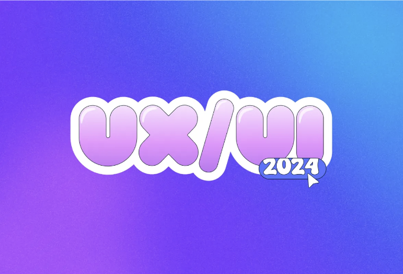

2024년에는 UI/UX 디자인 분야가 흥미로운 변화를 겪을 것으로 예상됩니다. 이전 년도의 트렌드에서 영감을 받아 동기부여를 얻고, 앞으로의 가능성으로 걸어가 보겠습니다. 이 블로그 글에서는 선별된 트렌드들을 주의 깊게 모아놓았는데요, 이 트렌드들이 최소한 다음 11개월 동안, 혹은 그 이상의 시간 동안 디지털 랜드스케이프를 형성할 것으로 기대합니다. 모든 조직 단위에 효율성을 재정립하는 인공 지능(AI)의 지배적 존재로, UI 및 UX 팀에도 영향을 미칠 것으로 거의 확실시됩니다.

준비가 되고 기대감이 높아지면서, 우리는 기다리고 있는 가장 흥미로운 변형적 트렌드 중 일부를 살펴보겠습니다.

<!-- ui-log 수평형 -->

<ins class="adsbygoogle"
     style="display:block"
     data-ad-client="ca-pub-4877378276818686"
     data-ad-slot="9743150776"
     data-ad-format="auto"
     data-full-width-responsive="true"></ins>
<component is="script">
(adsbygoogle = window.adsbygoogle || []).push({});
</component>

# UI 트렌드

## 레트로 그루비 타이포그래피

최근 몇 년간, 디자인 세계는 주목할 만한 타이포그래피를 사용하여 텍스트를 주목성을 부여하기 위해 전략적으로 배치하여 UI 분야에서 큰 타이포그래피의 지배를 목격했습니다. 2024년에는 과거 시대의 미학을 재미있고 혁신적인 방식으로 재상상하여 새로운 창의성의 파도를 불러일으키는 신선한 창의성의 파도가 몰아칩니다.

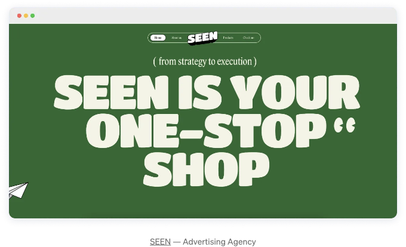

이 트렌드의 아이디어는 70년대와 80년대의 빈티지하고 화려한 디자인에서 기억을 불러일으키는 동안 이를 시대를 초월적이고 재미있게 만드는 것입니다. 이 디자인 스타일은 과거에서 영향을 받아 현대적인 인터페이스에 고전적인 느낌을 주며, 혼잡한 디지털 랜드스케이프에서 사용자 경험을 기억에 남고 독특하게 만들기 위해 이러한 미학을 점점 더 많이 사용하고 있습니다. 레트로 타이포그래피는 오래된 것과 새로운 것을 시대를 초월적인 방식으로 결합하여 사람들과의 깊은 연결을 만들 수 있는 경험을 디자이너가 만들 수 있도록 해주는 가치 있는 트렌드입니다.

레트로 그루비 타이포그래피를 사용하면 대부분의 산업이 이점을 얻을 수 있지만, 소매, 화장품 및 패션 브랜드가 이 트렌드에서 가장 큰 이점을 얻을 수 있습니다.

<!-- ui-log 수평형 -->

<ins class="adsbygoogle"
     style="display:block"
     data-ad-client="ca-pub-4877378276818686"
     data-ad-slot="9743150776"
     data-ad-format="auto"
     data-full-width-responsive="true"></ins>
<component is="script">
(adsbygoogle = window.adsbygoogle || []).push({});
</component>

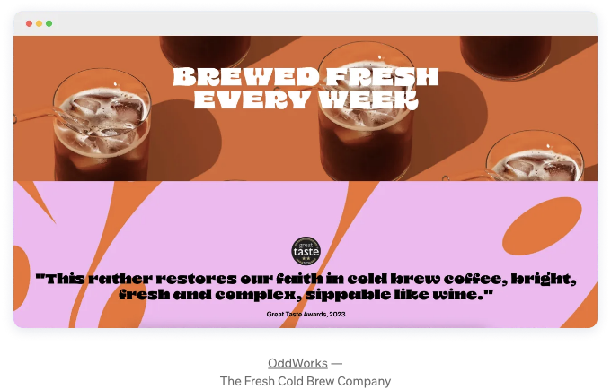

## 해체된 히어로 섹션

히어로 섹션은 웹 사이트를 방문할 때 사용자가 처음으로 만나는 인사입니다. 조금 다르고 보편적인 방법을 따르지 않는 것이 처음 눈에 띄게 만들어 첫인상을 남기게 만듭니다. 해체된 히어로 섹션 트렌드는 기존 방식의 경계를 넘어서 메모리에 남을 수 있도록 합니다.

이 트렌드의 본질은 의도적인 해체 행위에 있습니다. 디자이너들은 내용 단편, 굵은 타이포그래피 및 정렬되지 않은 이미지를 통합하여 호기심과 경이로운 환경을 조성하여 히어로 섹션을 재상상하고 있습니다. 일반적인 것을 의문하여 디자이너는 사용자의 주의를 끌뿐만 아니라 전체 사용자 경험의 분위기를 설정할 수 있는 고유한 입구를 만들 수 있습니다.

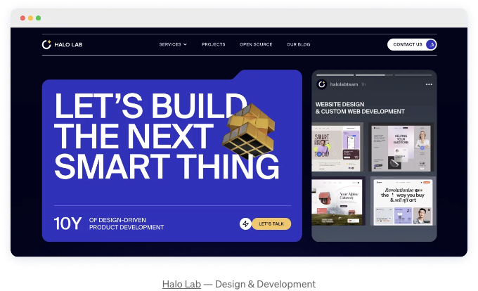

디자인이 최소한이든 과다하게 모양과 색상으로 가득 찬 것이든, 해체된 히어로 섹션은 사용자들에게 더 많은 정보를 알고 싶게 만들 것입니다. 요소와 공백을 조작하여 완벽한 조화를 만드는 데 두려워하지 마십시오.

<!-- ui-log 수평형 -->

<ins class="adsbygoogle"
     style="display:block"
     data-ad-client="ca-pub-4877378276818686"
     data-ad-slot="9743150776"
     data-ad-format="auto"
     data-full-width-responsive="true"></ins>
<component is="script">
(adsbygoogle = window.adsbygoogle || []).push({});
</component>

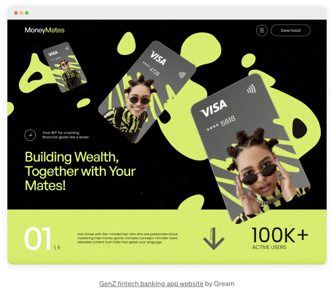

## 오프 화이트는 새로운 화이트

화면이 우리의 일상적인 상호작용을 지배하는 현대 디지털 시대에는 눈을 부담스럽게 하는 순수한 흰색에서 색의 미학적인 변화가 나타났습니다. 이러한 변화로 인해 "오프 화이트는 새로운 화이트"라는 트렌드가 등장했는데, 이는 전반적인 사용자 경험을 향상시키기 위한 미학적 선택입니다.

이것은 디자인 요소들이 빛나는 순수한 흰색 배경의 엄격함을 줄이고 친근하면서도 클래식한 모습을 제공하기 위한 오프 화이트 미학을 영감으로 합니다. 부드러운 배경은 다른 디자인 요소들이 돋보일 수 있도록 합니다.

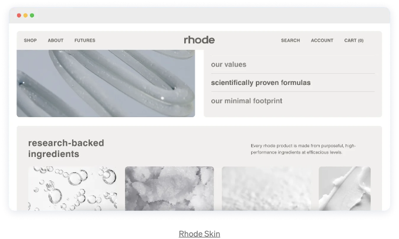

디자이너들은 색상이 사용자 경험에 미치는 감정적인 중요성을 깨달았기 때문에, 현대주의와 고전적인 세련미의 조화를 이루기 위한 전략적인 결정으로 오프 화이트 톤으로의 이동이 계획된 것입니다. 이 스타일은 단순히 시대에 따라 현대적이고 아담하면서도 친근하게 만드는 데만 사용되지 않으며, 디자인에서 따뜻함과 접근성을 느끼게 하는 전략적인 결정입니다.

<!-- ui-log 수평형 -->

<ins class="adsbygoogle"
     style="display:block"
     data-ad-client="ca-pub-4877378276818686"
     data-ad-slot="9743150776"
     data-ad-format="auto"
     data-full-width-responsive="true"></ins>
<component is="script">
(adsbygoogle = window.adsbygoogle || []).push({});
</component>

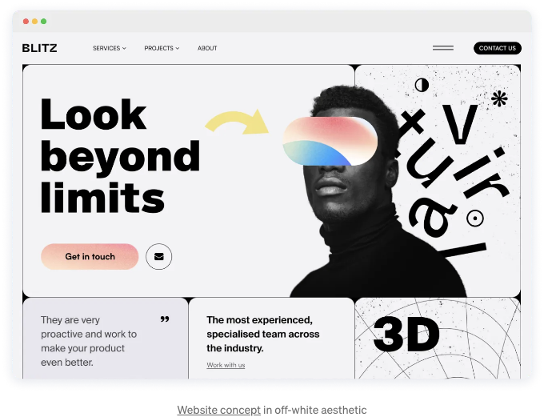

## 커서 재발명

커서는 항상 존재하지만 대부분의 시간 동안은 주의를 기울이지 않습니다. 디자이너들은 그것을 바꿔 이용하고 경험을 더욱 향상시키기 위해 추가적인 상호 작용의 정도로 업그레이드하는 데 관심이 있습니다.

이 재발명은 단순히 재미와 꾸며짐에 그치지 않고 사용자 경험을 향상시키기 위한 것입니다. 혼란스러우고 순전히 장식적인 사용자 정의 커서는 사라졌으며, 대신 디자이너들은 커서를 유용하고 기쁨을 줄 수 있는 혁신적인 방법으로 만들기 위해 노력하고 있습니다.

여러 가지 커서 옵션을 신중하게 선택하여 프로젝트 전체에 일관성을 유지하면서, 지나치게 복잡한 효과를 피하십시오.

그리고 기억하세요, 이것은 데스크톱에서만 사용할 수 있는 옵션입니다. 태블릿이나 모바일(또는 다른 터치 스크린 장치)에서는 표시되지 않습니다. 사용자의 데스크톱 경험을 향상시키는 방법으로 커서를 다루되 모바일에서는 손상되지 않도록하십시오.

<!-- ui-log 수평형 -->

<ins class="adsbygoogle"
     style="display:block"
     data-ad-client="ca-pub-4877378276818686"
     data-ad-slot="9743150776"
     data-ad-format="auto"
     data-full-width-responsive="true"></ins>
<component is="script">
(adsbygoogle = window.adsbygoogle || []).push({});
</component>

## 데이터 시각화

오늘날의 급속한 세상은 데이터와 많은 양의 데이터로 지배되고 있습니다. 따라서 데이터 시각화는 복잡한 데이터 세트를 시각적 요소를 사용하여 효과적이고 빠르게 통신하도록 단순화하는 기술입니다.

코딩과 UX/UI 디자인의 급속한 발전 덕분에 혼란스러운 차트와 표의 시대는 사라지고 간소화된 데이터 시각화 접근법이 중심에 있습니다. 레퍼토리는 이제 그래프, 카운터, 이미지 및 상호 작용 맵을 포함하여 다양한 가능성을 제공합니다.

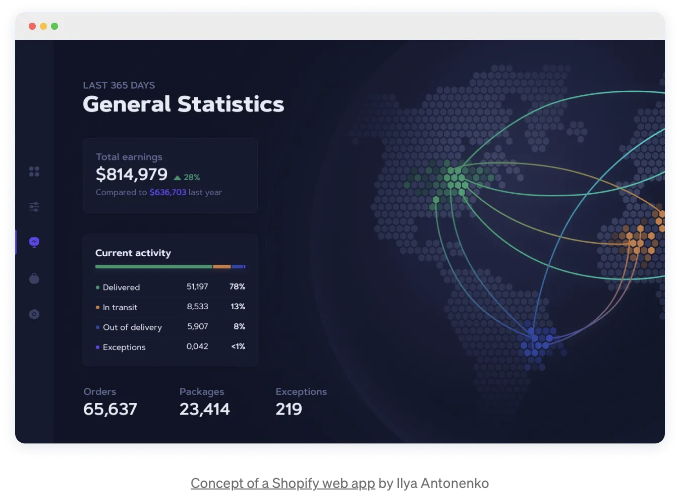

Spotify, Headspace 또는 Apple Health와 같은 앱들은 더 크고 향상된 개인화를 추구하고, 사용자가 실제로 필요로 하는 보다 단순하고 통찰력 있는 데이터를 제공합니다. 사용자의 좋아하는 노래와 장르부터 건강과 피트니스 정보까지 - 데이터는 사용자에게 작업할 내용을 제공하고 매일 더 나아지도록 동기를 부여합니다.

개인화 이외에도 기업은 데이터 시각화를 사용하여 기능과 성과를 강조합니다. 주요 포인트는 명확한 시각적 그래픽으로 요약되어 정보를 효과적으로 사용자 또는 이해 관계자에게 전달합니다. 정보의 시대에서 데이터 시각화는 복잡성을 단순화하는 도구로서뿐만 아니라 사용자를 참여시키고 동기를 부여하는 강력한 수단으로 등장합니다.

<!-- ui-log 수평형 -->

<ins class="adsbygoogle"
     style="display:block"
     data-ad-client="ca-pub-4877378276818686"
     data-ad-slot="9743150776"
     data-ad-format="auto"
     data-full-width-responsive="true"></ins>
<component is="script">
(adsbygoogle = window.adsbygoogle || []).push({});
</component>

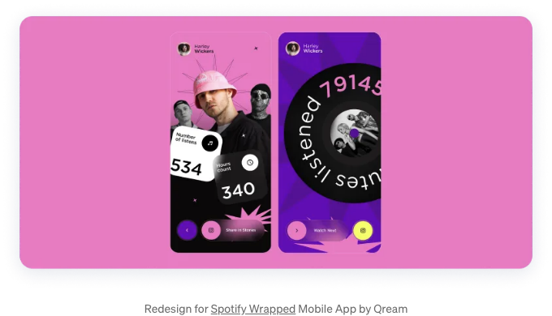

# UX 트렌드

## AR/VR 몰입형 경험

고속으로 발전하는 기술 혁신은 증강 현실(AR) 및 가상 현실(VR)을 대중과 더 가깝게 만든 바 있습니다. 이 공간적 개념은 사용자가 현실과 가상 세계를 원활하게 융합할 수 있는 새로운 디자인 도전 과제와 접근 방법을 만들어냈습니다.

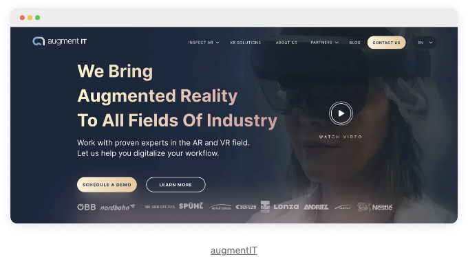

<!-- ui-log 수평형 -->

<ins class="adsbygoogle"
     style="display:block"
     data-ad-client="ca-pub-4877378276818686"
     data-ad-slot="9743150776"
     data-ad-format="auto"
     data-full-width-responsive="true"></ins>
<component is="script">
(adsbygoogle = window.adsbygoogle || []).push({});
</component>

이러한 대화식이고 몰입형 경험의 사용은 날이 갈수록 커지고 있습니다. AR 및 VR은 의료, 엔터테인먼트, 게임, 소매부터 교육 및 협업까지 디지털 공간과 콘텐츠와의 상호 작용 방식을 혁신적으로 바꿀 수 있는 능력을 가지고 있습니다.

이러한 기술은 디자이너가 전통적인 인터

페이스의 경계를 넘어서 생각할 수 있는 기회를 제공합니다. 디자이너들은 확장된 경험을 위해 스토리텔링 기법, 사운드, 애니메이션 및 3D 객체를 사용하여 실험할 수 있습니다.

<!-- ui-log 수평형 -->

<ins class="adsbygoogle"
     style="display:block"
     data-ad-client="ca-pub-4877378276818686"
     data-ad-slot="9743150776"
     data-ad-format="auto"
     data-full-width-responsive="true"></ins>
<component is="script">
(adsbygoogle = window.adsbygoogle || []).push({});
</component>

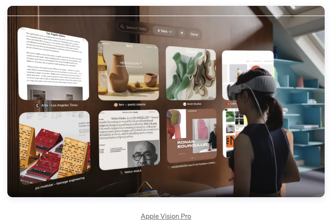

## 음성 사용자 인터페이스(VUIs)

음성 사용자 인터페이스 또는 VUI라고 불리는 음성 인식 기술은 컴퓨터, 스마트폰 또는 기타 장치와 대화하기 위해 음성 명령을 사용하는 기술을 말합니다. 이러한 인터페이스는 스마트 홈 장치(예: 아마존의 Alexa)부터 시리(예: 애플 장치)에 이르기까지 점차적으로 인기를 얻고 있습니다.

예를 들어 아마존의 Alexa와 같은 스마트 홈 장치는 빛을 제어하거나 음악을 재생하거나 정보를 제공하기 위해 음성 명령에 응답합니다. 애플 장치의 Siri는 자연스러운 언어 대화로 사용자를 참여시켜 작업을 수행하고 쿼리에 답합니다. YouTube와 Google과 같은 플랫폼은 사용자가 음성으로 콘텐츠를 탐색하도록 허용하여 접근성과 편의성을 높입니다.

## 멀티 모달 인터페이스

이전 두 주제에서 각각의 인터페이스 유형을 다루었으며, 이것은 우리를 여러 모드의 인터페이스로 이어지게 합니다. 이러한 선택은 다양한 입력 방식을 결합하여 터치, 수동 제스처, 펜 및 음성을 포함합니다.

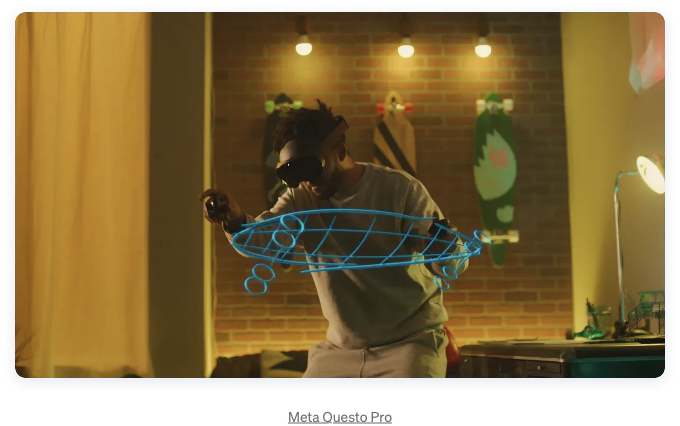

AR, VR 및 VUI에 대한 논의에서도 멀티 모달 특성이 자주 나타납니다. Apple Vision Pro, Meta Wayfarer 및 Alexa와 같은 음성 어시스턴트는 터치, 제스처 및 음성을 융합하여 사용자에게 풍부하고 다양한 상호 작용 경험을 제공합니다.

<!-- ui-log 수평형 -->

<ins class="adsbygoogle"
     style="display:block"
     data-ad-client="ca-pub-4877378276818686"
     data-ad-slot="9743150776"
     data-ad-format="auto"
     data-full-width-responsive="true"></ins>
<component is="script">
(adsbygoogle = window.adsbygoogle || []).push({});
</component>

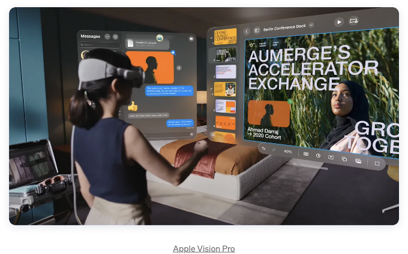

## 생성적 인공 지능

AI는 의심할 여지없이 작년 가장 큰 주제 중 하나입니다. 사용자 경험 지식과 AI가 제공할 수 있는 머신러닝 알고리즘을 연결함으로써 우리는 사용자 중심의 딥 퍼스널라이즈드 및 매력적인 경험을 만들 수 있습니다.

AI의 파워를 활용하여 사용자 경험을 향상시키는 데 어떻게 기여할 수 있습니까? 다음은 AI가 중요한 역할을 하는 핵심 측면입니다.

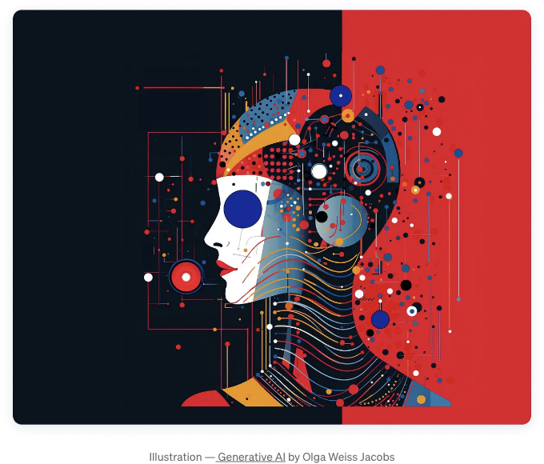

- 아이디어 탐색: 모든 가능한 맥락을 탐색하여 아이디어와 개념을 테스트하고 분석합니다.
- UX 연구: 새로운 주제를 배우고, 새로운 워크플로를 평가하고, 리소스 제안을 요청하고, 사용자 질문 및 프로토콜을 작성하고 업그레이드하며, 데이터를 더 빨리 분석하고 더 나은 보고서를 제공합니다.
- 데이터 기반 의사 결정: 더 깊고 포괄적인 데이터를 통해 사용자 중심의 디자인 결정을 위한 보다 나은 정보를 제공합니다.

이러한 인공 지능 기술은 사용자의 필요에 맞게 콘텐츠를 추천하고 개인화된 경험을 제공할 수 있습니다. 이는 사용자의 욕구와 요구에 따라 동적으로 조정되는 인터페이스를 통해 심층적인 상호 작용을 제공합니다.

# 결론

이러한 UI/UX 트렌드들은 지난 몇 년 동안 혁신의 중심이었던 핵심 원리와 기존의 아이디어들에서 영감을 받았습니다. 그러나 이들은 또한 새로운 창의적인 방식으로 발전해왔습니다. 미래를 위한 디자인을 적용하고자 한다면, 사용자 경험을 향상시키고 최신 트렌드에 발맞추는 것이 중요합니다. 이를 통해 사용자 중심의 디지털 환경을 구축하고 유지할 수 있습니다.
