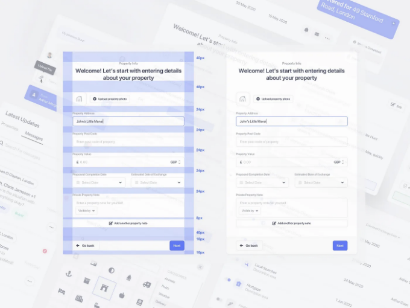
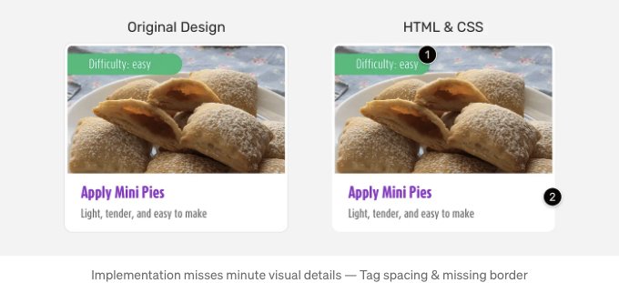
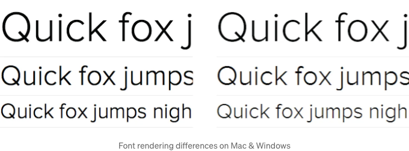
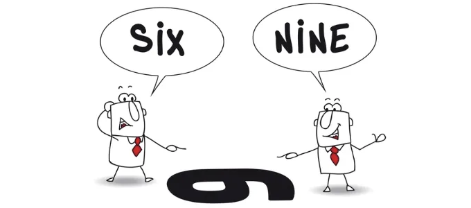

# 더 인정받는 웹 디자인을 하는 방법

## 왜 내가 개발한 웹 페이지가 UX 디자인과 맞지 않는 걸까요?

웹 페이지를 디자인 계획대로 정확하게 만드는 것을 '픽셀 완벽한 웹 디자인 또는 구현'이라고 합니다. 이는 시각적 디자인을 웹 개발로 정확하게 번역하여 최종 제품이 원래 디자인 의도와 가깝게 보이도록 하는 것을 의미합니다. 이러한 세심한 주의는 일관된 및 정제된 사용자 경험을 유지하는 데 중요합니다.

<!-- ui-log 수평형 -->

<ins class="adsbygoogle"
     style="display:block"
     data-ad-client="ca-pub-4877378276818686"
     data-ad-slot="9743150776"
     data-ad-format="auto"
     data-full-width-responsive="true"></ins>
<component is="script">
(adsbygoogle = window.adsbygoogle || []).push({});
</component>

## 내 웹 페이지가 디자인과 다르게 보이는 이유

### 세부 사항에 대한 주의 부족 및 디자인 도구에 대한 부족한 지식

- 여러 시각적 세부 사항에 주의를 기울이는 것은 특정 디자인 요소에 중요합니다. 이는 간격, 정렬, 글꼴 크기, 그래디언트, 그림자 및 전체적인 시각적 일관성과 같은 요소들을 면밀히 고려하는 것을 의미합니다.
- 개발자는 카드에 그림자가 있는 경우 테두리를 놓치기 쉽습니다.
- 디자인 도구 사용에 어려움을 겪을 수 있으며, 이는 디자인 파일을 정확한 코드로 번역하는 데 어려움을 줄 수 있습니다.

<!-- ui-log 수평형 -->

<ins class="adsbygoogle"
     style="display:block"
     data-ad-client="ca-pub-4877378276818686"
     data-ad-slot="9743150776"
     data-ad-format="auto"
     data-full-width-responsive="true"></ins>
<component is="script">
(adsbygoogle = window.adsbygoogle || []).push({});
</component>

### 시간 및 리소스 제한

- 프로젝트 기한이 타이트할수록 개발자들은 속도를 우선시하는 경향이 있으며, 이는 세부 사항에 주의를 기울이지 않고 제품의 품질을 저하시킬 수 있습니다.

### 브라우저 호환성

<!-- ui-log 수평형 -->

<ins class="adsbygoogle"
     style="display:block"
     data-ad-client="ca-pub-4877378276818686"
     data-ad-slot="9743150776"
     data-ad-format="auto"
     data-full-width-responsive="true"></ins>
<component is="script">
(adsbygoogle = window.adsbygoogle || []).push({});
</component>

- 다른 웹 브라우저는 렌더링 엔진과 CSS 또는 HTML 기능 지원의 차이로 인해 웹 페이지를 약간 다르게 렌더링할 수 있습니다.

### 반응형 디자인과 장치 다양성

- 디바이스, 화면 크기 및 플랫폼의 차이점은 디자인 구현 방식에 영향을 미칠 수 있습니다.
- 반응형 레이아웃을 위한 디자인 시 픽셀 완벽함을 보장하는 것이 더 복잡해집니다.

### 기술적 한계와 기술적 지식 부족

<!-- ui-log 수평형 -->

<ins class="adsbygoogle"
     style="display:block"
     data-ad-client="ca-pub-4877378276818686"
     data-ad-slot="9743150776"
     data-ad-format="auto"
     data-full-width-responsive="true"></ins>
<component is="script">
(adsbygoogle = window.adsbygoogle || []).push({});
</component>

- 개발자들은 UX 디자이너가 고안한 복잡한 디자인 요소를 구현하는 데 필요한 기술 또는 전문 지식이 부족할 수 있습니다.

### 동적인, 확장 가능한 콘텐츠 및 미디어

- 디자인은 일반적으로 정적 또는 제한된 콘텐츠와 함께 제공되므로 개발자들은 동적인 웹 페이지의 특성을 고려해야 합니다.

### 디자인의 의사소통 부재 및 오해

<!-- ui-log 수평형 -->

<ins class="adsbygoogle"
     style="display:block"
     data-ad-client="ca-pub-4877378276818686"
     data-ad-slot="9743150776"
     data-ad-format="auto"
     data-full-width-responsive="true"></ins>
<component is="script">
(adsbygoogle = window.adsbygoogle || []).push({});
</component>

- UX 디자이너와 개발자 간의 효과적인 의사소통 부재는 오해로 이어질 수 있습니다.

### 디자인 시스템 제한과 일관되지 않은 디자인

- 일관되지 않은 디자인은 개발자들에게 도전을 제공합니다.

웹 구현과 디자인의 일치는 사용자 만족도를 향상시키며, 다양한 플랫폼에서 웹 사이트의 기능성과 사용성을 보장합니다. 개발자들은 브랜드/디자이너가 설정한 비전을 실현하는 데 다양한 도전에 직면합니다. 그러나 효과적인 협업, 지속적인 학습 및 디자인 원칙에 대한 깊은 이해를 통해 디자인 비전과 웹 구현 간의 격차를 줄일 수 있습니다.
