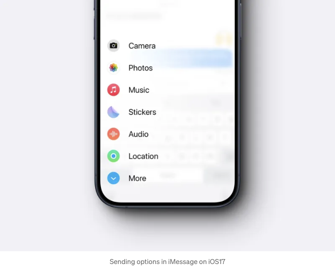
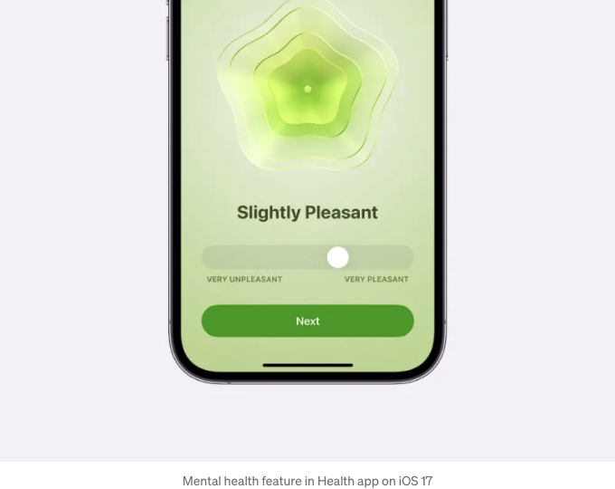
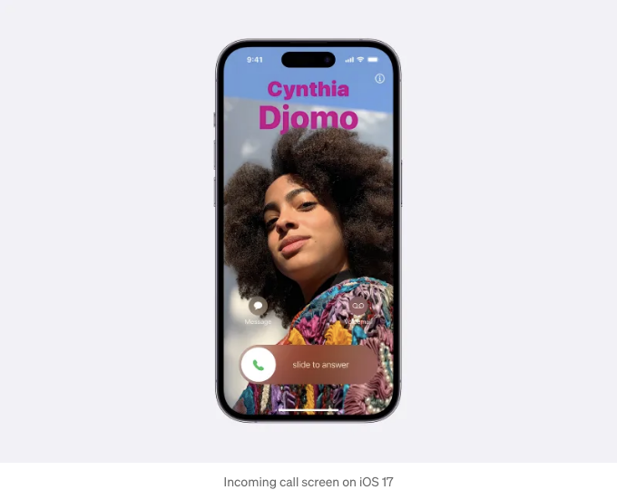
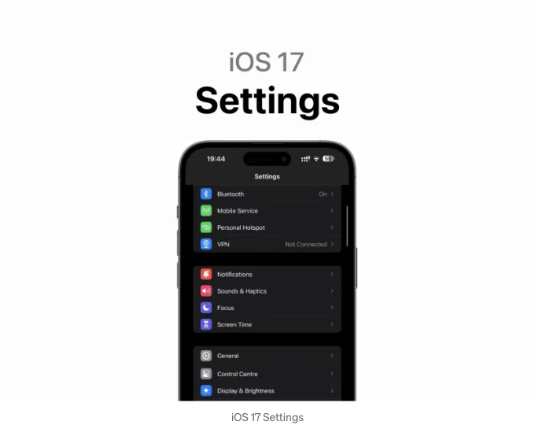
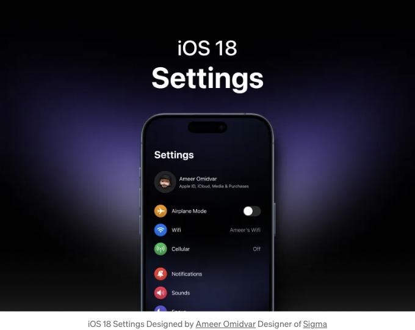
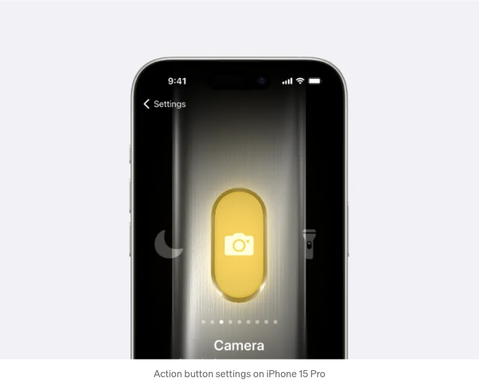
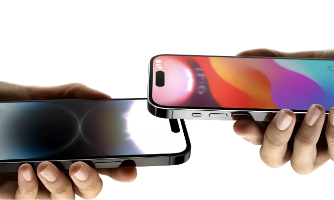

# 애플 IOS17에 추가된 새로운 UI UX 디자인

애플은 여러 차례 산업을 혁신했습니다. UI 측면에서도 여러 번이나 그렇게 했습니다. 개인 컴퓨팅, 모바일 컴퓨팅, 최근에는 Vision Pro(공간 컴퓨팅)을 통해 말이죠.
우리는 iOS 7의 소개가 지난 10년 동안 GUI의 길을 정했다고 생각할 수 있습니다.

<!-- ui-log 수평형 -->

<ins class="adsbygoogle"
     style="display:block"
     data-ad-client="ca-pub-4877378276818686"
     data-ad-slot="9743150776"
     data-ad-format="auto"
     data-full-width-responsive="true"></ins>
<component is="script">
(adsbygoogle = window.adsbygoogle || []).push({});
</component>

# UI는 더 잘 작동하고 더 아름답게 보여야 합니다.

스티브 잡스의 이 말을 정말 좋아합니다.

많은 디자이너들이 실제로 해결해야 할 문제가 최종 목표라는 것을 놓치고 있는 것 같습니다.
미학은 경험에서 중요한 역할을 하지만 그것이 전부는 아닙니다.
그래서 다음 시각적 언어의 핵심은 무엇일까요?
공간 컴퓨팅 시대를 비롯한 새로운 기회를 최대한 활용하는 것입니다.

<!-- ui-log 수평형 -->

<ins class="adsbygoogle"
     style="display:block"
     data-ad-client="ca-pub-4877378276818686"
     data-ad-slot="9743150776"
     data-ad-format="auto"
     data-full-width-responsive="true"></ins>
<component is="script">
(adsbygoogle = window.adsbygoogle || []).push({});
</component>

# 점과점을 이어 보겠습니다.

깊이 관찰하면 애플이 UI에서 여기저기 조금씩 변경을 가하고 있다는 것을 알 수 있습니다.
각 플랫폼마다 제한과 장점이 있지만 새로운 디자인 원칙은 애플의 생태계 전체를 매끄럽게 작동해야 합니다.
새로운 플랫폼 Vision Pro에 영감을 받아 IOS에도 흥미로운 변화가 일어나고 있다고 생각합니다.
그리고 그것이 이동하는 방향이라고 생각합니다.

이미 어떤 패턴이 보이고 있을 것입니다. 하지만 설명을 해보겠습니다.

# 몰입감, 물리적인 감각 및 동작

이 세 가지 주요 원칙을 간단하게 설명할 수 있습니다. 공간 컴퓨터의 부상으로 인해 반드시 해야 할 중요한 변경 사항이 있습니다. 수년 동안 우리는 모든 것이 2D 환경에서 제시될 것으로 제한되었습니다. 따라서 디자이너로서 우리는 공간, 깊이, 물리학 등에 대해 실제로 걱정할 필요가 없었습니다. 그러나 이러한 요소들은 우리가 살아가는 3D 세계에서 엄청난 역할을 합니다. 그것들은 단지 새로운 경험의 층을 추가할 뿐입니다. 공간 컴퓨터에서는 새로운 경험을 해제할 수 있는 UI의 끝없는 가능성이 있습니다.

<!-- ui-log 수평형 -->

<ins class="adsbygoogle"
     style="display:block"
     data-ad-client="ca-pub-4877378276818686"
     data-ad-slot="9743150776"
     data-ad-format="auto"
     data-full-width-responsive="true"></ins>
<component is="script">
(adsbygoogle = window.adsbygoogle || []).push({});
</component>

## 몰입감

이것을 예로 들어보겠습니다. 이전에는 2D 표면을 직접 보아야 했던 날씨 앱에서, 이제 날씨를 확인하기 위해 눈 속에 서 있을 수 있습니다. 눈송이가 손에 내리쬐게 될 것입니다. 그것을 상상하는 것만으로도 전율이 느껴집니다.

하지만 이것은 iOS에서는 일어날 수 없을까요? 대신 여기에는 앱들이 고유한 공간을 가지도록 하는 것이 패턴입니다. 앱들은 전체 디스플레이를 활용하여 "상자 안"보다 더 몰입적으로 표현될 수 있습니다.

위의 예시에 추가하여, 새로운 원칙을 적용하여 설정을 재설계했습니다.

## 물리적인 감각

우리가 살고 있는 세계처럼 Vision OS 내부의 모든 것에는 물리학이 있습니다. 현실을 받아들이기 위해 깊이, 그림자, 반사 등이 있습니다. 나는 2D UI에서도 이러한 경향이 있을 것이라고 생각합니다. 사실, 나는 새로운 형태의 스키오모포즘이 돌아오고 인기를 얻고 있다는 것이 그 이유 중 하나라고 생각합니다. 같은 원

칙이 적용됩니다. iPhone 15 Pro의 액션 버튼 설정이 좋은 예라고 생각합니다.

<!-- ui-log 수평형 -->

<ins class="adsbygoogle"
     style="display:block"
     data-ad-client="ca-pub-4877378276818686"
     data-ad-slot="9743150776"
     data-ad-format="auto"
     data-full-width-responsive="true"></ins>
<component is="script">
(adsbygoogle = window.adsbygoogle || []).push({});
</component>

## 완전히 새로운 정교한 동작 수준

Dynamic Island은 하드웨어 문제를 소프트웨어 장점으로 대대적으로 바꿀 수 있는 중요한 아이디어였습니다. 이것은 내가 생각하기에는 애플에서만 볼 수 있는 것입니다. 그 외에도 애니메이션은 매우 순조롭고 "마법 같은" 정확한 물리학을 가지고 있습니다. 그리고 우리는 iOS 17에서 이러한 패턴을 자주 볼 수 있었습니다. Dynamic Island의 아름다운 Shazam 애니메이션, 에어드롭 등이 그것입니다.

<!-- ui-log 수평형 -->

<ins class="adsbygoogle"
     style="display:block"
     data-ad-client="ca-pub-4877378276818686"
     data-ad-slot="9743150776"
     data-ad-format="auto"
     data-full-width-responsive="true"></ins>
<component is="script">
(adsbygoogle = window.adsbygoogle || []).push({});
</component>

# 결론

트렌드는 문제를 해결하고 인간다운 느낌을 주며 엄청난 새로운 가능성을 뚫어낼 때에만 표준이 됩니다.

나는 디자이너들이 항상 핵심적으로 문제 해결 방식을 유지하면서도 3D 그래픽 및 환경에 대해 더 많이 배우기 시작하고, "상자 밖"을 진정으로 생각하고 동작 상호작용을 고려해야 할 새로운 시대의 가장자리에 있다고 생각합니다.
