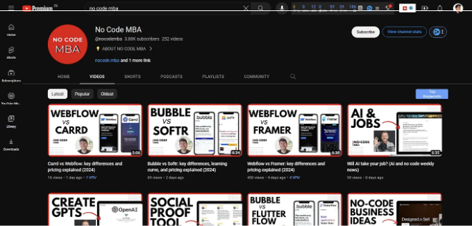

# 코딩 공부하기에 좋은 사이트 및 유튜브 10가지

1. Andrew Huberman

세부적으로 건강 및 피트니스에 대해 모든 것을 배우세요.

다루는 주제:

- 정신 건강
- 체지방 감량
- 근육 발달
- 영양

그 외

링크: [Andrew Huberman](https://www.youtube.com/@hubermanlab/)

<!-- ui-log 수평형 -->

<ins class="adsbygoogle"
     style="display:block"
     data-ad-client="ca-pub-4877378276818686"
     data-ad-slot="9743150776"
     data-ad-format="auto"
     data-full-width-responsive="true"></ins>
<component is="script">
(adsbygoogle = window.adsbygoogle || []).push({});
</component> 2. FreeCodeCamp

프로그래밍에 대해 모든 것을 배울 수 있습니다.

다루는 주제:

- C/C++
- 프런트엔드 웹 개발
- 딥 러닝
- 데이터 분석

그 외

링크: [FreeCodeCamp](https://www.youtube.com/@freecodecamp/)

3. Matt Wolfe

튜토리얼과 사용할 도구를 통해 AI 세계에서 일어나는 모든 것을 배워보세요.

다루는 주제:

- AI 뉴스
- 무료 AI 아바타 생성
- GPT
- AI 비디오 제작

그 외

링크: [Matt Wolfe](https://www.youtube.com/@mreflow/)

<!-- ui-log 수평형 -->

<ins class="adsbygoogle"
     style="display:block"
     data-ad-client="ca-pub-4877378276818686"
     data-ad-slot="9743150776"
     data-ad-format="auto"
     data-full-width-responsive="true"></ins>
<component is="script">
(adsbygoogle = window.adsbygoogle || []).push({});
</component>

4. MIT OpenCourseWare

세계 최고 대학 중 하나인 MIT에서 무료 튜토리얼을 제공받으세요.

다루는 주제:

- 수학
- 물리학
- 화학
- AI

그 외

링크: [MIT OpenCourseWare](https://www.youtube.com/@mitocw/)

5. Crash Course

중요한 주제에 대한 간단하고 이해하기 쉬운 튜토리얼을 받으세요.

다루는 주제:

- 생물학
- 식물학
- 환경 과학
- 기후와 에너지

그 외

링크: [Crash Course](https://www.youtube.com/@crashcourse/)

6. Trevor Jones

비디오 편집에 대해 끝까지 배우세요.

주제:

- 비디오 편집
- 콘텐츠 제작

링크: [Trevor Jones](https://www.youtube.com/@TrevorJonescreator/)

<!-- ui-log 수평형 -->

<ins class="adsbygoogle"
     style="display:block"
     data-ad-client="ca-pub-4877378276818686"
     data-ad-slot="9743150776"
     data-ad-format="auto"
     data-full-width-responsive="true"></ins>
<component is="script">
(adsbygoogle = window.adsbygoogle || []).push({});
</component>

7. No Code MBA

코드를 작성하지 않고 다양한 도구를 사용하여 웹사이트 및 애플리케이션을 구축하는 데 필요한 모든 것을 배우세요.

주제:

- Carrd
- Webflow
- Bubble
- Softr

그 외

링크: [No Code MBA](https://www.youtube.com/@nocodemba/)

8. Design with Canva

Canva를 사용한 그래픽 디자인에 대해 알아보세요.

다루는 주제:

- ChatGPT
- Canva
- Canva를 사용한 그래픽 디자인

링크: [Design with Canva](https://www.youtube.com/@TeamRonDi/)

9. Flux Academy

웹 디자이너가 되기 위해 알아야 할 모든 것을 배우세요.

주제:

- 워드프레스
- 포트폴리오 리뷰
- StudioXperience

그 외

링크: [Flux Academy](https://www.youtube.com/@FluxAcademy/)

<!-- ui-log 수평형 -->

<ins class="adsbygoogle"
     style="display:block"
     data-ad-client="ca-pub-4877378276818686"
     data-ad-slot="9743150776"
     data-ad-format="auto"
     data-full-width-responsive="true"></ins>
<component is="script">
(adsbygoogle = window.adsbygoogle || []).push({});
</component>

10. Vanessa Lau

소셜 미디어에서 대중을 확보하는 방법에 대해 처음부터 끝까지 모두 배우세요.

주제:

- YouTube 성장 팁
- Instagram 성장 팁

그 외

링크: [Vanessa Lau](https://www.youtube.com/@VanessaLau/)

이 도움이 되었기를 바랍니다.

무료로 AI 배우기: [Horizon](https://www.joinhorizon.ai/)
