# 반드시 알아야하는 피그마 플러그인 45가지(2024년 최신)

이 글에서는 2024년을 위한 피그마의 45가지 인기 있는 실용적인 플러그인을 찾을 수 있습니다.
세심하게 선별된 이 플러그인들은 작업 흐름을 향상시키고 창의성을 증진시키며 피그마 경험을 높여줄 것입니다.

## Figma to Webflow (HTML, CSS and Website)

웹플로우 랩스(Webflow Labs)에서 개발한 Figma to Webflow 플러그인을 사용하면 정적 디자인을 깨끗한 제작용 웹플로우 HTML과 CSS로 변환할 수 있습니다. Webflow 상호작용을 추가하고 강력한 CMS를 사용하여 내용을 연결하고, 최고의 호스팅 인프라에 한 번의 클릭으로 게시하세요.

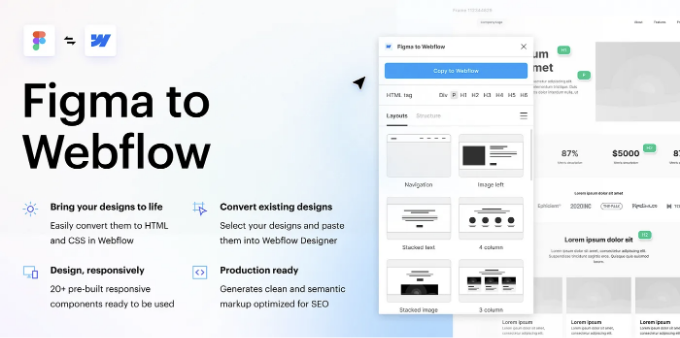

<!-- ui-log 수평형 -->

<ins class="adsbygoogle"
     style="display:block"
     data-ad-client="ca-pub-4877378276818686"
     data-ad-slot="9743150776"
     data-ad-format="auto"
     data-full-width-responsive="true"></ins>
<component is="script">
(adsbygoogle = window.adsbygoogle || []).push({});
</component>

.

## Figma to HTML with Framer

Framer에서 캔버스에 있는 내용을 간단히 복사하여 붙여넣음으로써 Figma 디자인을 내보낼 수 있습니다. 이 플러그인은 디자인을 Framer의 레이아웃 도구에 맞게 실시간으로 조정해주므로 훌륭한 웹사이트를 만드는 데 집중할 수 있습니다.

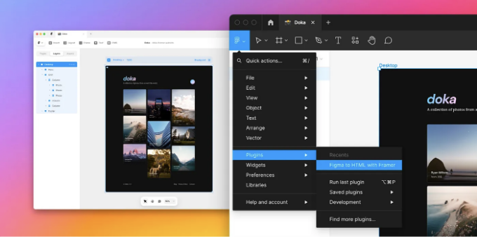

<!-- ui-log 수평형 -->

<ins class="adsbygoogle"
     style="display:block"
     data-ad-client="ca-pub-4877378276818686"
     data-ad-slot="9743150776"
     data-ad-format="auto"
     data-full-width-responsive="true"></ins>
<component is="script">
(adsbygoogle = window.adsbygoogle || []).push({});
</component>

## Fast Isometric

Fast Isometric은 다양한 도구와 템플릿을 사용하여 간편하게 등장하는 등치선(等持線) 디자인을 빠르게 만들 수 있는 Figma 플러그인으로, 인상적인 3차원 그래픽과 인터페이스를 제작하는 과정을 단순화합니다.

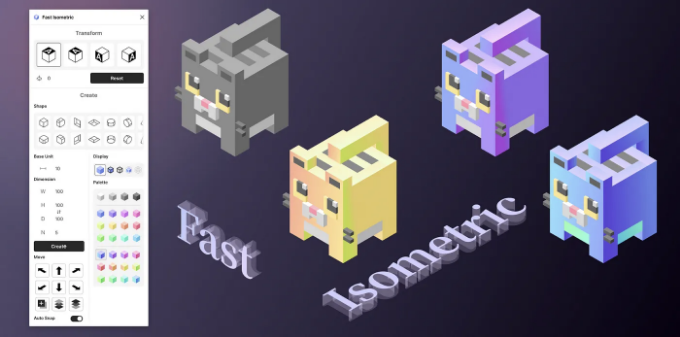

.

## Breakpoints

Figma 프레임 내에서 반응형 레이아웃을 미리보고 애니메이션 프로토타입을 공유하세요.

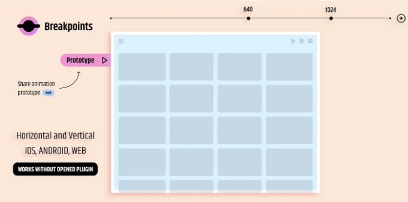

<!-- ui-log 수평형 -->

<ins class="adsbygoogle"
     style="display:block"
     data-ad-client="ca-pub-4877378276818686"
     data-ad-slot="9743150776"
     data-ad-format="auto"
     data-full-width-responsive="true"></ins>
<component is="script">
(adsbygoogle = window.adsbygoogle || []).push({});
</component>

## Relume

Relume 사이트 빌더를 사용하여 웹사이트를 만들고 이를 통해 플러그인에서 쉽게 편집할 수 있습니다.

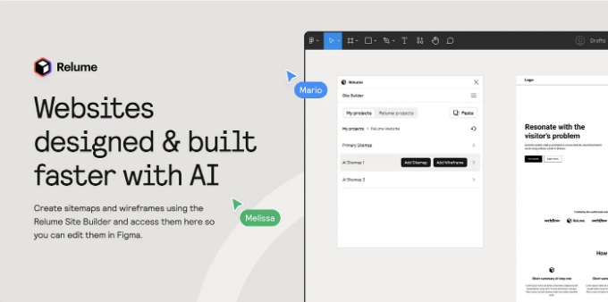

.

## Musho AI

Musho는 단순한 레이아웃, 훌륭한 복사본 및 멋진 이미지로 거의 완성된 개발용 웹사이트를 제작하는 데 사용되는 프롬프트를 제공합니다.

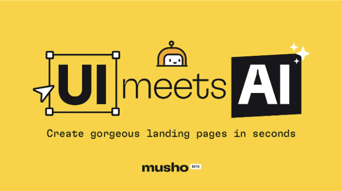

<!-- ui-log 수평형 -->

<ins class="adsbygoogle"
     style="display:block"
     data-ad-client="ca-pub-4877378276818686"
     data-ad-slot="9743150776"
     data-ad-format="auto"
     data-full-width-responsive="true"></ins>
<component is="script">
(adsbygoogle = window.adsbygoogle || []).push({});
</component>

## ARC — Bend your type!

텍스트를 위로, 아래로 또는 원 모양으로 구부려 보세요.

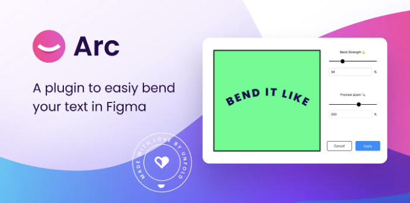

.

## Unsplash

Unsplash에서 아름다운 이미지를 디자인에 삽입하세요.
Unsplash 라이선스를 통해 이미지를 상업적 및 개인적 프로젝트에 자유롭게 사용할 수 있습니다.

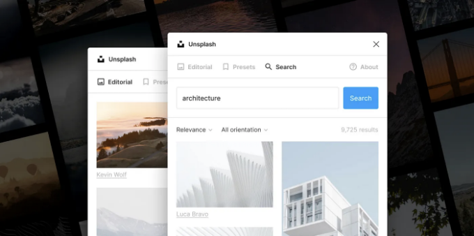

.

## Jitter · Animation for Figma

Jitter를 사용하여 전문적인 애니메이션 콘텐츠를 만드세요. 브랜드에 맞는 애니메이션 UI, 비디오, 소셜 미디어 게시물, 웹사이트, 앱, 로고 등을 디자인하는 데 사용할 수 있습니다. 무료로 가입하세요.

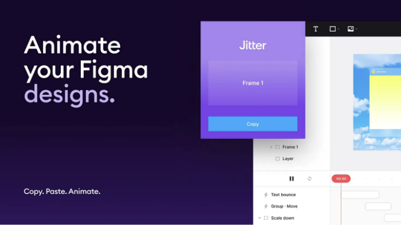

<!-- ui-log 수평형 -->

<ins class="adsbygoogle"
     style="display:block"
     data-ad-client="ca-pub-4877378276818686"
     data-ad-slot="9743150776"
     data-ad-format="auto"
     data-full-width-responsive="true"></ins>
<component is="script">
(adsbygoogle = window.adsbygoogle || []).push({});
</component>

## Magician

복사에서 고유한 아이콘 생성에 이르기까지 모든 것을 수행

하기 위해 AI의 힘을 사용하세요.

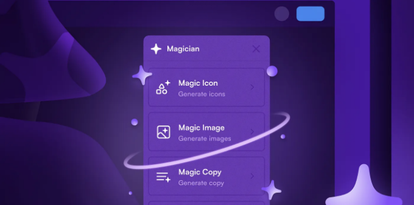

.

## Remove BG

단일 클릭으로 이미지의 배경을 자동으로 제거하세요.

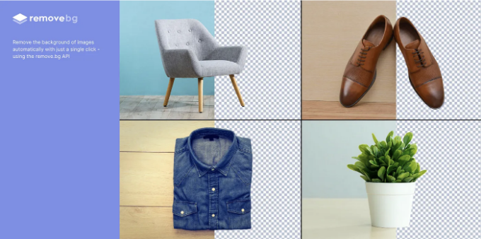

.

## Anima — Figma to Code: React, HTML, Vue, CSS, Tailwind

Anima가 AI 코드 개인화로 당신처럼 코드를 작성하세요.
디자인을 기반으로 코드를 가져와서 디자인을 개발하는 과정을 가속화하세요.

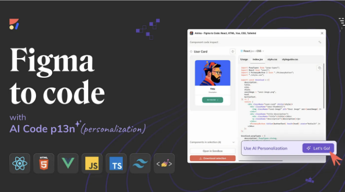

## Icons8 — 아이콘, 일러스트, 사진

가장 크고 일관된 컬렉션의 그래픽을 사용하여 작업하세요. Figma를 떠나지 않고도 1.5M+ 아이콘, 사진 및 일러스트를 제공합니다!

<!-- ui-log 수평형 -->

<ins class="adsbygoogle"
     style="display:block"
     data-ad-client="ca-pub-4877378276818686"
     data-ad-slot="9743150776"
     data-ad-format="auto"
     data-full-width-responsive="true"></ins>
<component is="script">
(adsbygoogle = window.adsbygoogle || []).push({});
</component>

## Content Reel

한 팔레트에서 텍스트 문자열, 이미지 및 아이콘을 가져와서 더 효율적으로 레이아웃을 디자인하세요. Content Reel을 사용하면 사용자 정의 콘텐츠를 생성하고 다른 Figma 사용자와 공유할 수 있습니다.

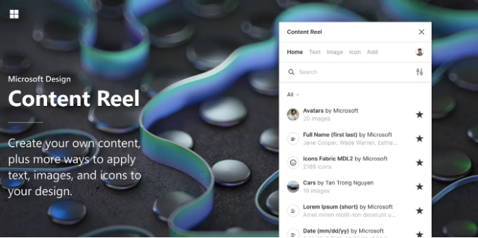

.

## Vector to 3D

이 플러그인은 텍스트와 벡터 노드를 클릭 한 번으로 3D 모델로 변환합니다! 변환된 모델은 자동으로 배치되고 GPU 레이 트레이싱으로 렌더링됩니다. 3D 전문가가 아닌 상태에서도 멋진 3D 아이콘, 텍스트 또는 기타 3D 스타일 이미지를 렌더링하는 데 사용할 수 있습니다.

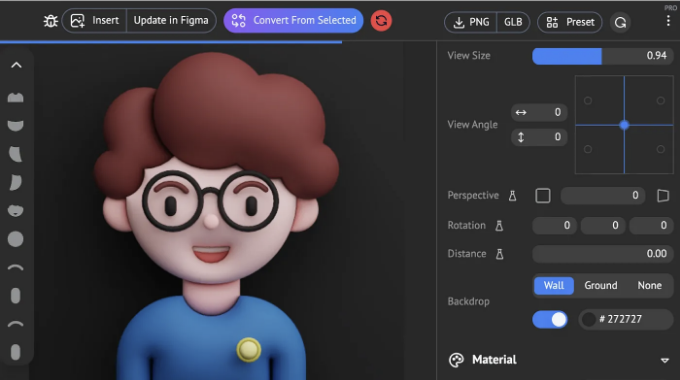

.

## Mockup

기기를 선택하고 프레임을 선택하면 디자인이 화면에 표시됩니다. 가장 쉬운 모킹업 플러그인

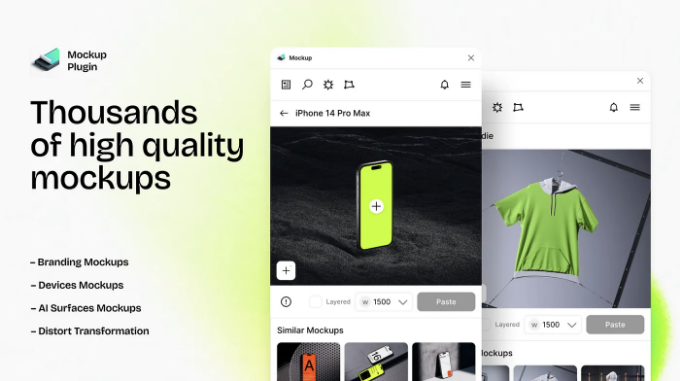

<!-- ui-log 수평형 -->

<ins class="adsbygoogle"
     style="display:block"
     data-ad-client="ca-pub-4877378276818686"
     data-ad-slot="9743150776"
     data-ad-format="auto"
     data-full-width-responsive="true"></ins>
<component is="script">
(adsbygoogle = window.adsbygoogle || []).push({});
</component>

## Autoflow

Figma에서 자동으로 플로우 화살표를 그립니다! 손으로 그린 또는 최소주의 스타일로 사용자 플로우, 다이어그램 또는 그래픽을 설명하세요.

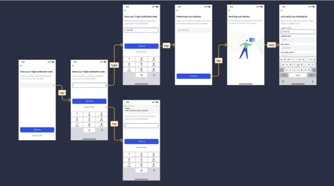

.

## Blobs

버튼을 클릭 한 번으로 유기적인 블롭 모양을 생성하세요. 생성된 모든 모양은 이전과 다르게 유일합니다. 모양이 얼마나 독특한지와 포인트 수를 제어할 수 있습니다.

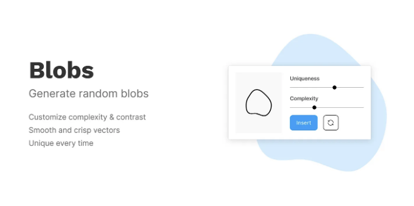

.

## Glow

요소에 부드럽고 아름다운 빛을 적용하세요.

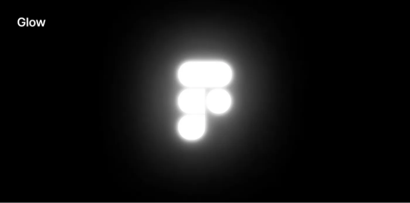

.

## LottieFiles — 애니메이션 생성 및 Figma에서 Lottie로 내보내기

LottieFiles for Figma는 디자이너가 자신의 디자인을 손쉽게 Lottie 애니메이션으로 변환할 수 있도록합니다. 이 강력한 기능은 기본 애니메이션부터 다중 프레임 및 다중 변형 구성 요소 시퀀스까지 모두 지원합니다.

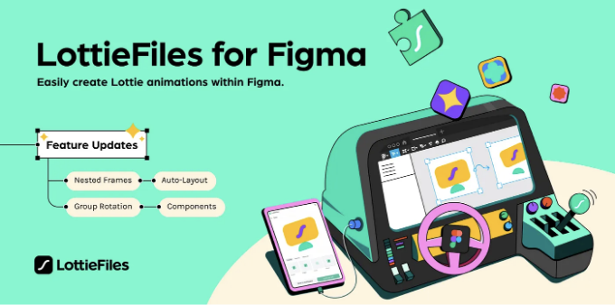

<!-- ui-log 수평형 -->

<ins class="adsbygoogle"
     style="display:block"
     data-ad-client="ca-pub-4877378276818686"
     data-ad-slot="9743150776"
     data-ad-format="auto"
     data-full-width-responsive="true"></ins>
<component is="script">
(adsbygoogle = window.adsbygoogle || []).push({});
</component>

## To Path

어떤 객체나 텍스트도 경로 위에 배치하세요.

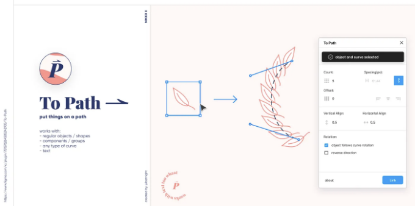

<!-- ui-log 수평형 -->

<ins class="adsbygoogle"
     style="display:block"
     data-ad-client="ca-pub-4877378276818686"
     data-ad-slot="9743150776"
     data-ad-format="auto"
     data-full-width-responsive="true"></ins>
<component is="script">
(adsbygoogle = window.adsbygoogle || []).push({});
</component>

## Noise

Figma의 노이즈 플러그인은 사용자 정의 가능한 노이즈 패턴으로 디자인에 질감과 깊이를 추가합니다. Perlin, simplex 및 cellular noise를 생성하고 스케일 및 불투명도와 같은 매개변수를 조정하여 실시간으로 변경 사항을 미리 보세요. 이 유용한 도구로 디자인을 신속하게 향상시키세요.

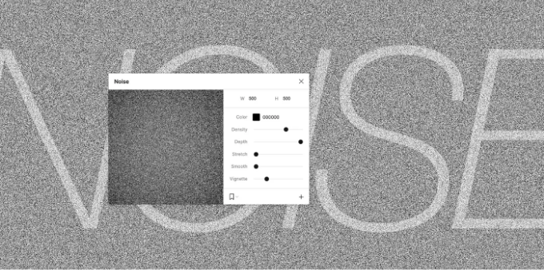

.

## Table Creator

콘텐츠에 따라 자동으로 크기가 조절되고 수정할 수 있는 사용자 정의 스타일의 테이블을 만드세요. 구성 요소를 수정하여 테이블의 디자인을 제어하세요.

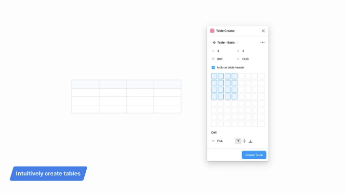

.

## Chart

18 종류의 차트를 생성하는 데 실제 데이터나 무작위 데이터를 사용하는 Figma의 가장 강력한 플러그인입니다. Chart는 Excel, Numbers, Google Sheets와 같은 편집기에서 복사하여 붙여넣기, Google Sheets와의 실시간 연결

및 원격 JSON(REST API), 로컬 CSV 및 JSON 파일을 지원합니다.

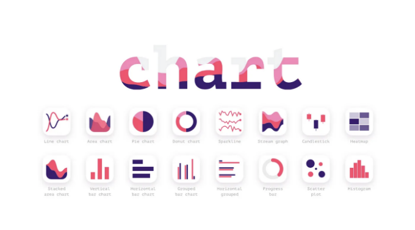

.

## Stark — 대비 및 접근성 도구

이제 기록적인 시간에 접근 가능한 소프트웨어를 생성하고 테스트할 수 있습니다. 웹사이트, 온라인 상점, 모바일 앱 또는 SaaS 제품을 개발 중이더라도 Stark는 모든 디자이너, 엔지니어, PM 및 QA 전문가에게 손쉽게 접근 가능한 수동 및 자동화된 도구를 제공합니다.

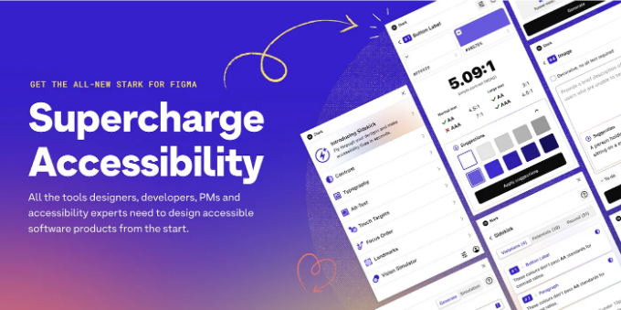

<!-- ui-log 수평형 -->

<ins class="adsbygoogle"
     style="display:block"
     data-ad-client="ca-pub-4877378276818686"
     data-ad-slot="9743150776"
     data-ad-format="auto"
     data-full-width-responsive="true"></ins>
<component is="script">
(adsbygoogle = window.adsbygoogle || []).push({});
</component>

## 3D Wave: Fabric과 같이 모든 것을 부드럽게 만들기

모든 것을 3D Wave로 만들어 보세요!

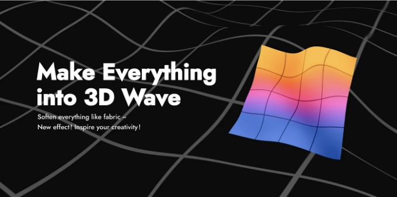

.

## Get Waves

고유한 SVG 웨이브를 만들기 위한 무료 SVG 웨이브 생성기입니다. 곡선을 선택하고 복잡성을 조정하세요!

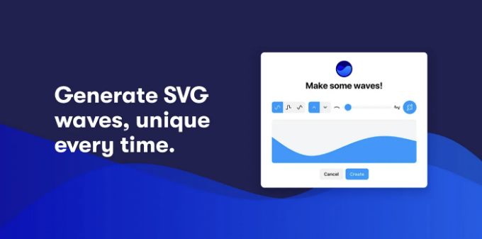

.

## User Profile | Avatar

디자인 프로토타입에 아름다운 생성된 아바타를 표시할 수 있습니다.

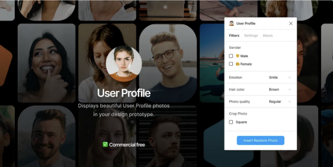

<!-- ui-log 수평형 -->

<ins class="adsbygoogle"
     style="display:block"
     data-ad-client="ca-pub-4877378276818686"
     data-ad-slot="9743150776"
     data-ad-format="auto"
     data-full-width-responsive="true"></ins>
<component is="script">
(adsbygoogle = window.adsbygoogle || []).push({});
</component>

## UI Faces — 무료 AI 아바타

크리에이티브 프로젝트를 위한 무료 AI 생성 아바타입니다.

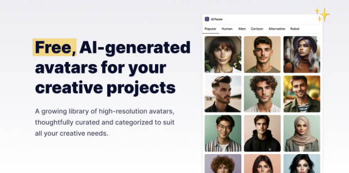

.

## Noise & Texture

Figma 플러그인으로 동적으로 타일형 노이즈, 질감, 패턴, 그라데이션 등을 생성합니다. 레이어를 선택하고 노이즈나 질감을 추가하세요. 설정을 변경하고 레이어가 실시간으로 업데이트되는 것을 확인하세요.

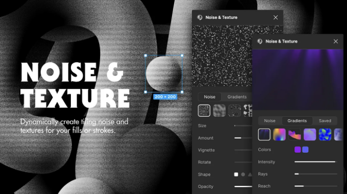

.

## Mesh Gradient

2D 메쉬를 사용한 그래디언트 이미지를 생성하고 메쉬의 정점 및 가장자리를 수정하여 완벽한 그래디언트 모양을 얻을 수 있습니다.

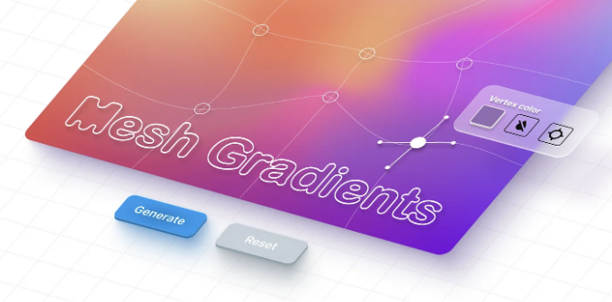

.

## Beautiful Shadows

'빛 원본'을 드래그하여 선택한 요소에 그림자를 만듭니다.

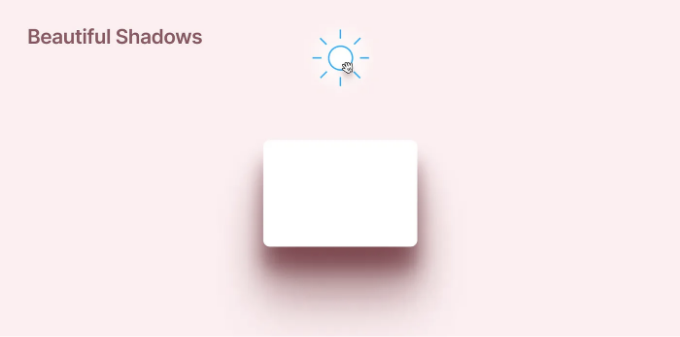

<!-- ui-log 수평형 -->

<ins class="adsbygoogle"
     style="display:block"
     data-ad-client="ca-pub-4877378276818686"
     data-ad-slot="9743150776"
     data-ad-format="auto"
     data-full-width-responsive="true"></ins>
<component is="script">
(adsbygoogle = window.adsbygoogle || []).push({});
</component>

## Ruri Splines

어떤 곡선에도 그라디언트를 추가하여 고품질의 스플라인, 모양, 스팟을 만듭니다. 250개 이상의 수작업 및 완전히 편집 가능한 곡선 및 색상 컬렉션을 사용하면 무제한한 옵션을 활용할 수 있습니다.

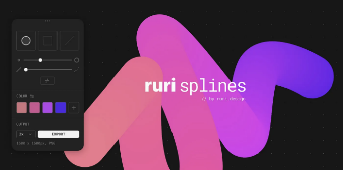

.

## Pixels

이미지에 픽셀화 / 8bit 효과 필터를 적용하세요. 래스터 및 벡터.

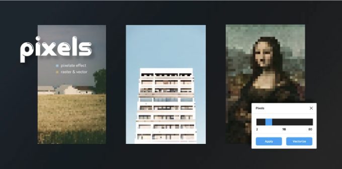

.

## Drawkit 3D Builder

DrawKit 3D 빌더를 사용하여 아름다운 디자인을 만들어 보세요. 3D 일러스트 및 아이콘을 쉽게 혼합 및 매치하여 Figma 파일에 삽입할 수 있습니다.

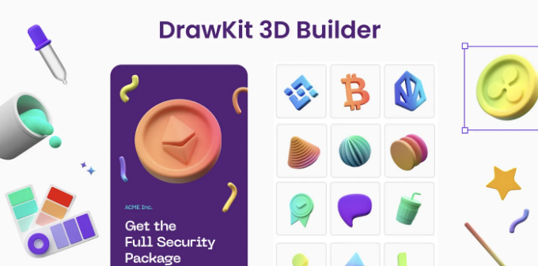

<!-- ui-log 수평형 -->

<ins class="adsbygoogle"
     style="display:block"
     data-ad-client="ca-pub-4877378276818686"
     data-ad-slot="9743150776"
     data-ad-format="auto"
     data-full-width-responsive="true"></ins>
<component is="script">
(adsbygoogle = window.adsbygoogle || []).push({});
</component>

## Sine wave

몇 번의 클릭으로 사인파를 생성하세요.

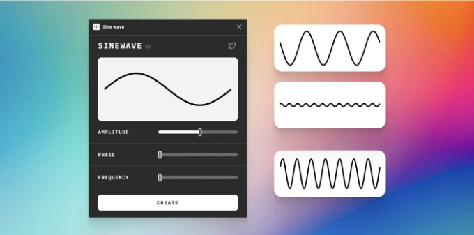

.

## Fit Curve

Fit Curve 플러그인을 사용하여 Figma에서 부드러운 곡률을 가진 곡선을 생성하세요. 원형 버튼과 슬라이더가 있는 직관적인 인터페이스를 통해 베지어 곡선 세그먼트의 핸들 길이를 정밀하게 수정할 수 있습니다.

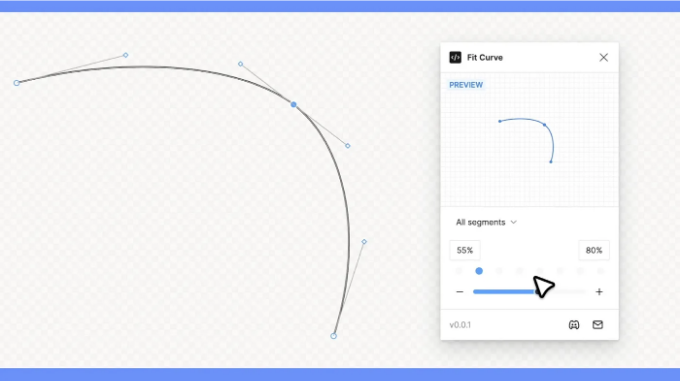

.

## Figma To Elementor

Figma 디자인을 Elementor 위젯으로 손쉽게 변환하는 Figma 플러그인입니다. 이 플러그인에서 생성된 JSON 데이터를 Elementor 편집기에 바로 붙여넣기하여 원하는 디자인을 쉽게 시작할 수 있습니다.

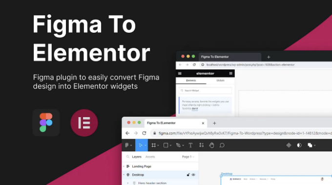

.

## Repeater effect

원하는 모양을 선택하고 브랜드 자료, 블로그 포스트 이미지 또는 기타 어느 곳에서든 사용할 수 있는 멋진 효과를 생성하세요.

<!-- ui-log 수평형 -->

<ins class="adsbygoogle"
     style="display:block"
     data-ad-client="ca-pub-4877378276818686"
     data-ad-slot="9743150776"
     data-ad-format="auto"
     data-full-width-responsive="true"></ins>
<component is="script">
(adsbygoogle = window.adsbygoogle || []).push({});
</component>

## Illustration Maker

Figma에서 여러분의 다음 프로젝트에 사용할 수 있는 멋진 일러스트를 생성하세요.

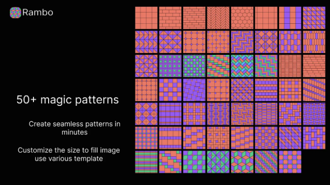

.

## Free Image Converter

Figma 파일에서 이미지를 추출하고 원하는 포맷으로 변환하세요.

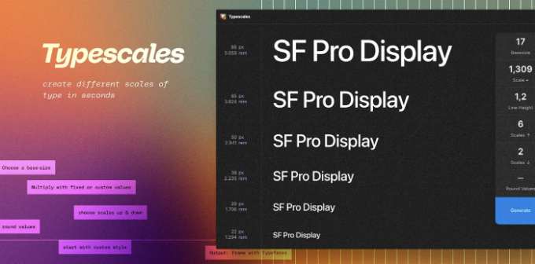

<!-- ui-log 수평형 -->

<ins class="adsbygoogle"
     style="display:block"
     data-ad-client="ca-pub-4877378276818686"
     data-ad-slot="9743150776"
     data-ad-format="auto"
     data-full-width-responsive="true"></ins>
<component is="script">
(adsbygoogle = window.adsbygoogle || []).push({});
</component>

## Arabesque

피그마에서 현대적인 아라베스크 패턴을 만드세요.

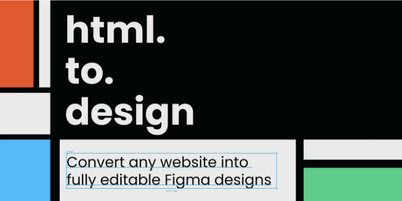

.

## Button Resizer

버튼 디자인을 조정하고 프레임과 그리드를 사용하여 버튼의 크기를 자동으로 조정하세요.

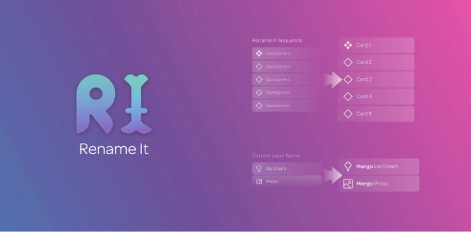

.

## Audio

Figma에서 사용 가능한 무료 오디오 파일을 검색하고 불러오세요.

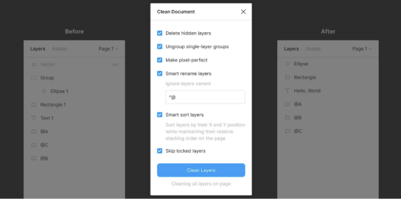

<!-- ui-log 수평형 -->

<ins class="adsbygoogle"
     style="display:block"
     data-ad-client="ca-pub-4877378276818686"
     data-ad-slot="9743150776"
     data-ad-format="auto"
     data-full-width-responsive="true"></ins>
<component is="script">
(adsbygoogle = window.adsbygoogle || []).push({});
</component>

## Theme Change

피그마에서 빠르게 주제를 변경하세요.

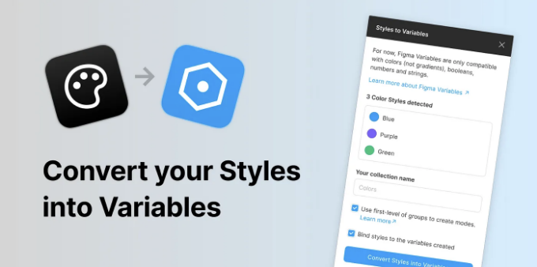

.

이러한 피그마 플러그인들은 디자이너들이 작업을 더욱 효율적으로 수행하고 창의성을 높일 수 있도록 돕습니다. 각 플러그인은 다양한 기능과 옵션을 제공하여 사용자가 피그마를 최대한 활용할 수 있도록 합니다. 이를 통해 디자인 프로세스를 개선하고 팀 협업을 강화할 수 있습니다.
