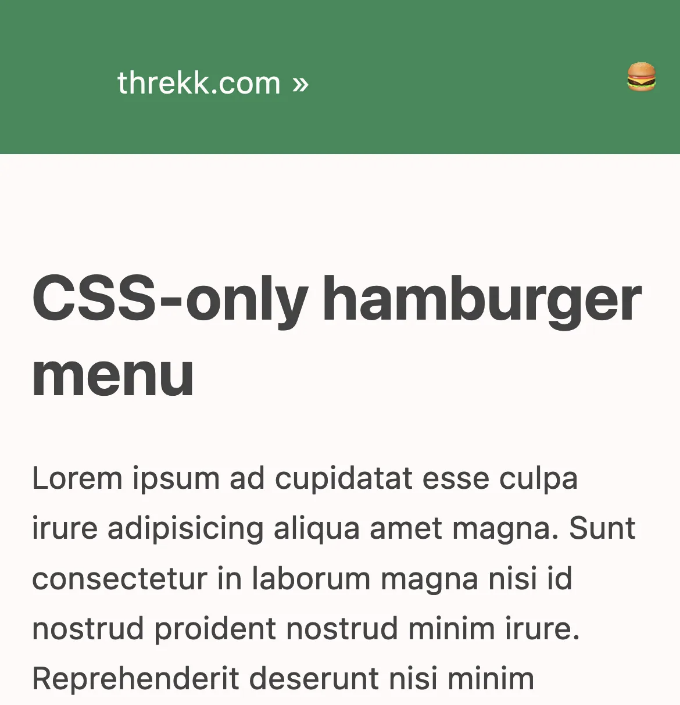

# CSS로 햄버거 메뉴 만드는 방법

최근에 사이트를 약간 수정하고 있는 중에, 내가 만든 햄버거 메뉴를 다시 발견했다. 이것은 매우 특별한 것은 아니고, 작은 해상도로 들어가면 숨겨진 수직 메뉴로 압축되어 버튼을 눌러 보여주거나 숨길 수 있는 메뉴일 뿐이다. 흥미로운 점은 이것이 HTML과 CSS만을 사용하여 만들어졌다는 것이다.

내가 만들 때 인터넷에서 이를 수행하는 방법에 대한 완전한 예제를 찾을 수 없었고, 원하는 결과를 얻기 위해 많은 시행착오가 필요했다는 것을 기억한다. 그래서, 메뉴의 코드를 추출하여 간소화된 예제로 만들었다.

<!-- ui-log 수평형 -->

<ins class="adsbygoogle"
     style="display:block"
     data-ad-client="ca-pub-4877378276818686"
     data-ad-slot="9743150776"
     data-ad-format="auto"
     data-full-width-responsive="true"></ins>
<component is="script">
(adsbygoogle = window.adsbygoogle || []).push({});
</component>

## 요구 사항

이 프로젝트를 시작할 때, 충족해야 할 몇 가지 요구 사항이 있었다:

- 상호작용을 포함하여 HTML과 CSS만을 사용해야 한다.
- 두 개의 다른 메뉴가 아닌 동일한 메뉴이어야 한다.
- CSS가 로드되지 않은 경우에도 최소한 기능해야 한다.

## 과정

프로젝트에는 다음 단계가 있다:

- 링크 목록 만들기.
- 큰 화면에서 링크 목록 보기 좋게 만들기.
- 작은 화면에서 링크 목록 보기 좋게 만들기.
- 작은 화면의 링크 목록 축소 가능하게 만들기.

<!-- ui-log 수평형 -->

<ins class="adsbygoogle"
     style="display:block"
     data-ad-client="ca-pub-4877378276818686"
     data-ad-slot="9743150776"
     data-ad-format="auto"
     data-full-width-responsive="true"></ins>
<component is="script">
(adsbygoogle = window.adsbygoogle || []).push({});
</component>

## 시작점, 링크 목록

메뉴는 결국 탐색에 사용되는 링크 목록이므로, 그것으로 시작한다:

```html
<nav>
  <!-- 항상 표시되는 항목 -->
  <ul>
    <li>
      <a href="https://threkk.com">threkk.com</a>
    </li>
  </ul>
  <!-- 축소 가능한 메뉴 -->
  <ul>
    <li><a href="https://mastodon.social/@threkk">Mastodon</a></li>
    <li><a href="https://twitter.com/threkk">Twitter</a></li>
    <li><a href="https://github.com/threkk">Github</a></li>
  </ul>
</nav>
```

이 목록은 전체 메뉴에 사용할 HTML이며, 나머지는 CSS 마법일 뿐이다.

<!-- ui-log 수평형 -->

<ins class="adsbygoogle"
     style="display:block"
     data-ad-client="ca-pub-4877378276818686"
     data-ad-slot="9743150776"
     data-ad-format="auto"
     data-full-width-responsive="true"></ins>
<component is="script">
(adsbygoogle = window.adsbygoogle || []).push({});
</component>

## 큰 화면에서 링크 목록 보기 좋게 만들기

이 부분은 간단하며, 약간의 CSS만 있으면 된다. 좋아보이는 것은 당신이 결정하는 대로:

```css
nav {
  background-color: SeaGreen;
  color: snow;
  display: flex;
  justify-content: space-between;
}
nav ul {
  /* 마커를 사라지게 만듭니다. */
  list-style-type: none;
}
nav ul li {
  /* 요소를 한 줄에 배치합니다. */
  display: inline-flex;
  margin: 0.3em 1em;
}
```

이 부분은 완료되었고, 이 부분에서는 더 이상 변경하지 않을 것이다.

## 작은 화면에서 링크 목록 보기 좋게 만들기

미디어 쿼리를 사용하여 다음 규칙을 작은 해상도에만 적용합니다. 예를 들어, 태블릿을 "작은 장치"로 고려할지 여부에 따라 값을 조정할 수 있습니다.

```css
@media (max-width: 576px) {
  nav {
    flex-direction: row;
    flex-wrap: wrap;
    margin-left: 0;
    margin-right: 0;
  }
  /* 모바일 모드에서는 수직 목록으로 표시합니다. */
  nav ul {
    display: block;
  }
  /* 두 개의 목록이 있습니다. 첫 번째는 항상 메뉴 바에 표시되는 항목입니다.
       두 번째는 숨겨질 목록입니다. */
  nav ul:last-child {
    width: 100%;
    flex-basis: 100%;
  }
  nav ul li {
    margin-bottom: 0;
    width: 100%;
    text-align: right;
    padding: 0.5em;
  }
}
```

<!-- ui-log 수평형 -->

<ins class="adsbygoogle"
     style="display:block"
     data-ad-client="ca-pub-4877378276818686"
     data-ad-slot="9743150776"
     data-ad-format="auto"
     data-full-width-responsive="true"></ins>
<component is="script">
(adsbygoogle = window.adsbygoogle || []).push({});
</component>



## 작은 화면의 링크 목록 축소 가능하게 만들기

마지막으로, 흥미로운 부분입니다. 모든 마법이 여기에 있습니다: 체크박스가 주어지면, 체크되지 않은 경우 인접한 목록은 표시되지 않습니다.

```css
input[type="checkbox"]:not(:checked) + ul {
  display: none;
}
```

먼저, HTML에 체크박스와 레이블을 추가합니다.

<!-- ui-log 수평형 -->

<ins class="adsbygoogle"
     style="display:block"
     data-ad-client="ca-pub-4877378276818686"
     data-ad-slot="9743150776"
     data-ad-format="auto"
     data-full-width-responsive="true"></ins>
<component is="script">
(adsbygoogle = window.adsbygoogle || []).push({});
</component>

```html
<nav>
  <!-- 항상 표시되는 항목 -->
  <ul>
    <li>
      <a href="https://threkk.com">threkk.com</a>
    </li>
  </ul>
  <!-- 햄버거 메뉴 -->
  <label for="menu" tabindex="0"> 🍔 </label>
  <input id="menu" type="checkbox" />
  <!-- 축소 가능한 메뉴 -->
  <ul>
    <li><a href="https://mastodon.social/@threkk">Mastodon</a></li>
    <li><a href="https://twitter.com/threkk">Twitter</a></li>
    <li><a href="https://github.com/threkk">Github</a></li>
  </ul>
</nav>
```

체크박스와 레이블은 큰 화면에서 숨겨지고,

그 값은 무시됩니다.

```css
nav input[type="checkbox"],
nav label {
  display: none;
}
```

<!-- ui-log 수평형 -->

<ins class="adsbygoogle"
     style="display:block"
     data-ad-client="ca-pub-4877378276818686"
     data-ad-slot="9743150776"
     data-ad-format="auto"
     data-full-width-responsive="true"></ins>
<component is="script">
(adsbygoogle = window.adsbygoogle || []).push({});
</component>

그러나 작은 해상도에서는 체크박스를 숨기고 레이블을 표시합니다.

```css
/* 메뉴 아이콘 스타일링, 체크박스는 숨겨진 채로 유지 */
nav label {
  text-align: right;
  display: block;
  padding: 0.5em;
  line-height: 1.6em;
  align-self: center;
}
```

<!-- ui-log 수평형 -->

<ins class="adsbygoogle"
     style="display:block"
     data-ad-client="ca-pub-4877378276818686"
     data-ad-slot="9743150776"
     data-ad-format="auto"
     data-full-width-responsive="true"></ins>
<component is="script">
(adsbygoogle = window.adsbygoogle || []).push({});
</component>


이렇게하면 끝이 납니다!
