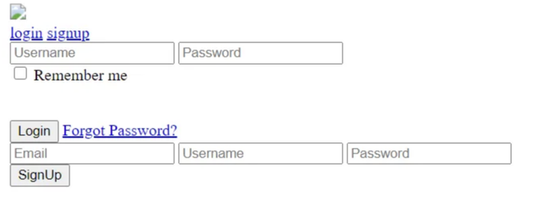

# HTML CSS JS로 회원가입 로그인 폼 만드는 방법


<!-- ui-log 수평형 -->

<ins class="adsbygoogle"
     style="display:block"
     data-ad-client="ca-pub-4877378276818686"
     data-ad-slot="9743150776"
     data-ad-format="auto"
     data-full-width-responsive="true"></ins>
<component is="script">
(adsbygoogle = window.adsbygoogle || []).push({});
</component>

이 블로그를 통해 HTML, CSS 및 JavaScript를 사용하여 간단한 로그인 및 회원가입 폼을 만드는 방법에 대한 아이디어를 얻을 수 있습니다.

회원가입 폼은 사용자가 웹 사이트, 소셜 미디어 또는 기타 시스템에 등록하여 액세스할 수 있는 HTML 폼입니다. 로그인 폼은 사용자가 자신을 식별하고 인증하여 해당 시스템에 액세스할 수 있게 합니다. 이제 어떻게 로그인 및 회원가입 폼을 만들었는지 단계별로 살펴보겠습니다.

# 1. 폼 구조

먼저 HTML을 사용하여 웹 페이지 구조를 만들어야 합니다. 보시다시피, 이 로그인 폼 및 회원가입 폼은 동일한 웹 페이지에 있습니다. 먼저 이들을 개별적으로 만들어 봅시다.

폼을 만들기 위해 `<form>` 태그를 사용해야 합니다. 로그인 폼은 세 개의 `<input>` 요소로 구성됩니다. 사용자 이름을 위한 텍스트 필드, 비밀번호를 위한 비밀번호 필드 및 로그인 버튼을 위한 제출 필드입니다. 이 세 요소 이외에도 회원가입 폼에는 사용자 이메일 주소를 위한 이메일 필드가 포함됩니다. `<input>` 태그에는 종료 태그가 없습니다.

`<input>` 태그 내부에는 id라는 속성이 있습니다. 이는 JavaScript에서 요소에 액세스하고 조작하는 데 사용되며 CSS에서 요소를 스타일링하는 데 사용됩니다. Placeholder 속성은 입력 필드의 예상 값을 표시합니다.

<!-- ui-log 수평형 -->

<ins class="adsbygoogle"
     style="display:block"
     data-ad-client="ca-pub-4877378276818686"
     data-ad-slot="9743150776"
     data-ad-format="auto"
     data-full-width-responsive="true"></ins>
<component is="script">
(adsbygoogle = window.adsbygoogle || []).push({});
</component>

```js
<input type="text" name="name" id="logName" placeholder="사용자 이름">
```

샘플 HTML 코드:

Output:



# 2. 스타일링

CSS를 사용하여 웹 페이지에 더 많은 색을 추가할 수 있습니다. 스타일 시트를 삽입하는 방법에는 세 가지가 있습니다. 관련 요소에 스타일 속성을 추가하고 CSS 속성을 포함하는 인라인 CSS를 사용할 수 있습니다. 그렇지 않으면 `<style>` 요소 내에서 사용되는 내부 CSS를 사용할 수 있습니다. 다른 방법은 .css 확장자를 가진 외부 CSS 파일을 만들고 HTML 파일의 `<head>` 섹션에 링크하는 것입니다. 웹 페이지를 개발할 때는 외부 CSS 파일을 사용하는 것이 가장 좋은 실천 방법입니다.

```js
<link rel="stylesheet" type="text/css" href="style.css">
```

그런 다음 CSS 파일 내에서 태그 이름, ID 및 클래스를 사용하여 웹 페이지에 스타일을 추가할 수 있습니다. 이 웹 페이지에 사용된 주요 CSS 스타일은 다음과 같습니다.

배경 이미지

배경 이미지를 웹 페이지의 본문에 추가할 수 있습니다. 배경 이미지 경로를 지정하는 background-image 속성을 사용합니다.

<!-- ui-log 수평형 -->

<ins class="adsbygoogle"
     style="display:block"
     data-ad-client="ca-pub-4877378276818686"
     data-ad-slot="9743150776"
     data-ad-format="auto"
     data-full-width-responsive="true"></ins>
<component is="script">
(adsbygoogle = window.adsbygoogle || []).push({});
</component>

```js
body{
background-image: url(background.jpg);
}
```

투명 상자

요소에 투명도를 추가하려면 background-color 속성을 사용합니다. RGBA 색 값의 알파 매개변수는 색의 불투명도를 지정합니다. 0.0은 완전한 불투명성을, 1.0은 완전한 불투명성을 나타냅니다. 원하는대로 알파 값을 변경할 수 있습니다.

```js
.box{
background-color:rgba(0, 0, 0, 0.7);
}
```

<!-- ui-log 수평형 -->

<ins class="adsbygoogle"
     style="display:block"
     data-ad-client="ca-pub-4877378276818686"
     data-ad-slot="9743150776"
     data-ad-format="auto"
     data-full-width-responsive="true"></ins>
<component is="script">
(adsbygoogle = window.adsbygoogle || []).push({});
</component>

로그인 아이콘

다음 코드 예제를 사용하여 로그인 아이콘을 폼 상단에 배치할 수 있습니다.

```js
.box img{
width:100px;
margin-top:-50px ;
}
```

입력 요소

입력 필드를 스타일링할 수 있습니다. input[type= submit]을 사용하여 입력 유형을 지정합니다. 마우스를 올리면 속성 값을 부드럽게 변경할 수 있도록 hover 선택기를 사용합니다.

```js
input[type=submit]{
background-color:#600080 ;
color: #ffffff;
}
input[type=submit]:hover{
background-color:#ffffff;
color: #000000;
}
```

샘플 CSS 코드:

# 3. 애니메이션

먼저 .js 확장자를 사용하여 JavaScript 파일을 만듭니다. 그런 다음 `<script>` 태그를 사용하여 해당 JS 파일을 HTML 파일에 링크합니다. `<script>` 태

그를 `<head>` 섹션 내에 포함하면 JavaScript 파일이 HTML 파일보다 먼저 로드되어 몇 가지 문제가 발생할 수 있습니다. 따라서 웹 사이트 응답 시간을 높이기 위해 `<script>` 태그를 닫는 `</body>` 태그 위에 포함하는 것이 좋은 실천 방법입니다.

```js
<script src="index.js"></script>
```

<!-- ui-log 수평형 -->

<ins class="adsbygoogle"
     style="display:block"
     data-ad-client="ca-pub-4877378276818686"
     data-ad-slot="9743150776"
     data-ad-format="auto"
     data-full-width-responsive="true"></ins>
<component is="script">
(adsbygoogle = window.adsbygoogle || []).push({});
</component>

한 웹 페이지에서 로그인 폼 및 회원가입 폼을 표시하려면 JavaScript 및 jQuery를 사용하여 애니메이션 부분을 추가해야 합니다. 따라서 `<script>` 태그 내에 jquery CDN을 포함합니다.

```js
<script src="https://code.jquery.com/jquery-3.3.1.min.js" integrity="sha256-FgpCb/KJQlLNfOu91ta32o/NMZxltwRo8QtmkMRdAu8=" crossorigin="anonymous"></script>
```

웹 페이지에서 "LOGIN" 및 "SIGNUP"이라는 두 개의 링크가 있습니다. "LOGIN"을 클릭하면 로그인 폼이 웹 페이지에 나타납니다. "SIGNUP"을 클릭하면 로그인 폼이 사라지고 회원가입 폼이 웹 페이지에 표시됩니다.

해시에 변경 사항이 있으면 onhashchange 이벤트가 발생합니다. (해시는 # 기호로 시작하는 URL의 앵커 부분입니다.) 그런 다음 hashchange 이벤트를 $(window)에 바인딩합니다. 해시가 변경되면 콜백이 발생합니다.

```js
$(window).on("hashchange", function ())
```

location.hash 속성은 URL의 앵커 부분을 반환하고 location.hash.slice(1)은 해시 데이터에서 # 기호를 제거합니다. "SIGNUP" 링크를 클릭하면 회원가입 페이지가 나타나고 해시가 #signup으로 변경됩니다. if 문 내에서 location.hash.slice(1)이 signup과 같은지 확인합니다. 그런 다음 로그인 폼을 100% 오른쪽으로 이동시키고 웹 페이지에 회원가입 폼을 표시합니다.

```js
if (location.hash.slice(1) == "signup") {
$(".page").addClass("extend");
$("#login").removeClass("active");
$("#signup").addClass("active");
```

<!-- ui-log 수평형 -->

<ins class="adsbygoogle"
     style="display:block"
     data-ad-client="ca-pub-4877378276818686"
     data-ad-slot="9743150776"
     data-ad-format="auto"
     data-full-width-responsive="true"></ins>
<component is="script">
(adsbygoogle = window.adsbygoogle || []).push({});
</component>


# 4. 폼 유효성 검사

사용자 입력은 JavaScript로 유효성을 검사할 수 있습니다. HTML 파일에서 `<form>` 태그에 onsubmit 이벤트 유형을 포함합니다. 사용자가 폼을 제출하려고 할 때 함수를 호출할 수 있습니다. 메서드로 GET 또는 POST를 사용할 수 있습니다. 그러나 GET 메서드보다 보안이 더 우수한 POST 메서드를 사용하는 것이 좋습니다.

```js
<form class="login"name="loginForm"
onsubmit="returnvalidateLoginForm()" method="POST">
```

다음으로 JavaScript 파일로 이동하여 함수를 만듭니다. 그런 다음 함수 내에서 사용자가 폼 필드에 입력한 값을 가져와 if/else 블록을 사용하여 해당 값들을 확인합니다. 사용자가 입력한 값을 가져오려면 documents.getElementbyID(“ID_name”).value를 사용합니다. 그런 다음 이러한 값을 조건을 확인하기 위해 변수에 할당해야 합니다.

```js
var password = document.getElementById("logPassword").value;
```

<!-- ui-log 수평형 -->

<ins class="adsbygoogle"
     style="display:block"
     data-ad-client="ca-pub-4877378276818686"
     data-ad-slot="9743150776"
     data-ad-format="auto"
     data-full-width-responsive="true"></ins>
<component is="script">
(adsbygoogle = window.adsbygoogle || []).push({});
</component>

variable_name.length를 사용하여 입력의 길이를 가져올 수 있습니다. 이제 if/else 조건을 사용하여 필요한 조건을 확인하고 true 또는 false를 반환합니다. 사용자 입력이 유효하지 않은 경우 함수가 false를 반환합니다. 함수가 true를 반환하는 경우에만 사용자가 로그인하거나 회원가입할 수 있습니다. 그렇지 않으면 사용자가 오류 메시지를 받습니다.

```js
if (password.length < 8) {
  document.getElementById("errorMsg").innerHTML = "비밀번호는 적어도 8자 이상이어야 합니다";
  return false;
}
```


사용자 입력이 유효한 경우 사용자는 성공적으로 로그인하거나 회원가입할 수 있습니다. 그런 다음 해당 메시지가 포함된 경고 상자가 표시됩니다. 오류 메시지를 읽은 후에는 확인을 클릭하십시오. 그렇지 않으면 상자가 닫힐 때까지 웹 페이지의 다른 부분에 액세스할 수 없습니다.

```js
alert("로그인에 성공했습니다");
```

<!-- ui-log 수평형 -->

<ins class="adsbygoogle"
     style="display:block"
     data-ad-client="ca-pub-4877378276818686"
     data-ad-slot="9743150776"
     data-ad-format="auto"
     data-full-width-responsive="true"></ins>
<component is="script">
(adsbygoogle = window.adsbygoogle || []).push({});
</component>


샘플 JavaScript 코드:

이제 간단한 로그인 및 회원가입 페이지를 만드는 데 성공했습니다. 직접 시도해보세요!
