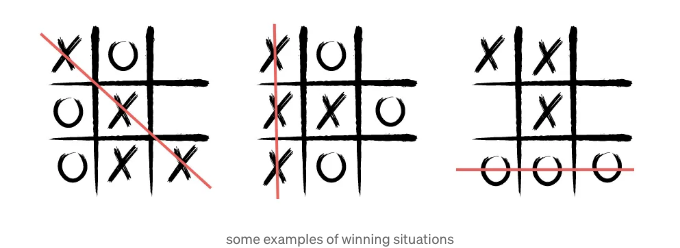
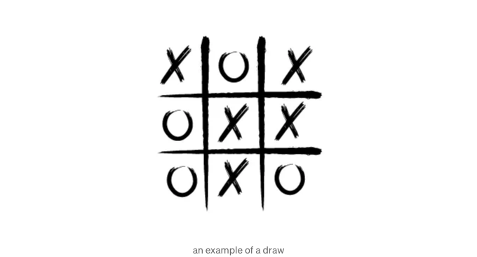

# Html CSS JS로 틱택토(tic-tac-toe)게임 만들기

HTML, CSS, JavaScript 언어를 사용하여 틱택토 게임을 만들어 보겠습니다. 게임의 최종 상황은 다음과 같습니다:


<!-- ui-log 수평형 -->

<ins class="adsbygoogle"
     style="display:block"
     data-ad-client="ca-pub-4877378276818686"
     data-ad-slot="9743150776"
     data-ad-format="auto"
     data-full-width-responsive="true"></ins>
<component is="script">
(adsbygoogle = window.adsbygoogle || []).push({});
</component>

우선, 게임에 대해 알아보겠습니다.

## 틱택토는 무엇이며 게임 규칙은 무엇인가요?

- 두 명의 플레이어가 하는 게임입니다.
- 일반적으로 3x3 보드에서 진행되지만 더 큰 보드도 가능합니다. 저는 3x3 보드를 기준으로 하겠습니다.
- 선공한 플레이어는 빈 칸에 'X'를 입력하고, 다른 플레이어는 'O'를 입력합니다.
- 한 플레이어가 행, 열 또는 대각선에 'X-X-X' 또는 'O-O-O'를 만들면 게임에서 승리합니다.



- 모든 칸이 채워지고 위의 조건 중 하나가 제공되지 않으면 게임이 무승부로 끝납니다.



<!-- ui-log 수평형 -->

<ins class="adsbygoogle"
     style="display:block"
     data-ad-client="ca-pub-4877378276818686"
     data-ad-slot="9743150776"
     data-ad-format="auto"
     data-full-width-responsive="true"></ins>
<component is="script">
(adsbygoogle = window.adsbygoogle || []).push({});
</component>

코딩을 시작하기 전에 무엇을 했는지 간단히 설명하겠습니다. 먼저, 게임에 필요한 요소를 HTML로 코딩했습니다. 더 아름답게 만들기 위해 CSS로 스타일을 만들었습니다. 게임이 작동하도록 하기 위해 JavaScript를 사용했습니다. 이제 이들을 자세히 살펴보겠습니다.

## HTML:

제목을 가진 div 내에 h1 태그를 추가했습니다.

게임에 필요한 3x3 보드를 만들기 위해 board라는 id를 가진 div를 생성했습니다.

각 칸을 square라는 class로 board 내에 div로 생성했습니다. 각 칸에는 id가 있습니다.

게임을 다시 시작할 수 있도록 endGame이라는 id를 가진 div 내에 버튼 형태의 입력을 추가했습니다. 이 버튼이 클릭되면 자바스크립트에서 만든 함수를 호출하여 게임 화면을 재설정해야 합니다.

```html
<!DOCTYPE html>
<html lang="en">
  <head>
    <meta charset="UTF-8" />
    <meta http-equiv="X-UA-Compatible" content="IE=edge" />
    <meta name="viewport" content="width=device-width, initial-scale=1.0" />
    <title>Tic Tac Toe</title>
    <link rel="stylesheet" href="styles.css" />
    <link href="https://fonts.googleapis.com/css2?family=Poppins:wght@200&family=Roboto+Serif&display=swap" rel="stylesheet" />
  </head>
  <body>
    <div id="title">
      <h1>Tic Tac Toe</h1>
    </div>
    <div id="board">
      <div class="square" id="square0"></div>
      <div class="square" id="square1"></div>
      <div class="square" id="square2"></div>
      <div class="square" id="square3"></div>
      <div class="square" id="square4"></div>
      <div class="square" id="square5"></div>
      <div class="square" id="square6"></div>
      <div class="square" id="square7"></div>
      <div class="square" id="square8"></div>
    </div>
    <div id="endGame">
      <input type="button" value="다시 시작" id="restartButton" onclick="restartButton()" />
    </div>
    <script src="game.js"></script>
  </body>
</html>
```

<!-- ui-log 수평형 -->

<ins class="adsbygoogle"
     style="display:block"
     data-ad-client="ca-pub-4877378276818686"
     data-ad-slot="9743150776"
     data-ad-format="auto"
     data-full-width-responsive="true"></ins>
<component is="script">
(adsbygoogle = window.adsbygoogle || []).push({});
</component>

## CSS:

제목을 페이지 중앙에 배치했습니다.

board라는 id를 가진 div를 페이지 중앙에 배치했습니다. 이를 위해 margin 속성을 설정했습니다.

board의 너비와 높이 속성을 설정했습니다.

board는 9개의 칸으로 이루어져 있으며, 이를 생성하기 위해 grid 표시 속성을 사용했습니다. Grid template columns 설정으로 9개의 프레임을 만들었습니다. grid-gap 속성으로 프레임 사이의 간격을 설정했습니다.

각 칸의 너비와 높이 속성을 설정했습니다. 이 칸들에 border 속성을 추가했습니다. 배경색을 설정했습니다. 텍스트의 위치를 display 속성을 사용하여 설정했습니다. hover 기능을 사용하여 칸 위에 마우스를 올렸을 때 색상이 변경되도록 했습니다.

restartButton이라는 id를 가진 요소에 display 속성 및 다른 스타일을 설정했습니다. 또한 hover 기능을 사용했습니다.

```css
body {
  font-family: "Poppins", sans-serif;
  color: #000000;
}

h1 {
  text-align: center;
}

#board {
  margin-left: auto;
  margin-right: auto;
  width: 375px;
  height: 375px;
  display: grid;
  grid-template-columns: repeat(3, 1 fr);
  grid-gap: 5px;
}

.square {
  width: 120px;
  height: 120px;
  border: 1px solid #d3d3d3;
  background-color: #f5f5f5;
  font-size: 40px;
  display: flex;
  justify-content: center;
  align-items: center;
}

.square:hover {
  background-color: #ffffe0;
}

#restartButton {
  display: block;
  margin-left: auto;
  margin-right: auto;
  height: 40px;
  width: 150px;
  background-color: #ffffff;
  border: 1px solid #000000;
  border-radius: 40px;
  font-size: 18px;
}

#restartButton:hover {
  background-color: #000000;
  color: #ffffff;
}
```

<!-- ui-log 수평형 -->

<ins class="adsbygoogle"
     style="display:block"
     data-ad-client="ca-pub-4877378276818686"
     data-ad-slot="9743150776"
     data-ad-format="auto"
     data-full-width-responsive="true"></ins>
<component is="script">
(adsbygoogle = window.adsbygoogle || []).push({});
</component>

## JavaScript:

JavaScript를 사용하여 HTML에서 사용하는 요소를 처리하기 위해 HTML DOM 기능을 사용했습니다.

board라는 id와 square라는 class를 가진 div에 접근하기 위해 해당 DOM 태그에 해당하는 변수에 할당했습니다.

게임을 위해 "players"라는 배열을 만들었습니다. 배열의 요소는 X와 O입니다.

X가 먼저 게임을 시작했기 때문에 players[0]를 currentPlayer 변수에 할당했습니다.

```js
const board = document.getElementById("board");
const squares = document.getElementsByClassName("square");
const players = ["X", "O"];
let currentPlayer = players[0];
```

<!-- ui-log 수평형 -->

<ins class="adsbygoogle"
     style="display:block"
     data-ad-client="ca-pub-4877378276818686"
     data-ad-slot="9743150776"
     data-ad-format="auto"
     data-full-width-responsive="true"></ins>
<component is="script">
(adsbygoogle = window.adsbygoogle || []).push({});
</component>

게임 종료를 확인하려면 게임이 조건을 만족할 때 화면에 메시지를 출력해야 합니다. 이를 위해 endMessage 변수에 h2 태그를 할당하여 HTML 문서에서 확인할 수 있도록 했습니다. after 함수를 사용하여 보드라는 id를 가진 div의 작업에 대한 메시지를 출력하도록 했습니다. textContent를 사용하여 변수에 텍스트를 출력할 수 있도록 했습니다. "X의 차례!"를 출력했습니다. 생성한 태그에 스타일을 추가했습니다.

```js
const endMessage = document.createElement("h2");
endMessage.textContent = `X의 차례!`;
endMessage.style.marginTop = "30px";
endMessage.style.textAlign = "center";
board.after(endMessage);
```

게임의 승리 상태를 배열에 정의했습니다.

```js
const winning_combinations = [
  [0, 1, 2],
  [3, 4, 5],
  [6, 7, 8],
  [0, 3, 6],
  [1, 4, 7],
  [2, 5, 8],
  [0, 4, 8],
  [2, 4, 6],
];
```

<!-- ui-log 수평형 -->

<ins class="adsbygoogle"
     style="display:block"
     data-ad-client="ca-pub-4877378276818686"
     data-ad-slot="9743150776"
     data-ad-format="auto"
     data-full-width-responsive="true"></ins>
<component is="script">
(adsbygoogle = window.adsbygoogle || []).push({});
</component>

필요한 제어를 제공하기 위해 함수를 만들었습니다. checkWin이라는 함수를 만들어 게임의 승리 상태를 확인했습니다. 배열에서 하나의 상태가 충족되면 해당 플레이어가 게임에 승리합니다.

```js
function checkWin(currentPlayer) {
  for (let i = 0; i < winning_combinations.length; i++) {
    const [a, b, c] = winning_combinations[i];
    if (squares[a].textContent === currentPlayer && squares[b].textContent === currentPlayer && squares[c].textContent === currentPlayer) {
      return true;
    }
  }
  return false;
}
```

무승부 상태를 확인하기 위해 checkTie 함수를 만들었습니다. for 루프를 통해 생성된 모든 프레임의 텍스트를 확인했습니다. 모든 칸이 채워져 있고 승리 상태가 만족되지 않으면 true를 반환합니다.

<!-- ui-log 수평형 -->

<ins class="adsbygoogle"
     style="display:block"
     data-ad-client="ca-pub-4877378276818686"
     data-ad-slot="9743150776"
     data-ad-format="auto"
     data-full-width-responsive="true"></ins>
<component is="script">
(adsbygoogle = window.adsbygoogle || []).push({});
</component>

```js
function checkTie() {
  for (let i = 0; i < squares.length; i++) {
    if (squares[i].textContent === "") {
      return false;
    }
  }
  return true;
}
```

게임을 다시 시작할 때 작업을 재설정하기 위해 restartButton이라는 함수를 만들었습니다. square에 있는 값을 ""로 할당했습니다. endMessage.textContent에 게임이 시작될 때 화면에 표시될 메시지를 할당했습니다. 기본 플레이어를 다시 X로 할당했습니다.

```js
function restartButton() {
  for (let i = 0; i < squares.length; i++) {
    squares[i].textContent = "";
  }
  endMessage.textContent = `X의 차례!`;
  currentPlayer = players[0];
}
```

게임에서 생성된 함수를 확인하기 위해 for 루프에서 사용했습니다. 이 루프에서 각 프레임을 클릭할 때 특정 조건이 충족되면 화면에 게임 상태가 출력됩니다. addEventListener 메소드를 사용하여 이 작업을 수행했습니다.

<!-- ui-log 수평형 -->

<ins class="adsbygoogle"
     style="display:block"
     data-ad-client="ca-pub-4877378276818686"
     data-ad-slot="9743150776"
     data-ad-format="auto"
     data-full-width-responsive="true"></ins>
<component is="script">
(adsbygoogle = window.adsbygoogle || []).push({});
</component>

```js
for (let i = 0; i < squares.length; i++) {
  squares[i].addEventListener("click", () => {
    if (squares[i].textContent !== "") {
      return;
    }
    squares[i].textContent = currentPlayer;
    if (checkWin(currentPlayer)) {
      endMessage.textContent = `게임 종료! ${currentPlayer}이(가) 승리했습니다!`;
      return;
    }
    if (checkTie()) {
      endMessage.textContent = `게임이 무승부로 종료되었습니다!`;
      return;
    }
    currentPlayer = currentPlayer === players[0] ? players[1] : players[0];
    if (currentPlayer == players[0]) {
      endMessage.textContent = `X의 차례!`;
    } else {
      endMessage.textContent = `O의 차례!`;
    }
  });
}
```

작성한 JavaScript 코드 전체는 다음과 같습니다:

<!-- ui-log 수평형 -->

<ins class="adsbygoogle"
     style="display:block"
     data-ad-client="ca-pub-4877378276818686"
     data-ad-slot="9743150776"
     data-ad-format="auto"
     data-full-width-responsive="true"></ins>
<component is="script">
(adsbygoogle = window.adsbygoogle || []).push({});
</component>

```js
const board = document.getElementById("board");
const squares = document.getElementsByClassName("square");
const players = ["X", "O"];
let currentPlayer = players[0];
const endMessage = document.createElement("h2");
endMessage.textContent = `X의 차례!`;
endMessage.style.marginTop = "30px";
endMessage.style.textAlign = "center";
board.after(endMessage);

const winning_combinations = [
  [0, 1, 2],
  [3, 4, 5],
  [6, 7, 8],
  [
    0, 3,

    6,
  ],
  [1, 4, 7],
  [2, 5, 8],
  [0, 4, 8],
  [2, 4, 6],
];

for (let i = 0; i < squares.length; i++) {
  squares[i].addEventListener("click", () => {
    if (squares[i].textContent !== "") {
      return;
    }
    squares[i].textContent = currentPlayer;
    if (checkWin(currentPlayer)) {
      endMessage.textContent = `게임 종료! ${currentPlayer}이(가) 승리했습니다!`;
      return;
    }
    if (checkTie()) {
      endMessage.textContent = `게임이 무승부로 종료되었습니다!`;
      return;
    }
    currentPlayer = currentPlayer === players[0] ? players[1] : players[0];
    if (currentPlayer == players[0]) {
      endMessage.textContent = `X의 차례!`;
    } else {
      endMessage.textContent = `O의 차례!`;
    }
  });
}

function checkWin(currentPlayer) {
  for (let i = 0; i < winning_combinations.length; i++) {
    const [a, b, c] = winning_combinations[i];
    if (squares[a].textContent === currentPlayer && squares[b].textContent === currentPlayer && squares[c].textContent === currentPlayer) {
      return true;
    }
  }
  return false;
}

function checkTie() {
  for (let i = 0; i < squares.length; i++) {
    if (squares[i].textContent === "") {
      return false;
    }
  }
  return true;
}

function restartButton() {
  for (let i = 0; i < squares.length; i++) {
    squares[i].textContent = "";
  }
  endMessage.textContent = `X의 차례!`;
  currentPlayer = players[0];
}
```
