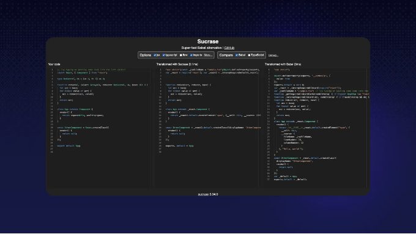
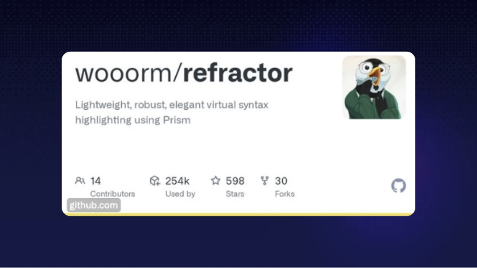
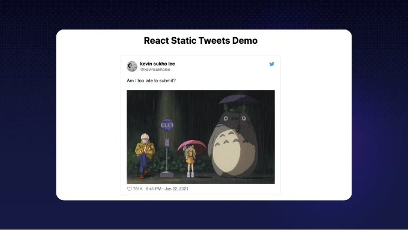
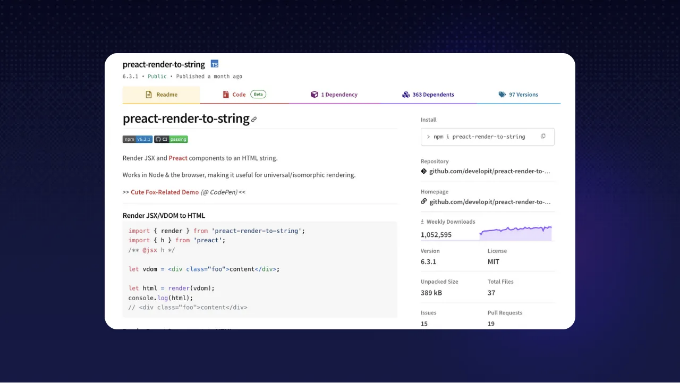
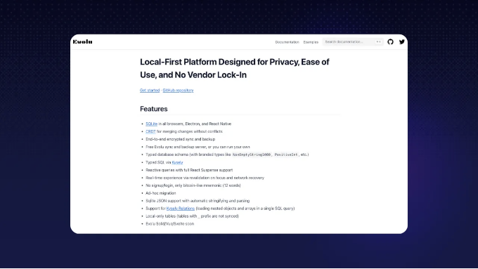

# React 개발할 때 참고하면 좋은 레포지토리 8가지


안녕하세요!

오늘은 최상위 1%의 개발자들이 사용하는 React 레포지토리 8가지를 살펴보겠습니다. (아마도 들어보지 못한 것들입니다.)

준비되셨나요?


<!-- ui-log 수평형 -->

<ins class="adsbygoogle"
     style="display:block"
     data-ad-client="ca-pub-4877378276818686"
     data-ad-slot="9743150776"
     data-ad-format="auto"
     data-full-width-responsive="true"></ins>
<component is="script">
(adsbygoogle = window.adsbygoogle || []).push({});
</component>

우리가 최고의 개발자들이 사용하는 것을 어떻게 찾았는지 이야기해드릴게요. Quine에서는 DevRank라는 것을 통해 개발자들을 순위화합니다.

간단히 말하면, DevRank는 개방 소스에 대한 기여를 기반으로 개발자의 중요성을 측정하기 위해 Google의 PageRank 알고리즘을 사용합니다.

이 목록을 만들기 위해 우리는 최상위 1%가 스타를 한 레포지토리를 살펴보았어요. 🌟

그리고, 우리는 최상위 1%가 레포지토리를 스타할 확률과 하위 50%가 그렇지 않을 확률을 계산했습니다.

마지막으로, 조금의 선별 작업을 거친 후에 아래 8개의 레포지토리를 찾았습니다. 👇

이 레포지토리들은 멋진 웹 앱을 만들 때 특히 유용할 것입니다.

만약 작은 앱을 만들고 적용된 AI 쪽을 즐기는 것이 좋다면, ChatGPT, Claude, Gemini 등과 함께 멋진 GenerativeAI 앱을 만들어 개방형 도전을 보상으로 제공하는 오픈소스 챌린지인 Creator Quests를 확인해보세요. 🙃 💰

현재 Creator Quest는 Generative AI를 사용한 개발 도구를 만드는 것을 도전하고 있습니다. 참여하려면 간단히 Quine에 가입하고 퀘스트로 이동하면 됩니다.

현재 상금 풀은 $2028이며, 참가자가 더 많이 참여할수록 상금이 더 늘어납니다! 아래 이미지를 클릭해서 시도해보세요! ⬇️


<!-- ui-log 수평형 -->

<ins class="adsbygoogle"
     style="display:block"
     data-ad-client="ca-pub-4877378276818686"
     data-ad-slot="9743150776"
     data-ad-format="auto"
     data-full-width-responsive="true"></ins>
<component is="script">
(adsbygoogle = window.adsbygoogle || []).push({});
</component>

# jsxstyle/jsxstyle

JS에서 CSS로의 이동 더 이상 필요 없음


왜 중요할까요? React 또는 Preact를 사용한 웹 개발에서 컴포넌트(버튼, 메뉴 등)를 스타일링해야 할 때가 있습니다. 기존에는 별도의 CSS 파일이나 복잡한 스타일링 시스템을 사용하여 이를 처리했는데, 이는 시간이 많이 소요되고 관리하기 번거로울 수 있습니다. jsxstyle은 컴포넌트와 함께 직접 JavaScript 코드 내에서 스타일을 정의할 수 있도록 해줍니다. 다시 말해, JS와 CSS 파일 간에 이동할 필요가 없어집니다.

설치: npm install jsxstyle
예제 사용법: 아래와 같이 코드를 작성할 수 있습니다. 👇

```js
<Row padding={15}>
  <Block
    backgroundColor="#EEE"
    boxShadow="inset 0 0 0 1px rgba(0,0,0,0.15)"
    borderRadius={5}
    height={64}
    width={64}
    marginRight={15}
    backgroundSize="contain"
    backgroundImage="url(http://graph.facebook.com/justinbieber/picture?type=large)"
  />
  <Col fontFamily="sans-serif" fontSize={16} lineHeight="24px">
    <Block fontWeight={600}>Justin Bieber</Block>
    <Block fontStyle="italic">Canadian</Block>
  </Col>
</Row>
```

[https://github.com/jsxstyle/jsxstyle](https://github.com/jsxstyle/jsxstyle)

<!-- ui-log 수평형 -->

<ins class="adsbygoogle"
     style="display:block"
     data-ad-client="ca-pub-4877378276818686"
     data-ad-slot="9743150776"
     data-ad-format="auto"
     data-full-width-responsive="true"></ins>
<component is="script">
(adsbygoogle = window.adsbygoogle || []).push({});
</component>

# alangpierce/sucrase

Babel 대안으로서의 초고속 변환기



왜 중요할까요? Babel은 최신 JavaScript 코드를 구형 브라우저가 이해할 수 있는 형식으로 변환하는 데 널리 사용되는 도구입니다. Sucrase는 Babel에 대한 빠른 대안입니다.

설치:

```js
yarn add --dev sucrase
# 또는
npm install --save-dev sucrase node -r sucrase/register main.ts
```

예제 사용법: Sucrase는 다음과 같이 직접 JS에서 호출할 수 있습니다.

```js
import { transform } from "sucrase";
const compiledCode = transform(code, { transforms: ["typescript", "imports"] }).code;
```

<!-- ui-log 수평형 -->

<ins class="adsbygoogle"
     style="display:block"
     data-ad-client="ca-pub-4877378276818686"
     data-ad-slot="9743150776"
     data-ad-format="auto"
     data-full-width-responsive="true"></ins>
<component is="script">
(adsbygoogle = window.adsbygoogle || []).push({});
</component>

[https://github.com/alangpierce/sucrase](https://github.com/wooorm/refractor)

# 🎨 wooorm/refractor

웹 페이지 코드를 색상으로 표시하여 일상을 더욱 쉽게 만들어줍니다.



왜 중요할까요? Refractor는 웹 애플리케이션에 코드 스니펫을 추가할 때 특히 유용한 하이라이팅을 제공합니다. 이는 가독성을 향상시키며, 특히 전통적인 HTML 기반 하이라이팅이 이상적이지 않은 CLI 폼 등과 같은 영역에서 유용합니다.

설치: npm install refractor

예제 사용법:

```js
import { refractor } from "refractor";

const tree = refractor.highlight('"use strict";', "js");

console.log(tree);
```

<!-- ui-log 수평형 -->

<ins class="adsbygoogle"
     style="display:block"
     data-ad-client="ca-pub-4877378276818686"
     data-ad-slot="9743150776"
     data-ad-format="auto"
     data-full-width-responsive="true"></ins>
<component is="script">
(adsbygoogle = window.adsbygoogle || []).push({});
</component>

결과:

```js
{ type: 'root', children: [ { type: 'element', tagName: 'span', properties: {className: ['token', 'string']}, children: [{type: 'text', value: '"use strict"'}] }, { type: 'element', tagName: 'span', properties: {className: ['token', 'punctuation']}, children: [{type: 'text', value: ';'}] } ] }
```

[https://github.com/wooorm/refractor](https://github.com/wooorm/refractor)

# 🐦 transitive-bullshit/react-static-tweets

웹사이트에 트윗을 추가하는 가장 좋은 선택



왜 중요할까요? 웹사이트에 트윗을 추가하는 것은 많은 랜딩 페이지에서 볼 수 있는 멋진 기능입니다. React Static Tweets는 웹 프로젝트에 트윗을 쉽게 포함할 수 있는 효율적인 방법을 제공하여 트위터의 표준 포함 방법보다 빠르게 로드되고 성능이 향상됩니다.

설치:

```js
npm install react-static-tweets static-tweets date-fns
# 또는
yarn add react-static-tweets static-tweets date-fns
```

<!-- ui-log 수평형 -->

<ins class="adsbygoogle"
     style="display:block"
     data-ad-client="ca-pub-4877378276818686"
     data-ad-slot="9743150776"
     data-ad-format="auto"
     data-full-width-responsive="true"></ins>
<component is="script">
(adsbygoogle = window.adsbygoogle || []).push({});
</component>

예제 사용법:

```js
import React from "react";
import { fetchTweetAst } from "static-tweets";
import { Tweet } from "react-static-tweets";

const tweetId = "1358199505280262150";

export const getStaticProps = async () => {
  try {
    const tweetAst = await fetchTweetAst(tweetId);

    return {
      props: {
        tweetAst,
      },
      revalidate: 10,
    };
  } catch (err) {
    console.error("error fetching tweet", err);

    throw err;
  }
};

export default function Example({ tweetAst }) {
  return <Tweet ast={tweetAst} />;
}
```

[https://github.com/transitive-bullshit/react-static-tweets](https://github.com/transitive-bullshit/react-static-tweets)

<!-- ui-log 수평형 -->

<ins class="adsbygoogle"
     style="display:block"
     data-ad-client="ca-pub-4877378276818686"
     data-ad-slot="9743150776"
     data-ad-format="auto"
     data-full-width-responsive="true"></ins>
<component is="script">
(adsbygoogle = window.adsbygoogle || []).push({});
</component>

# 🖨️ preactjs/preact-render-to-string

HTML에 컴포넌트 렌더링



왜 중요할까요? "preact-render-to-string"은 웹사이트를 빠르게 로드하고 검색 엔진에서 더 잘 표시할 수 있도록 도와줍니다. Preact와 같은 JS 프레임워크로 구축된 웹사이트는 브라우저가 먼저 JavaScript를 실행해야 하기 때문에 콘텐츠를 표시하는 데 시간이 걸립니다. 이 레포지토리는 컴포넌트를 사용 가능한 HTML로 변환하여 서버 측에서 작업을 처리합니다. 따라서 누군가 웹사이트를 방문하면 인터넷 속도가 느릴지라도 즉시 콘텐츠를 볼 수 있습니다.

설치: npm install preact-render-to-string

예제 사용법:

```js
import { render } from "preact-render-to-string";
import { h, Component } from "preact";
/** @jsx h */

// Classical components work
class Fox extends Component {
  render({ name }) {
    return <span class="fox">{name}</span>;
  }
}

// ... and so do pure functional components:
const Box = ({ type, children }) => <div class={`box box-${type}`}>{children}</div>;

let html = render(
  <Box type="open">
    <Fox name="Finn" />
  </Box>
);

console.log(html);
// <div class="box box-open"><span class="fox">Finn</span></div>
```

https://github.com/preactjs/preact-render-to-string

<!-- ui-log 수평형 -->

<ins class="adsbygoogle"
     style="display:block"
     data-ad-client="ca-pub-4877378276818686"
     data-ad-slot="9743150776"
     data-ad-format="auto"
     data-full-width-responsive="true"></ins>
<component is="script">
(adsbygoogle = window.adsbygoogle || []).push({});
</component>

# 🏆 bikeshaving/crank

단지 자바스크립트 프레임워크


왜 중요할까요? React와 같은 전통적인 웹 프레임워크에서는 웹 컴포넌트가 한 번 설정되고 명시적으로 지정된 경우에만 변경됩니다. 이들은 수동으로 업데이트해야 할 정적 이미지처럼 보입니다. Crank.js는 이를 변경하여 위젯이 새로운 데이터에 응답하여 스스로 업데이트할 수 있도록 합니다. 이는 뉴스 티커가 새로운 뉴스로 갱신되는 것과 같이 실시간 데이터를 관리하는 웹 애플리케이션에 특히 유용합니다.

이 레포지토리는 더 많은 사람들이 이로 마이그레

이션하여 인기를 얻기 위해서는 더 많은 시간이 필요하지만, 여전히 주목할 가치가 있는 매우 멋진 레포지토리입니다. 👀

설치: $ npm i @b9g/crank

예제 사용법:

```js
import { renderer } from "@b9g/crank/dom";

function Greeting({ name = "World" }) {
  return <div>Hello {name}</div>;
}
renderer.render(<Greeting />, document.body);
```

https://github.com/bikeshaving/crank

# 🎯 evoluhq/evolu

나는 로컬을 중심으로 생각하는 사람



왜 중요할까요? 웹 애플리케이션은 일반적으로 사용자 데이터를 서버에 저장하는데, 이는 지속적인 인터넷 연결이 필요하며 개인 정보 보호 및 데이터 보안에 대한 우려를 유발합니다. 이 서버 기반 접근 방식은 성능이 느리고 서버가 다운되거나 회사가 운영을 중단할 경우 데이터 손실이 발생할 수 있습니다.

Evolu는 사용자의 장치에 데이터를 직접 저장하는 "로컬 중심" 접근 방식을 도입합니다. 이는 애플리케이션이 오프라인으로 작동할 수 있고 데이터에 더 빠르게 액세스하며 향상된 개인 정보 보호와 보안을 제공합니다. 이는 오프라인 Chrome/브라우저 앱을 구축하는 경우 유용합니다.

설치: npm install @evolu/react

사용을 시작하려면 여기 훌륭한 가이드를 찾을 수 있습니다.

https://github.com/evoluhq/evolu

# 📸 jest-community/snapshot-diff

Jest를 위한 차이 스냅샷 유틸리티


왜 중요할까요? React 컴포넌트 또는 다른 JavaScript 값들을 테스트할 때 개발자들은 일반적으로 전체 상태나 출력을 비교합니다. 이는 큰 데이터 청크를 처리하고 특정 변경 사항을 찾는 것이 바늘을 건너 끈을 찾는 것과 같습니다. Snapshot-diff는 두 컴포넌트 상태(또는 두 JavaScript 값) 간에 차이점만 강조하여 직접 비교할 수 있는 집중 비교 도구입니다.

React 컴포넌트를 테스트할 때 특히 유용하며, 두 상태 사이에 변경된 내용을 정확히 지정하여 코드 변경의 영향을 식별하고 이해하는 데 큰 도움이 됩니다.

설치: yarn add --dev snapshot-diff

예제 사용법: 기본 Jest Matcher

<!-- ui-log 수평형 -->

<ins class="adsbygoogle"
     style="display:block"
     data-ad-client="ca-pub-4877378276818686"
     data-ad-slot="9743150776"
     data-ad-format="auto"
     data-full-width-responsive="true"></ins>
<component is="script">
(adsbygoogle = window.adsbygoogle || []).push({});
</component>

```js
const snapshotDiff = require("snapshot-diff");

test("2개의 문자열 사이의 스냅샷 차이", () => {
  expect(snapshotDiff(a, b)).toMatchSnapshot();
});

const React = require("react");
const Component = require("./Component");

test("2개의 React 컴포넌트 상태 사이의 스냅샷 차이", () => {
  expect(snapshotDiff(<Component test="say" />, <Component test="my name" />)).toMatchSnapshot();
});
```

https://github.com/jest-community/snapshot-diff

이러한 발견이 유용하고 더 견고한 React 툴킷을 구축하는 데 도움이 되기를 바랍니다! ⚒️

만약 오늘 이러한 도구를 활용하여 보상을 받고 싶다면, 우리는 방금 Generative AI를 사용한 개발 도구를 만들기 위한 도전을 시작했습니다.
