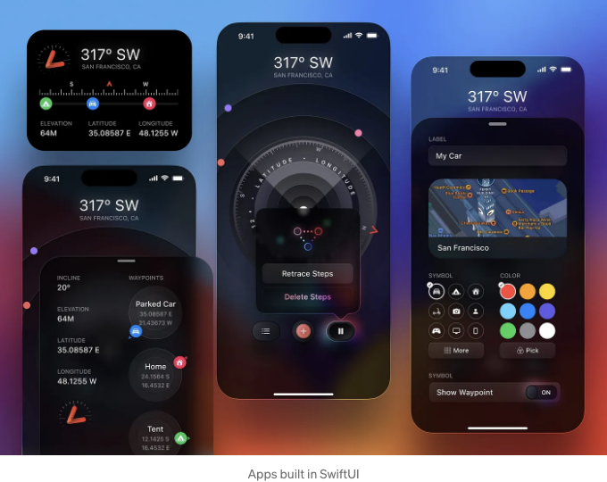
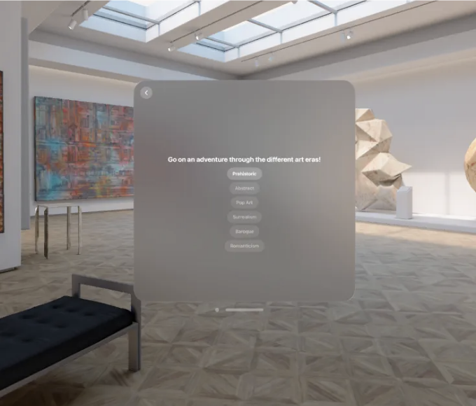
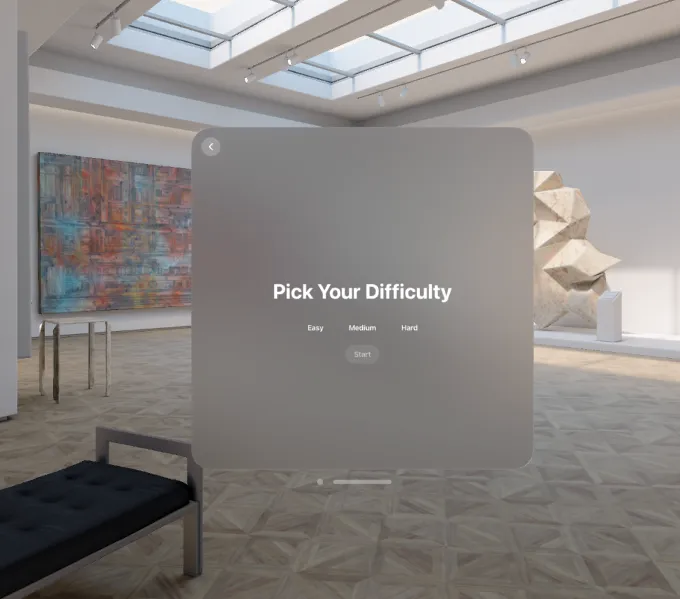
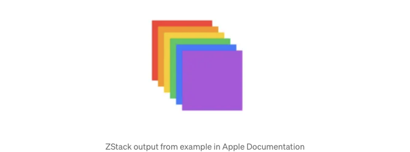
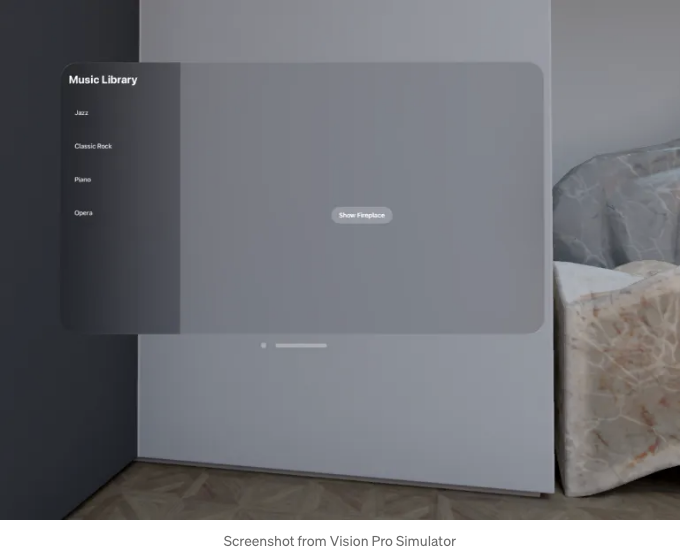

# Swift로 Vision OS 뷰 만드는 방법

VisionOS 앱에 사용할 SwiftUI 뷰를 만드는 간단한 글입니다.



<!-- ui-log 수평형 -->

<ins class="adsbygoogle"
     style="display:block"
     data-ad-client="ca-pub-4877378276818686"
     data-ad-slot="9743150776"
     data-ad-format="auto"
     data-full-width-responsive="true"></ins>
<component is="script">
(adsbygoogle = window.adsbygoogle || []).push({});
</component>

VisionOS는 SwiftUI를 기반으로 구축되었기 때문에, 우리는 Vision Pro 앱을 탐색하기 위해 동일한 기술을 활용합니다.

이 기사에서는 내비게이션 및 데이터 표시를 쉽게 만들기 위해 Vision Pro 앱에 추가할 수 있는 다양한 뷰 및 구성 요소를 살펴보겠습니다. 또한 시뮬레이터에서의 모습과 주어진 작업에 적합한 적절한 도구 선택에 대해 설명하겠습니다.

탐색할 요소 중 일부는 다음과 같습니다:

- VStack, HStack 및 ZStack
- NavigationStack
- NavigationSplitView

<!-- ui-log 수평형 -->

<ins class="adsbygoogle"
     style="display:block"
     data-ad-client="ca-pub-4877378276818686"
     data-ad-slot="9743150776"
     data-ad-format="auto"
     data-full-width-responsive="true"></ins>
<component is="script">
(adsbygoogle = window.adsbygoogle || []).push({});
</component>

각각에 대한 예제가 포함되어 있으므로 여러 사용 사례를 볼 수 있습니다.

VStack, HStack 및 ZStack

SwiftUI에서는 (V, H, Z)-Stacks을 사용하여 항목을 다양한 사전 정의된 방식으로 정렬하여 사용자에게 제공할 수 있습니다. 스택의 다른 글자는 항목이 나열되는 방향을 나타냅니다. 예를 들어 V는 수직을 나타내며, 항목은 위에서 아래로 나열됩니다. 마찬가지로 H 및 Z 스택은 각각 왼쪽에서 오른쪽으로 및 배경에서 전경으로 항목을 나열합니다.

Vision Pro의 경우, 이러한 동작은 정확히 동일하지만 사용 사례가 변경됩니다. 예를 들어 이제 이러한 스택은 항목 선택에 사용할 수 있습니다. 스택의 각 항목은 클릭시 나타날 수 있는 특정 3D 자산에 해당할 수 있습니다.

예를 들어, 버튼 목록을 표시하기 위한 뷰의 일부로 이 VStack을 사용할 수 있습니다:

<!-- ui-log 수평형 -->

<ins class="adsbygoogle"
     style="display:block"
     data-ad-client="ca-pub-4877378276818686"
     data-ad-slot="9743150776"
     data-ad-format="auto"
     data-full-width-responsive="true"></ins>
<component is="script">
(adsbygoogle = window.adsbygoogle || []).push({});
</component>

```swift
struct StoryView: View {
    // 다수의 부울 상태 변수

    var body : some View {
        NavigationStack {
            VStack {
                Text("다양한 미술 시대를 통해 모험을 떠나보세요!")
                    .font(.title)
            }

            VStack {
                Toggle("선사 시대", isOn: $showPrehistoric)
                    .toggleStyle(.button)

                Toggle("추상주의", isOn: $showAbstract)
                    .toggleStyle(.button)
                    .disabled(dataModel.stage < 1)

                Toggle("팝 아트", isOn: $showPopArt)
                    .toggleStyle(.button)
                    .disabled(dataModel.stage < 2)

                Toggle("초현실주의", isOn: $showSurrealism)
                    .toggleStyle(.button)
                    .disabled(dataModel.stage < 3)

                Toggle("바로크", isOn: $showBaroque)
                    .toggleStyle(.button)
                    .disabled(dataModel.stage < 4)

                Toggle("로맨티시즘", isOn: $showRomanticism)
                    .toggleStyle(.button)
                    .disabled(dataModel.stage < 5)

            }
        }
    }
}
```

결과는 다음과 같습니다:



<!-- ui-log 수평형 -->

<ins class="adsbygoogle"
     style="display:block"
     data-ad-client="ca-pub-4877378276818686"
     data-ad-slot="9743150776"
     data-ad-format="auto"
     data-full-width-responsive="true"></ins>
<component is="script">
(adsbygoogle = window.adsbygoogle || []).push({});
</component>

VStack과 마찬가지로, HStack은 항목을 수평으로 표시하는 데 사용됩니다. 예를 들어, 다음 코드:

```swift
struct FreestyleView: View {
    @State private var selectedDifficulty: String?
    let difficulty = ["쉬움", "중간", "어려움"]

    var body : some View {
        NavigationStack {
            VStack {
                Text("난이도 선택")
                    .font(.extraLargeTitle)
                    .padding()

                HStack {
                    ForEach(difficulty, id: \.self) { option in
                        Button(action: {
                            self.selectedDifficulty = option
                        }) {
                            Text(option)
                                .foregroundColor(.white)
                                .frame(width: 100, height: 30) // 필요에 따라 너비와 높이 조정
                                .background(selectedDifficulty == option ? Color.gray.opacity(0.7) : Color.clear)
                                .cornerRadius(10)
                        }
                        .padding(1) // 더 작은 padding
                        .buttonStyle(PlainButtonStyle()) // 버튼 스타일링 제거
                    }
                }.padding()

                Toggle("시작", isOn: $showFreestyleMode)
                    .toggleStyle(.button)
                    .disabled(selectedDifficulty == nil)
            }
        }
    }
}
```

대략 다음과 같이 표시됩니다:

<!-- ui-log 수평형 -->

<ins class="adsbygoogle"
     style="display:block"
     data-ad-client="ca-pub-4877378276818686"
     data-ad-slot="9743150776"
     data-ad-format="auto"
     data-full-width-responsive="true"></ins>
<component is="script">
(adsbygoogle = window.adsbygoogle || []).push({});
</component>



두 경우 모두 여러 옵션을 선택할 수 있습니다. 여기서 중요한 점은 버튼을 초기화하는 다른 방법을 사용하지만 결국 같은 데이터를 나타낸다는 것입니다. 이들은 서로 다른 스택에 의해 캡슐화되어 있으므로 다른 방향으로 항목을 표시할 수 있습니다.

ZStack은 항목을 "레이어링"할 수 있도록 특별합니다. 개인적으로 이 구성 요소에 대한 사용 사례를 아직 찾지 못했지만, Apple 문서에서는 주로 계층화된 아트를 만드는 기능을 강조합니다.



Navigation Stack

네비게이션 스택은 사용자에게 다른 뷰를 표시하기 위해 토글할 수 있는 경우에 필수적입니다. React / React Native를 사용해본 사람들에게는 스택 네비게이

터와 매우 유사한 개념입니다.

그러나 SwiftUI가 구현하는 방식은 조금 다릅니다. SwiftUI는 더 유연한 접근 방식을 취합니다. 특정 뷰 내에서 네비게이션 스택을 선언하고, 런타임 시에 조건에 따라 다른 창 뷰로 열 수 있습니다. 네비게이션 스택은 네비게이션을 위한 "뒤로" 버튼도 암시적으로 제공합니다.

이전 코드를 기반으로한 예시를 살펴봅시다:

```swift
struct FreestyleView: View {
    @Environment(\.openImmersiveSpace) var openImmersiveSpace
    @Environment(\.dismissImmersiveSpace) var dismissImmersiveSpace

    @State private var showFreestyleMode = false
    @State private var freestyleModeShown = false
    @State private var selectedDifficulty: String?
    let difficulty = ["쉬움", "중간", "어려움"]

    var body : some View {
        NavigationStack { // navigation stack used here
            VStack {
                ...
                }.padding()

            }.onChange(of: showFreestyleMode) { _, newValue in
                Task {
                    if newValue && selectedDifficulty == "쉬움" {
                        switch await openImmersiveSpace(id: "EasyMode") {
                        case .opened:
                            freestyleModeShown = true
                        case .error, .userCancelled:
                            fallthrough
                        @unknown default:
                            freestyleModeShown = false
                            showFreestyleMode = false
                        }
                    } else if freestyleModeShown {
                        await dismissImmersiveSpace()
                        freestyleModeShown = false
                    }
                }
            }
            // other difficulties에 대한 변경 트리거에 대한 내용
    }
}
```

여기서는 "showFreestyleMode" 변수의 변경을 듣는 ".onChange" 문을 네비게이션 스택에 추가했습니다. 그런 다음 선택한 난이도에 따라 특정 공간을 엽니다.

<!-- ui-log 수평형 -->

<ins class="adsbygoogle"
     style="display:block"
     data-ad-client="ca-pub-4877378276818686"
     data-ad-slot="9743150776"
     data-ad-format="auto"
     data-full-width-responsive="true"></ins>
<component is="script">
(adsbygoogle = window.adsbygoogle || []).push({});
</component>

Navigation Split View

이는 좀 더 "특수한" 사용 사례를 위한 구성 요소입니다. 이는 현재 보기 창을 사이드 메뉴와 주요 보기 창으로 "구획화"합니다. 이 뷰는 사용자가 측면에서 선택하고 주요 창에서 해당하는 반응을 트리거하도록 원할 때 훌륭합니다.

효과는 다음과 같습니다:



해당 코드는 다음과 같습니다:

<!-- ui-log 수평형 -->

<ins class="adsbygoogle"
     style="display:block"
     data-ad-client="ca-pub-4877378276818686"
     data-ad-slot="9743150776"
     data-ad-format="auto"
     data-full-width-responsive="true"></ins>
<component is="script">
(adsbygoogle = window.adsbygoogle || []).push({});
</component>

```swift
struct ContentView: View {
    // state variables

    var body: some View {

        // View is split between music side menu and main control menu
        NavigationSplitView {
            List {
                ForEach(["재즈", "클래식 록", "피아노", "오페라"], id: \.self) { item in
                    ListItemView(title: item,
                                 isHovered: hoveredItem == item,
                                 isSelected: selectedItem == item)
                    .hoverEffect(.automatic)
                    .onTapGesture {
                        musicPlaying = true
                        selectedItem = item
                        let state = musicSelection.from(musicChoice: selectedItem)
                        dataModel.playMusic(music: state, currMusicPlaying: musicPlaying)
                    }
                }
            }.toolbar {
                ToolbarItem(placement: .topBarLeading) {
                    VStack (alignment: .leading) {
                        Text("음악 라이브러리")
                            .font(.largeTitle)
                    }
                }
            }

            // Main menu content
        } detail: {
            Toggle("벽난로 표시", isOn: $showFireplaceView)
                .toggleStyle(.button)
                .onChange(of: showFireplaceView) {_, isShowing in
                    if isShowing {
                        openWindow(id: "FireplaceView")
                        dataModel.playFireplaceSounds();
                    } else {
                        dismissWindow(id: "FireplaceView")
                        dataModel.stopFireplaceSounds();
                    }
                }

            // other code
            }
        }
    }
}
```

여기서 우리는 뷰 본문에서 Navigation Split View를 정의했습니다. 그런 다음 툴바 섹션에서 그것이 어떤 부분에 속하는지 강조하는 제목을 가졌습니다. 주 메뉴 내용은 "detail" 섹션에 정의되어 있으며, 여기에는 벽난로를 나타내는 버튼과 표시되지 않은 기타 기능이 포함됩니다.

당신의 뷰를 사용자 정의하기 위해 사용할 수 있는 몇 가지 구성 요소에 대해 이야기했습니다. 이러한 구성 요소는 대부분의 시간 동안 사용하게 될 주요 구성 요소입니다. 앱을 최대한 활용하려면 Vision Pro 앱 내에서 이러한 뷰의 여러 가지 변형을 사용하여 인터페이스를 사용자에게 더 매력적이고 직관적으로 만드는 것이 좋습니다.

SwiftUI에서 사용할 수 있는 다양한 구성 요소가 많이 있으며, VisionOS 내에서 Vision Pro 앱을 구축하기 위해 이러한 구성 요소를 어떻게 사용할 수 있는지 보여주는 기사를 작성할 예정입니다.
