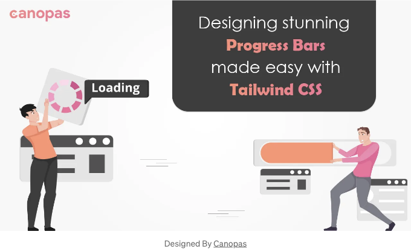
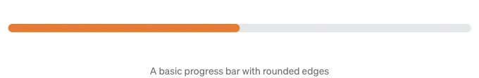
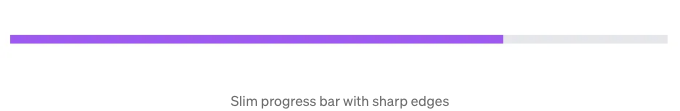
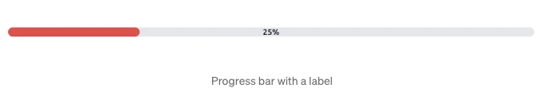
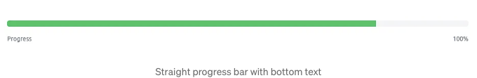
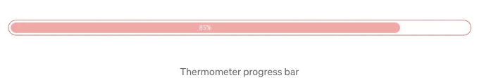
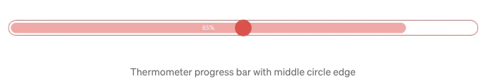
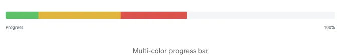
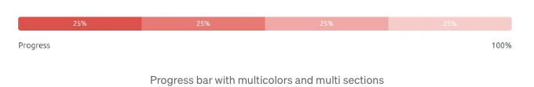

# Tailwind CSS로 Progress bar 10가지 만들기



<!-- ui-log 수평형 -->

<ins class="adsbygoogle"
     style="display:block"
     data-ad-client="ca-pub-4877378276818686"
     data-ad-slot="9743150776"
     data-ad-format="auto"
     data-full-width-responsive="true"></ins>
<component is="script">
(adsbygoogle = window.adsbygoogle || []).push({});
</component>

# 배경

현재의 빠르게 변화하는 디지털 세계에서 사용자 경험은 웹 개발의 중요한 측면입니다. 사용자 경험을 향상시키는 효과적인 방법 중 하나는 웹 사이트나 애플리케이션에 Progress bar를 통합하는 것입니다.

온라인 파일 업로드 기능을 클라우드 저장소 애플리케이션에 구축 중이라고 상상해보십시오. 사용자가 파일을 업로드할 때는 업로드 상태를 알고 나머지 시간을 예측하거나 프로세스가 성공적으로 완료되었는지 확인하고 싶어합니다.

파일 업로드 기능에 Progress bar를 통합하여 사용자에게 실시간 피드백을 제공하면 파일 업로드의 진행 상황에 대한 정보를 제공하여 불확실성을 줄이고 업로드 프로세스를 성공적으로 완료할 수 있도록 도와줍니다.

이 블로그 글에서는 Progress bar를 Tailwind CSS를 사용하여 쉽게 만드는 방법을 살펴보겠습니다. 시작해 봅시다!

# 목차

```js
* Progress bar의 중요성
* Tailwind CSS로 시작하기
  1. 둥근 모서리를 가진 기본 Progress bar
  2. 날카로운 모서리를 가진 슬림 Progress bar
  3. 라벨이 있는 Progress bar
  4. 애니메이션 효과가 있는 Progress bar
  5. 하단 텍스트가 있는 직선 Progress bar
  6. 세로 방향 Progress bar
  7. 온도계 형태의 Progress bar
  8. 다중 색상 Progress bar
  9. 그라디언트 Progress bar
  10. 다중 색상 및 다중 섹션 Progress bar
* 결론
```

<!-- ui-log 수평형 -->

<ins class="adsbygoogle"
     style="display:block"
     data-ad-client="ca-pub-4877378276818686"
     data-ad-slot="9743150776"
     data-ad-format="auto"
     data-full-width-responsive="true"></ins>
<component is="script">
(adsbygoogle = window.adsbygoogle || []).push({});
</component>

# Progress bar의 중요성

Progress bar는 시각적 피드백을 제공하고 사용자의 기대를 관리하는 데 귀중한 도구입니다.

Progress bar는 완료된 느낌을 전달하고 불안을 줄이며 사용자 참여를 증가시킵니다.

파일 업로드, 양식 제출 또는 시간이 필요한 작업 등 다양한 작업에 사용될 때, 잘 디자인된 Progress bar는 사용자에게 정보를 제공하고 관여할 수 있는 기회를 제공하여 만족스러운 사용자 경험을 제공합니다.

# Tailwind CSS로 시작하기

Tailwind CSS는 개발자가 아름답고 반응형 사용자 인터페이스를 신속하게 구축할 수 있도록 하는 유틸리티 기반 CSS 프레임워크입니다. 그 간결함과 유연성으로 인해 Progress bar를 만드는 데 이상적인 선택입니다.

시작하기 전에 프로젝트에 Tailwind CSS가 설치되어 있는지 확인하십시오. 그렇지 않은 경우, 설치 방법에 대한 공식 Tailwind CSS 문서를 참조하십시오.

## 1. 둥근 모서리를 가진 기본 Progress bar

이것은 둥근 모서리를 가진 기본 Progress bar로, 쉽게 통합할 수 있습니다.

```js
<div class="mb-5 h-2 rounded-full bg-gray-200">
  <div class="h-2 rounded-full bg-orange-500" style="width: 50%"></div>
</div>
```

<!-- ui-log 수평형 -->

<ins class="adsbygoogle"
     style="display:block"
     data-ad-client="ca-pub-4877378276818686"
     data-ad-slot="9743150776"
     data-ad-format="auto"
     data-full-width-responsive="true"></ins>
<component is="script">
(adsbygoogle = window.adsbygoogle || []).push({});
</component>



위 코드 스니펫은 회색 배경과 주황색으로 채워진 Progress bar를 생성합니다. 여기서 50%의 진행을 나타냅니다.

플레이그라운드에서 실시간 데모를 확인하고 필요에 따라 플레이해 보세요.

## 2. 날카로운 모서리를 가진 슬림 Progress bar

날카로운 모서리를 가진 슬림 Progress bar를 선호하는 경우, 클래스를 수정할 수 있습니다.

```js
<div class="mb-5 h-1 bg-gray-200">
  <div class="h-1 bg-purple-500" style="width: 75%"></div>
</div>
```



위 코드 스니펫은 회색 배경과 보라색으로 채워진 슬림 Progress bar를 생성합니다. 여기서 75%의 진행을 나

타냅니다.

플레이그라운드에서 실시간 데모를 확인하세요.

## 3. 라벨이 있는 Progress bar

Progress bar에 라벨을 추가하면 추가적인 컨텍스트를 제공할 수 있습니다. Progress bar 내에 텍스트 요소를 포함하여 이를 구현할 수 있습니다.

<!-- ui-log 수평형 -->

<ins class="adsbygoogle"
     style="display:block"
     data-ad-client="ca-pub-4877378276818686"
     data-ad-slot="9743150776"
     data-ad-format="auto"
     data-full-width-responsive="true"></ins>
<component is="script">
(adsbygoogle = window.adsbygoogle || []).push({});
</component>

```js
<div class="relative mb-5 h-2 rounded-full bg-gray-200">
  <div class="h-2 rounded-full bg-red-500" style="width: 25%"></div>
  <span class="absolute inset-0 flex items-center justify-center text-sm font-medium text-gray-900">25%</span>
</div>
```



이 코드 스니펫에서는 Progress bar 중앙에 백분율 라벨이 위치하여 진행을 명확히 시각적으로 나타냅니다.

플레이그라운드에서 실시간 데모를 확인하세요.

## 4. 애니메이션 효과가 있는 Progress bar

Progress bar에 줄무늬 애니메이션 효과를 추가하려면 몇 가지 추가 CSS 클래스를 사용하여 이를 구현할 수 있습니다.

```js
<div class="mb-5 h-2 overflow-hidden rounded-full bg-gray-200">
  <div class="h-2 animate-pulse rounded-full bg-gray-800" style="width: 50%">
    <div class="h-full w-full translate-x-full transform bg-white"></div>
  </div>
</div>
```

<!-- ui-log 수평형 -->

<ins class="adsbygoogle"
     style="display:block"
     data-ad-client="ca-pub-4877378276818686"
     data-ad-slot="9743150776"
     data-ad-format="auto"
     data-full-width-responsive="true"></ins>
<component is="script">
(adsbygoogle = window.adsbygoogle || []).push({});
</component>


이 코드 스니펫은 줄무늬 애니메이션 효과가 있는 Progress bar를 생성합니다. Progress bar는 컨테이너의 50%를 채우고, 줄무늬 애니메이션이 왼쪽에서 오른쪽으로 움직이며 진행을 시각적으로 나타냅니다.

플레이그라운드에서 실시간 데모를 확인하세요.

## 5. 하단 텍스트가 있는 직선 Progress bar

이 Progress bar는 하단 텍스트(진행 백분율)를 추가하고 진행을 표시할 수 있습니다.

```js
<div class="relative mb-5 pt-1">
  <div class="mb-4 flex h-2 overflow-hidden rounded bg-gray-100 text-xs">
    <div style="width: 80%" class="bg-green-500"></div>
  </div>
  <div class="mb-2 flex items-center justify-between text-xs">
    <div class="text-gray-600">진행</div>
    <div class="text-gray-600">100%</div>
  </div>
</div>
```



이 코드 스니펫에서는 Progress bar 아래에 백분율 라벨 및 텍스트를 배치하여 진행을 명확하게 시각적으로 나타냅니다.

플레이그라운드에서 실시간 데모를 확인하세요.

## 6. 세로 방향 Progress bar

이 Progress bar는 수직으로 표시됩니다. flex-col 클래스는 열 방향으로 요소를 정렬하는 데 사용됩니다.

```js
<div class="flex">
  <div class="mb-5 ml-5 flex flex-col items-center">
    <div class="h-24 w-5 overflow-hidden rounded-md bg-gray-300">
      <div class="h-full bg-yellow-800" style="height: 50%"></div>
    </div>
    <span class="mt-2 text-xs text-gray-600">50%</span>
  </div>
  <div class="mb-5 ml-5 flex flex-col items-center">
    <div class="h-24 w-10 overflow-hidden rounded-full bg-gray-300">
      <div class="h-full bg-yellow-500" style="height: 75%"></div>
    </div>
    <span class="mt-2 text-xs text-gray-600">75%</span>
  </div>
  <div class="mb-5 ml-5 flex flex-col items-center">
    <div class="h-24 w-10 overflow-hidden rounded-full bg-gray-200">
      <div class="h-full bg-gradient-to-t from-gray-200 via-blue-400 to-blue-600" style="height: 60%"></div>
    </div>
    <span class="mt-2 text-xs text-gray-600">60%</span>
  </div>
</div>
```

<!-- ui-log 수평형 -->

<ins class="adsbygoogle"
     style="display:block"
     data-ad-client="ca-pub-4877378276818686"
     data-ad-slot="9743150776"
     data-ad-format="auto"
     data-full-width-responsive="true"></ins>
<component is="script">
(adsbygoogle = window.adsbygoogle || []).push({});
</component>


Progress bar의 높이는 h-24 클래스를 사용하여 설정되며 h-full 클래스를 사용하여 내부 div의 높이를 조정하여 채움량을 나타냅니다.

플레이그라운드에서 실시간 데모를 확인하세요.

## 7. 온도계 형태의 Progress bar

이 Progress bar는 원형 모양을 가집니다.

```js
<div class="relative mb-5">
  <div class="rounded-full border border-red-500 p-1">
    <div class="flex h-6 items-center justify-center rounded-full bg-red-300 text-xs leading-none" style="width: 85%; height: 85%;">
      <span class="p-1 text-white">85%</span>
    </div>
  </div>
</div>
```



외부 div는 rounded-full과 border 클래스로 원형 컨테이너를 생성합니다. 진행은 지정된 백분율에 따라 채워지며, 원형 모양은 백분율 값으로 높이와 너비를 설정하여 달성됩니다.

우리는 또한 50%나 다른 위치에 원을 추가할 수 있습니다. 이것은 몇 가지 종단점이나 목표점을 나타내어 작업의 진행을 쉽게 파악할 수 있습니다.

<!-- ui-log 수평형 -->

<ins class="adsbygoogle"
     style="display:block"
     data-ad-client="ca-pub-4877378276818686"
     data-ad-slot="9743150776"
     data-ad-format="auto"
     data-full-width-responsive="true"></ins>
<component is="script">
(adsbygoogle = window.adsbygoogle || []).push({});
</component>

```js
<div class="relative my-20 mx-5">
  <div class="rounded-full border border-red-500 p-1">
    <div class="flex h-6 items-center justify-center rounded-full bg-red-300 text-xs leading-none" style="width: 85%; height: 85%;">
      <span class="p-1 text-white">85%</span>
    </div>
  </div>
  <div class="absolute inset-0 flex items-center justify-center">
    <div class="h-8 w-8 rounded-full bg-red-500"></div>
  </div>
</div>
```

<!-- ui-log 수평형 -->

<ins class="adsbygoogle"
     style="display:block"
     data-ad-client="ca-pub-4877378276818686"
     data-ad-slot="9743150776"
     data-ad-format="auto"
     data-full-width-responsive="true"></ins>
<component is="script">
(adsbygoogle = window.adsbygoogle || []).push({});
</component>



내부 div는 진행을 나타내며, 외부 컨테이너 내에서 absolute 클래스를 사용하여 위치가 지정됩니다.

플레이그라운드에서 실시간 데모를 확인하세요.

## 8. 다중 색상 Progress bar

이 Progress bar는 다양한 색상의 여러 섹션으로 나누어져 있으며, 각각은 진행의 특정 백분율을 나타냅니다.

```js
<div class="relative my-20 mx-5 pt-1">
  <div class="mb-4 flex h-2 overflow-hidden rounded bg-gray-100 text-xs">
    <div style="width: 10%" class="bg-green-500 transition-all duration-500 ease-out"></div>
    <div style="width: 25%" class="bg-yellow-500 transition-all duration-500 ease-out"></div>
    <div style="width: 20%" class="bg-red-500 transition-all duration-500 ease-out"></div>
  </div>
  <div class="mb-2 flex items-center justify-between text-xs">
    <div class="text-gray-600">진행</div>
    <div class="text-gray-600">100%</div>
  </div>
</div>
```

<!-- ui-log 수평형 -->

<ins class="adsbygoogle"
     style="display:block"
     data-ad-client="ca-pub-4877378276818686"
     data-ad-slot="9743150776"
     data-ad-format="auto"
     data-full-width-responsive="true"></ins>
<component is="script">
(adsbygoogle = window.adsbygoogle || []).push({});
</component>



이 스니펫에서는 세 가지 다른 색상으로 세 가지 다른 백분율을 나타내는 세 개의 다른 섹션을 설계했습니다.

각 섹션은 별도의 div로 정의되어 있으며, 백분율 값으로 너비가 설정됩니다. 서로 다른 섹션은 서로 다른 색상을 가질 수 있으며, 필요에 따라 섹션의 수와 너비를 조정할 수 있습니다.

플레이그라운드에서 실시간 데모를 확인하세요.

## 9. 그라디언트 Progress bar

이 Progress bar는 색상의 부드러운 전환을 만들기 위해 그라디언트 효과를 활용합니다.

```js
<div class="mb-5 h-4 overflow-hidden rounded-full bg-gray-200">
  <div class="h-4 animate-pulse rounded-full bg-gradient-to-r from-green-500 to-blue-500" style="width: 75%"></div>
</div>
```


bg-gradient-to-r 클래스는 왼쪽에서 오른쪽으로 그라디언트를 적용하며, from-green-500으로 지정된 색상에서 시작하여 to-blue-500으로 지정된 색상으로 끝납니다. w-1/2 클래스는 각 그라디언트 섹션의 너비를 50%로 설정하여 두 개의 동일한 세그먼트를 생성합니다.

이렇게 하여 작업의 진행을 보다 상호작용적으로 표시할 수 있도록 스타일을 수정할 수도 있습니다.

```js
<div class="relative mb-5 h-5 rounded-full bg-gray-200">
  <div class="h-full animate-pulse rounded-full bg-blue-500" style="width: 75%">
    <span class="absolute inset-0 flex items-center justify-center text-xs font-semibold text-white">75%</span>
  </div>
</div>
```

<!-- ui-log 수평형 -->

<ins class="adsbygoogle"
     style="display:block"
     data-ad-client="ca-pub-4877378276818686"
     data-ad-slot="9743150776"
     data-ad-format="auto"
     data-full-width-responsive="true"></ins>
<component is="script">
(adsbygoogle = window.adsbygoogle || []).push({});
</component>


플레이그라운드에서 실시간 데모를 확인하세요.

## 10. 다중 색상 및 다중 섹션 Progress bar

이 Progress bar는 다양한 색상의 여러 섹션으로 나뉘어 각각이 진행의 특정 백분율을 나타냅니다.

```js
<div class="relative">
  <div class="mb-4 flex h-5 overflow-hidden rounded bg-gray-100 text-xs">
    <div class="flex flex-col justify-center bg-red-500 text-white" style="width: 25%;">
      <span class="text-center">25%</span>
    </div>
    <div
      class="flex flex-col justify-center bg-red-400 text-white"
      style="width:

 10%;"
    >
      <span class="text-center">10%</span>
    </div>
    <div class="flex flex-col justify-center bg-red-300 text-white" style="width: 15%;">
      <span class="text-center">15%</span>
    </div>
  </div>
  <div class="mb-2 flex items-center justify-between text-xs">
    <div class="text-gray-600">진행</div>
    <div class="text-gray-600">100%</div>
  </div>
</div>
```



<!-- ui-log 수평형 -->

<ins class="adsbygoogle"
     style="display:block"
     data-ad-client="ca-pub-4877378276818686"
     data-ad-slot="9743150776"
     data-ad-format="auto"
     data-full-width-responsive="true"></ins>
<component is="script">
(adsbygoogle = window.adsbygoogle || []).push({});
</component>

이 코드 스니펫에서는 세 가지 다른 색상으로 세 가지 다른 백분율을 나타내는 세 개의 다른 섹션을 설계했습니다.

각 섹션은 별도의 div로 정의되어 있으며, 백분율 값으로 너비가 설정됩니다. 서로 다른 섹션은 서로 다른 색상을 가질 수 있으며, 필요에 따라 섹션의 수와 너비를 조정할 수 있습니다.

<!-- ui-log 수평형 -->

<ins class="adsbygoogle"
     style="display:block"
     data-ad-client="ca-pub-4877378276818686"
     data-ad-slot="9743150776"
     data-ad-format="auto"
     data-full-width-responsive="true"></ins>
<component is="script">
(adsbygoogle = window.adsbygoogle || []).push({});
</component>

## 결론

이제 Progress bar를 만드는 몇 가지 간단한 방법을 배웠습니다. 이러한 디자인 패턴을 사용하여 사용자 경험을 향상시키고 웹 애플리케이션 또는 웹 사이트에 동적인 요소를 추가하세요. Tailwind CSS의 간결한 클래스 구문을 활용하여 손쉽게 스타일을 지정할 수 있습니다.

더 많은 스타일 및 옵션을 사용하려면 [Tailwind CSS 공식 문서](https://tailwindcss.com/docs)를 참조하십시오. 그런 다음 플레이그라운드에서 실험하여 직접 만들어 보세요!

이제 디자이너의 역량과 개발자의 기술을 결합하여 멋진 Progress bar를 만들어 보세요. 행운을 빕니다!

해당 스니펫을 실제 프로젝트에 적용하고, 디자인을 적용할 때 참고로 사용하세요. 이러한 스니펫은 향상된 사용자 경험을 제공하고 웹 애플리케이션 또는 웹 사이트에 동적인 요소를 추가하는 데 도움이 될 것입니다. 만약 질문이 있거나 추가 지원이 필요하면 언제든지 문의하십시오. 함께 프로젝트를 성공적으로 완료해 봅시다!
