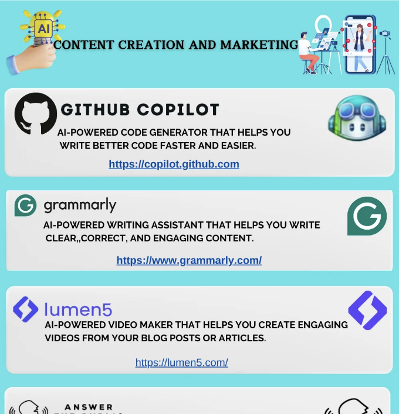
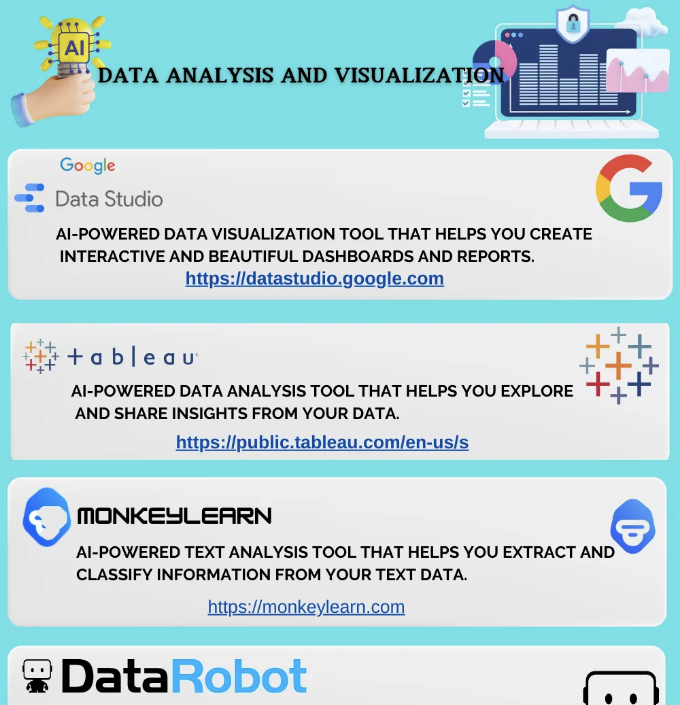
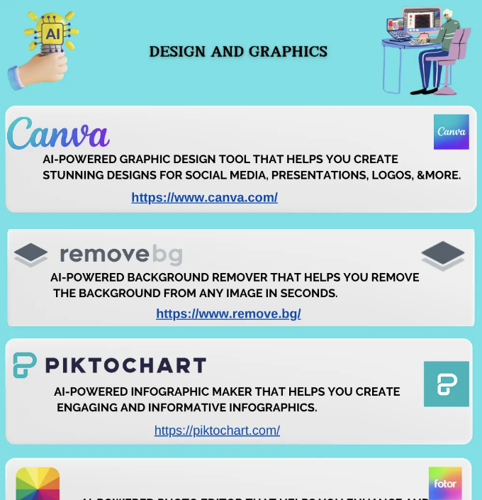
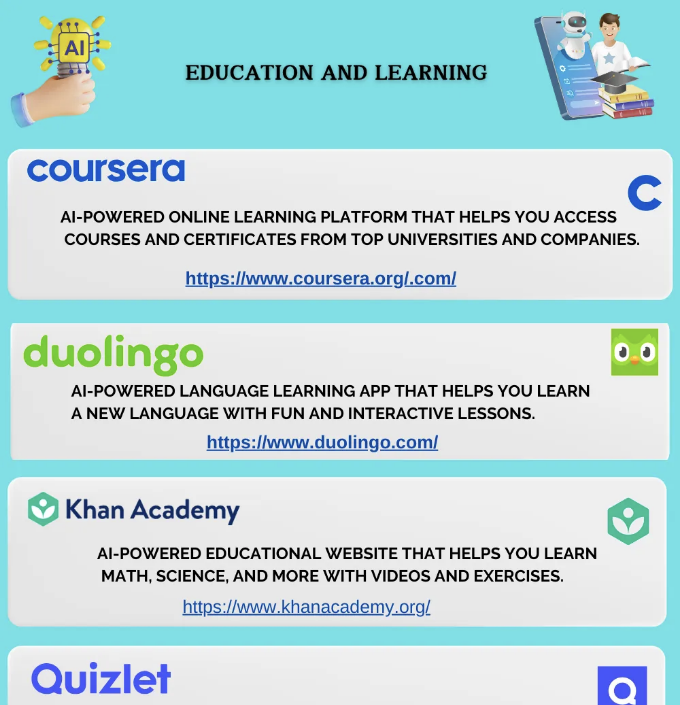
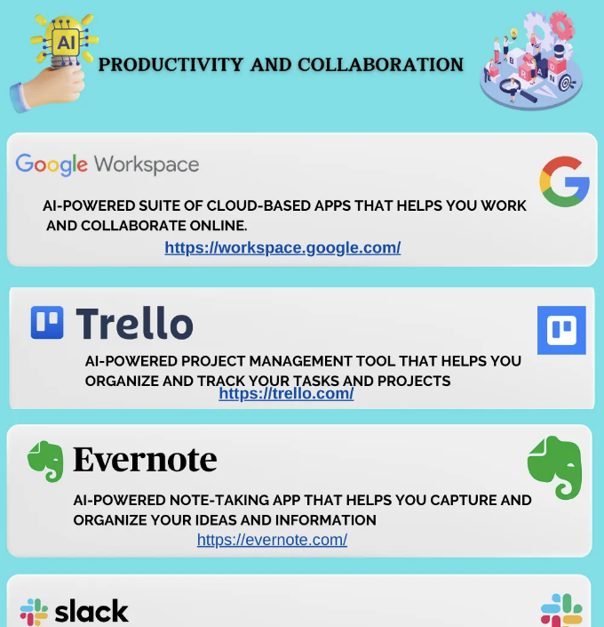

# 비즈니스를 진행할 때 필수적인 AI 도구

<!-- ui-log 수평형 -->

<ins class="adsbygoogle"
     style="display:block"
     data-ad-client="ca-pub-4877378276818686"
     data-ad-slot="9743150776"
     data-ad-format="auto"
     data-full-width-responsive="true"></ins>
<component is="script">
(adsbygoogle = window.adsbygoogle || []).push({});
</component>

이 블로그 포스트에서는 비즈니스나 초보자들을 위한 무료이며 사용하기 쉬운 최고의 AI 도구들을 살펴보겠습니다. 여러분이 작업을 자동화하고 창의성을 향상시키거나 새로운 기술을 배우고 싶어하는 경우, 이러한 AI 도구들은 여러분의 목표를 달성하는 데 도움이 될 것입니다.

# AI 도구란 무엇이며 비즈니스나 초보자에게 왜 중요한가요?

AI 도구는 인공 지능(AI) 기술을 사용하여 인간의 지능이나 창의성이 필요한 작업을 수행하는 소프트웨어 응용 프로그램입니다. AI 도구를 사용하면 다음과 같은 이점을 얻을 수 있습니다:

- 반복적이거나 복잡한 작업을 자동화함으로써 시간과 비용을 절약합니다.

- 워크플로우와 프로세스를 최적화함으로써 생산성과 효율성을 향상시킵니다.

- 오류와 편견을 줄이는 것으로 품질과 정확도를 향상시킵니다.

- 새로운 아이디어와 통찰력을 생성함으로써 혁신력과 경쟁력을 향상시킵니다.

- 온라인 강의와 튜토리얼을 통해 새로운 기술과 지식을 습득합니다.

특히 비즈니스나 초보자들에게 AI 도구는 매우 중요합니다. 여러분은 AI의 힘을 발휘하려면 많은 자원이나 전문 지식을 투자하지 않고도 사용자 친화적이고 무료인 AI 도구를 사용할 수 있습니다. 무료이며 사용하기 쉬운 AI 도구를 사용함으로써 여러분은 다음을 할 수 있습니다:

- 어떠한 위험도나 약속 없이 다양한 AI 응용 프로그램과 기능을 실험할 수 있습니다.

- 여러분의 문제나 과제에 대한 새로운 기회와 해결책을 발견할 수 있습니다.

- AI를 사용하지 않는 경쟁 상대나 동료에 비해 경쟁 우위를 점할 수 있습니다.

- AI의 기초와 최선의 실천 방법을 배우면서 AI 읽기와 자신감을 향상시킬 수 있습니다.

# 여러분의 요구 사항과 목표에 맞는 적절한 AI 도구를 선택하는 방법은 무엇인가요?

<!-- ui-log 수평형 -->

<ins class="adsbygoogle"
     style="display:block"
     data-ad-client="ca-pub-4877378276818686"
     data-ad-slot="9743150776"
     data-ad-format="auto"
     data-full-width-responsive="true"></ins>
<component is="script">
(adsbygoogle = window.adsbygoogle || []).push({});
</component>

시장에는 많은 AI 도구들이 있지만, 모든 도구가 여러분의 요구 사항과 목표에 적합한 것은 아닙니다. 비즈니스나 학습을 위한 적절한 AI 도구를 선택하기 위해 다음과 같은 요소들을 고려해야 합니다:

- 목적: AI 도구를 사용하여 무엇을 달성하고 싶은가요? 자동화, 향상 또는 학습이 목적인가요?

- 기능: AI 도구가 어떤 기능과 능력을 제공하나요? 여러분의 요구 사항과 기대에 부합하는가요?

- 사용성: AI 도구를 사용하는 것이 얼마나 쉬운가요? 사용자 친화적인 인터페이스와 명확한 지침이 있나요?

- 호환성: AI 도구가 여러분의 기존 시스템과 플랫폼과 얼마나 잘 통합되나요? 여러분이 선호하는 형식과 표준을 지원하나요?

- 신뢰성: AI 도구는 얼마나 안전하고 신뢰할까요? 그들의 평판과 실적은 어떤가요?

- 지원: AI 도구가 얼마나 많은 지도와 지원을 제공하나요? 반응이 빠르고 도움이 되는 고객 서비스와 커뮤니티가 있나요?

# 비즈니스나 초보자를 위한 무료이며 필수적인 AI 도구 몇 가지는 무엇인가요?

AI를 시작하기 위해, 우리는 비즈니스나 초보자를 위한 무료이며 필수적인 AI 도구 목록을 준비했습니다. 이러한 AI 도구들은 다음과 같은 다양한 도메인과 응용 분야를 다룹니다:

1. 콘텐츠 생성 및 마케팅

2. 데이터 분석 및 시각화

3. 디자인 및 그래픽

4. 교육 및 학습

5. 생산성 및 협업

<!-- ui-log 수평형 -->

<ins class="adsbygoogle"
     style="display:block"
     data-ad-client="ca-pub-4877378276818686"
     data-ad-slot="9743150776"
     data-ad-format="auto"
     data-full-width-responsive="true"></ins>
<component is="script">
(adsbygoogle = window.adsbygoogle || []).push({});
</component>

각 도메인 및 응용 분야에 대해 사용할 수 있는 AI 도구의 몇 가지 예시는 다음과 같습니다:

<!-- ui-log 수평형 -->

<ins class="adsbygoogle"
     style="display:block"
     data-ad-client="ca-pub-4877378276818686"
     data-ad-slot="9743150776"
     data-ad-format="auto"
     data-full-width-responsive="true"></ins>
<component is="script">
(adsbygoogle = window.adsbygoogle || []).push({});
</component>

# 1. 콘텐츠 생성 및 마케팅:

# 2. 데이터 분석 및 시각화:

# 3. 디자인 및 그래픽:

# 4. 교육 및 학습:

# 5. 생산성 및 협업:

<!-- ui-log 수평형 -->

<ins class="adsbygoogle"
     style="display:block"
     data-ad-client="ca-pub-4877378276818686"
     data-ad-slot="9743150776"
     data-ad-format="auto"
     data-full-width-responsive="true"></ins>
<component is="script">
(adsbygoogle = window.adsbygoogle || []).push({});
</component>

결론:

AI 도구는 비즈니스나 학습 결과를 향상시킬 수 있는 강력하고 유용한 자원입니다. 무료이며 사용하기 쉬운 AI 도구를 사용하여 여러분은 시간과 비용을 절약하고 품질과 정확도를 향상시키며 혁신력과 경쟁력을 향상시키고 새로운 기술과 지식을 습득할 수 있습니다.
