# 웹디자이너를 위한 16가지 디자인 규칙

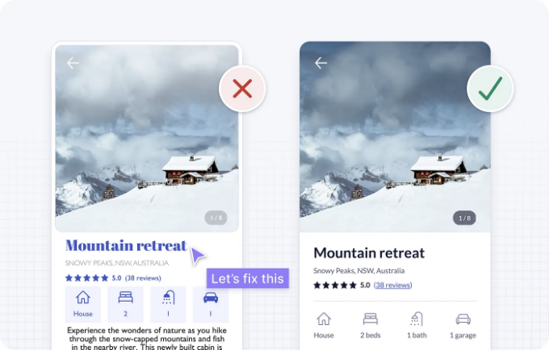

<!-- ui-log 수평형 -->

<ins class="adsbygoogle"
     style="display:block"
     data-ad-client="ca-pub-4877378276818686"
     data-ad-slot="9743150776"
     data-ad-format="auto"
     data-full-width-responsive="true"></ins>
<component is="script">
(adsbygoogle = window.adsbygoogle || []).push({});
</component>

사용자 인터페이스 디자인은 어렵습니다. 레이아웃, 간격, 타이포그래피 및 색상에 대한 선택지가 많기 때문에 디자인 결정을 내리는 것은 혼란스러울 수 있습니다. 사용성, 접근성 및 심리학을 추가하면 더욱 어려워집니다.

가장 빠른 학습 방법은 경험을 통해 배우는 것이므로 시작해 보겠습니다.

## 디자인 개선을 통해 디자인 규칙 소개

다음 2개의 디자인은 단기간의 임시 임대 앱의 속성 세부정보 페이지를 위한 것입니다. 첫 번째는 원본 디자인이고 두 번째는 몇 가지 논리적인 규칙이나 지침을 적용한 결과입니다.

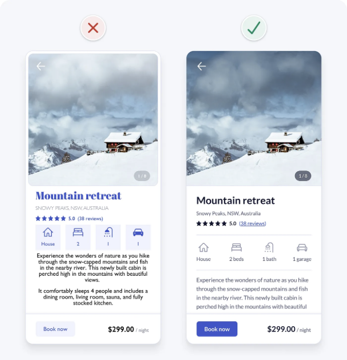

<!-- ui-log 수평형 -->

<ins class="adsbygoogle"
     style="display:block"
     data-ad-client="ca-pub-4877378276818686"
     data-ad-slot="9743150776"
     data-ad-format="auto"
     data-full-width-responsive="true"></ins>
<component is="script">
(adsbygoogle = window.adsbygoogle || []).push({});
</component>

시각적 또는 상호 작용 디자인 경험이 많지 않더라도 원본 디자인이 혼잡하고 복잡하며 사용하기 어렵다는 것을 느낄 것입니다. 이것은 사용성에 위험을 초래하는 많은 문제가 있는 디자인 세부 사항을 포함하기 때문입니다. 아마도 이미 몇 가지 문제를 알아차릴 수 있을 것입니다.

원본 디자인의 문제를 하나씩 해결하여 다음과 같은 논리적인 규칙이나 지침을 적용하겠습니다.

- 관련 요소를 그룹화하기 위해 공간 사용
- 일관성 유지
- 비슷한 모양의 요소는 비슷한 방식으로 작동하도록 보장
- 명확한 시각적 계층 구조 생성
- 불필요한 스타일 제거
- 색상을 목적에 맞게 사용
- 인터페이스 요소에 3:1 대비 비율 보장
- 텍스트에 4.5:1 대비 비율 보장
- 색상만을 지시자로 사용하지 않음
- 단일 산세리프 글꼴 사용
- 소문자의 글자가 더 큰 산세리프 글꼴 사용
- 대문자 사용 제한
- 정규 및 볼드 글꼴 두 가지만 사용
- 순수한 검은색 텍스트 피함
- 텍스트를 왼쪽 정렬
- 본문 텍스트에는 최소한 1.5 줄 간격 사용

## 1. 관련 요소를 그룹화하기 위해 공간 사용

정보를 관련 요소의 작은 그룹으로 나누면 인터페이스를 구조화하고 조직하는 데 도움이됩니다. 이렇게하면 사람들이 더 빨리 이해하고 기억하기 쉽습니다.

다음과 같은 방법으로 관련 요소를 그룹화 할 수 있습니다.

- 관련 요소를 동일한 컨테이너에 배치
- 관련 요소를 가까이 배치
- 관련 요소를 유사하게 보이

도록

- 관련 요소를 연속적인 선에 정렬

컨테이너 사용은 인터페이스 요소를 그룹화하기위한 가장 강력한 시각적 힌트이지만 불필요한 혼란을 초래할 수 있습니다. 다른 그룹화 방법을 사용할 수있는 기회를 찾아보십시오. 이들은 종종 미묘하며 디자인을 단순화하는 데 도움이될 수 있습니다.

특히 공간을 사용하는 것은 관련 요소를 명확하게 그룹화하는 매우 효과적이고 간단한 방법입니다. 그룹을 더 명확하게 표시하는 데 다른 그룹화 방법을 결합 할 수도 있습니다.

우리의 예에서 콘텐츠 사이의 공간 부족으로 인해 디자인이 혼잡하고 이해하기 어려워 보입니다. 간격을 늘리면 콘텐츠를 명확하게 그룹화하여 더 정리되고 이해하기 쉬운 디자인으로 만들 수 있습니다.

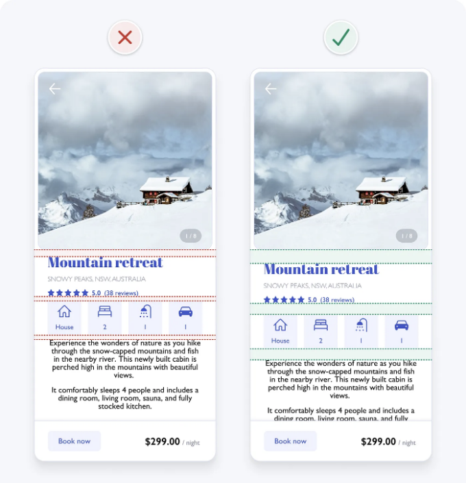

<!-- ui-log 수평형 -->

<ins class="adsbygoogle"
     style="display:block"
     data-ad-client="ca-pub-4877378276818686"
     data-ad-slot="9743150776"
     data-ad-format="auto"
     data-full-width-responsive="true"></ins>
<component is="script">
(adsbygoogle = window.adsbygoogle || []).push({});
</component>

## 2. 일관성 유지

UI 디자인의 일관성은 유사한 요소가 유사하게 보이고 작동한다는 것을 의미합니다. 이는 제품 내에서도 잘 설정되어 있으며 기타 잘 설정된 제품과 비교할 때도 마찬가지입니다. 이 예측 가능한 기능은 사용성을 향상시키고 오류를 줄입니다. 사람들이 사물이 어떻게 작동하는지 항상 배워야하는 필요가 없기 때문입니다.

우리의 예에서 아이콘 스타일이 일관되지 않습니다. 채워진 아이콘이 선택된 요소를 나타내는 경우가 많기 때문에 이것은 혼란스러울 수 있습니다. 모든 아이콘에 2pt 스트로크 무게와 둥근 모서리가있는 외곽선을 적용하여 일관성을 향상시킵니다.

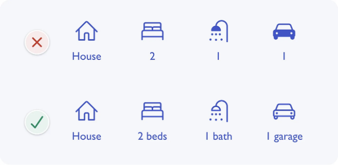

아이콘에 텍스트 레이블도 추가되어 있습니다. 이렇게 하면 스크린 리더를 사용하는 사람들이 이해할 수 있습니다(화면을 보지 못하는 사람들에게 인터페이스를 설명하는 소프트웨어).

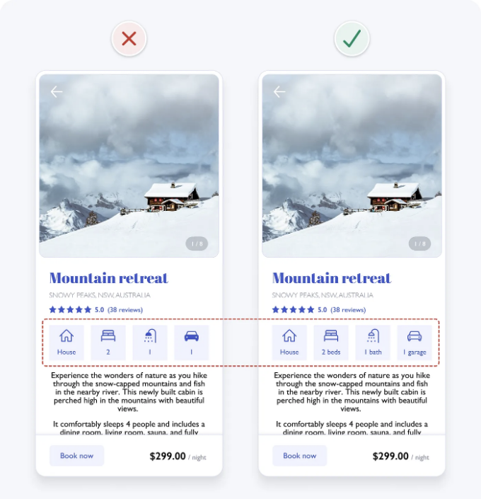

## 3. 비슷한 모양의 요소는 비슷한 방식으로 작동하도록 보장

요소가 비슷하게 보이면 사람들은 비슷한 방식으로 작동할 것으로 예상합니다. 따라서 동일한 기능을하는 요소에 일관된 시각적 처리를 사용하도록합니다. 반대로, 기능이 다른 요소는 다르게 보이도록하십시오.

우리의 예에서 아이콘 컨테이너는 "지금 예약"버튼과 유사한 시각적 스타일을 가지고 있습니다. 이것은 해당 요소가 대화형인 것처럼 보이게합니다. 아이콘에서 파란색을 제거하고 아이콘에서 버튼 스타일을 제거하여 아이콘이 대화형 요소로 오해되는 것을 방지합니다.

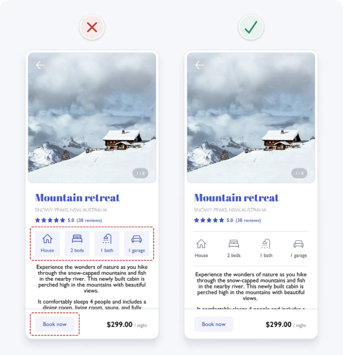

<!-- ui-log 수평형 -->

<ins class="adsbygoogle"
     style="display:block"
     data-ad-client="ca-pub-4877378276818686"
     data-ad-slot="9743150776"
     data-ad-format="auto"
     data-full-width-responsive="true"></ins>
<component is="script">
(adsbygoogle = window.adsbygoogle || []).push({});
</component>

## 4. 명확한 시각적 계층 구조 생성

인터페이스의 모든 정보에는 동일한 중요도 수준이 없습니다. 더 중요한 요소가 더 눈에 띄도록 정보를 중요도 순서로 제시하십시오.

중요도에 따른 명확한 순서 또는 시각적 계층 구조는 사람들이 정보를 빠르게 스캔하고 관심 영역에 초점을 맞추도록 돕습니다. 또한 순서를 만들면 정렬된 느낌이 생겨 미학을 향상시킵니다. 크기, 색상, 대비, 간격, 위치 및 깊이의 변화를 사용하여 명확한 시각적 계층 구조를 만들 수 있습니다.

다음은 명확한 시각적 계층 구조가없는 웹 사이트 히어로 배너의 예입니다. 그것은 중요도 순서로 요소를 명확하게 제시하는 것이며 그런 후 하나는 중요한 요소가 눈에 띄도록 표시합니다.

시각적 계층 구조가 명확한지 테스트하는 빠르고 쉬운 방법은 Squint Test를 사용하는 것입니다. 단순히 눈을 가리고 디자인을 보세요. 또는 화면에서 멀어지거나 디자인을 흐릿하

게해도됩니다. 여전히 가장 중요한 요소를 알아볼 수 있고 인터페이스가 무엇을 위한 것인지 인식할 수 있어야합니다.

예를 들어 Squint Test를 우리의 예에 적용합니다. 중요도가 비슷한 여러 요소가 주목을 끌고 있음을 볼 수 있습니다. 한편, 왼쪽 하단의 기본 작업은 전혀 눈에 띄지 않습니다.

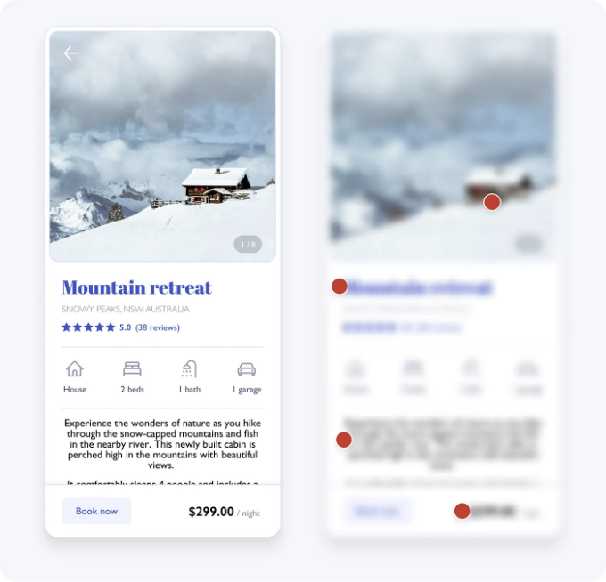

일반적으로 기본 작업은 인터페이스의 가장 중요한 요소 여야합니다. 높은 대비 배경색과 굵은 글꼴 무게를 부여하는 것은 이를 달성하는 데 도움이됩니다. 이것은 저대비 버튼과 함께 저대비 버튼에 대한 접근성 문제를 수정합니다. 이에 대해 나중에 살펴 보겠습니다.

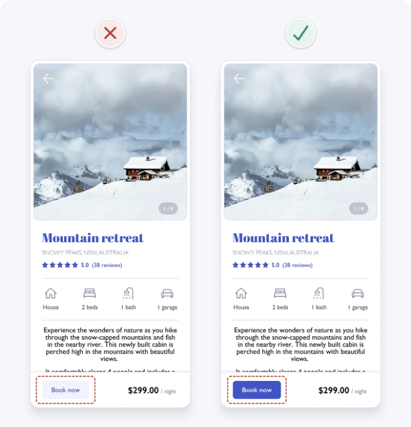

업데이트 된 디자인에 Squint Test를 적용하면 기본 작업이 명확히 가장 중요한 요소임을 확인할 수 있습니다.

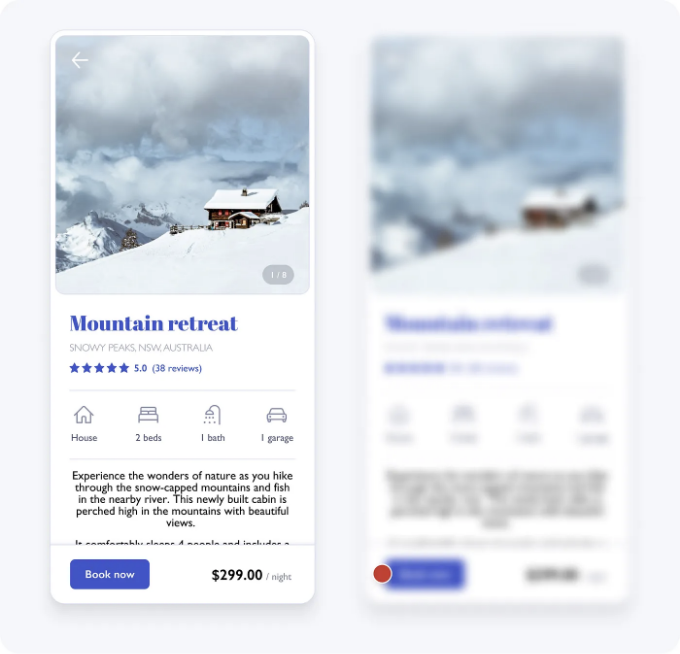

시각적 계층 구조는 현재 더 명확하지만 개선할 여지가 있습니다. 예를 들어 본문 텍스트 블록은 여전히 중요성에 비해 너무 두드러집니다. 곧 배울 몇 가지 빠른 타이포 그래피 가이드 라인을 사용하여 시각적 계층 구조를 수정하는 데 도움이됩니다.

## 5. 불필요한 스타일 제거

불필요한 정보와 시각적 스타일은 혼란을 유발하고 인지 부하 (인터페이스 사용에 필요한 뇌의 양)를 증가시킬 수 있습니다. 단순하고 집중 된 인터페이스를 만들기 위해 불필요한 선, 색상, 배경 및 애니메이션을 피하십시오.

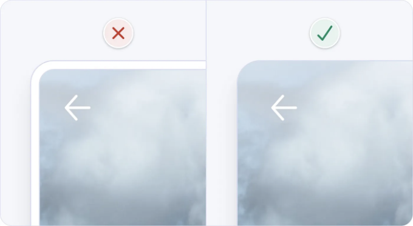

우리의 예에서 이미지 주변의 여백과 테두리는 불필요한 시각적 복잡성을 추가합니다. 그들은 정보를 전달하거나 요소를 그룹화하는 데 필요하지 않으므로 디자인을 단순화하기 위해 안전하게 제거 할 수 있습니다.

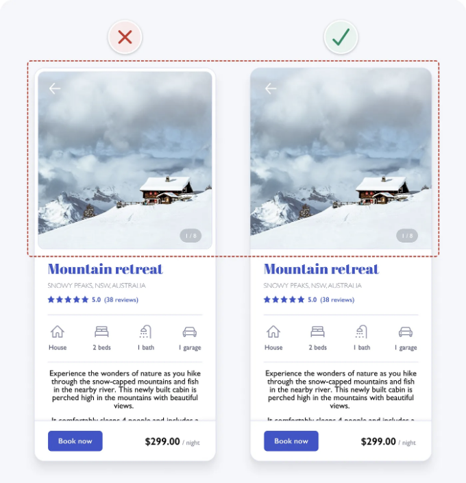

<!-- ui-log 수평형 -->

<ins class="adsbygoogle"
     style="display:block"
     data-ad-client="ca-pub-4877378276818686"
     data-ad-slot="9743150776"
     data-ad-format="auto"
     data-full-width-responsive="true"></ins>
<component is="script">
(adsbygoogle = window.adsbygoogle || []).push({});
</component>

## 6. 색상을 목적적으로 사용하십시오

색상은 절약적으로 사용하고 목적을 가지고 사용하십시오. 색상을 순전히 장식 용으로 사용하는 것은 혼란스럽고 주의를 산만하게 할 수 있습니다. 검정색과 흰색으로 시작하고 의미를 전달하는 곳에 색상을 도입하십시오.

브랜드 색상을 텍스트 링크 및 버튼과 같은 대화형 요소에 적용하는 간단하고 효과적인 방법입니다. 이렇게하면 대화형 요소와 그렇지 않은 것을 가르 칠 수 있습니다. 이미 대화형 요소임을 나타내는 시각적 단서가있는 몇 가지 대화형 요소에는 이미 색상이 추가되어 있습니다. 예를 들어 다음 예에서 카드는 파란색 링크와 함께 있든 없든 여전히 대화형 느낌이 납니다.

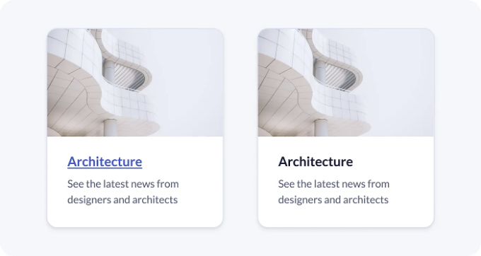

우리의 원래 예에서 파란색 제목은 멋져 보일 수 있지만 텍스트를 대화형으로 보입니다. 혼란을 방지하기 위해 헤딩에서 파란색을 제거합니다. 또한 다른 비대화형 요소에서도 파란색을 제거합니다. 이렇게하면 대화형 요소와 그렇지 않은 것을 쉽게 볼 수 있습니다.

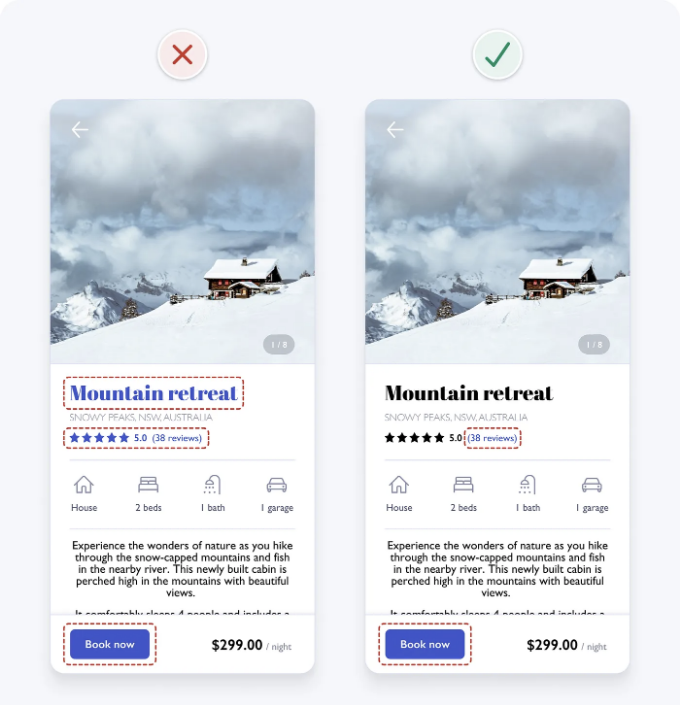

## 7. 인터페이스 요소에 3:1 대비 비율이있는지 확인하십시오

대비는 두 색상 간의 지각 빛 차이를 측정하는 것입니다. 1:1에서 21:1까지의 비율로 표시됩니다. 예를 들어, 검은색 텍스트는 검은색 배경에 대해 가장 낮은 1:1 대비 비율을 가지며 검은색 텍스트는 흰색 배경에 대해 최고의 21:1 비율을 가집니다. 서로 다른 색상 간의 대조를 측정하는 데 도움이되는 많은 온라인 도구가 있습니다.

시강을 받은 시각 장애를 가진 사람들이 인터페이스 세부 정보를 명확하게 볼 수 있도록하기위한 웹 콘텐츠 접근성 지침 (WCAG) 2.1

은 최소 4.5:1 대비 비율을 요구합니다. 대비 비율이 낮은 텍스트는 읽기가 어렵기 때문에 사용해야하는 경우 특별히 주의해야합니다.

우리의 예에서 파란색 텍스트와 버튼 배경 사이의 대비가 낮습니다. 색상이 비슷하기 때문에 텍스트가 버튼에서 잘 눈에 띄지 않습니다. 이 문제를 해결하기 위해 버튼의 배경색을 더 어둡게하십시오. 이것은 우리가 예상했던 디자인을 짧은 시간에 찾을 것입니다.

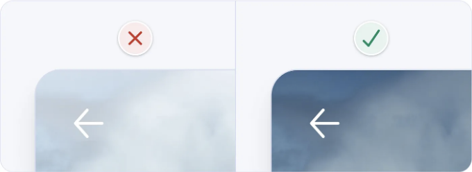

버튼에 대한 대비 비율을 검사하는 데 사용할 수있는 몇 가지 무료 온라인 도구가 있습니다.

## 8. 텍스트에 4.5:1 대비 비율 보장

우리가 방금 설명한대로 텍스트에 4.5:1 대비 비율이있는지 확인하십시오.

우리의 예에서 대부분의 텍스트에 대비가 높으며 문제가 없습니다. 그러나 일부 텍스트가 버튼에서 낮은 대비를 가지고 있음을 알 수 있습니다. 이것은 이미지가없는 버튼 (예 : "지금 예약")에서 발생합니다. 색상 대비가 낮은 이 텍스트는 대화형으로 보이지 않습니다.

또한 헤딩에 대한 대비 비율을 검사하십시오. 이것은 특히 텍스트 크기가 클 때 중요합니다. 대부분의 헤딩은 WCAG 2.1 권장 사항에 따라 3:1 대비 비율을 초과하지만 1단계 헤딩은 아닙니다. 이것은 수정할 수있는 빠른 수정입니다.

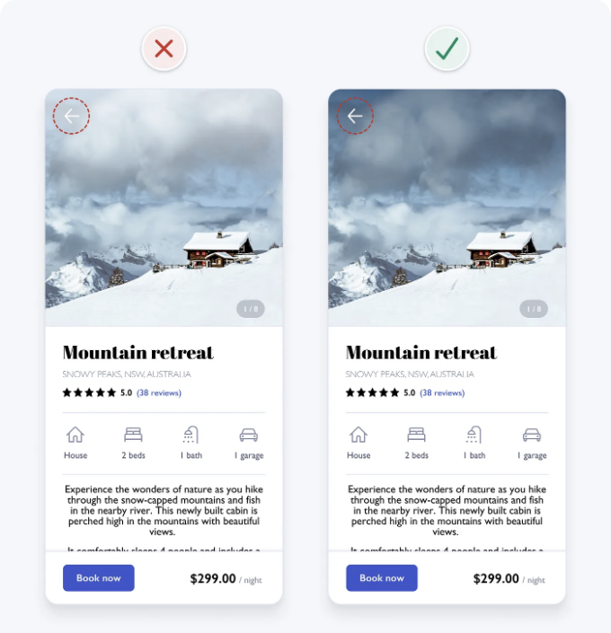

## 9. 색상만을 지시자로 사용하지 않습니다

색상은 정보를 전달하는 강력한 방법 중 하나이지만 색상은 독자적 인 지시자가 아닙니다. 색맹, 저시력 또는 색 감지 장애가있는 사람들은 색상에 의존하지 않습니다.

버튼과 같은 대화형 요소에 여러 시각적 지시자 (색상, 텍스트, 아이콘 등)를 추가하여 색상을 지시자로 사용하지 않도록하십시오.

예를 들어, 우리의 예에서 버튼 배경의 명확한 윤곽선을 제공하여 색상을 지시자로 사용하지 않도록합니다.

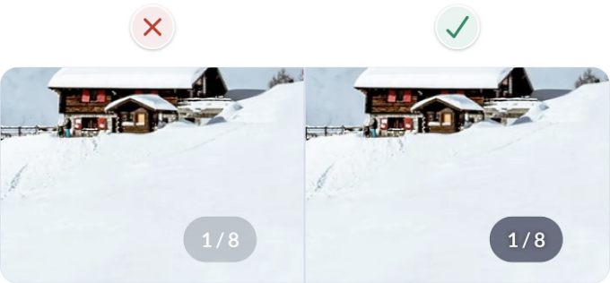

<!-- ui-log 수평형 -->

<ins class="adsbygoogle"
     style="display:block"
     data-ad-client="ca-pub-4877378276818686"
     data-ad-slot="9743150776"
     data-ad-format="auto"
     data-full-width-responsive="true"></ins>
<component is="script">
(adsbygoogle = window.adsbygoogle || []).push({});
</component>

## 10. 단일 산세리프 글꼴 사용

다양한 글꼴을 혼합하면 인터페이스가 혼란 스럽고 일관성이없게됩니다. 단일 산세리프 글꼴을 사용하면 인터페이스가 더 일관되고 깨끗해 보입니다.

우리의 예는 이미 단일 산세리프 글꼴을 사용하고 있으므로이 규칙은 이미 준수됩니다.

## 11. 소문자의 글자가 더 큰 산세리프 글꼴 사용

인터페이스에서 대문자 글꼴을 사용하면 읽기가 더 어려울 수 있습니다. 이러한 글꼴은 글자 간 간격이 일정하지 않기 때문입니다. 이것은 인터페이스의 가독성과 관련이 있습니다.

또한 소문자 글자를 대문자 글자와 비교하여 더 많은 공간을 차지하므로 소문자 글꼴을 사용하여 더 많은 공간을 차지하도록 인터페이스를 조정하십시오.

우리의 예에서 글꼴은 모두 소문자이므로이 규칙은 이미 준수됩니다.

## 12. 대문자 사용 제한

대문자 글꼴을 사용할 때 소문자 글꼴보다 읽기가 어렵습니다. 그렇기 때문에 대문자 글꼴을 사용하지 않도록합니다.

우리의 예는 이미 대문자를 사용하지 않고 있으므로이 규칙을 준수하고 있습니다.

<!-- ui-log 수평형 -->

<ins class="adsbygoogle"
     style="display:block"
     data-ad-client="ca-pub-4877378276818686"
     data-ad-slot="9743150776"
     data-ad-format="auto"
     data-full-width-responsive="true"></ins>
<component is="script">
(adsbygoogle = window.adsbygoogle || []).push({});
</component>

## 13. 정규 및 볼드 글꼴 두 가지만 사용

인터페이스에서 사용되는 글꼴을 두 가지로 제한하면 일관된 디자인을 유지하고 사용자가 디자인을 기억하는 데 도움이됩니다. 정규 및 볼드 글꼴 만 사용하는 것이 좋습니다.

우리의 예에서 이미 정규 및 볼드 글꼴을 사용하고 있으므로이 규칙을 준수합니다.

## 14. 순수한 검은색 텍스트 사용 피함

순수 검정색 텍스트를 사용하면 검은색 텍스트가 더 어둡게 보이게되어 글자가 작아 보입니다. 대신 텍스트를 약

간 흐린 회색으로 만들어 더 편안하게 읽을 수 있도록합니다.

우리의 예에서 글꼴 색상은 # 000이 아니라 # 222입니다.

## 15. 줄 간격을 늘립니다

글자와 글자 사이의 공간을 늘리면 텍스트가 읽기 쉬워집니다. 공간이 많은 텍스트를 보면 텍스트가 더 편안하게 보입니다.

우리의 예에서 줄 간격이 이미 넓은 것을 볼 수 있습니다.

## 16. 텍스트의 왼쪽 정렬 사용

글자를 왼쪽으로 정렬하면 텍스트가 읽기 쉬워집니다. 텍스트를 중앙에 배치하면 읽기가 더 어려울 수 있습니다.

우리의 예에서 텍스트는 이미 왼쪽으로 정렬되어 있습니다.

<!-- ui-log 수평형 -->

<ins class="adsbygoogle"
     style="display:block"
     data-ad-client="ca-pub-4877378276818686"
     data-ad-slot="9743150776"
     data-ad-format="auto"
     data-full-width-responsive="true"></ins>
<component is="script">
(adsbygoogle = window.adsbygoogle || []).push({});
</component>

# 17. 제품 이미지 제공

제품 이미지는 사용자에게 제품에 대한 좋은 시각적 인상을 줄 수 있습니다. 따라서 제품 이미지를 제공하여 사용자에게 제품의 외관과 느낌을 보여줍니다.

우리의 예에서 이미지는 이미 제공되고 있으므로이 규칙을 준수합니다.

디자인을 개선하는 데는 이러한 간단한 규칙이 충분합니다. 이러한 규칙을 준수하여 사용자에게 최고의 경험을 제공 할 수 있습니다.

이 17가지 규칙을 따르면 인터페이스가 더 쉽게 사용되고 이해되며 읽기 쉬워집니다. 더 나은 사용자 경험을위한이 디자인 원칙을 사용하고 일관된 사용자 경험을 제공하십시오.

사용자의 관점에서 디자인을 생각하십시오. 그들이 기쁘게 사용하면 제품을 정말로 성공적으로 만든 것입니다.
