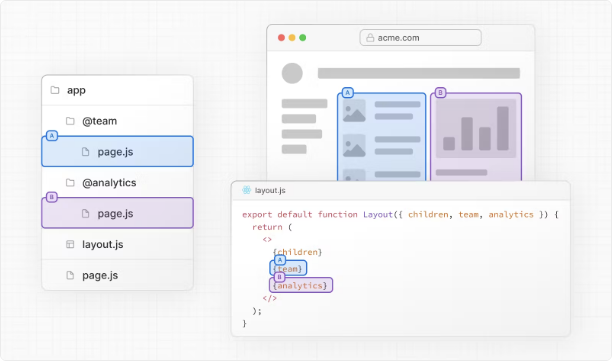
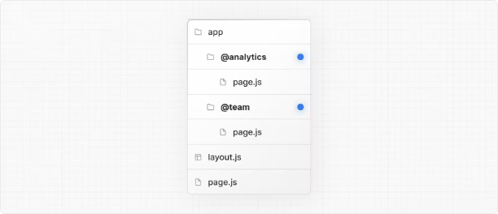
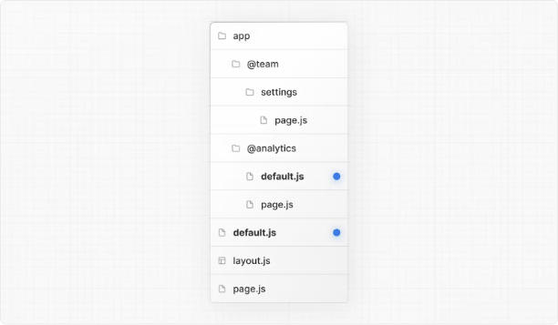
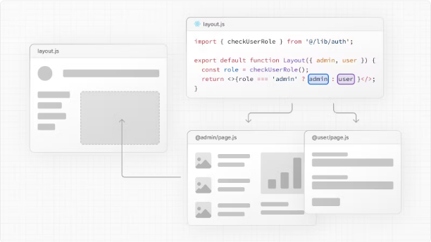
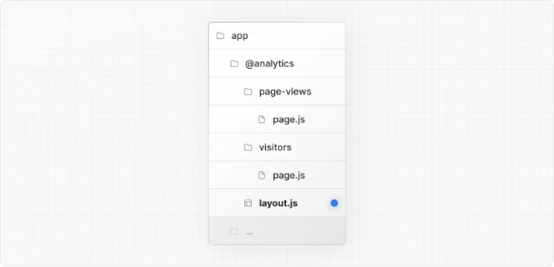
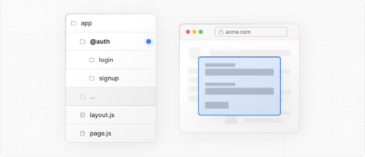
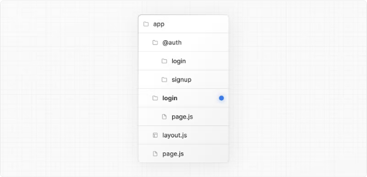
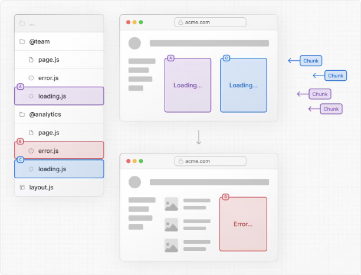

# Nextjs 14 Parallel Routes(병렬 라우트)정리

::: tip 💡이 포스팅을 읽으면

:::

# 병렬 라우트

병렬 라우트는 동시에 또는 조건부로 하나 이상의 페이지를 동일한 레이아웃 내에서 렌더링할 수 있게 해줍니다. 이는 대시보드나 소셜 사이트의 피드와 같이 매우 동적인 앱 섹션에 유용합니다.

예를 들어, 대시보드를 고려해보면 병렬 라우트를 사용하여 팀 및 분석 페이지를 동시에 렌더링할 수 있습니다.



<!-- ui-log 수평형 -->

<ins class="adsbygoogle"
     style="display:block"
     data-ad-client="ca-pub-4877378276818686"
     data-ad-slot="9743150776"
     data-ad-format="auto"
     data-full-width-responsive="true"></ins>
<component is="script">
(adsbygoogle = window.adsbygoogle || []).push({});
</component>

## 슬롯

병렬 라우트는 명명된 슬롯을 사용하여 생성됩니다. 슬롯은 @folder 규칙을 따릅니다. 예를 들어, 다음 파일 구조는 @analytics와 @team 두 개의 슬롯을 정의합니다:



<!-- ui-log 수평형 -->

<ins class="adsbygoogle"
     style="display:block"
     data-ad-client="ca-pub-4877378276818686"
     data-ad-slot="9743150776"
     data-ad-format="auto"
     data-full-width-responsive="true"></ins>
<component is="script">
(adsbygoogle = window.adsbygoogle || []).push({});
</component>
슬롯은 공유 부모 레이아웃에 속성(props)으로 전달됩니다. 위의 예제에서는 app/layout.js 파일의 컴포넌트가 이제 @analytics 및 @team 슬롯 props를 수용하고, 이를 children props와 함께 병렬로 렌더링할 수 있습니다:

```typescript
export default function Layout({ children, team, analytics }: { children: React.ReactNode; analytics: React.ReactNode; team: React.ReactNode }) {
  return (
    <>
      {children}
      {team}
      {analytics}
    </>
  );
}
```

그러나 슬롯은 라우트 세그먼트가 아니며 URL 구조에 영향을 주지 않습니다. 예를 들어, /dashboard/@analytics/views의 경우 URL은 /dashboard/views가 됩니다. 왜냐하면 @analytics는 슬롯이기 때문입니다.

<!-- ui-log 수평형 -->

<ins class="adsbygoogle"
     style="display:block"
     data-ad-client="ca-pub-4877378276818686"
     data-ad-slot="9743150776"
     data-ad-format="auto"
     data-full-width-responsive="true"></ins>
<component is="script">
(adsbygoogle = window.adsbygoogle || []).push({});
</component>

> 알아두세요:
> children props는 슬롯을 폴더에 매핑할 필요가 없는 암시적인 슬롯입니다. 즉, app/page.js는 app/@children/page.js와 동일합니다.

## 활성 상태 및 탐색

기본적으로 Next.js는 각 슬롯에 대한 활성 상태(또는 서브페이지)를 추적합니다. 그러나 슬롯에 렌더링된 내용은 탐색 유형에 따라 달라집니다.

- 소프트 탐색: 클라이언트 측 탐색 중에 Next.js는 부분 렌더링을 수행하여 현재 URL과 일치하지 않는 다른 슬롯의 활성 서브페이지를 유지합니다.
- 하드 탐색: 전체 페이지 로드(브라우저 새로 고침) 후에는 Next.js가 현재 URL과 일치하지 않는 슬롯의 활성 상태를 결정할 수 없습니다. 대신, 일치하지 않는 슬롯에 대해 default.js 파일을 렌더링하거나 default.js가 존재하지 않으면 404가 렌더링됩니다.

> 알아두세요:
> 일치하지 않는 라우트에 대한 404는 의도하지 않은 병렬 라우트가 의도되지 않은 페이지에 렌더링되지 않도록 보장합니다.

<!-- ui-log 수평형 -->

<ins class="adsbygoogle"
     style="display:block"
     data-ad-client="ca-pub-4877378276818686"
     data-ad-slot="9743150776"
     data-ad-format="auto"
     data-full-width-responsive="true"></ins>
<component is="script">
(adsbygoogle = window.adsbygoogle || []).push({});
</component>

### default.js

일치하지 않는 슬롯에 대한 대체 렌더링을 위해 default.js 파일을 정의할 수 있습니다. 이는 초기 로드나 전체 페이지 새로 고침 중에 사용됩니다.

다음과 같은 폴더 구조를 고려해보십시오. @team 슬롯에는 /settings 페이지가 있지만 @analytics에는 없습니다.



/dashboard/settings로 이동할 때 @team 슬롯은 /settings 페이지를 렌더

링하고 @analytics 슬롯의 현재 활성 페이지를 유지합니다.

새로 고침하면 Next.js가 @analytics에 대해 default.js를 렌더링합니다. default.js가 없으면 대신 404가 렌더링됩니다.

또한, children이 암시적인 슬롯인 경우 부모 페이지의 활성 상태를 복구할 수 없는 경우를 대비해 대체 렌더링을 위해 default.js 파일을 생성해야 합니다.

<!-- ui-log 수평형 -->

<ins class="adsbygoogle"
     style="display:block"
     data-ad-client="ca-pub-4877378276818686"
     data-ad-slot="9743150776"
     data-ad-format="auto"
     data-full-width-responsive="true"></ins>
<component is="script">
(adsbygoogle = window.adsbygoogle || []).push({});
</component>

### useSelectedLayoutSegment(s)

useSelectedLayoutSegment 및 useSelectedLayoutSegments는 parallelRoutesKey 매개변수를 사용하여 슬롯 내에서 활성 라우트 세그먼트를 읽을 수 있습니다.

```typescript
"use client";

import { useSelectedLayoutSegment } from "next/navigation";

export default function Layout({ auth }: { auth: React.ReactNode }) {
  const loginSegments = useSelectedLayoutSegment("auth");
  // ...
}
```

사용자가 app/@auth/login(또는 URL 표시줄의 /login)로 이동할 때, loginSegments는 "login" 문자열과 동일합니다.

<!-- ui-log 수평형 -->

<ins class="adsbygoogle"
     style="display:block"
     data-ad-client="ca-pub-4877378276818686"
     data-ad-slot="9743150776"
     data-ad-format="auto"
     data-full-width-responsive="true"></ins>
<component is="script">
(adsbygoogle = window.adsbygoogle || []).push({});
</component>

## 예시

### 조건부 라우트

특정 조건(예: 사용자 역할)에 따라 라우트를 조건부로 렌더링할 수 있습니다. 예를 들어, /admin 또는 /user 역할에 대해 다른 대시보드 페이지를 렌더링하려면:



```typescript
import { checkUserRole } from "@/lib/auth";

export default function Layout({ user, admin }: { user: React.ReactNode; admin: React.ReactNode }) {
  const role = checkUserRole();
  return <>{role === "admin" ? admin : user}</>;
}
```

### 탭 그룹

슬롯 내부에 레이아웃을 추가하여 사용자가 슬롯을 독립적으로 탐색할 수 있도록 할 수 있습니다. 이는 탭을 생성하는 데 유용합니다.

예를 들어, @analytics 슬롯에는 두 개의 하위 페이지(/page-views 및 /visitors)가 있습니다.

<!-- ui-log 수평형 -->

<ins class="adsbygoogle"
     style="display:block"
     data-ad-client="ca-pub-4877378276818686"
     data-ad-slot="9743150776"
     data-ad-format="auto"
     data-full-width-responsive="true"></ins>
<component is="script">
(adsbygoogle = window.adsbygoogle || []).push({});
</component>



@analytics 내부에서 두 페이지 간에 탭을 공유하기 위해 레이아웃 파일을 만듭니다:

```typescript
import Link from "next/link";

export default function Layout({ children }: { children: React.ReactNode }) {
  return (
    <>
      <nav>
        <Link href="/dashboard/page-views">페이지 조회수</Link>
        <Link href="/dashboard/visitors">방문자</Link>
      </nav>
      <div>{children}</div>
    </>
  );
}
```

### 모달

병렬 라우트는 Intercepting Routes와 함께 사용하여 모달을 생성할 수 있습니다. 이를 통해 모달을 구축할 때 발생하는 공통적인 문제를 해결할 수 있습니다:

- 모달 내용을 URL을 통해 공유할 수 있게 합니다.
- 페이지가 새로 고쳐질 때 모달을 닫는 대신 컨텍스트를 유지합니다.
- 이전 라우트로 이동할 때 모달을 닫습니다.
- 앞으로 이동할 때 모달을 다시 엽니다.

다음과 같은 UI 패턴을 고려해 보겠습니다. 사용자는 레이아웃에서 클라이언트 측 네비게이션을 사용하여 로그인 모달을 열거나 별도의 /login 페이지에 액세스할 수 있습니다:

<!-- ui-log 수평형 -->

<ins class="adsbygoogle"
     style="display:block"
     data-ad-client="ca-pub-4877378276818686"
     data-ad-slot="9743150776"
     data-ad-format="auto"
     data-full-width-responsive="true"></ins>
<component is="script">
(adsbygoogle = window.adsbygoogle || []).push({});
</component>



이 패턴을 구현하려면 주요 로그인 페이지를 렌더링하는 /login 라우트를 만듭니다.



```typescript
import { Login } from "@/app/ui/login";

export default function Page() {
  return <Login />;
}
```

그런 다음 @auth 슬롯 내부에 default.js 파일을 추가하여 활성 상태가 아닐 때 모달이 렌더링되지 않도록합니다.

```typescript
export default function Default() {
  return null;
}
```

@auth 슬롯 내부에서 /login 라우트를 가로채기 위해 /(.)login 폴더를 업데이트합니다. `<Modal>` 컴포넌트 및 해당 자식을 /(.)login/page.tsx 파일에 가져옵니다.

<!-- ui-log 수평형 -->

<ins class="adsbygoogle"
     style="display:block"
     data-ad-client="ca-pub-4877378276818686"
     data-ad-slot="9743150776"
     data-ad-format="auto"
     data-full-width-responsive="true"></ins>
<component is="script">
(adsbygoogle = window.adsbygoogle || []).push({});
</component>

```typescript
import { Modal } from "@/app/ui/modal";
import { Login } from "@/app/ui/login";

export default function Page() {
  return (
    <Modal>
      <Login />
    </Modal>
  );
}
```

> 참고:
> 라우트를 가로채기 위해 사용되는 규칙(예: (.))은 파일 시스템 구조에 따라 달라집니다. Intercepting Routes 규칙을 참조하세요.
> 모달 기능(`<Modal>`)을 모달 내용(`<Login>`)과 분리함으로써 모달 내의 양식과 같은 내용을 Server Components로 보장할 수 있습니다. 자세한 내용은 Interleaving Client and Server Components를 참조하세요.

#### 모달 열기

이제 Next.js 라우터를 사용하여 모달을 열고 닫을 수 있습니다. 모달이 열릴 때 URL이 올바르게 업데이트되고 뒤로 및 앞으로 이동할 때 모달이 올바르게 처리됩니다.

모달을 열려면 부모 레이아웃에 @auth 슬롯을 prop으로 전달하고 children prop과 함께 렌더링합니다.

```typescript
import Link from "next/link";

export default function Layout({ auth, children }: { auth: React.ReactNode; children: React.ReactNode }) {
  return (
    <>
      <nav>
        <Link href="/login">모달 열기</Link>
      </nav>
      <div>{auth}</div>
      <div>{children}</div>
    </>
  );
}
```

<!-- ui-log 수평형 -->

<ins class="adsbygoogle"
     style="display:block"
     data-ad-client="ca-pub-4877378276818686"
     data-ad-slot="9743150776"
     data-ad-format="auto"
     data-full-width-responsive="true"></ins>
<component is="script">
(adsbygoogle = window.adsbygoogle || []).push({});
</component>

사용자가 `<Link>`를 클릭하면 /login 페이지로 이동하는 대신 모달이 열립니다. 그러나 새로 고침이나 초기 로드에서 /login으로 이동하면 사용자가 메인 로그인 페이지로 이동합니다.

#### 모달 닫기

router.back()을 호출하거나 Link 컴포넌트를 사용하여 모달을 닫을 수 있습니다.

```typescript
'use client'

import { useRouter } from 'next/navigation'

export function Modal({ children }: { children: React.ReactNode }) {
  const router = useRouter()

  return (
    <>
      <button
        onClick={() => {
          router.back()
        }
      >
        모달 닫기
      </button>
      <div>{children}</div>
    </>
  )
}
```

Link 컴포넌트를 사용하여 슬롯에서 더 이상 @auth 슬롯을 렌더링하지 않는 페이지로 이동할 때 모달을 닫습니다. 이를 위해 null을 반환하는 캐치올 라우트를 사용합니다.

```typescript
import Link from "next/link";

export function Modal({ children }: { children: React.ReactNode }) {
  return (
    <>
      <Link href="/">모달 닫기</Link>
      <div>{children}</div>
    </>
  );
}
```

<!-- ui-log 수평형 -->

<ins class="adsbygoogle"
     style="display:block"
     data-ad-client="ca-pub-4877378276818686"
     data-ad-slot="9743150776"
     data-ad-format="auto"
     data-full-width-responsive="true"></ins>
<component is="script">
(adsbygoogle = window.adsbygoogle || []).push({});
</component>

```typescript
export default function CatchAll() {
  return null;
}
```

> 참고:
> 우리는 슬롯에 캐치올 라우트를 사용하여 모달을 닫습니다. 이는 Active state and navigation에서 설명한 동작 때문입니다. 슬롯에 더 이상 일치하지 않는 루트로의 클라이언트 측 네비게이션은 표시된 상태로 유지되므로 모달을 닫기 위해 null을 반환하는 슬롯과 일치하는 루트가 필요합니다.
> 다른 예시로는 갤러리에서 사진 모달을 열고 별도의 /photo/[id] 페이지가 있는 경우 또는 쇼핑 카트를 측면 모달에 열거나 다른 페이지로 이동할 때입니다.
> Intercepted와 Parallel Routes를 사용한 모달 예시를 보세요.

### 로딩 및 오류 UI

병렬 라우트는 독립적으로 스트리밍할 수 있으므로 각 라우트에 대해 독립적인 오류 및 로딩 상태를 정의할 수 있습니다:



더 많은 정보는 Loading UI 및 Error Handling 문서를 참조하세요.

위의 예시들은 병렬 라우트와 함께 사용되는 다양한 패턴을 보여줍니다. 조건부 라우팅, 탭 그룹, 모달, 그리고 로딩 및 오류 UI를 구현하는 방법을 설명하고 있습니다. 이러한 패턴들을 활용하면 Next.js 애플리케이션의 유연성을 향상시키고 사용자 경험을 향상시킬 수 있습니다.
