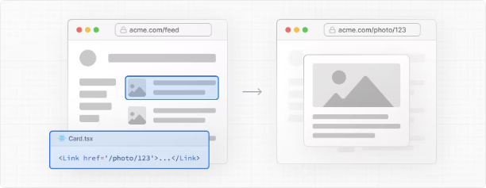
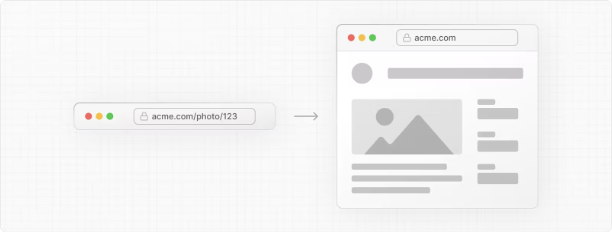
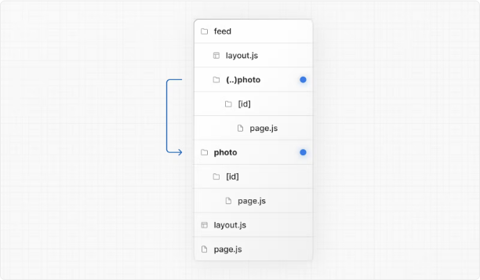
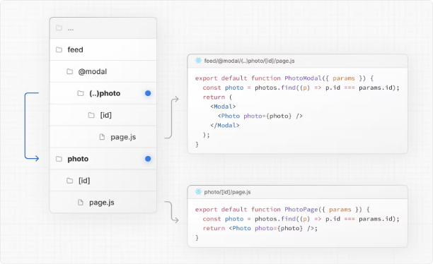

# Nextjs 14 intercepting Routes(라우트 가로채기)정리

# 라우트 가로채기

라우트 가로채기는 현재 레이아웃 내에서 애플리케이션의 다른 부분에서 라우트를 로드할 수 있게 해줍니다. 이 라우팅 패러다임은 사용자가 다른 컨텍스트로 전환하지 않고도 라우트의 내용을 표시할 때 유용합니다.

<!-- ui-log 수평형 -->

<ins class="adsbygoogle"
     style="display:block"
     data-ad-client="ca-pub-4877378276818686"
     data-ad-slot="9743150776"
     data-ad-format="auto"
     data-full-width-responsive="true"></ins>
<component is="script">
(adsbygoogle = window.adsbygoogle || []).push({});
</component>

예를 들어, 피드에서 사진을 클릭하면 피드 위에 모달로 사진을 표시할 수 있습니다. 이 경우 Next.js는 /photo/123 라우트를 가로채서 URL을 가린 다음 /feed 위에 오버레이합니다.

그러나 공유 가능한 URL을 클릭하거나 페이지를 새로고침하여 사진에 직접 이동할 때는 모달 대신 전체 사진 페이지가 렌더링되어야 합니다. 라우트 가로채기가 발생하지 않아야 합니다.

<!-- ui-log 수평형 -->

<ins class="adsbygoogle"
     style="display:block"
     data-ad-client="ca-pub-4877378276818686"
     data-ad-slot="9743150776"
     data-ad-format="auto"
     data-full-width-responsive="true"></ins>
<component is="script">
(adsbygoogle = window.adsbygoogle || []).push({});
</component>

## 규칙

라우트 가로채기는 상대 경로 컨벤션인 ../와 유사한 (..) 컨벤션을 사용하여 정의할 수 있습니다.

다음과 같은 방법으로 사용할 수 있습니다.

- (.) 동일 레벨의 세그먼트와 일치
- (..) 하나 위 레벨의 세그먼트와 일치
- (..)(..) 두 단계 위의 세그먼트와 일치
- (...) 루트 앱 디렉토리의 세그먼트와 일치

예를 들어, 피드 세그먼트 내에서 사진 세그먼트를 가로채려면 (..)photo 디렉토리를 만들면 됩니다.

> (..) 컨벤션은 파일 시스템이 아니라 라우트 세그먼트를 기반으로 합니다.

<!-- ui-log 수평형 -->

<ins class="adsbygoogle"
     style="display:block"
     data-ad-client="ca-pub-4877378276818686"
     data-ad-slot="9743150776"
     data-ad-format="auto"
     data-full-width-responsive="true"></ins>
<component is="script">
(adsbygoogle = window.adsbygoogle || []).push({});
</component>

## 예시

### 모달

라우트 가로채기는 병렬 라우트와 함께 사용하여 모달을 만드는 데 사용할 수 있습니다. 이를 통해 모달을 구축할 때 발생하는 일반적인 문제를 해결할 수 있습니다.

- 모달 콘텐츠를 URL을 통해 공유 가능하게 만들기
- 페이지 새로고침 시 컨텍스트를 유지하고 모달을 닫지 않기
- 뒤로 가기로 모달을 닫고 이전 라우트로 이동하지 않기
- 앞으로 가기로 모달을 다시 열기

사용자가 갤러리에서 클라이언트 측 탐색을 사용하여 사진 모달을 열거나 공유 가능한 URL을 통해 사진 페이지로 직접 이동할 수 있는 다음 UI 패턴을 고려해보세요.

<!-- ui-log 수평형 -->

<ins class="adsbygoogle"
     style="display:block"
     data-ad-client="ca-pub-4877378276818686"
     data-ad-slot="9743150776"
     data-ad-format="auto"
     data-full-width-responsive="true"></ins>
<component is="script">
(adsbygoogle = window.adsbygoogle || []).push({});
</component>

위 예제에서는 @modal이 슬롯이므로 사진 라우트가 두 파일 시스템 수준 더 높아도 세그먼트 수준이 하나 높기 때문에 사진 세그먼트의 경로에 (..) 매처를 사용할 수 있습니다.

단계별 예제는 병렬 라우트 문서를 참조하거나 이미지 갤러리 예제를 참조하세요.

> 참고:
> 다른 예시로는 탑 네비게이션 바에서 로그인 모달을 열거나 쇼핑 카트를 측면 모달로 열 수 있습니다.
