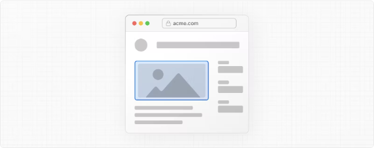
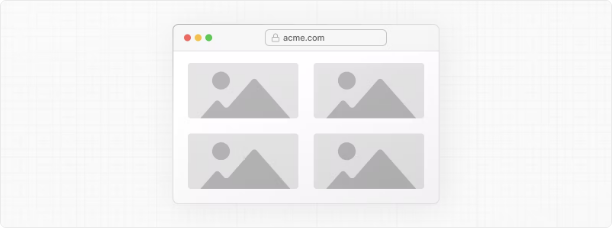
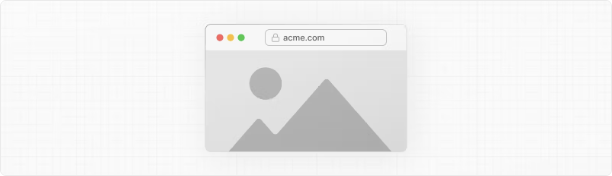

# Nextjs 14 이미지 최적화(image optimization)

# 이미지 최적화

웹 알만락에 따르면 이미지는 전형적인 웹사이트의 페이지 무게에서 상당한 부분을 차지하며 웹사이트의 LCP(가장 큰 콘텐츠 페인트) 성능에 상당한 영향을 미칠 수 있습니다.

Next.js의 Image 컴포넌트는 자동 이미지 최적화 기능을 제공하여 HTML `` 요소를 확장합니다:

- 크기 최적화: 모든 기기에 맞게 올바른 크기의 이미지를 자동으로 제공하며 WebP 및 AVIF와 같은 현대 이미지 형식을 사용합니다.
- 시각적 안정성: 이미지 로딩 중에 레이아웃 이동을 자동으로 방지합니다.
- 빠른 페이지 로드: 이미지는 네이티브 브라우저 지연 로딩을 사용하여 뷰포트에 진입할 때만 로드되며 선택적으로 블러 업 플레이스홀더를 사용합니다.
- 자산 유연성: 원격 서버에 저장된 이미지에 대해 필요한대로 이미지 크기 조정이 가능합니다.

> 🎥 시청: next/image 사용 방법에 대해 자세히 알아보기 → YouTube (9분)

<!-- ui-log 수평형 -->

<ins class="adsbygoogle"
     style="display:block"
     data-ad-client="ca-pub-4877378276818686"
     data-ad-slot="9743150776"
     data-ad-format="auto"
     data-full-width-responsive="true"></ins>
<component is="script">
(adsbygoogle = window.adsbygoogle || []).push({});
</component>

## 사용법

```js
import Image from "next/image";
```

그런 다음 이미지의 src를 정의할 수 있습니다(로컬 또는 원격).

### 로컬 이미지

로컬 이미지를 사용하려면 .jpg, .png 또는 .webp 이미지 파일을 가져와야 합니다.

Next.js는 가져온 파일을 기반으로 이미지의 너비와 높이를 자동으로 결정합니다. 이러한 값은 이미지가 로딩되는 동안 누적 레이아웃 이동을 방지하는 데 사용됩니다.

```js
import Image from "next/image";
import profilePic from "./me.png";

export default function Page() {
  return (
    <Image
      src={profilePic}
      alt="Picture of the author"
      // width={500} 자동으로 제공됨
      // height={500} 자동으로 제공됨
      // blurDataURL="data:..." 자동으로 제공됨
      // placeholder="blur" // 로딩 중 선택적으로 블러업
    />
  );
}
```

> 경고: 동적 await import() 또는 require()은 지원되지 않습니다. import는 정적이어야 하므로 빌드 시간에 분석할 수 있어야 합니다.

### 원격 이미지

원격 이미지를 사용하려면 src 속성을 URL 문자열로 지정해야 합니다.

Next.js는 빌드 프로세스 중에 원격 파일에 액세스할 수 없으므로 너비, 높이 및 선택적 blurDataURL 속성을 수동으로 제공해야 합니다.

너비와 높이 속성은 이미지의 올바른 측면 비율을 추론하고 이미지가 로딩될 때 레이아웃 이동을 방지하는 데 사용됩니다. 너비와 높이는 이미지 파일의 렌더링 크기를 결정하지 않습니다. 이미지 크기에 대한 자세한 내용은 이미지 크기 조정을 참조하세요.

```js
import Image from "next/image";

export default function Page() {
  return <Image src="https://s3.amazonaws.com/my-bucket/profile.png" alt="Picture of the author" width={500} height={500} />;
}
```

<!-- ui-log 수평형 -->

<ins class="adsbygoogle"
     style="display:block"
     data-ad-client="ca-pub-4877378276818686"
     data-ad-slot="9743150776"
     data-ad-format="auto"
     data-full-width-responsive="true"></ins>
<component is="script">
(adsbygoogle = window.adsbygoogle || []).push({});
</component>

이미지 최적화를 안전하게 허용하려면 next.config.js에서 지원하는 URL 패턴 목록을 정의하세요. 악의적 사용을 방지하려면 가능한 한 구체적으로 지정하세요. 예를 들어 다음 구성은 특정 AWS S3 버킷에서만 이미지를 허용합니다.

```js
module.exports = {
  images: {
    remotePatterns: [
      {
        protocol: "https",
        hostname: "s3.amazonaws.com",
        port: "",
        pathname: "/my-bucket/**",
      },
    ],
  },
};
```

remotePatterns 구성에 대해 자세히 알아보세요. 이미지 src에 대해 상대 URL을 사용하려면 로더를 사용하세요.

### 도메인

가끔 원격 이미지를 최적화하고자 할 수 있지만 내장 Next.js Image Optimization API를 사용하고 싶을 수 있습니다. 이를 위해 로더를 기본 설정으로 둔 채로 Image src 속성에 절대 URL을 입력하세요.

악의적 사용으로부터 응용 프로그램을 보호하려면 next/image 구성 요소에서 사용할 원격 호스트 이름 목록을 정의해야 합니다.

> remotePatterns 구성에 대해 자세히 알아보세요.

<!-- ui-log 수평형 -->

<ins class="adsbygoogle"
     style="display:block"
     data-ad-client="ca-pub-4877378276818686"
     data-ad-slot="9743150776"
     data-ad-format="auto"
     data-full-width-responsive="true"></ins>
<component is="script">
(adsbygoogle = window.adsbygoogle || []).push({});
</component>

### 로더

앞서 나온 예에서 로컬 이미지에 대한 부분적 URL("/me.png")이 제공됩니다. 이것은 로더 아키텍처 덕분에 가능합니다.

로더는 이미지의 URL을 생성하는 함수입니다. 이 함수는 제공된 src를 수정하고 다양한 크기에서 이미지를 요청하기 위해 여러 URL을 생성합니다. 이러한 여러 URL은 자동 srcset 생성에 사용되므로 방문자가 사이트에 방문할 때 뷰포트에 적합한 크기의 이미지를 제공합니다.

기본 Next.js 애플리케이션의 기본 로더는 내장 이미지 최적화 API를 사용하여 웹의 모든 위치에서 이미지를 최적화하고,

그런 다음 이미지를 Next.js 웹 서버에서 직접 제공합니다. 이미지를 CDN이나 이미지 서버에서 직접 제공하려면 몇 줄의 JavaScript로 고유한 로더 함수를 작성할 수 있습니다.

로더 prop을 사용하여 이미지별로 로더를 정의하거나 loaderFile 구성으로 애플리케이션 수준에서 로더를 정의할 수 있습니다.

## 우선순위

각 페이지의 Largest Contentful Paint (LCP) 요소가 될 이미지에 우선순위 속성을 추가해야 합니다. 이렇게 하면 Next.js가 이미지를 로딩하는 데 특별한 우선순위를 부여할 수 있습니다(예: 프리로드 태그 또는 우선순위 힌트를 통해), 이로 인해 LCP가 의미 있는 정도로 향상될 수 있습니다.

LCP 요소는 일반적으로 페이지 뷰포트 내에서 가장 큰 이미지 또는 텍스트 블록입니다. next dev를 실행할 때 LCP 요소가 우선순위 속성이 없는 `<Image>`인 경우 콘솔 경고가 표시됩니다.

LCP 이미지를 식별한 후 다음과 같이 속성을 추가할 수 있습니다:

```js
import Image from "next/image";
import profilePic from "../public/me.png";

export default function Page() {
  return <Image src={profilePic} alt="Picture of the author" priority />;
}
```

우선순위에 대한 자세한 내용은 next/image 컴포넌트 문서를 참조하세요.

<!-- ui-log 수평형 -->

<ins class="adsbygoogle"
     style="display:block"
     data-ad-client="ca-pub-4877378276818686"
     data-ad-slot="9743150776"
     data-ad-format="auto"
     data-full-width-responsive="true"></ins>
<component is="script">
(adsbygoogle = window.adsbygoogle || []).push({});
</component>

## 이미지 크기 지정

이미지가 가장 많이 성능에 영향을 미치는 방법 중 하나는 이미지가 로드되는 동안 페이지의 다른 요소를 이동시키는 레이아웃 이동(layout shift)입니다. 이 성능 문제는 사용자에게 매우 불편한 경험이므로 코어 웹 핵심 지표(Core Web Vital) 중 하나인 누적 레이아웃 이동(Cumulative Layout Shift)이라는 이름으로 별도로 측정됩니다. 이미지 기반의 레이아웃 이동을 피하려면 이미지 크기를 항상 지정해야 합니다. 이렇게 하면 브라우저가 이미지가 로드되기 전에 정확한 크기의 공간을 예약할 수 있습니다.

next/image는 항상 좋은 성능 결과를 보장하기 위해 설계되었으므로 레이아웃 이동에 기여할 수 있는 방식으로 사용할 수 없으며, 다음 중 하나의 방법으로 크기를 지정해야 합니다.

- 정적 임포트를 사용하여 자동으로
- 너비와 높이 속성을 포함하여 명시적으로
- 부모 요소를 채우기(fill) 위해 fill을 사용하여 암시적으로

> 이미지 크기를 알지 못하는 경우 어떻게 해야 하나요?
> 이미지 크기를 알지 못하는 경우 다음과 같은 방법을 고려할 수 있습니다:
> fill 사용하기
> fill 속성을 사용하면 이미지가 부모 요소의 크기에 따라 크기가 결정됩니다. CSS를 사용하여 이미지의 부모 요소에 페이지에서의 공간을 지정하고 모든 미디어 쿼리 브레이크 포인트에 맞게 sizes 속성을 맞추는 것을 고려해보세요. 또한 fill, contain 또는 cover와 object-fit, object-position을 사용하여 이미지가 해당 공간을 어떻게 차지해야 하는지 정의할 수 있습니다.
> 이미지 정규화하기
> 이미지를 제어할 수 있는 소스에서 이미지를 제어하기 때문에 이미지를 정규화하기 위해 이미지 파이프라인을 수정해야 할 수 있습니다.
> API 호출 수정하기
> 응용 프로그램이 API 호출(예: CMS)을 사용하여 이미지 URL을 검색하는 경우 API 호출을 수정하여 URL과 함께 이미지 차원을 반환할 수 있습니다.

제안된 방법 중 어느 것도 이미지 크기를 조정하는 데 도움이 되지 않는 경우 next/image 컴포넌트는 표준 `` 요소와 함께 페이지에서 잘 작동하도록 설계되었습니다.

## 스타일링

이미지 컴포넌트를 스타일링하는 방법은 일반적인 `` 요소를 스타일링하는 방법과 유사하지만 몇 가지 지침을 준수해야 합니다:

- className 또는 style을 사용하세요.
  대부분

의 경우 className 속성을 사용하는 것이 좋습니다. 이것은 가져온 CSS 모듈, 전역 스타일시트 등이 될 수 있습니다.
inline 스타일을 지정하기 위해 style 속성을 사용할 수도 있습니다.
현재 컴포넌트에 대해 스코프가 지정된 styled-jsx를 사용할 수 없습니다(스타일을 글로벌로 표시하지 않는 한).

- fill을 사용하는 경우 부모 요소는 position: relative를 가져야 합니다.
  이것은 해당 레이아웃 모드에서 이미지 요소를 올바르게 렌더링하는 데 필요합니다.
- fill을 사용하는 경우 부모 요소는 display: block을 가져야 합니다.
  이것은 `<div>` 요소의 기본값이지만 그렇지 않은 경우 명시적으로 지정해야 합니다.

## 예시

<!-- ui-log 수평형 -->

<ins class="adsbygoogle"
     style="display:block"
     data-ad-client="ca-pub-4877378276818686"
     data-ad-slot="9743150776"
     data-ad-format="auto"
     data-full-width-responsive="true"></ins>
<component is="script">
(adsbygoogle = window.adsbygoogle || []).push({});
</component>

### 반응형



```js
import Image from "next/image";
import mountains from "../public/mountains.jpg";

export default function Responsive() {
  return (
    <div style={{ display: "flex", flexDirection: "column" }}>
      <Image
        alt="Mountains"
        // 이미지를 가져오면
        // 너비와 높이가 자동으로 설정됩니다.
        src={mountains}
        sizes="100vw"
        // 이미지를 전체 너비로 표시합니다.
        style={{
          width: "100%",
          height: "auto",
        }}
      />
    </div>
  );
}
```

### 컨테이너 채우기



```js
import Image from "next/image";
import mountains from "../public/mountains.jpg";

export default function Fill() {
  return (
    <div
      style={{
        display: "grid",
        gridGap: "8px",
        gridTemplateColumns: "repeat(auto-fit, minmax(400px, auto))",
      }}
    >
      <div style={{ position: "relative", height: "400px" }}>
        <Image
          alt="Mountains"
          src={mountains}
          fill
          sizes="(min-width: 808px) 50vw, 100vw"
          style={{
            objectFit: "cover", // cover, contain, none
          }}
        />
      </div>
      {/* 그리드 내에 더 많은 이미지가 있습니다... */}
    </div>
  );
}
```

<!-- ui-log 수평형 -->

<ins class="adsbygoogle"
     style="display:block"
     data-ad-client="ca-pub-4877378276818686"
     data-ad-slot="9743150776"
     data-ad-format="auto"
     data-full-width-responsive="true"></ins>
<component is="script">
(adsbygoogle = window.adsbygoogle || []).push({});
</component>

### 배경 이미지



```js
import Image from "next/image";
import mountains from "../public/mountains.jpg";

export default function Background() {
  return (
    <Image
      alt="Mountains"
      src={mountains}
      placeholder="blur"
      quality={100}
      fill
      sizes="100vw"
      style={{
        objectFit: "cover",
      }}
    />
  );
}
```

다양한 스타일과 함께 Image 컴포넌트를 사용한 예제는 Image Component Demo를 참조하세요.

<!-- ui-log 수평형 -->

<ins class="adsbygoogle"
     style="display:block"
     data-ad-client="ca-pub-4877378276818686"
     data-ad-slot="9743150776"
     data-ad-format="auto"
     data-full-width-responsive="true"></ins>
<component is="script">
(adsbygoogle = window.adsbygoogle || []).push({});
</component>

### 다른 속성

next/image 컴포넌트에서 사용할 수 있는 모든 속성을 확인하세요.

### 구성

next/image 컴포넌트와 Next.js 이미지 최적화 API는 next.config.js 파일에서 구성할 수 있습니다. 이러한 구성을 사용하면 원격 이미지를 활성화하거나 사용자 정의 이미지 브레이크포인트를 정의하거나 캐싱 동작을 변경할 수 있습니다.

더 많은 정보를 위해 전체 이미지 구성 문서를 읽어보세요.
