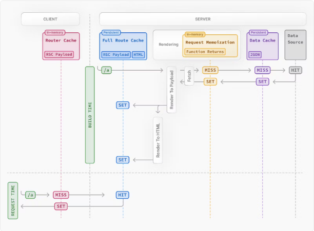
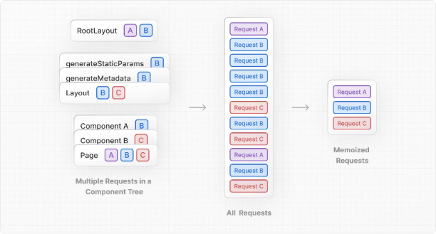
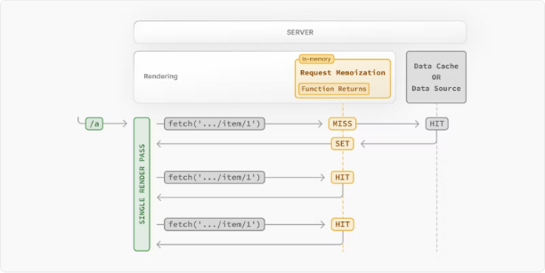
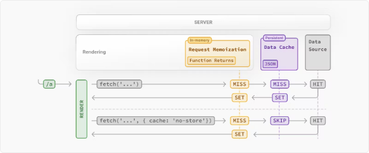
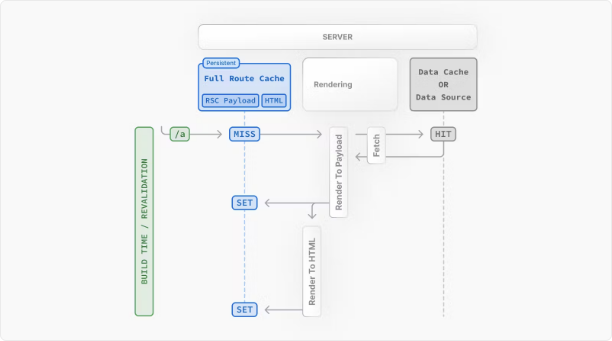
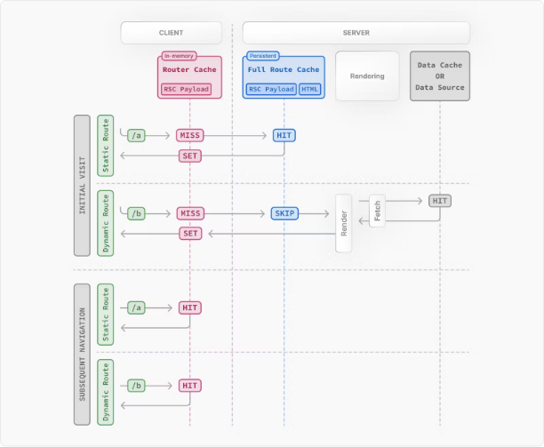
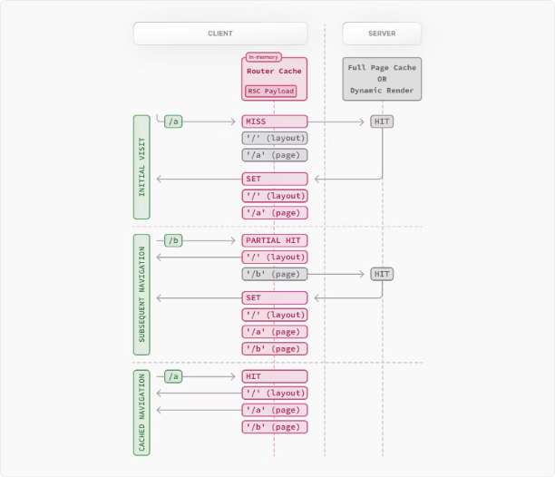

# Next.js의 캐싱

Next.js는 렌더링 작업과 데이터 요청을 캐싱함으로써 애플리케이션의 성능을 향상시키고 비용을 절감합니다. 이 페이지는 Next.js의 캐싱 메커니즘, 구성하는 데 사용할 수 있는 API 및 서로 상호작용하는 방법에 대해 자세히 살펴봅니다.

> 참고: 이 페이지는 Next.js가 어떻게 작동하는지에 대한 이해를 돕지만, Next.js를 효율적으로 사용하는 데 필수적인 지식은 아닙니다. 대부분의 Next.js의 캐싱 휴리스틱은 API 사용에 따라 결정되며, 최상의 성능을 위해 기본값이 지정되어 있습니다.

<!-- ui-log 수평형 -->

<ins class="adsbygoogle"
     style="display:block"
     data-ad-client="ca-pub-4877378276818686"
     data-ad-slot="9743150776"
     data-ad-format="auto"
     data-full-width-responsive="true"></ins>
<component is="script">
(adsbygoogle = window.adsbygoogle || []).push({});
</component>

## 개요

다양한 캐싱 메커니즘과 그 목적에 대한 고수준 개요입니다:

| 메커니즘                                  | 내용                 | 위치       | 목적                                  | 지속 시간                  |
| ----------------------------------------- | -------------------- | ---------- | ------------------------------------- | -------------------------- |
| [요청 메모이제이션](#request-memoization) | 함수의 반환 값       | 서버       | React 컴포넌트 트리에서 데이터 재사용 | 요청당 수명주기            |
| [데이터 캐시](#data-cache)                | 데이터               | 서버       | 사용자 요청 및 배포 간 데이터 저장    | 영구적 (재검증 가능)       |
| [전체 경로 캐시](#full-route-cache)       | HTML 및 RSC 페이로드 | 서버       | 렌더링 비용 감소 및 성능 향상         | 영구적 (재검증 가능)       |
| [라우터 캐시](#router-cache)              | RSC 페이로드         | 클라이언트 | 탐색 시 서버 요청 감소                | 사용자 세션 또는 시간 기반 |

기본적으로 Next.js는 성능을 향상시키고 비용을 절감하기 위해 가능한 한 많은 캐싱을 수행합니다. 이는 라우트가 정적으로 렌더링되고 데이터 요청이 캐시되어 있음을 의미합니다. 아래 다이어그램은 기본 캐싱 동작을 보여줍니다: 라우트가 빌드 시 정적으로 렌더링되고 정적 경로가 처음 방문될 때.



캐싱 동작은 라우트가 정적으로 또는 동적으로 렌더링되는지, 데이터가 캐시되는지 아니면 캐시되지 않는지, 요청이 초기 방문인지 아니면 후속 탐색인지에 따라 달라집니다. 사용 사례에 따라 개별 라우트와 데이터 요청에 대한 캐싱 동작을 구성할 수 있습니다.

<!-- ui-log 수평형 -->

<ins class="adsbygoogle"
     style="display:block"
     data-ad-client="ca-pub-4877378276818686"
     data-ad-slot="9743150776"
     data-ad-format="auto"
     data-full-width-responsive="true"></ins>
<component is="script">
(adsbygoogle = window.adsbygoogle || []).push({});
</component>

## 요청 메모이제이션

React는 동일한 URL과 옵션을 갖는 요청을 자동으로 메모이제이션하는 방식으로 fetch API를 확장합니다. 이는 React 컴포넌트 트리의 여러 위치에서 동일한 데이터를 요청할 때 fetch 함수를 호출하더라도 한 번만 실행됩니다.



예를 들어, 라우트 전체에서 동일한 데이터를 사용해야 할 때 (예: 레이아웃, 페이지 및 여러 컴포넌트에서), 트리의 맨 위에서 데이터를 가져와서 컴포넌트 간에 props를 전달할 필요가 없습니다. 대신 필요한 컴포넌트에서 데이터를 가져올 수 있으며, 네트워크에서 동일한 데이터에 대해 여러 요청을 만드는 것의 성능적인 영향을 걱정할 필요가 없습니다.

```typescript
async function getItem() {
  // `fetch` 함수는 자동으로 메모이제이션되고 결과가 캐시됩니다.
  const res = await fetch("https://.../item/1");
  return res.json();
}

// 이 함수는 두 번 호출되지만, 처음 호출될 때만 실행됩니다
const item = await getItem(); // 캐시 미스

// 두 번째 호출은 라우트 어디에서나 일어날 수 있습니다
const item = await getItem(); // 캐시 히트
```

<!-- ui-log 수평형 -->

<ins class="adsbygoogle"
     style="display:block"
     data-ad-client="ca-pub-4877378276818686"
     data-ad-slot="9743150776"
     data-ad-format="auto"
     data-full-width-responsive="true"></ins>
<component is="script">
(adsbygoogle = window.adsbygoogle || []).push({});
</component>

### 요청 메모이제이션 작동 방식



- 라우트를 렌더링하는 동안 특정 요청이 처음 호출될 때는 해당 결과가 메모리에 없으므로 캐시 미스입니다.
- 따라서 함수가 실행되고 데이터가 외부 소스에서 가져와져 메모리에 저장됩니다.
- 동일한 렌더링 패스에서 해당 요청의 후속 함수 호출은 캐시 히트이며, 함수를 실행하지 않고 메모리에서 데이터를 반환합니다.
- 라우트가 렌더링되고 렌더링 패스가 완료되면 메모리가 "재설정"되고 모든 요청 메모이제이션 항목이 지워집니다.

> 알아두세요:
> 요청 메모이제이션은 Next.js 기능이 아닌 React 기능입니다. 여기에 포함된 이유는 다른 캐싱 메커니즘과 상호작용하는 방법을 보여주기 위함입니다.
> 메모이제이션은 fetch 요청의 GET 메서드에만 적용됩니다.
> 메모이제이션은 React 컴포넌트 트리에만 적용되며, 이는 다음과 같습니다:
> generateMetadata, generateStaticParams, 레이아웃, 페이지 및 기타 서버 컴포넌트에서의 fetch 요청에 적용됩니다.
> 라우트 핸들러의 fetch 요청에는 적용되지 않습니다. 이는 React 컴포넌트 트리의 일부가 아닙니다.
> fetch가 적합하지 않은 경우 (예: 일부 데이터베이스 클라이언트, CMS 클라이언트 또는 GraphQL 클라이언트), 함수를 메모이제이션하기 위해 React 캐시 함수를 사용할 수 있습니다.

### 지속 시간

캐시는 서버 요청의 수명 동안 유지되며 React 컴포넌트 트리의 렌더링이 완료될 때까지 유지됩니다.

### 재검증

메모이제이션은 서버 요청 간에 공유되지 않고 렌더링 중에만 적용되기 때문에 재검증할 필요가 없습니다.

<!-- ui-log 수평형 -->

<ins class="adsbygoogle"
     style="display:block"
     data-ad-client="ca-pub-4877378276818686"
     data-ad-slot="9743150776"
     data-ad-format="auto"
     data-full-width-responsive="true"></ins>
<component is="script">
(adsbygoogle = window.adsbygoogle || []).push({});
</component>

### 선택적 비활성화

메모이제이션은 fetch 요청의 GET 메서드에만 적용되며, POST 및 DELETE와 같은 다른 메서드는 메모이제이션되지 않습니다. 이 기본 동작은 React 최적화이며 이를 비활성화하는 것을 권장하지 않습니다.

개별 요청을 관리하려면 AbortController의 signal 속성을 사용할 수 있습니다. 그러나 이렇게 하면 요청이 메모이제이션에서 제외되지 않고 대신 실행 중인 요청이 중단됩니다.

```js
const { signal } = new AbortController();
fetch(url, { signal });
```

## 데이터 캐시

Next.js에는 내장된 데이터 캐시가 있습니다. 이는 서버로의 들어오는 요청과 배포 간 데이터 가져오기의 결과를 지속시킵니다. Next.js는 각 요청이 서버에서 자체 지속적인 캐싱 의미론을 설정할 수 있도록 네이티브 fetch API를 확장하여 이를 가능하게 합니다.

> 알아두세요: 브라우저에서는 fetch의 cache 옵션은 요청이 브라우저의 HTTP 캐시와 상호작용하는 방식을 나타내지만, Next.js에서는 cache 옵션은 서버 측 요청이 서버의 데이터 캐시와 상호작용하는 방식을 나타냅니다.

기본적으로 fetch를 사용하는 데이터 요청은 캐시됩니다. 캐싱 동작을 구성하기 위해 fetch의 cache와 next.revalidate 옵션을 사용할 수 있습니다.

### 데이터 캐시 작동 방식



- 렌더링 중에 fetch 요청이 처음 호출될 때, Next.js는 데이터 캐시를 확인하여 캐시된 응답을 찾습니다.
- 캐시된 응답이 발견되면 즉시 반환되고 메모이제이션됩니다.
- 캐시된 응답이 발견되지 않으면 데이터 소스에 요청이 전송되고 결과가 데이터 캐시에 저장되고 메모이제이션됩니다.
- 캐시되지 않은 데이터의 경우 ({ cache: `no-store` }와 같은 경우), 결과는 항상 데이터 소스에서 가져와지고 메모이제이션됩니다.
- 데이터가 캐시되었든 캐시되지 않았든, 동일한 데이터에 대한 중복 요청을 피하기 위해 요청은 항상 메모이제이션됩니다.

> 데이터 캐시와 요청 메모이제이션의 차이점
> 두 캐싱 메커니즘 모두 캐시된 데이터를 재사용하여 성능을 향상시키지만, 데이터 캐시는 들어오는 요청과 배포 간에 지속됩니다. 반면에 메모이제이션은 요청의 수명 동안에만 지속됩니다.
> 메모이제이션을 통해 동일한 렌더링 패스에서 네트워크 경계를 넘어 데이터 캐시 서버 (예: CDN 또는 Edge 네트워크) 또는 데이터 소스 (예: 데이터베이스 또는 CMS)로 중복 요청의 수를 줄입니다. 데이터 캐시를 사용하면 원본 데이터 소스로의 요청 수를 줄입니다.

<!-- ui-log 수평형 -->

<ins class="adsbygoogle"
     style="display:block"
     data-ad-client="ca-pub-4877378276818686"
     data-ad-slot="9743150776"
     data-ad-format="auto"
     data-full-width-responsive="true"></ins>
<component is="script">
(adsbygoogle = window.adsbygoogle || []).push({});
</component>

### 지속 시간

데이터 캐시는 들어오는 요청과 배포 간에 지속됩니다. 재검증이나 비활성화하지 않는 한.

### 재검증

캐시된 데이터는 두 가지 방법으로 재검증될 수 있습니다.

- 시간 기반 재검증: 일정 시간이 경과하고 새 요청이 발생한 후 데이터를 재검증합니다. 이것은 변경되지 않는 데이터와 신선도가 중요하지 않은 데이터에 유용합니다.
- 온디맨드 재검증: 이벤트 (예: 폼 제출)에 따라 데이터를 재검증합니다. 온디맨드 재검증은 한 번에 여러 데이터 그룹을 재검증하기 위해 태그 기반 또는 경로 기반 접근 방식을 사용할 수 있습니다. 이는 최신 데이터가 가능한 한 빨리 표시되도록 하려는 경우 (예: 헤드리스 CMS의 콘텐츠가 업데이트될 때) 유용합니다.

#### 시간 기반 재검증

타임스탬프를 설정하여 데이터를 주기적으로 재검증할 수 있습니다.

```js
// 최대 한 시간마다 재검증
fetch("https://...", { next: { revalidate: 3600 } });
```

또는 fetch를 사용할 수 없는 경우 Route Segment Config 옵션을 사용할 수 있습니다.

### 온디맨드 재검증

데이터는 경로 (revalidatePath) 또는 캐시 태그 (revalidateTag)별로 온디맨드로 재검증될 수 있습니다.

### 비활성화

개별 데이터 가져오기에 대해 캐싱을 비활성화하려면 cache 옵션을 no-store로 설정합니다. 이렇게 하면 fetch가 호출될 때마다 데이터가 가져옵니다.

```js
// 개별 `fetch` 요청에 대한 캐싱 비활성화
fetch(`https://...`, { cache: "no-store" });
```

<!-- ui-log 수평형 -->

<ins class="adsbygoogle"
     style="display:block"
     data-ad-client="ca-pub-4877378276818686"
     data-ad-slot="9743150776"
     data-ad-format="auto"
     data-full-width-responsive="true"></ins>
<component is="script">
(adsbygoogle = window.adsbygoogle || []).push({});
</component>

또는 특정 라우트 세그먼트에 대한 캐싱을 비활성화하려면 Route Segment Config 옵션을 사용할 수 있습니다. 이는 라우트 세그먼트의 모든 데이터 요청에 영향을 줍니다.

```js
// 라우트 세그먼트 내의 모든 데이터 요청에 대한 캐싱 비활성화
export const dynamic = "force-dynamic";
```

> Vercel 데이터 캐시
> Next.js 애플리

케이션이 Vercel에 배포되었다면, Vercel 특정 기능에 대한 이해를 위해 Vercel 데이터 캐시 문서를 참조하는 것이 좋습니다.

## 전체 라우트 캐시

> 관련 용어:
> 자동 정적 최적화, 정적 사이트 생성 또는 정적 렌더링은 응용 프로그램의 라우트를 빌드 시간에 렌더링하고 캐시하는 프로세스를 가리키는 용어로 상호 교환하여 사용될 수 있습니다.

Next.js는 빌드 시간에 라우트를 자동으로 렌더링하고 캐시합니다. 이는 모든 요청에 대해 서버에서 렌더링하는 것 대신 캐시된 라우트를 제공하여 페이지 로드를 더 빠르게 만드는 최적화입니다.

전체 라우트 캐시가 작동하는 방법을 이해하는 데는 React가 렌더링을 처리하는 방법과 Next.js가 결과를 캐시하는 방법을 살펴보는 것이 도움이 됩니다:

### 1. 서버에서의 React 렌더링

서버에서는 Next.js가 렌더링을 조정하기 위해 React의 API를 사용합니다. 렌더링 작업은 개별 라우트 세그먼트와 Suspense 경계로 분할됩니다.

각 청크는 두 단계로 렌더링됩니다:

- React는 서버 컴포넌트를 스트리밍에 최적화된 특수한 데이터 형식으로 렌더링합니다. 이 형식은 React 서버 컴포넌트 페이로드라고 합니다.
- Next.js는 React 서버 컴포넌트 페이로드와 클라이언트 컴포넌트 JavaScript 지침을 사용하여 서버에서 HTML을 렌더링합니다.

이것은 모든 것이 렌더링되기를 기다릴 필요 없이 작업을 캐시하거나 응답을 보내기 전에 응답을 스트리밍할 수 있음을 의미합니다.

> React 서버 컴포넌트 페이로드란?
> React 서버 컴포넌트 페이로드는 렌더링된 React 서버 컴포넌트 트리의 간결한 이진 표현입니다. 이는 React가 클라이언트에서 브라우저의 DOM을 업데이트하는 데 사용됩니다. React 서버 컴포넌트 페이로드에는 다음이 포함됩니다:

- 서버 컴포넌트의 렌더링 결과
- 클라이언트 컴포넌트를 렌더링할 위치 및 해당 JavaScript 파일에 대한 참조
- 서버 컴포넌트에서 클라이언트 컴포넌트로 전달된 모든 속성
  자세한 내용은 서버 컴포넌트 문서를 참조하세요.

<!-- ui-log 수평형 -->

<ins class="adsbygoogle"
     style="display:block"
     data-ad-client="ca-pub-4877378276818686"
     data-ad-slot="9743150776"
     data-ad-format="auto"
     data-full-width-responsive="true"></ins>
<component is="script">
(adsbygoogle = window.adsbygoogle || []).push({});
</component>

### 2. 서버에서의 Next.js 캐싱 (전체 라우트 캐시)



Next.js의 기본 동작은 라우트의 렌더링 결과 (React 서버 컴포넌트 페이로드 및 HTML)를 서버에 캐시하는 것입니다. 이는 빌드 시간에 정적으로 렌더링된 라우트 또는 재유효화 중일 때 적용됩니다.

### 3. 클라이언트에서의 React 하이드레이션 및 조정

요청 시, 클라이언트에서:

- HTML은 클라이언트 및 서버 컴포넌트의 빠른 비대화형 초기 미리 보기를 즉시 표시하는 데 사용됩니다.
- React 서버 컴포넌트 페이로드는 클라이언트와 렌더링된 서버 컴포넌트 트리를 조정하고 DOM을 업데이트하는 데 사용됩니다.
- JavaScript 지침은 클라이언트 컴포넌트를 하이드레이션하고 응용 프로그램을 상호 작용 가능하게 만드는 데 사용됩니다.

### 4. 클라이언트의 Next.js 캐싱 (루터 캐시)

React 서버 컴포넌트 페이로드는 클라이언트 측 라우터 캐시에 저장됩니다. 이것은 개별 라우트 세그먼트로 분할된 별도의 인메모리 캐시로, 이전에 방문한 라우트를 저장하고 미래의 라우트를 사전 가져오는 데 사용됩니다.

### 5. 후속 네비게이션

이후의 네비게이션 또는 사전 가져오기 중에, Next.js는 클라이언트의 라우터 캐시에 React 서버 컴포넌트 페이로드가 저장되어 있는지 확인합니다. 그렇다면 새 요청을 서버에 보내지 않습니다.

라우트 세그먼트가 캐시에 없는 경우, Next.js는 서버에서 React 서버 컴포넌트 페이로드를 가져오고 클라이언트의 라우터 캐시를 채웁니다.

<!-- ui-log 수평형 -->

<ins class="adsbygoogle"
     style="display:block"
     data-ad-client="ca-pub-4877378276818686"
     data-ad-slot="9743150776"
     data-ad-format="auto"
     data-full-width-responsive="true"></ins>
<component is="script">
(adsbygoogle = window.adsbygoogle || []).push({});
</component>

### 정적 및 동적 렌더링

라우트가 빌드 시간에 캐시되는지 여부는 정적으로 또는 동적으로 렌더

링되는지에 따라 달라집니다. 정적 라우트는 기본적으로 캐시되지만, 동적 라우트는 요청 시간에 렌더링되며 캐시되지 않습니다.

다음 다이어그램은 정적 및 동적으로 렌더링된 라우트의 차이를 보여줍니다.



정적 및 동적 렌더링에 대해 자세히 알아보세요.

### 지속 시간

기본적으로 전체 라우트 캐시는 지속됩니다. 이는 렌더링 출력이 사용자 요청을 통해 캐시되기 때문입니다.

<!-- ui-log 수평형 -->

<ins class="adsbygoogle"
     style="display:block"
     data-ad-client="ca-pub-4877378276818686"
     data-ad-slot="9743150776"
     data-ad-format="auto"
     data-full-width-responsive="true"></ins>
<component is="script">
(adsbygoogle = window.adsbygoogle || []).push({});
</component>

### 무효화

전체 라우트 캐시를 무효화하는 두 가지 방법이 있습니다:

- 데이터 재검증: 데이터 캐시를 재검증하면 서버에서 구성 요소를 다시 렌더링하고 새로운 렌더링 출력을 캐시하면서 라우터 캐시를 무효화합니다.
- 다시 배포: 데이터 캐시와 달리 전체 라우트 캐시는 새로운 배포시에 지워집니다.

### 비활성화

전체 라우트 캐시에서 동적으로 구성 요소를 모든 요청에 대해 렌더링하려면 다음을 사용하여 전체 라우트 캐시를 비활성화할 수 있습니다:

- 동적 함수 사용: 이를 통해 라우트가 전체 라우트 캐시에서 제외되고 요청 시 동적으로 렌더링됩니다. 데이터 캐시는 여전히 사용될 수 있습니다.
- dynamic = `force-dynamic` 또는 revalidate = 0 라우트 세그먼트 구성 옵션 사용: 전체 라우트 캐시와 데이터 캐시를 건너뛰게 됩니다. 즉, 구성 요소는 클라이언트에 의해 매 요청마다 렌더링되고 데이터가 가져옵니다. 라우터 캐시는 여전히 클라이언트 측 캐시로 적용됩니다.
- 데이터 캐시 비활성화: 특정 fetch 요청이 캐시되지 않는 경우 라우트가 전체 라우트 캐시에서 제외됩니다. 해당 fetch 요청에 대한 데이터는 모든 요청에 대해 가져옵니다. 다른 fetch 요청은 캐시에서 제외되지 않고 데이터 캐시에 캐시됩니다. 이는 캐시된 데이터와 캐시되지 않은 데이터의 혼합을 가능하게 합니다.

## 라우터 캐시

> 관련 용어:
> 라우터 캐시는 클라이언트 측 캐시 또는 사전 가져오기 캐시라고도 할 수 있습니다. 사전 가져오기 캐시는 사전에 가져온 라우트 세그먼트를 가리키는 반면, 클라이언트 측 캐시는 방문한 라우트 세그먼트와 사전 가져온 세그먼트를 모두 포함한 전체 라우터 캐시를 가리킵니다. 이 캐시는 Next.js와 서버 컴포넌트에 특화되어 있으며, 브라우저의 bfcache와는 다르지만 유사한 결과를 얻을 수 있습니다.

Next.js에는 사용자 세션 동안 React 서버 컴포넌트 페이로드를 개별 라우트 세그먼트로 나누어 메모리에 저장하는 클라이언트 측 인메모리 캐시가 있습니다. 이를 라우터 캐시라고 합니다.

라우터 캐시 작동 방식



사용자가 라우트 간을 이동할 때, Next.js는 방문한 라우트 세그먼트를 캐시하고 사용자가 이동할 가능성이 있는 라우트를 사전에 가져옵니다 (화면 내의 `<Link> `컴포넌트를 기준으로).

이로 인해 사용자의 네비게이션 경험이 개선됩니다:

- 방문한 라우트가 캐시되어 있기 때문에 즉시 뒤로/앞으로 이동이 가능하고, 사전 가져오기 및 부분 렌더링으로 인해 새로운 라우트로 빠르게 이동할 수 있습니다.
- 네비게이션 간에 전체 페이지 새로고침이 없으며, React 상태 및 브라우저 상태가 유지됩니다.

> 라우터 캐시와 전체 라우트 캐시의 차이:
> 라우터 캐시는 사용자 세션 동안 브라우저의 임시 메모리에 React 서버 컴포넌트 페이로드를 일시적으로 저장하는 반면, 전체 라우트 캐시는 React 서버 컴포넌트 페이로드와 HTML을 서버에 지속적으로 저장하여 여러 사용자 요청에 걸쳐 유지합니다.
> 전체 라우트 캐시는 정적으로 렌더링된 라우트만 캐시하지만, 라우터 캐시는 정적 및 동적으로 렌더링된 라우트에 모두 적용됩니다.

<!-- ui-log 수평형 -->

<ins class="adsbygoogle"
     style="display:block"
     data-ad-client="ca-pub-4877378276818686"
     data-ad-slot="9743150776"
     data-ad-format="auto"
     data-full-width-responsive="true"></ins>
<component is="script">
(adsbygoogle = window.adsbygoogle || []).push({});
</component>

### 지속 시간

캐시는 브라우저의 임시 메모리에 저장됩니다. 라우터 캐시가 유지되는 기간은 두 가지 요인에 의해 결정됩니다:

- 세션: 캐시는 탐색 사이에 지속됩니다. 그러나 페이지 새로고침 시 지워집니다.
- 자동 무효화 기간: 개별 세그먼트의 캐시는 특정 시간 후 자동으로 무효화됩니다. 기간은 라우트가 정적으로 또는 동적으로 렌더링되는지에 따라 달라집니다:
  - 동적 렌더링: 30초
  - 정적 렌더링: 5분
    페이지 새로고침은 모든 캐시된 세그먼트를 지우지만, 자동 무효화 기간은 마지막으로 액세스 또는 생성된 시점부터 개별 세그먼트에만 영향을 줍니다.

사전에 가져오기를 위해 동적으로 렌더링된 라우트에 prefetch={true}를 추가하거나 router.prefetch를 호출하여 5분 동안 캐싱을 사용할 수 있습니다.

### 무효화

라우터 캐시를 무효화하는 두

가지 방법이 있습니다:

- 서버 작업에서:
  - 경로별로 (revalidatePath) 또는 캐시 태그별로 (revalidateTag) 필요할 때 데이터를 재검증합니다.
  - cookies.set 또는 cookies.delete를 사용하여 캐시를 무효화하여 쿠키를 사용하는 라우트가 오래되지 않도록 합니다 (예: 인증).
- router.refresh를 호출하여 라우터 캐시를 무효화하고 현재 라우트에 대해 새로운 요청을 보냅니다.

### 비활성화

라우터 캐시에서는 캐시를 비활성화할 수 없습니다. 그러나 router.refresh, revalidatePath 또는 revalidateTag를 호출하여 캐시를 무효화할 수 있습니다 (위 참조). 이렇게 하면 캐시가 지워지고 새로운 요청이 서버에 보내져 최신 데이터가 표시됩니다.

또한, `<Link>` 컴포넌트의 prefetch 속성을 false로 설정하여 사전 가져오기를 비활성화할 수 있습니다. 그러나 이렇게 하면 탭 바나 뒤로/앞으로 탐색과 같이 중첩된 세그먼트 간의 즉시 네비게이션을 허용하기 위해 라우트 세그먼트가 30초 동안 일시적으로 저장됩니다. 방문한 라우트는 여전히 캐시됩니다.

## 캐시 상호 작용

다양한 캐싱 메커니즘을 구성할 때, 이들이 서로 어떻게 상호 작용하는지를 이해하는 것이 중요합니다:

### 데이터 캐시와 전체 라우트 캐시

- 데이터 캐시의 재검증 또는 캐시 비활성화는 전체 라우트 캐시를 무효화합니다. 왜냐하면 렌더링 출력은 데이터에 의존하기 때문입니다.
- 전체 라우트 캐시의 무효화 또는 비활성화는 데이터 캐시에 영향을 주지 않습니다. 캐시된 데이터를 사용하는 페이지 대부분이 있지만 요청 시 가져와야 하는 데이터에 의존하는 몇 가지 컴포넌트가 있는 경우 동적으로 라우트를 렌더링할 수 있습니다. 이렇게 하면 모든 데이터를 다시 가져오는 성능 영향을 걱정하지 않고도 동적으로 렌더링할 수 있습니다.

<!-- ui-log 수평형 -->

<ins class="adsbygoogle"
     style="display:block"
     data-ad-client="ca-pub-4877378276818686"
     data-ad-slot="9743150776"
     data-ad-format="auto"
     data-full-width-responsive="true"></ins>
<component is="script">
(adsbygoogle = window.adsbygoogle || []).push({});
</component>

### 데이터 캐시와 클라이언트 측 라우터 캐시

- 라우트 핸들러에서 데이터 캐시를 재검증해도 라우터 캐시가 즉시 무효화되지 않습니다. 왜냐하면 라우트 핸들러는 특정 라우트에 바인딩되어 있지 않기 때문입니다. 이는 하드 새로고침을 하거나 자동 무효화 기간이 경과할 때까지 라우터 캐시가 이전 페이로드를 계속 제공할 것입니다.
- 데이터 캐시와 라우터 캐시를 즉시 무효화하려면 서버 액션에서 revalidatePath 또는 revalidateTag를 사용할 수 있습니다.

### API

다음 표는 다양한 Next.js API가 캐싱에 어떻게 영향을 미치는지에 대한 개요를 제공합니다.

| API                                           | Router Cache               | Full Route Cache      | Data Cache            | React Cache |
| --------------------------------------------- | -------------------------- | --------------------- | --------------------- | ----------- |
| `<Link prefetch>`                             | Cache                      |                       |                       |             |
| `router.prefetch`                             | Cache                      |                       |                       |             |
| `router.refresh`                              | Revalidate                 |                       |                       |             |
| `fetch`                                       |                            |                       | Cache                 | Cache       |
| `fetch options.cache`                         |                            |                       | Cache or Opt out      |             |
| `fetch options.next.revalidate`               |                            | Revalidate            | Revalidate            |             |
| `fetch options.next.tags` and `revalidateTag` |                            | Cache                 | Cache                 |             |
| `revalidateTag`                               | Revalidate (Server Action) | Revalidate            | Revalidate            |             |
| `revalidatePath`                              | Revalidate (Server Action) | Revalidate            | Revalidate            |             |
| `const revalidate`                            |                            | Revalidate or Opt out | Revalidate or Opt out |             |
| `const dynamic`                               |                            | Cache or Opt out      | Cache or Opt out      |             |
| `cookies`                                     | Revalidate (Server Action) | Opt out               |                       |             |
| `headers`, `searchParams`                     |                            | Opt out               |                       |             |
| `generateStaticParams`                        |                            | Cache                 |                       |             |
| `React.cache function`                        |                            |                       |                       | Cache       |
| `unstable_cache`                              |                            |                       |                       |             |

### `<Link>`

기본적으로 `<Link>` 컴포넌트는 Full Route Cache에서 라우트를 자동으로 prefetch하고 Router Cache에 React Server Component Payload를 추가합니다.

Prefetching을 비활성화하려면 prefetch prop을 false로 설정할 수 있습니다. 그러나 이렇게 하면 캐시를 영구적으로 건너뛰지는 않습니다. 사용자가 라우트를 방문할 때 라우트 세그먼트는 여전히 클라이언트 측에 캐시됩니다.

`<Link>` 컴포넌트에 대해 자세히 알아보기.

### router.prefetch

useRouter 훅의 prefetch 옵션은 라우트를 수동으로 prefetch하는 데 사용될 수 있습니다. 이렇게 하면 React Server Component Payload가 Router Cache에 추가됩니다.

useRouter 훅 API 참조 참조.

<!-- ui-log 수평형 -->

<ins class="adsbygoogle"
     style="display:block"
     data-ad-client="ca-pub-4877378276818686"
     data-ad-slot="9743150776"
     data-ad-format="auto"
     data-full-width-responsive="true"></ins>
<component is="script">
(adsbygoogle = window.adsbygoogle || []).push({});
</component>

### router.refresh

useRouter 훅의 refresh 옵션은 라우트를 수동으로 새로 고칠 때 사용될 수 있습니다. 이렇게 하면 Router Cache가 완전히 지워지고 현재 라우트에 대해 새 요청이 서버로 보내집니다. refresh는 Data나 Full Route Cache에 영향을 주지 않습니다.

렌더링된 결과물은 클라이언트에서 조화되면서 React 상태와 브라우저 상태가 보존됩니다.

useRouter 훅 API 참조 참조.

### fetch

fetch에서 반환된 데이터는 자동으로 Data Cache에 캐시됩니다.

```js
// 기본적으로 캐시됨. `force-cache`는 기본 옵션이며 생략할 수 있습니다.
fetch(`https://...`, { cache: "force-cache" });
```

더 많은 옵션에 대한 fetch API 참조를 확인하세요.

<!-- ui-log 수평형 -->

<ins class="adsbygoogle"
     style="display:block"
     data-ad-client="ca-pub-4877378276818686"
     data-ad-slot="9743150776"
     data-ad-format="auto"
     data-full-width-responsive="true"></ins>
<component is="script">
(adsbygoogle = window.adsbygoogle || []).push({});
</component>

### fetch options.cache

cache 옵션을 no-store로 설정하여 개별 fetch 요청의 데이터 캐싱을 건너뛸 수 있습니다.

```js
// 캐싱하지 않음
fetch(`https://...`, { cache: "no-store" });
```

렌더링 출력이 데이터에 의존하기 때문에 cache: `no-store`를 사용하면 해당 fetch 요청이 사용된 라우트의 Full Route Cache도 건너뛰게 됩니다. 즉, 라우트는 요청마다 동적으로 렌더링되지만 같은 라우트에서 다른 캐시된 데이터 요청을 여전히 가질 수 있습니다.

더 많은 옵션에 대한 fetch API 참조를 확인하세요.

### fetch options.next.revalidate

fetch의 next.revalidate 옵션을 사용하여 개별 fetch 요청의 재검증 기간(초 단위)을 설정할 수 있습니다. 이는 Data Cache를 재검증하고, 이로 인해 Full Route Cache가 재검증됩니다. 새로운 데이터가 가져와지고, 컴포넌트가 서버에서 다시 렌더링됩니다.

```js
// 최대 1시간마다 재검증
fetch(`https://...`, { next: { revalidate: 3600 } });
```

더 많은 옵션에 대한 fetch API 참조를 확인하세요.

### fetch options.next.tags 및 revalidateTag

Next.js에는 미세한 데이터 캐싱과 재검증을 위한 캐시 태깅 시스템이 있습니다.

- fetch나 unstable_cache를 사용할 때, 하나 이상의 태그로 캐시 항목을 태그 지정할 수 있습니다.
- 그런 다음, revalidateTag를 호출하여 해당 태그와 관련된 캐시 항목을 제거할 수 있습니다.

예를 들어 데이터를 가져올 때 태그를 설정할 수 있습니다.

```js
// 태그로 데이터 캐시
fetch(`https://...`, { next: { tags: ["a", "b", "c"] } });
```

<!-- ui-log 수평형 -->

<ins class="adsbygoogle"
     style="display:block"
     data-ad-client="ca-pub-4877378276818686"
     data-ad-slot="9743150776"
     data-ad-format="auto"
     data-full-width-responsive="true"></ins>
<component is="script">
(adsbygoogle = window.adsbygoogle || []).push({});
</component>

그런 다음, 태그와 함께 revalidateTag를 호출하여 캐시 항목을 제거할 수 있습니다.

```js
// 특정 태그와 관련된 항목 재검증
revalidateTag("a");
```

달성하려는 목적에 따라 revalidateTag를 사용할 수 있는 두 가지 위치가 있습니다.

- 라우트 핸들러 - 서드 파티 이벤트(e.g. 웹훅)에 대한 데이터 재검증을 위해 데이터를 재검증합니다. 이렇게 하면 라우터 캐시가 즉시 무효화되지 않으며, 라우터 핸들러는 특정 라우트에 바인딩되어 있지 않습니다.
- 서버 액션 - 사용자 조작(e.g. 폼 제출) 후에 데이터를 재검증합니다. 이렇게 하면 연결된 라우트에 대한 라우터 캐시가 무효화됩니다.

### revalidatePath

revalidatePath를 사용하면 특정 경로 아래의 데이터를 수동으로 재검증하고 라우트 세그먼트를 다시 렌더링할 수 있습니다. revalidatePath 메서드를 호출하면 Data Cache를 재검증하고, 이로 인해 Full Route Cache가 무효화됩니다.

```js
revalidatePath("/");
```

달성하려는 목적에 따라 revalidatePath를 사용할 수 있는 두 가지 위치가 있습니다.

- 라우트 핸들러 - 서드 파티 이벤트(e.g. 웹훅)에 대한 데이터 재검증을 위해 데이터를 재검증합니다.
- 서버 액션 - 사용자 상호 작용(e.g. 폼 제출, 버튼 클릭) 후에 데이터를 재검증합니다.

revalidatePath API 참조에서 자세한 정보를 확인하세요.

> revalidatePath 대 router.refresh:
> router.refresh를 호출하면 라우터 캐시가 지워지고 서버에서 라우트 세그먼트가 다시 렌더링됩니다. 그러나 Data Cache와 Full Route Cache는 변경되지 않습니다. 이 차이점은 revalidatePath가 Data Cache와 Full Route Cache를 지워버리지만 router.refresh()는 Data Cache와 Full Route Cache를 변경하지 않는다는 점에 있습니다. router.refresh()는 클라이언트 측 API이기 때문입니다.

### Dynamic Functions

쿠키와 헤더, 그리고 페이지의 searchParams와 같은 동적 함수는 런타임에서 수신되는 요청 정보에 따라 달라집니다. 이러한 함수를 사용하면 라우트를 Full Route Cache에서 opt-out하게 되어 라우트가 동적으로 렌더링됩니다.

#### cookies

서버 액션에서 cookies.set 또는 cookies.delete를 사용하면 라우터 캐시가 무효화되어 쿠키를 사용하는 라우트가 더 이상 사용되지 않는 쿠키가 될 수 있습니다 (e.g. 인증 변경 사항 반영).

쿠키 API 참조를 확인하세요.

<!-- ui-log 수평형 -->

<ins class="adsbygoogle"
     style="display:block"
     data-ad-client="ca-pub-4877378276818686"
     data-ad-slot="9743150776"
     data-ad-format="auto"
     data-full-width-responsive="true"></ins>
<component is="script">
(adsbygoogle = window.adsbygoogle || []).push({});
</component>

### Segment Config Options

Route Segment Config 옵션은 라우트 세그먼트의 기본값을 재정의하거나 fetch API를 사용할 수 없는 경우(예: 데이터베이스 클라이언트 또는 제3자 라이브러리)에 사용할 수 있습니다.

다음 Route Segment Config 옵션은 Data Cache와 Full Route Cache에서 opt-out합니다:

- const dynamic = `force-dynamic`
- const revalidate = 0

더 많은 옵션에 대한 Route Segment Config 문서를 확인하세요.

<!-- ui-log 수평형 -->

<ins class="adsbygoogle"
     style="display:block"
     data-ad-client="ca-pub-4877378276818686"
     data-ad-slot="9743150776"
     data-ad-format="auto"
     data-full-width-responsive="true"></ins>
<component is="script">
(adsbygoogle = window.adsbygoogle || []).push({});
</component>

### generateStaticParams

동적 세그먼트(e.g. app/blog/[slug]/page.js)의 경우, generateStaticParams에서 제공된 경로는 빌드 시 Full Route Cache에 캐시됩니다. 요청 시, Next.js는 빌드 시 알려지지 않았던 경로도 첫 방문 시 캐시합니다.

요청 시 캐싱을 비활성화하려면 route 세그먼트에서 export const dynamicParams = false 옵션을 사용하세요. 이 구성 옵션을 사용하면 generateStaticParams에서 제공된 경로만 제공되며, 다른 라우트는 404 또는 match됩니다(캐치-올 라우트의 경우).

generateStaticParams API 참조를 확인하세요.

<!-- ui-log 수평형 -->

<ins class="adsbygoogle"
     style="display:block"
     data-ad-client="ca-pub-4877378276818686"
     data-ad-slot="9743150776"
     data-ad-format="auto"
     data-full-width-responsive="true"></ins>
<component is="script">
(adsbygoogle = window.adsbygoogle || []).push({});
</component>

### React cache function

React 캐시 함수를 사용하면 함수의 반환 값을 메모이제이션하여 한 번 실행하면 여러 번 호출할 수 있습니다.

fetch 요청이 자동으로 메모이제이션되기 때문에 React 캐시에 래핑할 필요가 없습니다. 그러나 fetch API가 적합하지 않은 사용 사례에는 데이터 요청을 수동으로 메모이제이션하는 데 cache를 사용할 수 있습니다. 예를 들어, 일부 데이터베이스 클라이언트, CMS 클라이언트 또는 GraphQL 클라이언트입니다.

```typescript
import { cache } from "react";
import db from "@/lib/db";

export const getItem = cache(async (id: string) => {
  const item = await db.item.findUnique({ id });
  return item;
});
```
