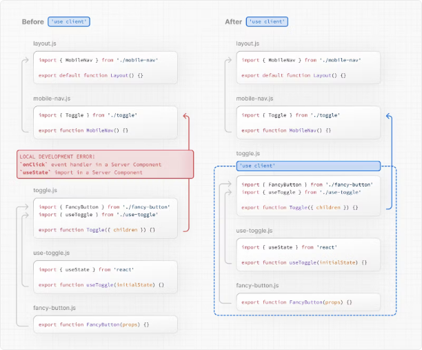

# Nextjs 14 클라이언트 컴포넌트 정리

# 클라이언트 컴포넌트

클라이언트 컴포넌트를 사용하면 서버에서 사전 렌더링되는 대화형 UI를 작성할 수 있으며 브라우저에서 실행되는 클라이언트 JavaScript를 사용할 수 있습니다.

이 페이지에서는 클라이언트 컴포넌트가 어떻게 작동하고, 렌더링되는 방식, 그리고 언제 사용해야 하는지에 대해 알아보겠습니다.

<!-- ui-log 수평형 -->

<ins class="adsbygoogle"
     style="display:block"
     data-ad-client="ca-pub-4877378276818686"
     data-ad-slot="9743150776"
     data-ad-format="auto"
     data-full-width-responsive="true"></ins>
<component is="script">
(adsbygoogle = window.adsbygoogle || []).push({});
</component>

## 클라이언트 렌더링의 장점

클라이언트에서 렌더링 작업을 수행하는 것에는 몇 가지 이점이 있습니다. 여기에는 다음이 포함됩니다:

- 상호 작용: 클라이언트 컴포넌트는 상태, 이펙트 및 이벤트 리스너를 사용할 수 있으므로 사용자에게 즉각적인 피드백을 제공하고 UI를 업데이트할 수 있습니다.
- 브라우저 API: 클라이언트 컴포넌트는 지리적 위치 또는 로컬 저장소와 같은 브라우저 API에 액세스할 수 있습니다.

## Next.js에서 클라이언트 컴포넌트 사용하기

클라이언트 컴포넌트를 사용하려면 파일 상단에 있는 import 위에 React "use client" 지시문을 추가할 수 있습니다.

"use client"는 서버 및 클라이언트 컴포넌트 모듈 간의 경계를 선언하는 데 사용됩니다. 즉, 파일에 "use client"를 정의하면 자식 컴포넌트를 포함한 모든 다른 모듈이 클라이언트 번들의 일부로 간주됩니다.

```typescript
import { useState } from "react";

export default function Counter() {
  const [count, setCount] = useState(0);

  return (
    <div>
      <p>You clicked {count} times</p>
      <button onClick={() => setCount(count + 1)}>Click me</button>
    </div>
  );
}
```

<!-- ui-log 수평형 -->

<ins class="adsbygoogle"
     style="display:block"
     data-ad-client="ca-pub-4877378276818686"
     data-ad-slot="9743150776"
     data-ad-format="auto"
     data-full-width-responsive="true"></ins>
<component is="script">
(adsbygoogle = window.adsbygoogle || []).push({});
</component>

다음 다이어그램은 toggle.js에서 onClick 및 useState를 사용할 때 "use client" 지시문이 정의되지 않으면 오류가 발생합니다. 이는 App Router의 모든 컴포넌트가 기본적으로 클라이언트에서 사용할 수 없는 Server Components이기 때문입니다. toggle.js에 "use client" 지시문을 정의함으로써 React에게 이러한 API가 사용 가능한 클라이언트 경계로 진입하도록 알릴 수 있습니다.



> 여러 use client 진입점 정의하기:
> React 컴포넌트 트리에서 여러 "use client" 진입점을 정의할 수 있습니다. 이를 통해 응용 프로그램을 여러 클라이언트 번들로 분할할 수 있습니다.
> 그러나 모든 클라이언트에 렌더링되어야 하는 모든 컴포넌트에 "use client"를 정의할 필요는 없습니다. 한 번 경계를 정의하면 모든 자식 컴포넌트와 그에 포함된 모든 모듈이 클라이언트 번들의 일부로 간주됩니다.

<!-- ui-log 수평형 -->

<ins class="adsbygoogle"
     style="display:block"
     data-ad-client="ca-pub-4877378276818686"
     data-ad-slot="9743150776"
     data-ad-format="auto"
     data-full-width-responsive="true"></ins>
<component is="script">
(adsbygoogle = window.adsbygoogle || []).push({});
</component>

## 클라이언트 컴포넌트는 어떻게 렌더링되나요?

Next.js에서 클라이언트 컴포넌트는 전체 페이지 로드(응용 프로그램의 초기 방문 또는 브라우저 새로 고침에 의한 페이지 다시로드)에 따라 다르게 렌더링됩니다.

### 전체 페이지 로드

초기 페이지 로드를 최적화하기 위해 Next.js는 클라이언트 및 서버 컴포넌트에 대해 서버에서 정적 HTML 미리보기를 렌더링하는 React의 API를 사용합니다. 즉, 사용자가 응용 프로그램을 처음 방문할 때 클라이언트가 클라이언트 컴포넌트 JavaScript 번들을 다운로드하고 파싱하고 실행하는 것을 기다릴 필요없이 페이지의 내용을 즉시 볼 수 있습니다.

서버에서는 다음과 같이 작동합니다:

- React는 서버 컴포넌트를 React Server Component Payload (RSC Payload)라는 특수한 데이터 형식으로 렌더링하며 이는 클라이언트 컴포넌트에 대한 참조를 포함합니다.
- Next.js는 RSC Payload와 클라이언트 컴포넌트 JavaScript 지침을 사용하여 서버에서 라우트의 HTML을 렌더링합니다.

그런 다음 클라이언트에서는 다음과 같이 작동합니다:

- HTML은 빠르고 비대화식 초기 미리보기를 즉시 표시하는 데 사용됩니다.
- React Server Components Payload는 클라이언트 및 서버 컴포넌트 트리를 조화시키고 DOM을 업데이트하는 데 사용됩니다.
- JavaScript 지침은 클라이언트 컴포넌트를 수화하고 UI를 상호 작용 가능하게 만듭니다.

> 수화란 무엇인가요?
> 수화는 DOM에 이벤트 리스너를 연결하여 정적 HTML을 상호 작용 가능하게 만드는

과정입니다. 수화는 내부적으로 hydrateRoot React API를 사용하여 수행됩니다.

<!-- ui-log 수평형 -->

<ins class="adsbygoogle"
     style="display:block"
     data-ad-client="ca-pub-4877378276818686"
     data-ad-slot="9743150776"
     data-ad-format="auto"
     data-full-width-responsive="true"></ins>
<component is="script">
(adsbygoogle = window.adsbygoogle || []).push({});
</component>

### 후속 탐색

후속 탐색에서 클라이언트 컴포넌트는 서버 렌더링된 HTML 없이 완전히 클라이언트에서 렌더링됩니다.

이는 클라이언트 컴포넌트 JavaScript 번들이 다운로드되고 파싱된 후에 발생합니다. 번들이 준비되면 React가 RSC Payload를 사용하여 클라이언트와 서버 컴포넌트 트리를 조화시키고 DOM을 업데이트합니다.

## 서버 환경으로 돌아가기

때로는 "use client" 경계를 선언한 후에도 서버 환경으로 돌아가고 싶을 수 있습니다. 예를 들어, 클라이언트 번들 크기를 줄이거나 서버에서 데이터를 가져오거나 서버에서만 사용 가능한 API를 사용할 수 있습니다.

클라이언트 컴포넌트에 이론적으로 중첩된 코드를 유지하면서도 클라이언트 컴포넌트와 서버 액션을 교차로 배치할 수 있습니다. 더 많은 정보는 구성 패턴 페이지를 참조하세요.
