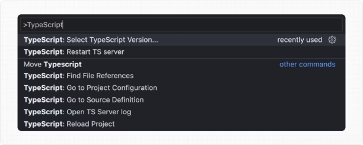

# TypeScript

Next.js는 React 애플리케이션을 구축하는 데 TypeScript를 우선으로 하는 개발 경험을 제공합니다.
필요한 패키지를 자동으로 설치하고 적절한 설정을 구성하기 위한 기본 TypeScript 지원이 제공됩니다.
또한 편집기용 TypeScript 플러그인도 포함되어 있습니다.

<!-- ui-log 수평형 -->

<ins class="adsbygoogle"
      style="display:block"
      data-ad-client="ca-pub-4877378276818686"
      data-ad-slot="9743150776"
      data-ad-format="auto"
      data-full-width-responsive="true"></ins>
<component is="script">
(adsbygoogle = window.adsbygoogle || []).push({});
</component>

> 🎥 시청하십시오: 내장된 TypeScript 플러그인에 대해 배우기 → YouTube (3분)

## 새로운 프로젝트

`create-next-app`은 이제 기본적으로 TypeScript를 배포합니다.

```js
npx create-next-app@latest
```

<!-- ui-log 수평형 -->

<ins class="adsbygoogle"
      style="display:block"
      data-ad-client="ca-pub-4877378276818686"
      data-ad-slot="9743150776"
      data-ad-format="auto"
      data-full-width-responsive="true"></ins>
<component is="script">
(adsbygoogle = window.adsbygoogle || []).push({});
</component>

## 기존 프로젝트

프로젝트에 TypeScript를 추가하려면 파일을 .ts / .tsx로 이름을 변경하세요. 자동으로 필요한 종속성이 설치되고 권장 구성 옵션을 가진 tsconfig.json 파일이 추가되도록 next dev 및 next build를 실행하세요.
이미 jsconfig.json 파일이 있는 경우 이전 jsconfig.json의 paths 컴파일러 옵션을 새 tsconfig.json 파일로 복사하고 이전 jsconfig.json 파일을 삭제하세요.

## TypeScript 플러그인

<!-- ui-log 수평형 -->

<ins class="adsbygoogle"
      style="display:block"
      data-ad-client="ca-pub-4877378276818686"
      data-ad-slot="9743150776"
      data-ad-format="auto"
      data-full-width-responsive="true"></ins>
<component is="script">
(adsbygoogle = window.adsbygoogle || []).push({});
</component>

Next.js에는 커스텀 TypeScript 플러그인과 타입 체커가 포함되어 있어, VSCode 및 다른 코드 편집기에서 고급 타입 체크와 자동 완성에 사용할 수 있어요.
VS Code에서 플러그인을 활성화하려면 다음을 따라하세요:

- 명령 팔레트를 엽니다 (Ctrl/⌘ + Shift + P)
- "TypeScript: Select TypeScript Version"을 검색합니다
- "Use Workspace Version"을 선택합니다
  

<!-- ui-log 수평형 -->

<ins class="adsbygoogle"
      style="display:block"
      data-ad-client="ca-pub-4877378276818686"
      data-ad-slot="9743150776"
      data-ad-format="auto"
      data-full-width-responsive="true"></ins>
<component is="script">
(adsbygoogle = window.adsbygoogle || []).push({});
</component>

파일을 편집할 때 이제 사용자 지정 플러그인이 활성화됩니다. 다음 빌드를 실행할 때는 사용자 지정 유형 검사기가 사용됩니다.

### 플러그인 기능

TypeScript 플러그인은 다음과 같은 기능을 제공할 수 있습니다:

- 세그먼트 구성 옵션에 잘못된 값이 전달되었을 때 경고 표시
- 사용 가능한 옵션 및 컨텍스트 문서 표시
- 클라이언트 지시어 사용이 올바른지 확인
- useState와 같은 클라이언트 후크가 Client Components에서만 사용되었는지 확인

<!-- ui-log 수평형 -->

<ins class="adsbygoogle"
      style="display:block"
      data-ad-client="ca-pub-4877378276818686"
      data-ad-slot="9743150776"
      data-ad-format="auto"
      data-full-width-responsive="true"></ins>
<component is="script">
(adsbygoogle = window.adsbygoogle || []).push({});
</component>

> 유용한 정보: 미래에 추가 기능이 더해질 예정입니다.

## TypeScript 최소 버전

적어도 TypeScript v4.5.2를 사용하는 것을 강력히 권장하며, 수입 이름에 대한 타입 수정자와 성능 향상과 같은 구문 기능을 얻을 수 있습니다.

## 정적으로 유형이 지정된 링크

<!-- ui-log 수평형 -->

<ins class="adsbygoogle"
      style="display:block"
      data-ad-client="ca-pub-4877378276818686"
      data-ad-slot="9743150776"
      data-ad-format="auto"
      data-full-width-responsive="true"></ins>
<component is="script">
(adsbygoogle = window.adsbygoogle || []).push({});
</component>

Next.js는 next/link을 사용할 때 오타 및 기타 오류를 방지하기 위해 링크에 정적 타입을 지정할 수 있습니다. 페이지 간 이동 시 유형 안전성을 개선해줍니다.
이 기능을 활성화하려면 experimental.typedRoutes를 활성화해야 하며 프로젝트가 TypeScript를 사용해야 합니다.

```js
/** @type {import('next').NextConfig} */
const nextConfig = {
  experimental: {
    typedRoutes: true,
  },
};

module.exports = nextConfig;
```

Next.js는 응용 프로그램의 모든 기존 경로에 대한 정보를 포함하는 .next/types에 링크 정의를 생성하며, TypeScript는 이를 사용하여 편집기에서 잘못된 링크에 대한 피드백을 제공할 수 있습니다.

<!-- ui-log 수평형 -->

<ins class="adsbygoogle"
      style="display:block"
      data-ad-client="ca-pub-4877378276818686"
      data-ad-slot="9743150776"
      data-ad-format="auto"
      data-full-width-responsive="true"></ins>
<component is="script">
(adsbygoogle = window.adsbygoogle || []).push({});
</component>

현재 실험적 지원으로는 동적 세그먼트를 포함한 모든 문자열 리터럴이 포함됩니다. 비 리터럴 문자열의 경우에는 href를 Route로 수동으로 캐스트해야 합니다:

```js
import type { Route } from 'next';
import Link from 'next/link'

// href가 유효한 루트인 경우 TypeScript 오류가 발생하지 않음
<Link href="/about" />
<Link href="/blog/nextjs" />
<Link href={`/blog/${slug}`} />
<Link href={('/blog' + slug) as Route} />

// href가 유효한 루트가 아닌 경우 TypeScript 오류 발생
<Link href="/aboot" />
```

next/link을 래핑한 사용자 지정 컴포넌트에서 href를 받으려면 제네릭을 사용하세요:

```js
import type { Route } from 'next'
import Link from 'next/link'

function Card<T extends string>({ href }: { href: Route<T> | URL }) {
  return (
    <Link href={href}>
      <div>My Card</div>
    </Link>
  )
}
```

<!-- ui-log 수평형 -->

<ins class="adsbygoogle"
      style="display:block"
      data-ad-client="ca-pub-4877378276818686"
      data-ad-slot="9743150776"
      data-ad-format="auto"
      data-full-width-responsive="true"></ins>
<component is="script">
(adsbygoogle = window.adsbygoogle || []).push({});
</component>

> 어떻게 작동합니까?
> "next dev" 또는 "next build"를 실행할 때, Next.js는 응용 프로그램에서 모든 기존 경로에 대한 정보를 포함하는 .next 내부에 숨겨진 .d.ts 파일을 생성합니다 (Link의 href 타입으로 모든 유효한 경로). 이 .d.ts 파일은 tsconfig.json에 포함되며, TypeScript 컴파일러는 해당 .d.ts를 확인하고 편집기에서 잘못된 링크에 대한 피드백을 제공합니다.

## 종단 간 유형 안정성

Next.js 앱 라우터는 향상된 유형 안정성을 갖추고 있습니다. 이에는 다음이 포함됩니다:

- 데이터 직렬화 불필요함: 컴포넌트, 레이아웃, 및 페이지에서 직접 데이터를 가져올 수 있습니다. 이 데이터를 React에서 사용하기 위해 문자열로 변환할 필요가 없습니다. 대신, 앱이 기본적으로 서버 컴포넌트를 사용하므로, Date, Map, Set 등의 값들을 추가적인 단계 없이 사용할 수 있습니다. 이전에는 Next.js 특정 유형을 수동으로 입력해야 했습니다.
- 컴포넌트 간 데이터 흐름 간소화: root 레이아웃을 선호하는 방식으로 \_app이 삭제되면, 이제 컴포넌트와 페이지 간의 데이터 흐름을 시각화하는 것이 더 쉬워졌습니다. 개별 페이지 및 \_app 간의 데이터 흐름이 어려웠고 혼란스러운 버그를 발생시킬 수도 있었던 이전 방식 대신, App 라우터에서의 공동 데이터 가져오기로 인해 이 문제가 해결되었습니다.

<!-- ui-log 수평형 -->

<ins class="adsbygoogle"
      style="display:block"
      data-ad-client="ca-pub-4877378276818686"
      data-ad-slot="9743150776"
      data-ad-format="auto"
      data-full-width-responsive="true"></ins>
<component is="script">
(adsbygoogle = window.adsbygoogle || []).push({});
</component>

Next.js에서 데이터 가져오기는 데이터베이스나 콘텐츠 제공 업체 선택에 대한 선험적 가이드가 없이 가능한 한 끝판까지 타입 안전을 제공합니다. 일반 TypeScript에서 예상할 수 있는 대로 응답 데이터의 유형을 지정할 수 있습니다. 예를 들어:

```js
async function getData() {
  const res = await fetch("https://api.example.com/...");
  // 반환 값은 직렬화되지 않습니다
  // Date, Map, Set 등을 반환할 수 있습니다
  return res.json();
}

export default async function Page() {
  const name = await getData();

  return "...";
}
```

끝판까지 타입 안전을 보장하려면 데이터베이스나 콘텐츠 제공 업체가 TypeScript를 지원해야 합니다. 이는 ORM 또는 타입 안전한 쿼리 빌더를 사용하는 것을 통해 가능합니다.

<!-- ui-log 수평형 -->

<ins class="adsbygoogle"
      style="display:block"
      data-ad-client="ca-pub-4877378276818686"
      data-ad-slot="9743150776"
      data-ad-format="auto"
      data-full-width-responsive="true"></ins>
<component is="script">
(adsbygoogle = window.adsbygoogle || []).push({});
</component>

## 비동기 서버 컴포넌트 TypeScript 오류

TypeScript를 사용하여 비동기 서버 컴포넌트를 사용하려면 TypeScript 5.1.3 이상 및 @types/react 18.2.8 이상을 사용하십시오.
이전 버전의 TypeScript를 사용하는 경우 `Promise<Element>`이(가) 유효한 JSX 요소 유형이 아닙니다는 오류가 발생할 수 있습니다. 최신 버전의 TypeScript 및 @types/react로 업데이트하면이 문제를 해결할 수 있습니다.

## 서버 및 클라이언트 컴포넌트 간 데이터 전달

<!-- ui-log 수평형 -->

<ins class="adsbygoogle"
      style="display:block"
      data-ad-client="ca-pub-4877378276818686"
      data-ad-slot="9743150776"
      data-ad-format="auto"
      data-full-width-responsive="true"></ins>
<component is="script">
(adsbygoogle = window.adsbygoogle || []).push({});
</component>

서버와 클라이언트 컴포넌트 간에 props를 통해 데이터를 전송할 때, 데이터는 여전히 브라우저에서 사용하기 위해 직렬화됩니다 (문자열로 변환됨). 그러나 특별한 유형이 필요하지는 않습니다. 다른 props를 컴포넌트 간에 전달하는 것과 동일한 방식으로 유형이 지정됩니다.
또한, 렌더링되지 않은 데이터는 서버와 클라이언트 간을 건너가지 않으므로 직렬화할 코드가 더 적어집니다 (서버에 그대로 남아 있음). 이것은 이제 서버 컴포넌트를 지원함으로써 가능해졌습니다.

## 경로 별칭과 baseUrl

Next.js는 자동으로 tsconfig.json의 "paths" 및 "baseUrl" 옵션을 지원합니다.

<!-- ui-log 수평형 -->

<ins class="adsbygoogle"
      style="display:block"
      data-ad-client="ca-pub-4877378276818686"
      data-ad-slot="9743150776"
      data-ad-format="auto"
      data-full-width-responsive="true"></ins>
<component is="script">
(adsbygoogle = window.adsbygoogle || []).push({});
</component>

이 기능에 대한 자세한 내용은 Module Path aliases 문서에서 확인할 수 있습니다.

## next.config.js의 타입 체크

next.config.js 파일은 Babel이나 TypeScript에 의해 구문 분석되지 않기 때문에 JavaScript 파일이어야 합니다. 그러나 아래와 같이 IDE에서 JSDoc을 사용하여 일부 타입 체크를 추가할 수 있습니다:

```js
// @ts-check

/**
 * @type {import('next').NextConfig}
 **/
const nextConfig = {
  /* 여기에 구성 옵션 작성 */
};

module.exports = nextConfig;
```

<!-- ui-log 수평형 -->

<ins class="adsbygoogle"
      style="display:block"
      data-ad-client="ca-pub-4877378276818686"
      data-ad-slot="9743150776"
      data-ad-format="auto"
      data-full-width-responsive="true"></ins>
<component is="script">
(adsbygoogle = window.adsbygoogle || []).push({});
</component>

## 점진적 타입 검사

v10.2.1부터 Next.js에서는 tsconfig.json에서 활성화되면 대규모 응용 프로그램에서 타입 검사 속도를 높일 수 있는 점진적 타입 검사를 지원합니다.

## TypeScript 오류 무시

프로젝트에 TypeScript 오류가 있을 때 Next.js는 제품 빌드 (next build)를 실패시킵니다.

<!-- ui-log 수평형 -->

<ins class="adsbygoogle"
      style="display:block"
      data-ad-client="ca-pub-4877378276818686"
      data-ad-slot="9743150776"
      data-ad-format="auto"
      data-full-width-responsive="true"></ins>
<component is="script">
(adsbygoogle = window.adsbygoogle || []).push({});
</component>

만약 당신이 Next.js가 애플리케이션에 오류가 있을 때에도 위험하게도 프로덕션 코드를 생성하도록 하길 원한다면, 내장된 타입 체크 단계를 비활성화할 수 있습니다.
비활성화된 경우, 빌드 또는 배포 프로세스의 일부로 타입 체크를 실행하는 것을 확실히 해야 합니다. 그렇지 않으면 매우 위험할 수 있습니다.
next.config.js 파일을 열고 typescript 구성에서 ignoreBuildErrors 옵션을 활성화하십시오:

```js
module.exports = {
  typescript: {
    // !! WARN !!
    // 프로젝트에 타입 오류가 있더라도 프로덕션 빌드를 성공적으로 완료할 수 있도록 위험하게 허용합니다.
    // !! WARN !!
    ignoreBuildErrors: true,
  },
};
```

<!-- ui-log 수평형 -->

<ins class="adsbygoogle"
      style="display:block"
      data-ad-client="ca-pub-4877378276818686"
      data-ad-slot="9743150776"
      data-ad-format="auto"
      data-full-width-responsive="true"></ins>
<component is="script">
(adsbygoogle = window.adsbygoogle || []).push({});
</component>

## 사용자 정의 형식 선언

사용자 정의 형식을 선언해야 할 때에는 next-env.d.ts 파일을 수정하고 싶을 수 있습니다. 그러나 이 파일은 자동으로 생성되기 때문에 여러분이 한 변경 사항은 덮어씌워집니다. 대신에 새 파일을 생성하여 그것을 참조하면 됩니다. 이 새 파일을 new-types.d.ts라고 하겠습니다. 그리고 tsconfig.json 파일에서 이를 참조하도록 해야 합니다:

```js
{
  "compilerOptions": {
    "skipLibCheck": true
    //...끝을 향해...
  },
  "include": [
    "new-types.d.ts",
    "next-env.d.ts",
    ".next/types/**/*.ts",
    "**/*.ts",
    "**/*.tsx"
  ],
  "exclude": ["node_modules"]
}
```

## 버전 변경

<!-- ui-log 수평형 -->

<ins class="adsbygoogle"
      style="display:block"
      data-ad-client="ca-pub-4877378276818686"
      data-ad-slot="9743150776"
      data-ad-format="auto"
      data-full-width-responsive="true"></ins>
<component is="script">
(adsbygoogle = window.adsbygoogle || []).push({});
</component>

```markdown
| Version   | Changes                                                                                                                              |
| --------- | ------------------------------------------------------------------------------------------------------------------------------------ |
| `v13.2.0` | Statically typed links are available in beta.                                                                                        |
| `v12.0.0` | [SWC](/docs/architecture/nextjs-compiler) is now used by default to compile TypeScript and TSX for faster builds.                    |
| `v10.2.1` | [Incremental type checking](https://www.typescriptlang.org/tsconfig#incremental) support added when enabled in your `tsconfig.json`. |
```

<!-- ui-log 수평형 -->

<ins class="adsbygoogle"
      style="display:block"
      data-ad-client="ca-pub-4877378276818686"
      data-ad-slot="9743150776"
      data-ad-format="auto"
      data-full-width-responsive="true"></ins>
<component is="script">
(adsbygoogle = window.adsbygoogle || []).push({});
</component>
