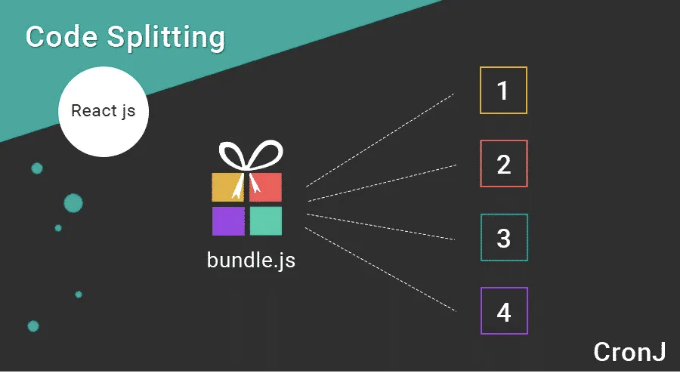

# 소개:

모바일 앱 개발 세계에서 사용자 경험은 중요합니다. 사용자는 플랫폼에 관계없이 빠르고 반응적인 앱을 기대합니다. React Native의 경우, 크로스 플랫폼 모바일 앱을 개발하기 위한 인기있는 프레임워크로, 성능 최적화는 개발의 중요한 측면입니다. 레이지 로딩과 코드 스플리팅은 React Native 앱의 성능을 크게 향상시킬 수 있는 두 가지 강력한 기술입니다.

# 레이지 로딩과 코드 스플리팅이란 무엇인가요?

<!-- ui-log 수평형 -->

<ins class="adsbygoogle"
      style="display:block"
      data-ad-client="ca-pub-4877378276818686"
      data-ad-slot="9743150776"
      data-ad-format="auto"
      data-full-width-responsive="true"></ins>
<component is="script">
(adsbygoogle = window.adsbygoogle || []).push({});
</component>

이 기술들을 React Native에서 어떻게 구현하는지 알아보기 전에, lazy loading과 코드 분할이 무엇을 의미하는지 명확히 해봅시다.


## Lazy Loading:

Lazy loading은 특정 리소스(예: 컴포넌트, 모듈 또는 이미지)의 로딩을 실제로 필요할 때까지 지연시키는 전략입니다. 이 접근 방식은 초기 앱 로드 시간을 줄이는 데 도움이 됩니다. 왜냐하면 초기 앱 구동 시에는 필수 컴포넌트만 로드되기 때문입니다. 추가 컴포넌트는 사용자가 앱과 상호작용할 때 로드됩니다.

<!-- ui-log 수평형 -->

<ins class="adsbygoogle"
      style="display:block"
      data-ad-client="ca-pub-4877378276818686"
      data-ad-slot="9743150776"
      data-ad-format="auto"
      data-full-width-responsive="true"></ins>
<component is="script">
(adsbygoogle = window.adsbygoogle || []).push({});
</component>



# 코드 분할:

코드 분할은 JavaScript 코드를 더 작고 관리하기 쉬운 조각들로 분할하는 기술입니다. 앱 전체를 하나의 JavaScript 파일로 번들링하는 대신 여러 개의 작은 파일 또는 조각으로 나누어 직접 로드될 때에만 로딩하는 방식으로 앱의 초기 로드 시간과 전반적인 성능을 향상시킬 수 있습니다.

이제 이 개념을 이해했으니, React Native 애플리케이션에서 lazy loading과 코드 분할을 구현하는 방법을 살펴보겠습니다.

<!-- ui-log 수평형 -->

<ins class="adsbygoogle"
      style="display:block"
      data-ad-client="ca-pub-4877378276818686"
      data-ad-slot="9743150776"
      data-ad-format="auto"
      data-full-width-responsive="true"></ins>
<component is="script">
(adsbygoogle = window.adsbygoogle || []).push({});
</component>

# React Native에서 Lazy Loading과 코드 분할 구현하기

## 단계 1: React Native 프로젝트 설정

아직이라면 Expo 또는 React Native CLI를 사용하여 새로운 React Native 프로젝트를 설정하세요. 이 예시에서는 React Native CLI를 사용한다고 가정하겠습니다.

```js
npx react-native init CodeSplittingExample
cd CodeSplittingExample
```

<!-- ui-log 수평형 -->

<ins class="adsbygoogle"
      style="display:block"
      data-ad-client="ca-pub-4877378276818686"
      data-ad-slot="9743150776"
      data-ad-format="auto"
      data-full-width-responsive="true"></ins>
<component is="script">
(adsbygoogle = window.adsbygoogle || []).push({});
</component>

## 단계 2: React Navigation 설치

저희는 네비게이션 및 지연 로딩을 위해 React Navigation을 사용할 거에요. 다음을 실행하여 설치해보세요:

```js
npm install react-navigation react-navigation-stack
```

## 단계 3: 화면 생성

<!-- ui-log 수평형 -->

<ins class="adsbygoogle"
      style="display:block"
      data-ad-client="ca-pub-4877378276818686"
      data-ad-slot="9743150776"
      data-ad-format="auto"
      data-full-width-responsive="true"></ins>
<component is="script">
(adsbygoogle = window.adsbygoogle || []).push({});
</component>

이 예제에서는 홈 화면과 프로필 화면 두 개를 만들겠습니다. 프로필 화면은 사용자가 이동할 때만 느린로딩을 사용하여 로드할 것입니다.

두 개의 파일을 만들어주세요: HomeScreen.js와 ProfileScreen.js.

## HomeScreen.js:

```js
import React from "react";
import { View, Text, Button } from "react-native";

const HomeScreen = ({ navigation }) => {
  return (
    <View>
      <Text>Home Screen</Text>
      <Button title="프로필로 이동" onPress={() => navigation.navigate("Profile")} />
    </View>
  );
};

export default HomeScreen;
```

<!-- ui-log 수평형 -->

<ins class="adsbygoogle"
      style="display:block"
      data-ad-client="ca-pub-4877378276818686"
      data-ad-slot="9743150776"
      data-ad-format="auto"
      data-full-width-responsive="true"></ins>
<component is="script">
(adsbygoogle = window.adsbygoogle || []).push({});
</component>

## ProfileScreen.js:

```js
import React from "react";
import { View, Text } from "react-native";

const ProfileScreen = () => {
  return (
    <View>
      <Text>프로필 화면</Text>
    </View>
  );
};

export default ProfileScreen;
```

## 단계 4: 지연 로딩과 함께 네비게이션 설정

App.js(또는 네비게이션을 구성하는 곳)에서 React.lazy()를 사용하여 지연 로딩으로 네비게이션을 설정하세요.

<!-- ui-log 수평형 -->

<ins class="adsbygoogle"
      style="display:block"
      data-ad-client="ca-pub-4877378276818686"
      data-ad-slot="9743150776"
      data-ad-format="auto"
      data-full-width-responsive="true"></ins>
<component is="script">
(adsbygoogle = window.adsbygoogle || []).push({});
</component>

```js
import React from "react";
import { createAppContainer } from "react-navigation";
import { createStackNavigator } from "react-navigation-stack";

// 스크린들을 lazy로 로딩합니다.
const HomeScreen = React.lazy(() => import("./HomeScreen"));
const ProfileScreen = React.lazy(() => import("./ProfileScreen"));

const AppNavigator = createStackNavigator(
  {
    Home: HomeScreen,
    Profile: ProfileScreen,
  },
  {
    initialRouteName: "Home",
  }
);

const AppContainer = createAppContainer(AppNavigator);

const App = () => {
  return (
    <React.Suspense fallback={<Text>Loading...</Text>}>
      <AppContainer />
    </React.Suspense>
  );
};

export default App;
```

위 코드에서는 네비게이션 중에 HomeScreen과 ProfileScreen 컴포넌트를 lazy하게 로드하는 React.lazy()를 사용하고 있습니다. React.Suspense로 AppContainer를 감싸서 컴포넌트가 로딩되는 동안 로딩 메시지를 표시합니다.

단계 5: 앱 실행

React Native 앱을 실행하세요.```

<!-- ui-log 수평형 -->

<ins class="adsbygoogle"
      style="display:block"
      data-ad-client="ca-pub-4877378276818686"
      data-ad-slot="9743150776"
      data-ad-format="auto"
      data-full-width-responsive="true"></ins>
<component is="script">
(adsbygoogle = window.adsbygoogle || []).push({});
</component>

```js
react-native run-android 또는 yarn android
# 또는
npx react-native run-ios 또는 yarn ios
```

이제 앱을 시작하면 홈 화면이 즉시 로드되는 것을 알 수 있을 것입니다. 프로필 화면은 필요할 때만 로드되므로 Lazy Loading 및 코드 분할이 실제로 작동하는 것을 확인할 수 있습니다.

# Lazy Loading 및 코드 분할의 장점

React Native 앱에 Lazy Loading 및 코드 분할을 구현하는 것은 여러 이점을 제공합니다:```

<!-- ui-log 수평형 -->

<ins class="adsbygoogle"
      style="display:block"
      data-ad-client="ca-pub-4877378276818686"
      data-ad-slot="9743150776"
      data-ad-format="auto"
      data-full-width-responsive="true"></ins>
<component is="script">
(adsbygoogle = window.adsbygoogle || []).push({});
</component>

- 빠른 초기 로드 시간: 필수 구성 요소만로드하고 코드를 분할하여 응용 프로그램이 더 빨리 시작되어 사용자 경험이 향상됩니다.
- 향상된 성능: 초기 번들 크기를 줄이면 특히 느린 네트워크나 오래된 장치에서 성능이 개선됩니다.
- 효율적인 리소스 활용: 필요할 때만 리소스를로드하도록 게으르게로드로 메모리 사용량을 최적화합니다.
- 단순화된 유지 관리: 코드 분할로 더 작고 관리하기 쉬운 코드 청크가 생성되어 코드베이스를 유지 관리하기 쉽습니다.

# 게으름을 부르고 코드 분할의 장점

React Native 앱에 게으름을 부르고 코드를 분할하는 것은 다음과 같은 여러 이점을 제공합니다:

- 빠른 초기 로드 시간: 필수 구성 요소만로드하고 코드를 분할하여 응용 프로그램이 더 빨리 시작되어 사용자 경험이 향상됩니다.
- 향상된 성능: 초기 번들 크기를 줄이면 특히 느린 네트워크나 오래된 장치에서 성능이 개선됩니다.
- 효율적인 리소스 활용: 필요할 때만 리소스를로드하도록 게으르게로드로 메모리 사용량을 최적화합니다.
- 단순화된 유지 관리: 코드 분할로 더 작고 관리하기 쉬운 코드 청크가 생성되어 코드베이스를 유지 관리하기 쉽습니다.

<!-- ui-log 수평형 -->

<ins class="adsbygoogle"
      style="display:block"
      data-ad-client="ca-pub-4877378276818686"
      data-ad-slot="9743150776"
      data-ad-format="auto"
      data-full-width-responsive="true"></ins>
<component is="script">
(adsbygoogle = window.adsbygoogle || []).push({});
</component>

# 결론

레이지 로딩과 코드 분할은 React Native 애플리케이션의 성능을 향상시키는 데 필수적인 기술입니다. 이러한 전략을 활용하여 초기로드 시간을 크게 개선하고 리소스 소비를 줄이며 더 부드러운 사용자 경험을 제공할 수 있습니다. React Native 프로젝트에서 이러한 기술을 채택하고 앱 성능이 새로운 차원으로 더 빨라지는 것을 지켜보세요!
