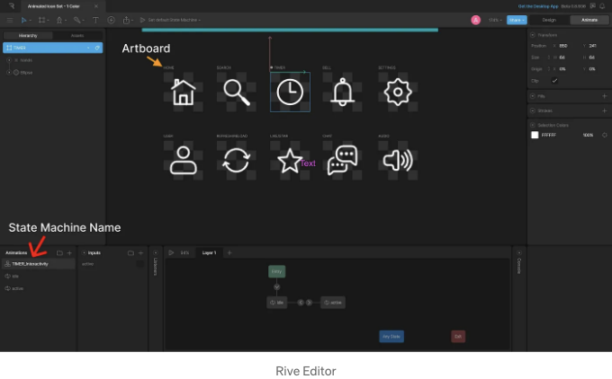
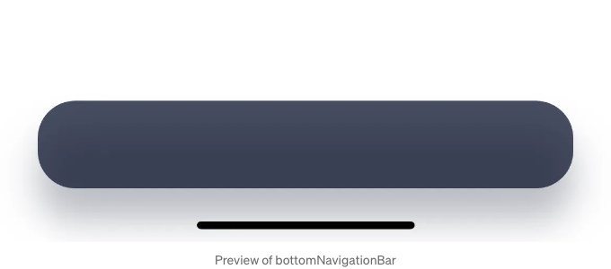
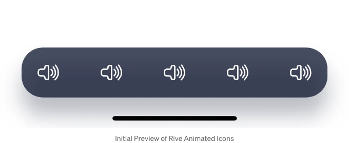
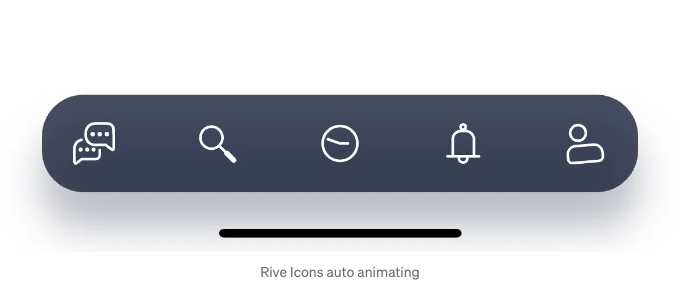
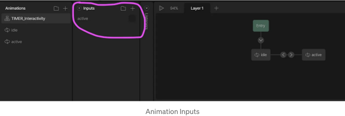

오늘은 플러터에서 Rive의 애니메이션 아이콘을 사용하여 사용자 정의 하단 내비게이션 바를 만드는 방법을 보여 드리겠습니다.


## 프로젝트 설정 🛠️

빈 플러터 프로젝트로 여정을 시작하고, assets 디렉토리를 생성합니다. 첫 번째 단계는 Rive 커뮤니티에서 애니메이션 아이콘을 다운로드하는 것입니다. 그런 다음 파일 이름을 animated-icons.riv로 변경하고 assets 폴더에 추가합니다. 이 파일이 pubspec.yaml에서 assets 하위에 올바르게 참조되었는지 확인하는 것이 중요합니다. 마지막 단계는 프로젝트에 Rive 패키지를 추가하는 것입니다.

<!-- ui-log 수평형 -->

<ins class="adsbygoogle"
      style="display:block"
      data-ad-client="ca-pub-4877378276818686"
      data-ad-slot="9743150776"
      data-ad-format="auto"
      data-full-width-responsive="true"></ins>
<component is="script">
(adsbygoogle = window.adsbygoogle || []).push({});
</component>

## RiveModel

**RiveModel** 모델을 생성해 보겠습니다. **src, artboard, stateMachineName**을 가진 모델입니다.

```js
class RiveModel {
  final String src, artboard, stateMachineName;

  RiveModel({
    required this.src,
    required this.artboard,
    required this.stateMachineName,
  });
}
```

지금, 여러분은 아트보드와 스테이트 머신 이름이 정확히 무엇인지 궁금할 것입니다. 애니메이션 아이콘으로 돌아가 보면, 리믹스 버튼을 클릭하면 마치 청사진을 보는 것과 같죠.

<!-- ui-log 수평형 -->

<ins class="adsbygoogle"
      style="display:block"
      data-ad-client="ca-pub-4877378276818686"
      data-ad-slot="9743150776"
      data-ad-format="auto"
      data-full-width-responsive="true"></ins>
<component is="script">
(adsbygoogle = window.adsbygoogle || []).push({});
</component>



각 아이콘이 이름이 지정되어 있는 것을 알 수 있어요. 이것을 우리는 아트보드(Artboard)라고 부르죠. 각 아트보드는 상태 머신(state machine)에 연결되어 있어요. 여기서 이름은 TIMER_Interactivity에요. 또한 상태 머신에는 두 가지 상태가 있어요: idle(유휴)와 active(활성). 이 상태들은 아이콘의 애니메이션을 제어하게 해줘요.

바텀 네비게이션에 사용할 모든 아이템을 저장할 변수인 bottomNavItems을 만들어 봅시다.

```js
List<RiveModel> bottomNavItems = [
  RiveModel(
      src: "assets/animated-icons.riv",
      artboard: "CHAT",
      stateMachineName: "CHAT_Interactivity"),
  RiveModel(
      src: "assets/animated-icons.riv",
      artboard: "SEARCH",
      stateMachineName: "SEARCH_Interactivity"),
  RiveModel(
      src: "assets/animated-icons.riv",
      artboard: "TIMER",
      stateMachineName: "TIMER_Interactivity"),
  RiveModel(
      src: "assets/animated-icons.riv",
      artboard: "BELL",
      stateMachineName: "BELL_Interactivity"),
  RiveModel(
      src: "assets/animated-icons.riv",
      artboard: "USER",
      stateMachineName: "USER_Interactivity"),
];
```

<!-- ui-log 수평형 -->

<ins class="adsbygoogle"
      style="display:block"
      data-ad-client="ca-pub-4877378276818686"
      data-ad-slot="9743150776"
      data-ad-format="auto"
      data-full-width-responsive="true"></ins>
<component is="script">
(adsbygoogle = window.adsbygoogle || []).push({});
</component>

자, 이제 다시 본 코드로 돌아가서 가장 재미있는 부분을 시작해 보겠습니다.

## 하단 내비게이션 바

새 StatefulWidget인 BottomNavWithAnimatedIcons를 만들어 보세요. 그리고 main.dart에서 이것을 애플리케이션의 홈으로 설정하세요.

```dart
import 'package:flutter/material.dart';

const Color bottonNavBgColor = Color(0xFF17203A);

class BottomNavWithAnimatedIcons extends StatefulWidget {
  const BottomNavWithAnimatedIcons({super.key});

  @override
  State<BottomNavWithAnimatedIcons> createState() =>
      _BottomNavWithAnimatedIconsState();
}

class _BottomNavWithAnimatedIconsState
    extends State<BottomNavWithAnimatedIcons> {
  @override
  Widget build(BuildContext context) {
    return Scaffold(
      // TODO: Bottom Nav Bar
    );
  }
}
```

<!-- ui-log 수평형 -->

<ins class="adsbygoogle"
      style="display:block"
      data-ad-client="ca-pub-4877378276818686"
      data-ad-slot="9743150776"
      data-ad-format="auto"
      data-full-width-responsive="true"></ins>
<component is="script">
(adsbygoogle = window.adsbygoogle || []).push({});
</component>

그 대신에 기존의 BottomNavigationBar 위젯을 사용하지 않고 Container를 사용할 거에요. 아래 코드로 ToDo: Bottom Nav Bar를 교체하세요.

```js
bottomNavigationBar: SafeArea(
  child: Container(
    height: 56, //나중에 높이를 제거하세요
    padding: const EdgeInsets.all(12),
    margin: const EdgeInsets.symmetric(horizontal: 24),
    decoration: BoxDecoration(
      color: bottonNavBgColor.withOpacity(0.8),
      borderRadius: const BorderRadius.all(Radius.circular(24)),
      boxShadow: [
        BoxShadow(
          color: bottonNavBgColor.withOpacity(0.3),
          offset: const Offset(0, 20),
          blurRadius: 20,
        ),
      ],
    ),
    // 애니메이션 아이콘 추가,
  ),
```



이제 아이콘을 표시할 거에요. List.generate를 사용하여 자식으로 설정된 Row를 통해 각 아이콘의 높이와 너비를 36으로 설정하세요. RiveAnimation.asset를 사용하여 소스를 정의하세요. ToDo: Animated Icons을 아래 코드로 교체하세요.

<!-- ui-log 수평형 -->

<ins class="adsbygoogle"
      style="display:block"
      data-ad-client="ca-pub-4877378276818686"
      data-ad-slot="9743150776"
      data-ad-format="auto"
      data-full-width-responsive="true"></ins>
<component is="script">
(adsbygoogle = window.adsbygoogle || []).push({});
</component>

```js
child: Row(
  mainAxisAlignment: MainAxisAlignment.spaceBetween,
  children: List.generate(
    bottomNavItems.length,
    (index) => SizedBox(
      height: 36,
      width: 36,
      child: RiveAnimation.asset(
        bottomNavItems[index].src,
        artboard: 'your_artboard_name_here',
      ),
    ),
  ),
),
```

이제 하나의 아이콘만 표시됩니다.



이는 파일에 모든 아이콘이 포함되어 있기 때문에 발생하며, 원하는 것을 지정해야 합니다. 아트보드를 사용하여 지정하세요. TO DO: Mention Artboard를 다음으로 바꿔주세요.

<!-- ui-log 수평형 -->

<ins class="adsbygoogle"
      style="display:block"
      data-ad-client="ca-pub-4877378276818686"
      data-ad-slot="9743150776"
      data-ad-format="auto"
      data-full-width-responsive="true"></ins>
<component is="script">
(adsbygoogle = window.adsbygoogle || []).push({});
</component>

```js
artboard: bottomNavItems[index].artboard,
```



## 애니메이션 제어하기

일부 아이콘이 애니메이션되고 일부는 그렇지 않다는 것을 알 수 있습니다. 애니메이션을 관리하려면 컨트롤러를 설정해야 합니다. 이를 위해 riveOnInIt이라는 함수를 생성하고 StateMachineController를 정의한 다음, artboard 및 stateMachineName을 전달해야 합니다. 그런 다음 이 컨트롤러를 artboard에 연결하는 것이 다음 단계입니다.```

<!-- ui-log 수평형 -->

<ins class="adsbygoogle"
      style="display:block"
      data-ad-client="ca-pub-4877378276818686"
      data-ad-slot="9743150776"
      data-ad-format="auto"
      data-full-width-responsive="true"></ins>
<component is="script">
(adsbygoogle = window.adsbygoogle || []).push({});
</component>

컨트롤러를 설정하면, 정확히 어떤 것을 컨트롤할 지 궁금할 것입니다. 이를 대답하기 위해 Rive 편집기로 돌아가 보겠습니다.



입력란 아래에 활성화 확인란이 있습니다. 이 활성화를 true로 설정하면 애니메이션이 작동합니다. 이를 통해 애니메이션을 제어할 것입니다. Rive에서는 숫자, 부울(참거짓), 또는 트리거 세 가지 유형의 입력을 사용할 수 있습니다.

코드에서 해당 내용을 액세스하려면 findInput을 사용합니다. 여기에 입력의 이름을 명시해야 합니다. 여기가 바로 우리의 함수입니다.

<!-- ui-log 수평형 -->

<ins class="adsbygoogle"
      style="display:block"
      data-ad-client="ca-pub-4877378276818686"
      data-ad-slot="9743150776"
      data-ad-format="auto"
      data-full-width-responsive="true"></ins>
<component is="script">
(adsbygoogle = window.adsbygoogle || []).push({});
</component>

```js
void riveOnInIt(Artboard artboard, {required String stateMachineName}) {
    StateMachineController? controller =
        StateMachineController.fromArtboard(artboard, stateMachineName);

    artboard.addController(controller!);
    controllers.add(controller);

    riveIconInputs.add(controller.findInput<bool>('active') as SMIBool);
}
```

이제 일부 오류가 있는 것을 알게 될 것입니다. 그 이유는 아직 controllers와 riveIconInputs를 정의하지 않았기 때문입니다. 그것을 해봅시다.

```js
List<SMIBool> riveIconInputs = [];
List<StateMachineController?> controllers = [];
int selctedNavIndex = 0;
```

컨트롤러를 저장하여 더 이상 필요하지 않을 때 삭제할 수 있도록 합니다. 선택된 NavIndex는 이후에 서로 다른 페이지 간을 탐색하고 기타 목적을 위해 사용될 것입니다.```

<!-- ui-log 수평형 -->

<ins class="adsbygoogle"
      style="display:block"
      data-ad-client="ca-pub-4877378276818686"
      data-ad-slot="9743150776"
      data-ad-format="auto"
      data-full-width-responsive="true"></ins>
<component is="script">
(adsbygoogle = window.adsbygoogle || []).push({});
</component>

'RiveAnimation'으로 돌아오면 'onInit'에서는 'riveOnInit'을 참조해야 합니다.

```js
onInit: (artboard) {
  riveOnInIt(artboard, stateMachineName: riveIcon.stateMachineName);
},
```

## 애니메이션 트리거

아이콘이 탭될 때 애니메이션을 트리거하는 마지막 단계입니다. SizedBox를 GestureDetector로 감싸주어야 합니다. 탭할 때 입력 상태가 true로 설정됩니다. 각 아이콘은 애니메이션을 완료하는 데 1초가 걸리며 반복됩니다. 그래서 1초 후에 애니메이션을 멈추려면 Future.delayed를 사용해야 합니다.

<!-- ui-log 수평형 -->

<ins class="adsbygoogle"
      style="display:block"
      data-ad-client="ca-pub-4877378276818686"
      data-ad-slot="9743150776"
      data-ad-format="auto"
      data-full-width-responsive="true"></ins>
<component is="script">
(adsbygoogle = window.adsbygoogle || []).push({});
</component>

```js
GestureDetector(
  onTap: () {
    riveIconInputs[index].change(true);
    Future.delayed(
      const Duration(seconds: 1),
      () {
        riveIconInputs[index].change(false);
      },
    );
    setState(() {
      selctedNavIndex = index;
    });
  },
  child: SizedBox( .... ),
)
```

## 애니메이션 바

선택한 아이콘 위에 애니메이션 바가 있는 것을 알 수 있습니다. 이를 만들어 보겠습니다.

```js
class AnimatedBar extends StatelessWidget {
  const AnimatedBar({
    key,
    required this.isActive,
  });

  final bool isActive;

  @override
  Widget build(BuildContext context) {
    return AnimatedContainer(
      duration: const Duration(milliseconds: 200),
      margin: const EdgeInsets.only(bottom: 2),
      height: 4,
      width: isActive ? 20 : 0,
      decoration: const BoxDecoration(
        color: Color(0xFF81B4FF),
        borderRadius: BorderRadius.all(Radius.circular(12)),
      ),
    );
  }
}
```

<!-- ui-log 수평형 -->

<ins class="adsbygoogle"
      style="display:block"
      data-ad-client="ca-pub-4877378276818686"
      data-ad-slot="9743150776"
      data-ad-format="auto"
      data-full-width-responsive="true"></ins>
<component is="script">
(adsbygoogle = window.adsbygoogle || []).push({});
</component>

마지막 단계는 SizedBox를 Column으로 감싸고 AnimatedBar를 상단에 배치하는 것입니다.

## 완성된 코드

아래는 참고용 완성 코드입니다.

```js
const Color bottonNavBgColor = Color(0xFF17203A);

class BottonNavWithAnimatedIcons extends StatefulWidget {
  const BottonNavWithAnimatedIcons({super.key});

  @override
  State<BottonNavWithAnimatedIcons> createState() =>
      _BottonNavWithAnimatedIconsState();
}

class _BottonNavWithAnimatedIconsState
    extends State<BottonNavWithAnimatedIcons> {
  List<SMIBool> riveIconInputs = [];
  List<StateMachineController?> controllers = [];
  int selctedNavIndex = 0;
  List<String> pages = ["Chat", "Search", "History", "Notification", "Profile"];

  void animateTheIcon(int index) {
    riveIconInputs[index].change(true);
    Future.delayed(
      const Duration(seconds: 1),
      () {
        riveIconInputs[index].change(false);
      },
    );
  }

  void riveOnInIt(Artboard artboard, {required String stateMachineName}) {
    StateMachineController? controller =
        StateMachineController.fromArtboard(artboard, stateMachineName);

    artboard.addController(controller!);
    controllers.add(controller);

    riveIconInputs.add(controller.findInput<bool>('active') as SMIBool);
  }

  @override
  void dispose() {
    for (var controller in controllers) {
      controller?.dispose();
    }
    super.dispose();
  }

  @override
  Widget build(BuildContext context) {
    return Scaffold(
      body: Center(child: Text(pages[selctedNavIndex])),
      bottomNavigationBar: SafeArea(
        child: Container(
          padding: const EdgeInsets.all(12),
          margin: const EdgeInsets.symmetric(horizontal: 24),
          decoration: BoxDecoration(
            color: bottonNavBgColor.withOpacity(0.8),
            borderRadius: const BorderRadius.all(Radius.circular(24)),
            boxShadow: [
              BoxShadow(
                color: bottonNavBgColor.withOpacity(0.3),
                offset: const Offset(0, 20),
                blurRadius: 20,
              ),
            ],
          ),
          child: Row(
            mainAxisAlignment: MainAxisAlignment.spaceBetween,
            children: List.generate(
              bottomNavItems.length,
              (index) {
                final riveIcon = bottomNavItems[index];
                return GestureDetector(
                  onTap: () {
                    animateTheIcon(index);
                    setState(() {
                      selctedNavIndex = index;
                    });
                  },
                  child: Column(
                    mainAxisSize: MainAxisSize.min,
                    children: [
                      AnimatedBar(isActive: selctedNavIndex == index),
                      SizedBox(
                        height: 36,
                        width: 36,
                        child: Opacity(
                          opacity: selctedNavIndex == index ? 1 : 0.5,
                          child: RiveAnimation.asset(
                            riveIcon.src,
                            artboard: riveIcon.artboard,
                            onInit: (artboard) {
                              riveOnInIt(artboard,
                                  stateMachineName: riveIcon.stateMachineName);
                            },
                          ),
                        ),
                      ),
                    ],
                  ),
                );
              },
            ),
          ),
        ),
      ),
    );
  }
}

class AnimatedBar extends StatelessWidget {
  const AnimatedBar({
    super.key,
    required this.isActive,
  });

  final bool isActive;

  @override
  Widget build(BuildContext context) {
    return AnimatedContainer(
      duration: const Duration(milliseconds: 200),
      margin: const EdgeInsets.only(bottom: 2),
      height: 4,
      width: isActive ? 20 : 0,
      decoration: const BoxDecoration(
        color: Color(0xFF81B4FF),
        borderRadius: BorderRadius.all(Radius.circular(12)),
      ),
    );
  }
}
```

<!-- ui-log 수평형 -->

<ins class="adsbygoogle"
      style="display:block"
      data-ad-client="ca-pub-4877378276818686"
      data-ad-slot="9743150776"
      data-ad-format="auto"
      data-full-width-responsive="true"></ins>
<component is="script">
(adsbygoogle = window.adsbygoogle || []).push({});
</component>

## 더 탐험할 것이 많아요!

이 하단 네비게이션 바는 Rive와 함께 사용하는 Animated Flutter 앱의 구성 요소 중 하나예요. Flutter에서 더 고급 애니메이션을 원하신다면 꼭 확인해보세요.

읽어 주셔서 정말 감사합니다. 이 내용이 도움이 되었으면 좋겠어요. 제안이나 피드백이 있다면 언제든 알려주세요. 여러분을 위해 더 나은 콘텐츠를 만드는 데 도움이 되는 소중한 의견이에요.

<!-- ui-log 수평형 -->

<ins class="adsbygoogle"
      style="display:block"
      data-ad-client="ca-pub-4877378276818686"
      data-ad-slot="9743150776"
      data-ad-format="auto"
      data-full-width-responsive="true"></ins>
<component is="script">
(adsbygoogle = window.adsbygoogle || []).push({});
</component>
